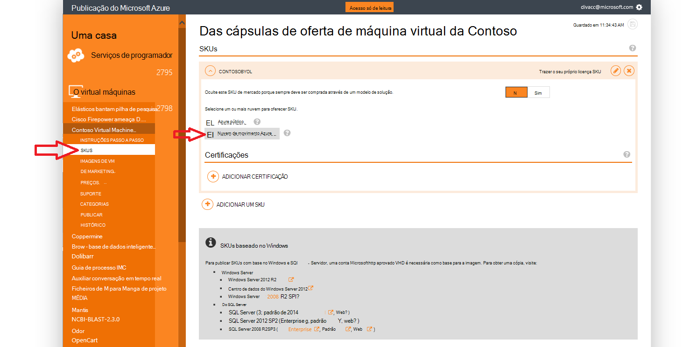
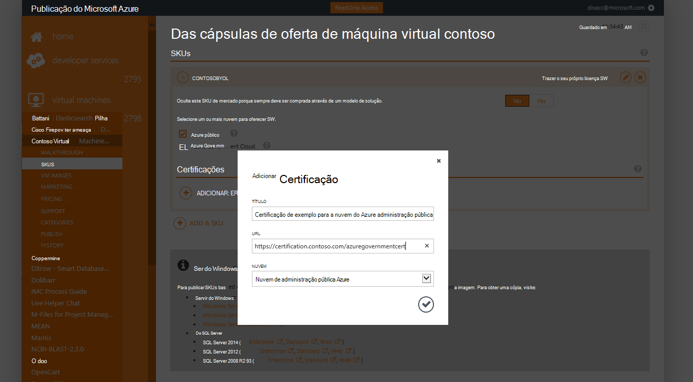
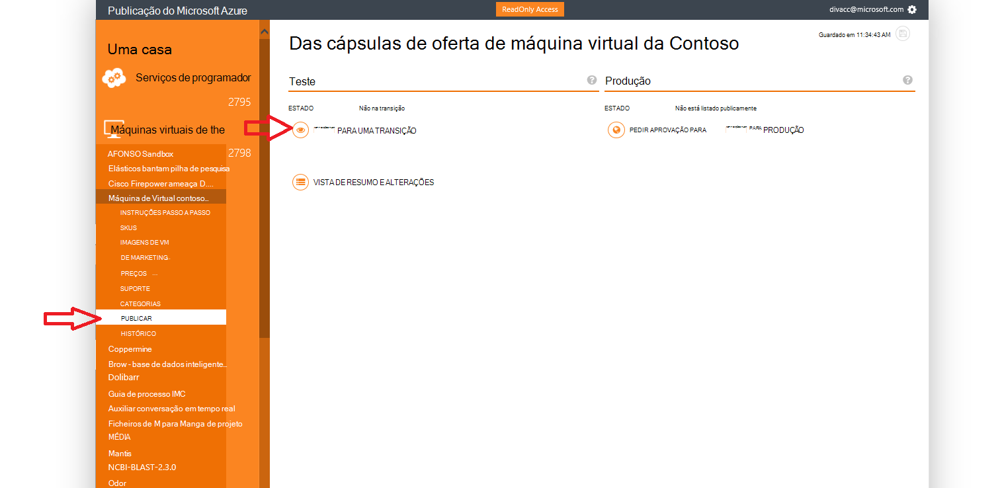
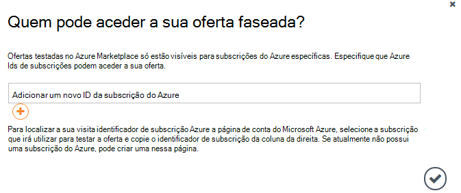
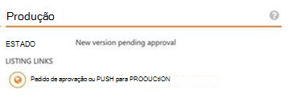

<properties
            pageTitle="Documentação do Azure administração pública | Microsoft Azure"
            description="Isto fornece uma comparação das funcionalidades e orientações sobre como desenvolver aplicações para administração pública do Azure."
            services="Azure-Government"
            cloud="gov"
            documentationCenter=""
            authors="tsingh"
            manager="asimm"
            editor=""/>
 
<tags    ms.service="multiple"
            ms.devlang="na"
            ms.topic="article"
            ms.tgt_pltfrm="na"
            ms.workload="azure-government"
            ms.date="10/20/2016"
            ms.author="zakramer;tsingh;divacc"/> 

# Administração pública Azure Marketplace
Para parceiros interessados em seu ofertas de publicação para o Azure Marketplace para administração pública, localize os detalhes do abaixo.

## Publicação
>[AZURE.NOTE] Se não for um parceiro Azure Marketplace certificação existente, conclua os passos [aqui](../marketplace-publishing/marketplace-publishing-getting-started.md) antes de continuar.

### Passo 1  
Inicie sessão no [https://publish.windowsazure.com](https://publish.windowsazure.com)

### Passo 2
Clique na oferta que pretende publicar

### Passo 3
Clique em **SKUS** e clique na caixa Azure Government Cloud

>[AZURE.NOTE] São suportados apenas trazer o próprio licença (BYOL) SKUs.  Esta opção não está disponível para SKUs repartição (PayG).

### Passo 4
Clique na + ligação de certificação de adicionar para adicionar ligações para qualquer certificações para a sua oferta.

### Passo 5
Pedido para uma conta de avaliação na nuvem da Microsoft Azure administração pública para permitem-lhe testar a sua imagem no portal do publicação: [https://azuregov.microsoft.com/trial/azuregovtrial](https://azuregov.microsoft.com/trial/azuregovtrial)

A elegibilidade como um parceiro que serve EUA entidades federais, estatais, locais ou Tribais são verificadas e confirmação será fornecida por correio eletrónico.  Conta de avaliação estarão disponível é dentro de dias de negócio de 3-5.

### Passo 6
Clique em publicar e clique em Push para transição. 

Vai ser-lhe para introduzir uma subscrição de whitelisted que tenha acesso à faseada oferecer. Introduza o ID da subscrição da sua conta de avaliação do Azure Governo recentemente adquirida.

### Passo 7
Assim que a oferta é testada com êxito, pode testar a sua imagem, iniciando sessão no [https://portal.azure.us](https://portal.azure.us) com a sua conta de versão de avaliação do Azure administração pública.

### Passo 8
Assim que tiver validado sua imagem utilizando a subscrição de avaliação, pode disponibilizar a oferta live clicando no publicar e a solicitar aprovação para ir para produção. 

## Próximos passos

Para informações suplementares e atualizações, subscreva o [Blogue do Microsoft Azure administração pública](https://blogs.msdn.microsoft.com/azuregov/).
