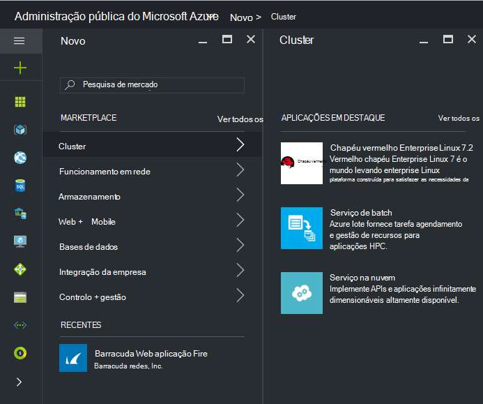
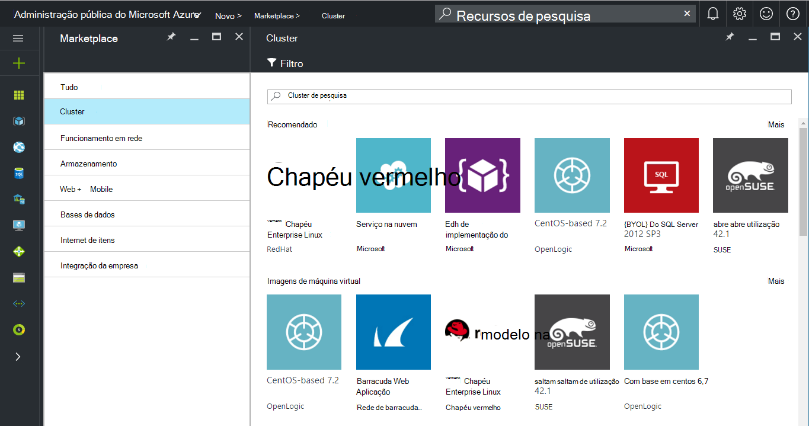
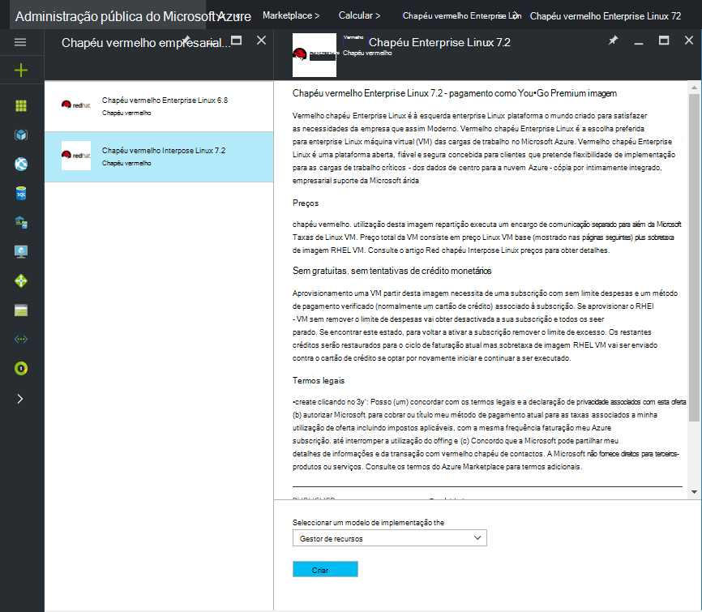
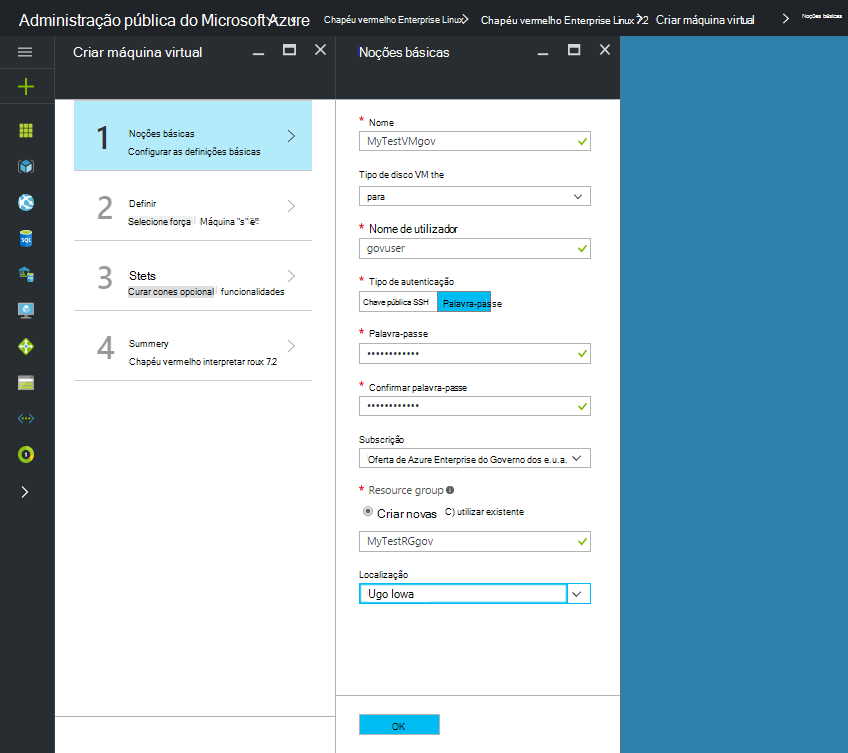
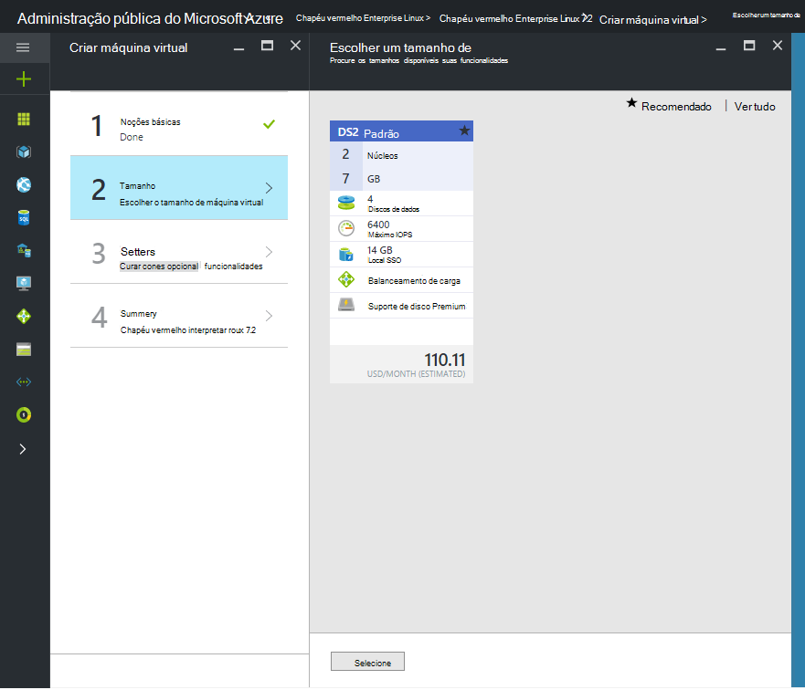

 <properties
    pageTitle="Documentação do Azure administração pública | Microsoft Azure"
    description="Isto fornece uma comparação das funcionalidades e orientações sobre como desenvolver aplicações para administração pública do Azure."
    services="Azure-Government"
    cloud="gov"
    documentationCenter=""
    authors="VybavaRamadoss"
    manager="asimm"
    editor=""/>

<tags   ms.service="multiple"
    ms.devlang="na"
    ms.topic="article"
    ms.tgt_pltfrm="na"
    ms.workload="azure-government"
    ms.date="10/20/2016"
    ms.author="zakramer;vybavar"/>

# Azure Marketplace para administração pública
Azure Marketplace está disponível para administração pública do Azure com uma lista actualizada de imagens do nossos fabricantes marketplace. 

## Variações
Seguem-se algumas considerações ao utilizar o Azure Marketplace para administração pública:

- Imagens de trazer o próprio licença (BYOL) só estão disponíveis. Não é possível aceder imagens que requerem transação de compra através do Azure Marketplace
- Apenas um subconjunto de imagens está atualmente disponível em comparação com o público marketplace. Pode encontrar na lista de imagens disponíveis [aqui](../azure-government-image-gallery.md) 
- Antes de uma imagem de aprovisionamento, administrador da empresa tem de ativar compras Marketplace para a sua subscrição do Azure
  - Iniciar sessão no Portal do como um administrador da empresa
  - Navegue para *Gerir*
  - Em *Detalhes de inscrição* clique no ícone de lápis junto do item de linha *Do Azure Marketplace*
  - Ativar/desativar *Activado/desactivado* conforme adequado
  - Clique em *Guardar*

>[AZURE.NOTE] Se estiver interessado em tornar as imagens disponíveis no Azure Governo consulte [diretrizes de ativação do parceiro](documentation-government-manage-marketplace-partners.md) para obter mais informações.

### Passo 1
Iniciação mercado

  

### Passo 2
Navegue através de produtos diferentes para localizar a correta.

O publisher marketplace fornece uma lista de certificações como parte da descrição do produto para o ajudar a tornar a escolha correta. 

### Passo 3
Selecione um product\image

### Passo 4
Iniciar o fluxo de criar e introduza os parâmetros necessários para implementação

>[AZURE.NOTE] No menu pendente de localização, apenas as localizações de Azure Governo estão visíveis

### Passo 5
Observar preços

### Passo 6
Concluir todos os passos e clique em Ok para iniciar o processo de aprovisionamento

## Próximos passos

Para informações suplementares e atualizações, subscreva o [Blogue do Microsoft Azure administração pública](https://blogs.msdn.microsoft.com/azuregov/).
