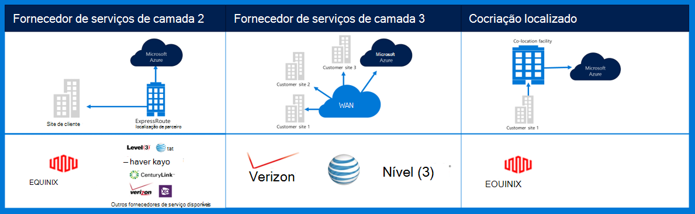
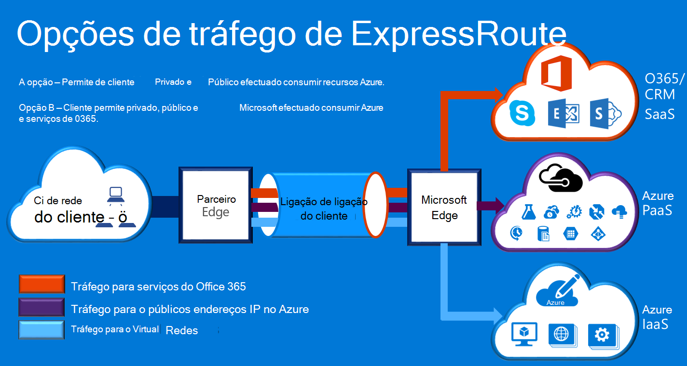

<properties
    pageTitle="Azure Governmenmt documentação | Microsoft Azure"
    description="Este procedimento fornece uma comparação das funcionalidades e orientações conectividade privado e administração pública"
    services="Azure-Government"
    cloud="gov" 
    documentationCenter=""
    authors="ryansoc"
    manager="zakramer"
    editor=""/>

<tags
    ms.service="multiple"
    ms.devlang="na"
    ms.topic="article"
    ms.tgt_pltfrm="na"
    ms.workload="azure-government"
    ms.date="09/28/2016"
    ms.author="ryansoc"/>

#  Administração pública Azure redes

##  ExpressRoute (privado Connectivity)

ExpressRoute está normalmente disponível no Azure Governo. Para mais informações (incluindo parceiros e efectuado localizações), consulte a <a href="https://azure.microsoft.com/en-us/documentation/services/expressroute/">documentação pública ExpressRoute </a>.

###  Variações

ExpressRoute é disponibilizada das versões (DG) no Azure Governo. 

- Clientes de administração pública ligar a uma capacidade física isolada através de uma ligação do Azure administração pública (administração pública) ExpressRoute (ER) dedicada

- Administração pública Azure fornece acrescido disponibilidade & durabilidade por tirar partido da vários pares de região localizado um mínimo de 500 milhas centímetros 

- Por predefinição conectividade de Azure administração pública ER todos os é configurado activo-activo redundantes com o suporte para de segurança e fornece a capacidade de circuito G até 10 (menor é 50MB)

- Localizações do Azure administração pública ER fornecem percursos otimizados (saltos mais curto, baixa latência, alto desempenho, etc.) para clientes e regiões geo redundantes administração pública do Azure

- A ligação privada Azure administração pública ER não utilizem-las, percorrer ou dependem da Internet

- Azure administração pública física e lógica infraestrutura física dedicada e separada e acesso está limitado a pessoas dos e.u.a.

- Microsoft é o proprietário e opera todos os infraestrutura fiber entre regiões de administração pública do Azure e Azure administração pública ER reunir-Me localizações

- Azure administração pública ER fornece conectividade ao Microsoft Azure, Office 365 e CRM serviços em nuvem

### Considerações sobre

Existem duas serviços básicos que fornecem a conectividade da rede privada para administração pública do Azure: VPN (site-para-site numa organização típica) e ExpressRoute.

Azure ExpressRoute é utilizada para criar ligações privada entre Azure Governo centros de dados e a sua infraestrutura no local ou num ambiente de colocação. ExpressRoute ligações não vão através da Internet pública — disponibilizam mais fiabilidade, velocidades mais rápidas e inferiores latências que típica ligações à Internet. Em alguns casos, utilizando ligações de ExpressRoute para transferir dados nos sistemas de local e Azure proveitos significativos benefícios de custo.   

Com ExpressRoute, estabelece ligações a Azure numa localização de ExpressRoute (por exemplo, uma funcionalidade de fornecedor do Exchange) ou, se diretamente liga ao Azure da sua rede WAN existente (tal como um multiprotocolo etiqueta mudança VPN (MPLS), fornecido pelo fornecedor de serviços de rede).

    

Serviços de rede suportar aplicações de cliente do Governo do Azure e soluções, recomenda-se vivamente que é implementado ExpressRoute (privado connectivity) para ligar à administração pública do Azure. Se forem utilizadas ligações VPN, as seguintes devem ser considerados:

- Os clientes devem contactar os respetivos bom funcionário/para determinar se é necessário conectividade privada ou outro mecanismo de uma ligação segura e para identificar restrições adicionais a ter em conta.

- Os clientes devem decidir se assegurar que a VPN do site para o site é encaminhada através de uma zona connectivity privado.

- Os clientes devem obter um circuito MPLS ou VPN com um fornecedor de acesso de conectividade privado licenciado.

Todos os clientes que utilizam uma arquitetura de conectividade privado devem validar que uma implementação adequada é estabelecida e manter-se para a ligação do cliente para a Gateway rede/Internet (GN / posso) limite ponto de delimitação router para administração pública do Azure. Da mesma forma, sua organização tem de estabelecer conectividade de rede entre o seu ambiente no local e o ponto de delimitação do Gateway rede/cliente (GN/C) limite router para administração pública do Azure.

## Próximos passos

Para informações suplementares e atualizações subscreva o <a href="https://blogs.msdn.microsoft.com/azuregov/">blogue do Microsoft Azure administração pública.</a>
