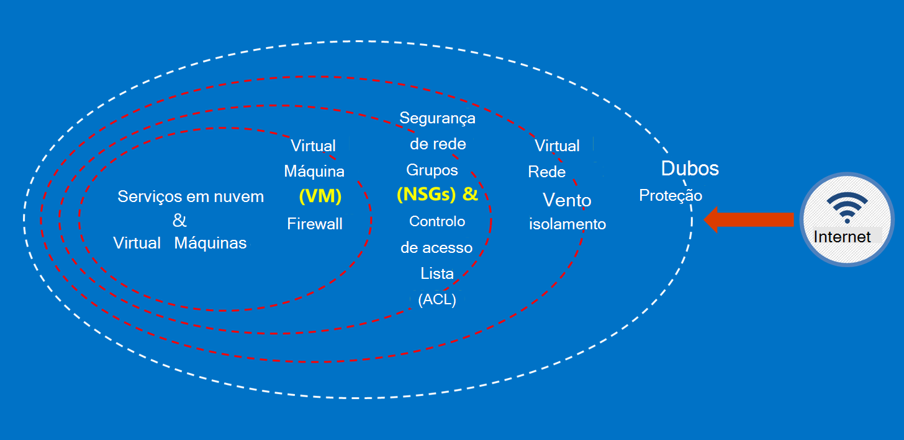

<properties
    pageTitle="Documentação do Azure administração pública | Microsoft Azure"
    description="Este procedimento fornece uma comparision das funcionalidades e orientações sobre como desenvolver aplicações para administração pública do Azure"
    services="Azure-Government"
    cloud="gov" 
    documentationCenter=""
    authors="ryansoc"
    manager="zakramer"
    editor=""/>

<tags
    ms.service="multiple"
    ms.devlang="na"
    ms.topic="article"
    ms.tgt_pltfrm="na"
    ms.workload="azure-government"
    ms.date="08/25/2016"
    ms.author="ryansoc"/>

#  Descrição geral da documentação do Azure administração pública

##  Introdução a documentação do Azure administração pública

Este site descreve as funcionalidades dos serviços [Microsoft Azure administração pública](https://azure.microsoft.com/features/gov/) e fornece informações gerais aplicável a todos os clientes. Antes de a incluir especificamente regulamentados dados na sua subscrição do Azure Governo, deve familiarizar-se com as funcionalidades de administração pública do Azure e consultar a equipa de conta, se tiver dúvidas.

Deve referir-se para a [Página de conformidade de centro de fidedignidade Azure Microsoft](http://www.microsoft.com/en-us/TrustCenter/Compliance/default.aspx) para obter informações sobre os serviços de Azure Governo abrangidos em regulamentos e acreditações específicas. Serviços adicionais da Microsoft também podem estar disponíveis, mas não estão no âmbito dos serviços de administração pública Azure abrangidos e não estão endereçados por este documento. Serviços de administração pública Azure também podem permitir a utilização de uma variedade de recursos adicionais, aplicações ou serviços que são fornecidos por terceiros — ou pela Microsoft em separado termos de utilização e privacidade políticas de — que não é incluído no âmbito deste documento. É responsável para rever os termos de todos os essas "suplemento" as ofertas, tais como as ofertas de Marketplace, para se certificar de que cumprem as suas necessidades em relação à conformidade.

Administração pública Azure está disponível para entidades processar dados estão sujeito a determinados regulamentos de administração pública e requisitos (tal como NIST 800.171 (DIB), ITAR, administração fiscal 1075, DoD L4 e CJIS) onde a utilização do Azure Governo é necessário para cumprir os regulamentos. Clientes de administração pública Azure estão sujeitos a validação de elegibilidade.

Entidades com as perguntas sobre elegibilidade para administração pública do Azure deverão consultar a sua equipa de conta.

##  Princípios para proteger dados do cliente no Azure administração pública

Administração pública Azure fornece um intervalo de funcionalidades e serviços que pode utilizar para criar soluções de nuvem para corresponder às suas necessidades de dados regulamentada/controlados. Uma solução de cliente em conformidade é nada mais do que a aplicação eficaz das capacidades de Azure Governo out of box, à forma com um procedimento de segurança de dados sólida.
Quando o alojar uma solução no Azure Governo, Microsoft lida com muitas destes requisitos ao nível de infraestrutura de nuvem.

O diagrama seguinte mostra o modelo de defesa no profundidade Azure. Por exemplo, a Microsoft fornece infraestrutura da nuvem básicas DDOS, juntamente com capacidades de cliente, tais como eletrodomésticos de segurança para a aplicação de cliente específicas que DDoS necessita.

Esta página descreve os princípios base destinados para proteger os seus serviços e aplicações, fornecer melhores práticas e orientações sobre como aplicar estas princípios; por outras palavras, como clientes farão utilização inteligente do Azure Governo para satisfazer as obrigações e responsabilidades que são necessárias para uma solução que processa as informações de ITAR.

Os princípios grandes para proteger dados do cliente são:
* Proteger dados através de encriptação
* Gestão de segredos
* Isolamento para restringir o acesso a dados

##  Proteger os dados a utilizar encriptação

Mitigam o risco e regulamentação obrigações de reunião estiver a conduzir a crescente foco e importância da encriptação de dados. Utilizar uma implementação de encriptação eficaz para melhorar as medidas de segurança de rede e a aplicação atuais — e diminuir o risco global do seu ambiente de nuvem.

### Encriptação em repouso
A encriptação dos dados at rest aplica-se para a proteção de conteúdo de cliente contido em armazenamento em disco. Existem várias formas, que isto pode acontecer:

### Encriptação do serviço de armazenamento

Azure encriptação do serviço de armazenamento é ativada ao nível da conta de armazenamento, que resulta no bloco blobs e automaticamente a ser encriptados quando escritas Azure armazenamento de blobs de página. Quando a ler os dados de armazenamento do Windows Azure, será possível desencriptar pelo serviço de armazenamento antes de serem devolvidos. Utilize esta opção para proteger os seus dados sem ter de modificar ou adicionar código a todas as aplicações.

### Encriptação Azure do disco
Utilize encriptação do Azure do disco para encriptar o sistema operativo discos e dados utilizados por uma máquina de Virtual do Azure. Integração com o Azure chave cofre dá-lhe controlo e ajuda a gerir as chaves de encriptação do disco.

### Encriptação do lado do cliente
Encriptação do lado do cliente está incorporada no Java e as bibliotecas do cliente armazenamento .NET, que podem utilizar o Azure chave cofre APIs, fazer isto simples implementar. Utilize o Azure chave cofre para obter acesso ao segredos no Azure chave cofre para indivíduos específicos, utilizando o Azure Active Directory.

### Encriptação em trânsito

A encriptação básica disponível para conectividade ao Azure Governo suporta o protocolo de transporte segurança TLS (Level) 1.2 e certificados x. 509. Federal Information Processing Standard (FIPS) 140-2 nível 1 criptografia algoritmos também são utilizados infraestrutura para ligações de rede entre o Azure Governo centros de dados.  Windows Server 2012 R2 e Windows 8-plus VMs e em partilhas de Azure pode utilizar SMB 3.0 para encriptação entre a VM e a partilha de ficheiros. Utilize a encriptação do lado do cliente para encriptar os dados antes de serem transferidas para o armazenamento numa aplicação cliente de e desencriptar os dados a seguir é transferida armazenamento.

### Práticas recomendadas para encriptação

* IaaS VMs: Utilize encriptação Azure do disco. Ativar a encriptação do serviço de armazenamento para encriptar os ficheiros VHD que são utilizados para criar uma cópia de segurança nesses discos no armazenamento do Windows Azure, mas isto encripta apenas os dados recentemente escritos. Isto significa que, se criar uma VM e, em seguida, ativar encriptação do serviço de armazenamento na conta de armazenamento que detém o ficheiro VHD, serão encriptadas apenas as alterações, não VHD ficheiro original.
* Encriptação do lado do cliente: Este é o método mais seguro para encriptar os seus dados, porque encripta-lo antes de trânsito e encripta os dados no resto. No entanto, requerem que adicionar código às suas aplicações do armazenamento, que não poderá querer fazer a utilizar. Nestes casos, pode utilizar HTTPs para os seus dados em trânsito e encriptação do serviço de armazenamento para encriptar os dados no resto. A encriptação do lado do cliente também envolve mais carga no cliente — tem de ter isso em consideração nos seus planos escalabilidade, especialmente se estiver a encriptação e transferir os muitos dados.

Para obter mais informações sobre as opções de encriptação no Azure consulte o [Guia de segurança de armazenamento](/storage-security-guide).

##  Proteger os dados pela gestão de segredos

Gestão de chave seguro é essencial para proteger os dados na nuvem. Os clientes devem esforça simplificar a gestão de chave e manter o controlo de teclas utilizada por nuvem aplicações e serviços para encriptar dados.

### Melhores práticas para gestão de segredos

* Utilize cofre chave para minimizar os riscos de segredos expostos através de ficheiros de configuração codificada scripts, ou no código fonte. Azure chave cofre encripta teclas (tal como as chaves de encriptação para encriptação de disco do Azure) e segredos (como palavras-passe), guardando-los no FIPS 140-2 nível 2 validou módulos de segurança do hardware (Os HSMs). Para assurance adicionada, pode importar ou gerar chaves nestes HSMs.
* Código de aplicação e modelos só devem conter referências URI para os segredos (que significa que os segredos reais não estão no código, configuração ou código fonte repositórios). Isto impede que ataques de phishing chave no repouso internos e externos, tais como colheita-bots no GitHub.
* Utiliza controlos RBAC fortes chave cofre. Se um operador de confiança deixar a empresa ou transferências para um novo grupo dentro da empresa, deve ser impedidos a partir da ser possível aceder aos segredos.  

Para obter mais informações consulte o artigo [Cofre chave para administração pública do Azure](/azure-government/azure-government-tech-keyvault)

##  Isolamento para restringir o acesso a dados

Isolamento é tudo sobre com limites, segmentação e contentores para limitar o acesso de dados para apenas os utilizadores autorizados, serviços e aplicações. Por exemplo, a separação entre inquilinos é um dispositivo de segurança essenciais para plataformas multi-inquilino na nuvem como o Microsoft Azure. Isolamento lógico ajuda a impedir que um inquilino interferir com as operações de qualquer outro inquilino.

### Ambiente isolamento
O ambiente do Azure Governo é uma instância física que está separada do resto da rede da Microsoft. Pode fazê-através de uma série de controlos físicos e lógicos que incluem o seguinte: proteger das barreiras físicas utilizando dispositivos biométricos e câmaras de vídeo.  Utilização de credenciais específicas e a autenticação multifator pelo pessoal da Microsoft que exijam acesso lógico para o ambiente de produção.  Todos os infraestrutura de serviço para administração pública do Azure é localizados dentro dos Estados Unidos.

#### Isolamento por cliente
Controlo de acesso de rede implementa Azure e a separação através de isolamento VLAN, ACL, carregam balanceadores e filtros de IP

Os clientes podem ainda mais isolar dos seus recursos através de subscrições, grupos de recursos, redes virtuais e sub-redes.

Para obter mais informações sobre o isolamento no Microsoft Azure consulte a [secção de isolamento do guia de segurança do Azure](/azure-security-getting-started/#isolation).

Para informações suplementares e atualizações subscreva o <a href="https://blogs.msdn.microsoft.com/azuregov/">blogue do Microsoft Azure administração pública.</a>
