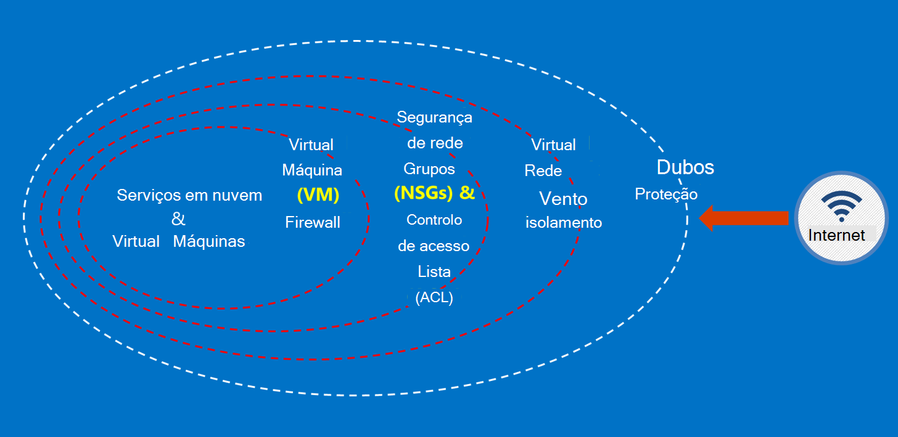

<properties
    pageTitle="Serviços de administração pública Azure | Microsoft Azure"
    description="Fornece e descrição geral dos serviços disponíveis no Azure Governo"
    services="Azure-Government"
    cloud="gov"
    documentationCenter=""
    authors="zakramer"
    manager="liki"
    editor="" />

<tags
    ms.service="multiple"
    ms.devlang="na"
    ms.topic="article"
    ms.tgt_pltfrm="na"
    ms.workload="azure-government"
    ms.date="10/18/2016"
    ms.author="ryansoc" />

#  Segurança

##  Princípios para proteger dados do cliente no Azure administração pública

Administração pública Azure fornece um intervalo de funcionalidades e serviços que pode utilizar para criar soluções de nuvem para corresponder às suas necessidades de dados regulamentada/controlados. Uma solução de cliente em conformidade é nada mais do que a aplicação eficaz das capacidades de Azure Governo out of box, à forma com um procedimento de segurança de dados sólida.

Quando o alojar uma solução no Azure Governo, Microsoft lida com muitas destes requisitos ao nível de infraestrutura de nuvem.

O diagrama seguinte mostra o modelo de defesa no profundidade Azure. Por exemplo, a Microsoft fornece infraestrutura da nuvem básicas DDOS, juntamente com capacidades de cliente, tais como eletrodomésticos de segurança para a aplicação de cliente específicas que DDoS necessita.

Esta página descreve os princípios base destinados para proteger os seus serviços e aplicações, fornecer melhores práticas e orientações sobre como aplicar estas princípios; por outras palavras, como clientes farão utilização inteligente do Azure Governo para satisfazer as obrigações e responsabilidades que são necessárias para uma solução que processa as informações de ITAR.

 Os princípios grandes para proteger dados do cliente são:

- Proteger dados através de encriptação
- Gestão de segredos
- Isolamento para restringir o acesso a dados

###  Proteger os dados a utilizar encriptação

Mitigam o risco e regulamentação obrigações de reunião estiver a conduzir a crescente foco e importância da encriptação de dados. Utilizar uma implementação de encriptação eficaz para melhorar as medidas de segurança de rede e a aplicação atuais — e diminuir o risco global do seu ambiente de nuvem.

#### Encriptação em repouso
A encriptação dos dados at rest aplica-se para a proteção de conteúdo de cliente contido em armazenamento em disco. Existem várias formas, que isto pode acontecer:

#### Encriptação do serviço de armazenamento

Azure encriptação do serviço de armazenamento é ativada ao nível da conta de armazenamento, que resulta no bloco blobs e automaticamente a ser encriptados quando escritas Azure armazenamento de blobs de página. Quando a ler os dados de armazenamento do Windows Azure, será possível desencriptar pelo serviço de armazenamento antes de serem devolvidos. Utilize esta opção para proteger os seus dados sem ter de modificar ou adicionar código a todas as aplicações.

#### Encriptação do lado do cliente
Encriptação do lado do cliente está incorporada no Java e as bibliotecas do cliente armazenamento .NET, que podem utilizar o Azure chave cofre APIs, fazer isto simples implementar. Utilize o Azure chave cofre para obter acesso ao segredos no Azure chave cofre para indivíduos específicos, utilizando o Azure Active Directory.

#### Encriptação em trânsito

A encriptação básica disponível para conectividade ao Azure Governo suporta o protocolo de transporte segurança TLS (Level) 1.2 e certificados x. 509. Federal Information Processing Standard (FIPS) 140-2 nível 1 algoritmos também são utilizados infraestrutura para ligações de rede entre o Azure Governo centros de dados.  Windows Server 2012 R2 e Windows 8-plus VMs e em partilhas de Azure pode utilizar SMB 3.0 para encriptação entre a VM e a partilha de ficheiros. Utilize a encriptação do lado do cliente para encriptar os dados antes de serem transferidas para o armazenamento numa aplicação cliente de e desencriptar os dados a seguir é transferida armazenamento.

#### Práticas recomendadas para encriptação

- IaaS VMs: Utilize encriptação Azure do disco. Ativar a encriptação do serviço de armazenamento para encriptar os ficheiros VHD que são utilizados para criar uma cópia de segurança nesses discos no armazenamento do Windows Azure, mas isto encripta apenas os dados recentemente escritos. Isto significa que, se criar uma VM e, em seguida, ativar encriptação do serviço de armazenamento na conta de armazenamento que detém o ficheiro VHD, serão encriptadas apenas as alterações, não VHD ficheiro original.
- Encriptação do lado do cliente: Este é o método mais seguro para encriptar os seus dados, porque encripta-lo antes de trânsito e encripta os dados no resto. No entanto, requerem que adicionar código às suas aplicações do armazenamento, que não poderá querer fazer a utilizar. Nestes casos, pode utilizar HTTPs para os seus dados em trânsito e encriptação do serviço de armazenamento para encriptar os dados no resto. A encriptação do lado do cliente também envolve mais carga no cliente — tem de ter isso em consideração nos seus planos escalabilidade, especialmente se estiver a encriptação e transferir os muitos dados.

###  Proteger os dados pela gestão de segredos

Gestão de chave seguro é essencial para proteger os dados na nuvem. Os clientes devem esforça simplificar a gestão de chave e manter o controlo de teclas utilizada por nuvem aplicações e serviços para encriptar dados.

#### Melhores práticas para gestão de segredos

- Utilize cofre chave para minimizar os riscos de segredos expostos através de ficheiros de configuração codificada scripts, ou no código fonte. Azure chave cofre encripta teclas (tal como as chaves de encriptação para encriptação de disco do Azure) e segredos (como palavras-passe), guardando-los no FIPS 140-2 nível 2 validado módulos de segurança do hardware (Os HSMs). Para assurance adicionada, pode importar ou gerar chaves nestes HSMs.
- Código de aplicação e modelos só devem conter referências URI para os segredos (que significa que os segredos reais não estão no código, configuração ou código fonte repositórios). Isto impede que ataques de phishing chave no repouso internos e externos, tais como colheita-bots no GitHub.
- Utiliza controlos RBAC fortes chave cofre. Se um operador de confiança deixar a empresa ou transferências para um novo grupo dentro da empresa, deve ser impedidos a partir da ser possível aceder aos segredos.

Para obter mais informações <a href="https://azure.microsoft.com/documentation/services/key-vault">documentação pública Azure chave cofre.</a>

###  Isolamento para restringir o acesso a dados

Isolamento é tudo sobre com limites, segmentação e contentores para limitar o acesso de dados para apenas os utilizadores autorizados, serviços e aplicações. Por exemplo, a separação entre inquilinos é um dispositivo de segurança essenciais para plataformas multi-inquilino na nuvem como o Microsoft Azure. Isolamento lógico ajuda a impedir que um inquilino interferir com as operações de qualquer outro inquilino.

#### Ambiente isolamento
O ambiente do Azure Governo é uma instância física que está separada do resto da rede da Microsoft. Pode fazê-através de uma série de controlos físicos e lógicos que incluem o seguinte:

- Proteger das barreiras físicas utilizando dispositivos biométricos e câmaras de vídeo.
- Utilização de credenciais específicas e a autenticação multifator pelo pessoal da Microsoft que exijam acesso lógico para o ambiente de produção.
- Todos os infraestrutura de serviço para administração pública do Azure é localizados dentro dos Estados Unidos.

#### Isolamento por cliente
Controlo de acesso de rede implementa Azure e a separação através de isolamento VLAN, ACL, carregam balanceadores e filtros de IP

Os clientes podem ainda mais isolar dos seus recursos através de subscrições, grupos de recursos, redes virtuais e sub-redes.

## Filtragem

A recentemente anunciada FedRAMP alta e a aprovação do departamento de defesa (DoD) impacto nível 4. Isto tem elevado a barra de segurança e conformidade ao longo do ambiente de Governo Azure.

Vamos são agora de filtragem todos os nossos operadores na nacionais Agência verificar com lei e crédito (NACLC) conforme definido na secção 5.6.2.2 da DoD nuvem computação segurança requisitos guia (SRG):

>[AZURE.NOTE] O inquérito de fundo mínimo necessário para o pessoal CSP tenham acesso aos nível 4 e 5 informações com base num "não críticas sensíveis" (por exemplo, do DoD ADP-2) são uma verificação de agência nacionais com lei e crédito (NACLC) (para contratantes "não críticas sensível"), ou uma moderado risco fundo inquérito (MBI) para uma designação de posição de "risco moderado".

A tabela seguinte resume os nossos filtragem atual para operadores Azure Governo:

Azure farelo de administração pública e os controlos de fundo | Descrição|
---|---|
Cidadania dos EUA |Verificação de cidadania dos EUA.
Verificação de fundo do Microsoft cloud (todos os dois anos)|Número de segurança social pesquisa, verificação histórico penais, lista do Office de controlo de ativos externa (OFAC), da lista Instituto da indústria e segurança (BIS), lista do Office de defesa comércio controlos excluída pessoas.
Verificação de agência nacional com lei e crédito (NACLC) (cinco anos) | Adiciona a verificação de fundo de identificação contra bases de dados de FBI. Para obter informações adicionais, aceda ao<a href="https://www.opm.gov/investigations/background-investigations/federal-investigations-notices/1997/fin97-02/"> Site de gestão de pessoal do Office</a>. | 
<a href="https://www.microsoft.com/en-us/TrustCenter/Compliance/CJIS">Serviços de informação de criminoso Justiça (CJIS)</a> | CJIS é um Estado, local e administração pública FBI qual identificação de processos de filtragem registos e valida históricos penais no operacionais funcionários que podem ser fornecidos acesso aos dados de informações (CJI) crítico criminoso Justiça.  Cada Estado é que os seus próprios fundo verificação e aprovação subsequente de todos os funcionários com acesso potencial a CJI.|

Para o pessoal de operações Azure, aplicam-se os seguintes princípios do access:

- Funções são definidas de forma clara, com responsabilidades separadas para solicitar, aprovar e implementar alterações.
- Acesso é através de interfaces definidas que tenham funcionalidades específicas.
- O Access é just-in-time (JIT) e é concedido apenas numa base por incidente ou de um evento de manutenção específicos e sempre durante um período limitado.
- Access é baseado em regra, com as funções definidas atribuídas apenas as permissões necessárias para resolver o problema.

Normas de filtragem incluem a validação de cidadania dos EUA de todos os suporte da Microsoft e docentes operacionais antes de é concedido acesso à alojado no Azure Governo sistemas. Suporte técnico que precisam de transferir dados utiliza as capacidades seguras no Azure Governo. Transferência de dados seguro requer um conjunto de credenciais de autenticação para obter acesso separado. Por exemplo, para aceder ao sistema metadados, pessoal operações utiliza ferramentas de baseada na web interno gestão específicas, APIs só de leitura e JIT elevação.

## Próximos passos

Para informações suplementares e atualizações subscreva o <a href="https://blogs.msdn.microsoft.com/azuregov/">blogue do Microsoft Azure administração pública.</a>
