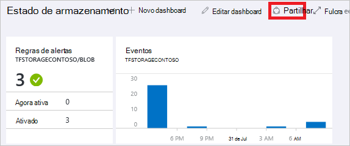
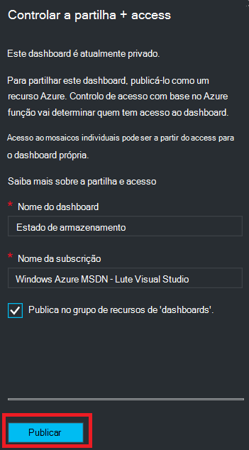
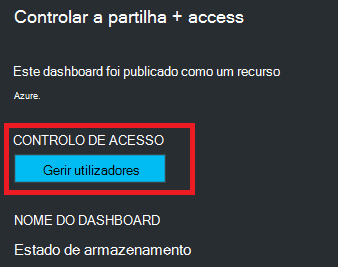
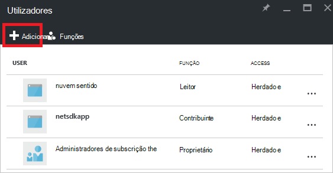
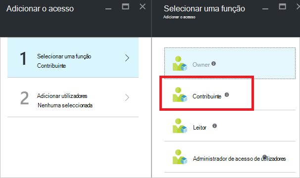
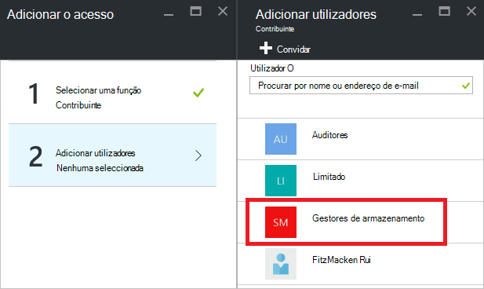
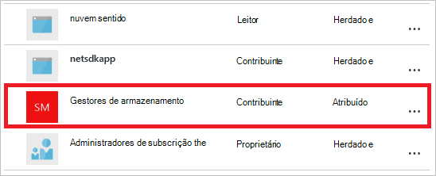

<properties
   pageTitle="Dashboard de portal Azure acesso | Microsoft Azure"
   description="Este artigo explica como partilhar o acesso a um dashboard no portal do Azure."
   services="azure-portal"
   documentationCenter=""
   authors="tfitzmac"
   manager="timlt"
   editor="tysonn"/>

<tags
   ms.service="multiple"
   ms.devlang="NA"
   ms.topic="article"
   ms.tgt_pltfrm="NA"
   ms.workload="na"
   ms.date="08/01/2016"
   ms.author="tomfitz"/>

# Partilhar Azure dashboards

Depois de configurar um dashboard, pode publicá-lo e partilhá-lo com outros utilizadores na sua organização. Permitir que outros utilizadores acedam o dashboard utilizando o Azure [Função com base no controlo de acesso](../active-directory/role-based-access-control-configure.md). Atribuir um utilizador ou grupo de utilizadores a uma função, e essa função define se esses utilizadores podem ver ou modificar o dashboard publicado. 

Todos os dashboards publicados são implementados como recursos Azure, que significa que existem como itens de fácil de gerir a sua subscrição e estão contidas num grupo de recursos.  A partir de uma perspetiva de controlo de acesso, dashboards não são diferentes outros recursos, tal como uma máquina virtual ou com uma conta de armazenamento.

> [AZURE.TIP] Mosaicos individuais no dashboard de impõem os seus próprios requisitos de controlo de acesso com base nos recursos que são apresentados.  Por conseguinte, pode estruturar um dashboard que é partilhado ficarem enquanto ainda proteger os dados na mosaicos individuais.

## Controlo de acesso de noções básicas sobre para dashboards

Com o controlo de acesso baseado em funções, pode atribuir utilizadores a funções com três diferentes níveis de âmbito:

- subscrição
- grupo de recursos
- recurso

As permissões que atribuir são herdadas da subscrição para baixo para o recurso. O dashboard publicado é um recurso. Por conseguinte, poderá já ter utilizadores atribuídos a funções para a subscrição que também funcionam para o dashboard publicado. 

Eis um exemplo.  Digamos tenha uma subscrição do Azure e vários membros da sua equipa foram atribuídos as funções de **leitor** da subscrição, **Contribuinte**ou **proprietário**. Os utilizadores que estão os proprietários ou contribuintes que conseguem da lista, ver, criar, modificar ou eliminar dashboards dentro da subscrição.  Os utilizadores que estão os leitores podem dashboards de lista e vista, mas não é possível modificar ou eliminá-los.  Os utilizadores com acesso de leitor conseguem fazer edições locais a um dashboard publicado (tal como quando um problema de resolução de problemas), mas não forem capazes de publicar essas alterações no servidor.  Terão a opção para fazer uma cópia privada do dashboard para si próprio

No entanto, também pode atribuir permissões para o grupo de recursos que contenha dashboards várias ou para um dashboard individual. Por exemplo, pode decidir que um grupo de utilizadores deve ter permissões limitadas ao longo da subscrição mas maior acesso a um dashboard específico. Atribuir aos utilizadores a uma função para esse dashboard. 

## Publicar dashboard

Vamos supor que terminar de configurar um dashboard que pretende partilhar com um grupo de utilizadores na sua subscrição. Os passos abaixo representar um grupo personalizado designado gestores de armazenamento, mas pode atribuir o nome do grupo tudo o que quiser. Para obter informações sobre como criar um grupo do Active Directory e adicionar utilizadores a esse grupo, consulte o artigo [Gerir grupos no Azure Active Directory](../active-directory/active-directory-accessmanagement-manage-groups.md).

1. No dashboard de, clique em **partilhar**.

     

2. Antes de atribuir acesso, tem de publicar o dashboard. Por predefinição, o dashboard será publicado a um grupo de recursos com o nome **dashboards**. Selecione **Publicar**.

     

O dashboard agora é publicado. Se as permissões herdadas da subscrição são adequadas, não terá de fazer mais nada. Outros utilizadores na sua organização poderão aceder e modificar o dashboard com base no seu papel de nível de subscrição. No entanto, neste tutorial, vamos atribuir um grupo de utilizadores a uma função para esse dashboard.

## Atribuir acesso a um dashboard

1. Depois de publicar o dashboard, selecione **Gerir utilizadores**.

     

2. Irá ver uma lista de utilizadores existentes que já estão atribuídas uma função para este dashboard. Lista de utilizadores existentes serão diferente que a imagem abaixo. Provavelmente, as atribuições são herdadas da subscrição. Para adicionar um novo utilizador ou grupo, selecione **Adicionar**.

     

3. Selecione a função que representa as permissões que pretende conceder. Neste exemplo, selecione **Contribuinte**.

     

4. Selecione o utilizador ou grupo que pretende atribuir a função. Se não vir o utilizador ou grupo que procura na lista, utilize a caixa de pesquisa. Lista de grupos disponíveis dependem os grupos que criou no Active Directory.

      

5. Quando tiver terminado de adicionar utilizadores ou grupos, clique **em OK**. 

6. A nova atribuição é adicionada à lista de utilizadores. Repare que o seu **acesso** está listado como **atribuídas** em vez de **herdada**.

     

## Próximos passos

- Para uma lista de funções, consulte o artigo [RBAC: funções incorporadas](../active-directory/role-based-access-built-in-roles.md).
- Para obter informações sobre a gestão de recursos, consulte o artigo [Gerir Azure recursos através do portal](resource-group-portal.md).