<properties
   pageTitle="Azure dashboards portais | Microsoft Azure"
   description="Este artigo explica como criar e editar dashboards no portal do Azure."
   services="azure-portal"
   documentationCenter=""
   authors="sewatson"
   manager="timlt"
   editor="tysonn"/>

<tags
   ms.service="multiple"
   ms.devlang="NA"
   ms.topic="article"
   ms.tgt_pltfrm="NA"
   ms.workload="na"
   ms.date="09/06/2016"
   ms.author="sewatson"/>

# Criar e partilhar dashboards no portal do Azure

Pode criar vários dashboards e partilhá-los com outras pessoas que têm o acesso às suas subscrições Azure.  Esta mensagem vai pelas noções básicas da criação de/editar e publicar e gerir o acesso ao dashboards.

## Personalizar os dashboards versus pás

Uma vez que iniciar dashboards há alguns meses, tiver havido uma diminuição constante personalizações pá e um aumento rápido personalizações do dashboard. Esta evolução de utilização forte mostra que prefere personalizar dashboards sobre pás. Para suportar a esse tendência, podemos removerá a capacidade de personalizar Pás e dedicar nossos esforços para melhorar a funcionalidade de dashboard. Se tiver personalizado um pá, a personalização mais cedo será removida. Para manter a esse personalização, afixe os mosaicos personalizados a um dashboard. Basta com o botão direito no mosaico e selecione **Afixar ao dashboard** , conforme mostrado na seguinte imagem.

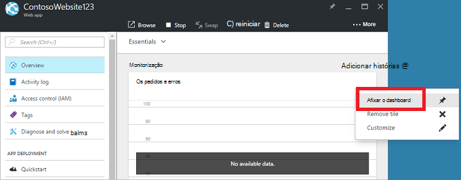

## Criar um dashboard

Para criar um dashboard, selecione o botão de **novo dashboard** junto ao nome do dashboard atual.  

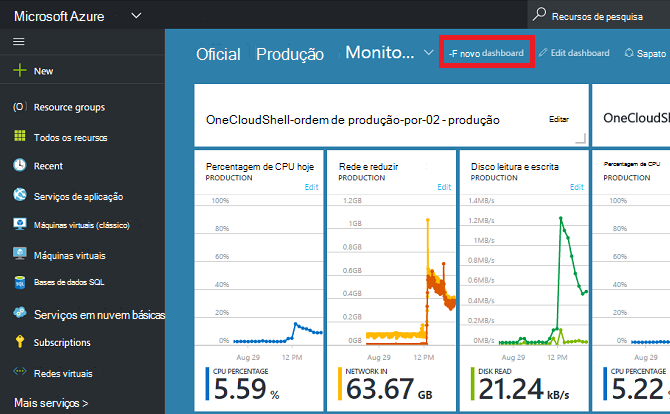

Esta ação cria um dashboard novo, vazio e privado e coloca-o modo de personalização onde pode atribuir um nome o dashboard e adicionar ou reordenar os mosaicos.  Quando está neste modo, na Galeria de mosaico que pode ser fechado leva-o até ao longo do menu de navegação esquerdo.  A Galeria de mosaico permite-lhe localizar mosaicos para os recursos do Azure de várias formas:, pode navegar pelo [grupo de recursos](../azure-resource-manager/resource-group-overview.md#resource-groups), por tipo de recurso, por [etiqueta](../resource-group-using-tags.md)ou ao procurar o seu recurso pelo nome.  

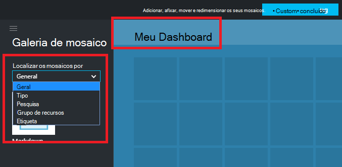

Adicione mosaicos arrastando e largando-as para a superfície de dashboard local onde pretende colocar.

Existe uma nova categoria denominada **gerais** para mosaicos que não estão associados um recurso em particular.  Neste exemplo, vamos afixe o mosaico Markdown.  Utilize este mosaico para adicionar conteúdo personalizado para o dashboard.  O mosaico suporta texto simples, [sintaxe Markdown](https://daringfireball.net/projects/markdown/syntax)e um conjunto de HTML limitado.  (De segurança, que não pode fazer coisas como inserção `<script>` etiquetas ou utilize determinado elemento de estilo de CSS que possam interferir com o portal.) 

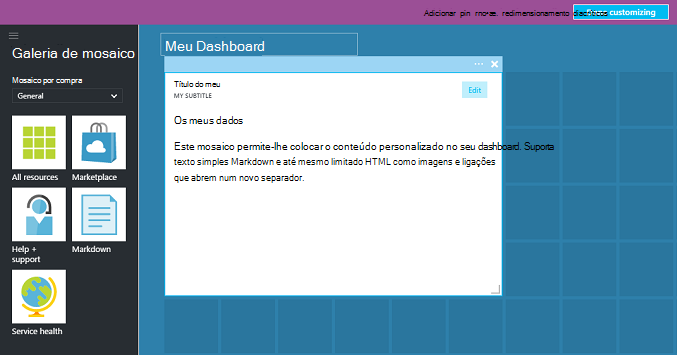

## Editar um dashboard

Depois de criar o seu dashboard, pode afixá mosaicos a partir da Galeria de mosaico ou a representação de mosaico de pás. Vamos afixar a representação da nossa grupo de recursos. Pode quer pin quando o item de navegação ou a partir do pá de grupo de recursos. As duas abordagens resultam em afixar a representação de mosaico de grupo de recursos.

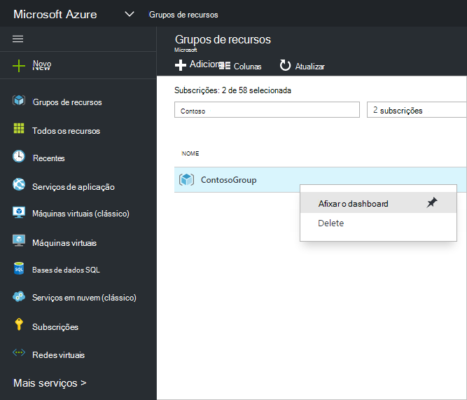

Após a afixação de item, é apresentado no seu dashboard.

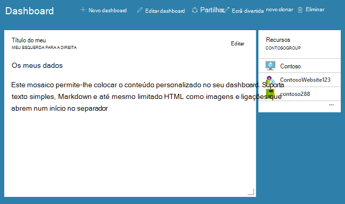

Agora que temos um mosaico Markdown e um grupo de recursos afixados ao dashboard, que possamos redimensionar e reorganizar os mosaicos das imagens para um esquema adequado.

Pairar e seleccionando "…" ou clicando com o botão direito num mosaico pode ver todos os comandos contextuais para esse mosaico. Por predefinição, existem dois itens:

1. **Remover do dashboard** – remove o mosaico do dashboard
2.  Introduz **Personalizar** – personalizar o modo

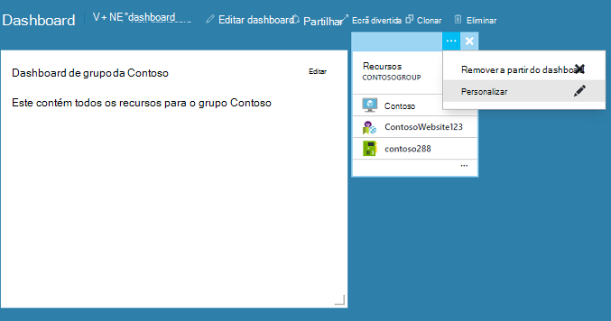

Ao selecionar Personalizar, pode redimensionar e reordenar os mosaicos. Para redimensionar um mosaico, selecione o novo tamanho no menu contextual, conforme mostrado na seguinte imagem.

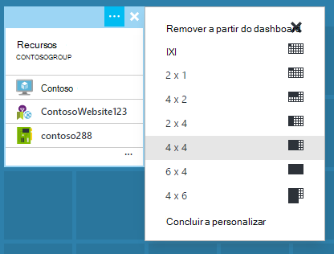

Em alternativa, se o mosaico suporta qualquer tamanho, pode arrastar o canto inferior direito para o tamanho pretendido.

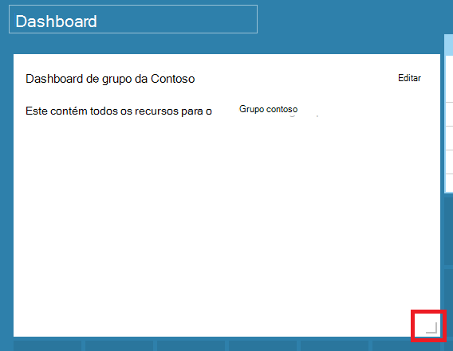

Depois de redimensionar mosaicos, visualizar o dashboard.

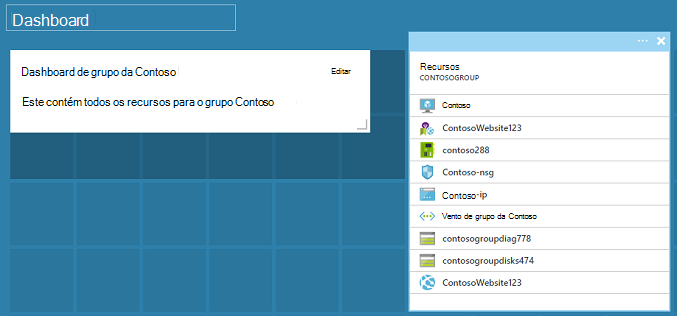

Assim que acabar de personalizar um dashboard, basta selecionar as **concluído personalizar** para sair do personalizar o modo de ou com o botão direito e selecione **concluído personalizar** no menu de contexto.

## Publicar um dashboard e gerir o controlo de acesso

Ao criar um dashboard, é privado por predefinição, o que significa que é o único utilizador quem pode vê-la.  Para tornar visível para outras pessoas, utilize o botão de **partilha** que é apresentada juntamente com os outros comandos do dashboard.

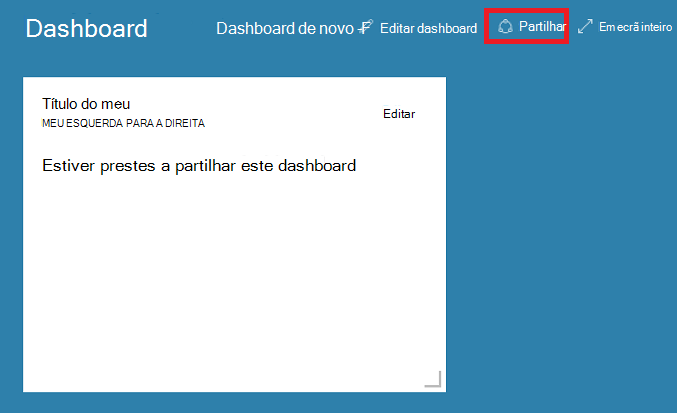

Se lhe pedir para escolher uma subscrição e o grupo de recursos para o dashboard para ser publicado. Para integrar totalmente dashboards em ecossistema, podemos optou por dashboards partilhados como recursos Azure (para que não é possível partilhar, escrevendo um endereço de e-mail).  O acesso às informações apresentados na maioria dos mosaicos no portal do são regida pelos [Função o Azure com base no controlo de acesso](../active-directory/role-based-access-control-configure.md ). A partir de uma perspetiva de controlo de acesso, dashboards partilhados são não diferentes a partir de uma máquina virtual ou com uma conta de armazenamento.  

Digamos tenha uma subscrição do Azure e membros da sua equipa foram atribuídos as funções de **leitor** da subscrição, **Contribuinte**ou **proprietário**.  Os utilizadores que estão os proprietários ou contribuintes que conseguem da lista, ver, criar, modificar ou eliminar dashboards dentro desse subscrição.  Os utilizadores que estão os leitores podem dashboards de lista e vista, mas não é possível modificar ou eliminá-los.  Os utilizadores com acesso de leitor podem fazer edições locais a um dashboard partilhado, mas não forem capazes de publicar essas alterações no servidor.  No entanto, estes podem fazer uma cópia privada do dashboard para utilização própria.  Como sempre, mosaicos individuais no dashboard de impõem as suas próprias regras de controlo de acesso com base nos recursos que correspondem à.  

Para sua comodidade, experiência o portal de publicação orienta-o no sentido um padrão onde colocar dashboards num grupo de recursos chamado **dashboards**.  

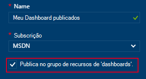

Também pode optar por publicar um dashboard para um grupo de recursos específico.  O controlo de acesso para esse dashboard corresponde o controlo de acesso do grupo de recursos.  Utilizadores que podem gerir os recursos nesse grupo de recursos também têm acesso aos dashboards.

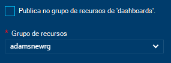

Depois do dashboard é publicado, o painel de controlo da **partilha + acesso** atualizar e mostrar-lhe informações sobre o dashboard publicado, incluindo uma ligação para gerir o acesso do utilizador para o dashboard.  Esta ligação inicia a pá de controlo de acesso com base da função padrão utilizado para gerir o acesso para todos os recursos Azure.  Pode sempre voltar a esta vista ao selecionar a **partilhar**.

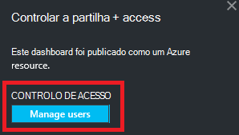

## Próximos passos

- Para gerir recursos, consulte o artigo [Gerir Azure recursos através do portal](resource-group-portal.md).
- Para implementar os recursos, consulte o artigo [recursos implementar modelos de Gestor de recursos e Azure portal](../resource-group-template-deploy-portal.md).