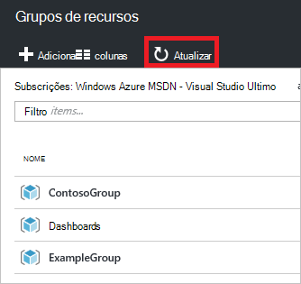

<properties 
    pageTitle="Utilizar o portal do Azure para gerir os recursos Azure | Microsoft Azure" 
    description="Utilize Azure portal e gerir o Azure recurso para gerir os seus recursos. Mostra como trabalhar com dashboards para monitorizar recursos." 
    services="azure-resource-manager,azure-portal" 
    documentationCenter="" 
    authors="tfitzmac" 
    manager="timlt" 
    editor="tysonn"/>

<tags 
    ms.service="azure-resource-manager" 
    ms.workload="multiple" 
    ms.tgt_pltfrm="na" 
    ms.devlang="na" 
    ms.topic="article" 
    ms.date="09/12/2016" 
    ms.author="tomfitz"/>

# Gerir os recursos Azure através do portal

> [AZURE.SELECTOR]
- [Azure PowerShell](../powershell-azure-resource-manager.md)
- [Clip Azure](../xplat-cli-azure-resource-manager.md)
- [Portal](resource-group-portal.md) 
- [REST API](../resource-manager-rest-api.md)

Este tópico mostra como utilizar o [Azure portal](https://portal.azure.com) com o [Gestor de recursos do Azure](../azure-resource-manager/resource-group-overview.md) para gerir os seus recursos Azure. Para obter informações sobre como implementar recursos através do portal do, consulte o artigo [recursos implementar modelos de Gestor de recursos e Azure portal](../resource-group-template-deploy-portal.md).

Atualmente, não cada serviço suporta o portal ou o Gestor de recursos. Desses serviços, terá de utilizar o [portal clássica](https://manage.windowsazure.com). Para o estado de cada serviço, consulte o [gráfico de disponibilidade portal Azure](https://azure.microsoft.com/features/azure-portal/availability/).

## Gerir grupos de recursos

1. Para ver todos os grupos na sua subscrição do recurso, selecione **grupos de recursos**.

    

1. Para criar um grupo de recursos vazia, selecione **Adicionar**.

    

1. Fornece um nome e uma localização para o novo grupo de recursos. Selecione **Criar**.

    

1. Poderá ter selecionar a opção **Atualizar** para ver o grupo de recursos criadas recentemente.

    

1. Para personalizar as informações apresentadas dos seus grupos de recurso, selecione **colunas**.

    

1. Selecione as colunas a adicionar e, em seguida, selecione **Atualizar**.

    

1. Para saber mais sobre implementar recursos para o novo grupo de recursos, consulte o artigo [recursos implementar modelos de Gestor de recursos e Azure portal](../resource-group-template-deploy-portal.md).

1. Para um acesso rápido para um grupo de recursos, pode afixar a pá o dashboard.

    

1. O dashboard apresenta o grupo de recursos e os seus recursos. Pode selecionar em grupos de recursos ou qualquer um dos seus recursos para navegar para o item.

    

## Recursos de etiqueta

Pode aplicar etiquetas para grupos de recursos e recursos para organizar logicamente os seus ativos. Para obter informações sobre como trabalhar com marcas, consulte o artigo [utilizar etiquetas para organizar os recursos do Azure](../resource-group-using-tags.md).

[AZURE.INCLUDE [resource-manager-tag-resource](../../includes/resource-manager-tag-resources.md)]

## Monitorizar recursos

Quando selecionar um recurso, o pá recurso apresenta predefinido gráficos e tabelas para monitorizar a esse tipo de recurso.

1. Selecione um recurso e repare na secção de **monitorização** . Inclui gráficos relevantes para o tipo de recurso. A imagem seguinte mostra a predefinição monitorizar os dados de uma conta de armazenamento.

    

1. Pode afixar uma secção da pá o dashboard ao selecionar as reticências (…) acima da secção. Também pode personalizar o tamanho, a secção na pá ou removê-lo completamente. A imagem seguinte mostra como afixar, personalizar ou remover a secção de memória e CPU.

    

1. Após a afixação de secção ao dashboard, verá o resumo no dashboard. E, selecionando-o imediatamente leva-o para obter mais detalhes sobre os dados.

    

1. Para personalizar completamente os dados que monitorizar através do portal do, navegue para o seu dashboard predefinido e selecione **novo dashboard**.

    

1. Dê um nome ao seu novo dashboard e arraste mosaicos para o dashboard. Os mosaicos das imagens são filtrados por diferentes opções.

    

     Para obter informações sobre como trabalhar com dashboards, consulte o artigo [criar e partilhar dashboards no portal do Azure](azure-portal-dashboards.md).

## Adicionar e utilizar recursos

No pá para um recurso, verá as opções para gerir o recurso. O portal apresenta opções de gestão para esse tipo de recurso específico. Consulte os comandos de gestão na parte superior de pá o recurso e, no lado esquerdo.

A partir destas opções, pode executar operações, tais como iniciar e parar a uma máquina virtual ou reconfigurar as propriedades da máquina virtual.

## Deslocar-se de recursos

Se precisar de deslocar-se de recursos para outra subscrição ou outro grupo de recursos, consulte o artigo [Mover recursos para novo grupo de recursos ou subscrição](../resource-group-move-resources.md).

## Recursos de bloqueio

Pode bloquear uma subscrição, grupo de recursos ou recurso para impedir que outros utilizadores na sua organização a partir de eliminar ou modificar recursos críticos acidentalmente. Para mais informações, consulte o artigo [recursos de bloqueio com o Gestor de recursos do Azure](../resource-group-lock-resources.md).

[AZURE.INCLUDE [resource-manager-lock-resources](../../includes/resource-manager-lock-resources.md)]

## Ver a sua subscrição e os custos

Pode ver informações sobre a sua subscrição e os custos de agregadas para todos os seus recursos. Selecione **subscrições** e a subscrição que pretende ver. Poderá ter apenas uma subscrição para selecionar.

Dentro de pá subscrição, verá uma taxa de gravação.

E uma divisão de custos por tipo de recurso.

## Modelo de exportação

Depois de configurar o seu grupo de recursos, poderá querer ver o modelo de Gestor de recursos para o grupo de recursos. Exportar o modelo oferece duas vantagens:

1. Pode facilmente automatizar implementações futuras da solução porque o modelo contém a infraestrutura concluída.

2. Podem ficar familiarizado com a sintaxe de modelo procurando na JavaScript objeto notação (JSON) que representa a solução.

Para obter orientações passo a passo, consulte o artigo [Gestor de recursos do Azure exportar modelo a partir de recursos existentes](../resource-manager-export-template.md).

## Eliminar o grupo de recursos ou recursos

Eliminar um grupo de recursos elimina todos os recursos nela contidas. Também pode eliminar recursos individuais dentro de um grupo de recursos. Pretende tenha cuidado quando eliminar um grupo de recursos, porque poderá haver recursos no outros grupos de recursos que estão ligados à mesma. Gestor de recursos não elimina recursos ligados, mas poderão não funcionar corretamente sem os recursos esperados.

## Próximos passos

- Para ver registos de auditoria, consulte o artigo [Auditar operações com o Gestor de recursos](../resource-group-audit.md).
- Para resolver problemas de erros de implementação, consulte o artigo [implementações de grupo de recursos de resolução de problemas com o Azure portal](../resource-manager-troubleshoot-deployments-portal.md).
- Para implementar os recursos através do portal do, consulte o artigo [recursos implementar modelos de Gestor de recursos e Azure portal](../resource-group-template-deploy-portal.md).
- Para gerir o acesso aos recursos, consulte o artigo [atribuições de funções de utilização para gerir o acesso aos recursos da subscrição Azure](../active-directory/role-based-access-control-configure.md).

