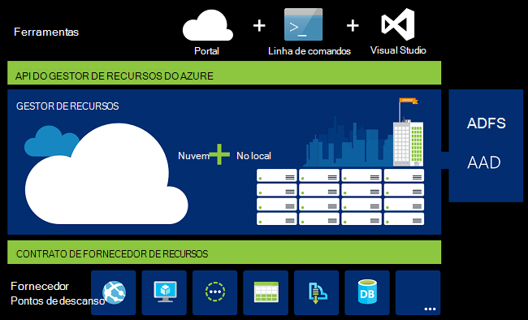
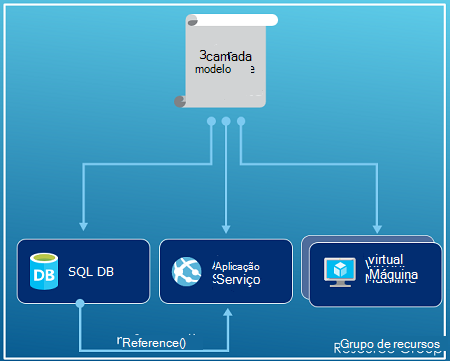
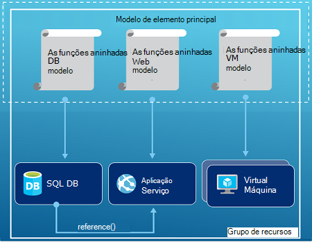
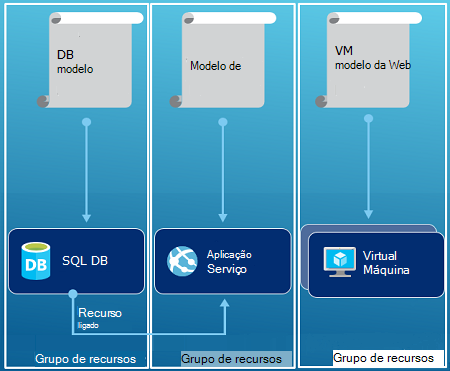

<properties
   pageTitle="Descrição geral do Gestor de recursos do Azure | Microsoft Azure"
   description="Descreve como utilizar o Gestor de recursos do Azure para a implementação, gestão e controlo de recursos no Azure de acesso."
   services="azure-resource-manager"
   documentationCenter="na"
   authors="tfitzmac"
   manager="timlt"
   editor="tysonn"/>

<tags
   ms.service="azure-resource-manager"
   ms.devlang="na"
   ms.topic="get-started-article"
   ms.tgt_pltfrm="na"
   ms.workload="na"
   ms.date="10/21/2016"
   ms.author="tomfitz"/>

# Descrição geral do Gestor de recursos Azure

A infraestrutura de para a aplicação é normalmente constituída por vários componentes – talvez uma máquina de virtual, conta de armazenamento e rede virtual, ou uma aplicação web, base de dados, servidor de base de dados e 3º serviços de terceiros. Não vê estes componentes como entidades separadas, em vez disso, pode vê-los como relacionadas e interdependentes partes de uma única entidade. Pretende implementar, gerir e monitorizá-los como um grupo. Gestor de recursos do Azure permite-lhe trabalhar com os recursos na sua solução como um grupo. Pode implementar, atualizar ou eliminar todos os recursos para a sua solução numa operação de única e coordenada. Utilizar um modelo para implementação e esse modelo pode ser útil ambientes diferentes, tais como teste, teste e produção. Gestor de recursos fornece segurança, auditoria e funcionalidades para o ajudar a gerir os seus recursos após a implementação de etiquetas. 

## Terminologia

Se estiver familiarizado para o Gestor de recursos do Azure, existem alguns termos poderá não estar familiarizado.

- **recurso** - um item de fácil que está disponível através do Azure. Alguns recursos comuns são uma máquina virtual, conta de armazenamento, aplicação web, base de dados e rede virtual, mas existem muitas mais.
- **grupo de recursos** - um contentor que detém recursos relacionados para uma solução Azure. O grupo de recursos pode incluir todos os recursos para a solução, ou apenas os recursos que pretende gerir como um grupo. Decidir como pretende atribuir recursos a grupos de recursos com base no que considera mais coerente para a sua organização. Consulte o artigo [grupos de recursos](#resource-groups).
- **fornecedor de recursos** - um serviço que fornece os recursos que pode implementar e gerir através do Gestor de recursos. Cada fornecedor de recursos oferece operações para trabalhar com os recursos que são implementados. Alguns fornecedores de recurso comuns são Microsoft.Compute, que fornece o recurso de máquina virtual, Microsoft.Storage, que fornece o recurso de conta de armazenamento, e Microsoft.Web, que fornece recursos relacionados com aplicações web. Consulte o artigo [fornecedores de recursos](#resource-providers).
- **Gestor de recursos do modelo** - ficheiro de respostas JavaScript objeto notação (JSON) que define um ou mais recursos para implementar a um grupo de recursos. Também define as dependências entre os recursos implementadas. O modelo pode ser utilizado para implementar os recursos de forma consistente e repetidamente. Consulte o artigo [implementação do modelo](#template-deployment).
- **sintaxe declarativa** - sintaxe que permite-lhe indicar a "Eis o que posso pretende criar" sem ter de escrever a sequência de programação comandos criá-lo. O modelo de Gestor de recursos está um exemplo da sintaxe declarativa. No ficheiro, pode definir as propriedades de infraestrutura implementar Azure. 

## Os benefícios da utilização do Gestor de recursos

Gestor de recursos fornece várias vantagens:

- Pode implementar, gerir e monitorizar todos os recursos para a sua solução como um grupo, em vez de processamento estes recursos individualmente.
- Pode implementar a sua solução durante o ciclo de vida do desenvolvimento repetidamente e ter confiança que os recursos são implementados num estado consistente.
- Pode gerir a sua infraestrutura de através de modelos declarativos em vez de scripts.
- Pode definir as dependências entre recursos, de modo que são implementadas na ordem correta.
- Pode aplicar o controlo de acesso a todos os serviços no seu grupo de recursos como controlo de acesso baseado em funções RBCA () vierem está integrado na plataforma de gestão.
- Pode aplicar etiquetas para recursos para organizar logicamente todos os recursos na sua subscrição.
- Pode clarificar faturação da sua organização, veja os custos de um grupo de recursos partilhar a mesma etiqueta.  

Gestor de recursos fornece uma nova forma para implementar e gerir as soluções. Se utilizou o modelo de implementação anterior e quer saber mais sobre as alterações, consulte [Noções sobre o Gestor de recursos de implementação e implementação clássica](../resource-manager-deployment-model.md).

## Camadas de gestão coerente

Gestor de recursos fornece uma camada de gestão coerente para as tarefas que efectuar através do Azure PowerShell, Azure clip, Azure portal, REST API e ferramentas de desenvolvimento. Todas as ferramentas de utilizam um conjunto comum de operações. Utilize as ferramentas que funcionam melhor para si e podem utilizá-los alternadamente sem confusões. 

Na imagem seguinte mostra como todas as ferramentas interagem com a API do Gestor de recursos do Azure mesmo. API transmite pedidos para o serviço de Gestor de recursos, que autentica e autoriza os pedidos. Gestor de recursos, em seguida, encaminha os pedidos para os fornecedores de recurso apropriado.

## Orientação

As seguintes sugestões ajudá-lo a tirar o máximo partido do Gestor de recursos quando trabalha com as soluções.

1. Definir e implementar a sua infraestrutura através da sintaxe declarativa em modelos de Gestor de recursos, em vez de através de comandos obrigatório.
2. Defina todos os passos de configuração e implementação no modelo. Que deve ter sem manuais passos para configurar a sua solução.
3. Execute obrigatório comandos para gerir os recursos, tais como iniciar ou parar de uma aplicação ou máquina.
4. Dispor os recursos com o mesmo ciclo de vida de um grupo de recursos. Utilize etiquetas para todos os outros organizar dos recursos.

Para obter recomendações mais, consulte o artigo [melhores práticas para criar modelos de Gestor de recursos do Azure](../resource-manager-template-best-practices.md).

## Grupos de recursos

Existem algumas factores importantes a ter em consideração quando definir o seu grupo de recursos:

1. Todos os recursos no seu grupo devem partilhar o ciclo de vida do mesmo. Implementar, atualize e elimine-as em conjunto. Se um recurso, tal como um servidor de base de dados, tem de existir um ciclo de implementação diferentes deve ser no outro grupo de recursos.
2. Cada recurso só pode existir no grupo de um recurso.
3. Pode adicionar ou remover um recurso a um grupo de recursos em qualquer altura.
4. Pode mover um recurso a partir de um grupo de recursos para outro grupo. Para mais informações, consulte o artigo [Mover recursos para novo grupo de recursos ou subscrição](../resource-group-move-resources.md).
4. Um grupo de recursos pode conter recursos que residem na regiões diferentes.
5. Um grupo de recursos pode ser utilizado para organizar o controlo de acesso para ações administrativas.
6. Um recurso pode interagir com os recursos no outros grupos de recursos. Este interação é comum quando os dois recursos estão relacionados com mas não partilham o mesma do ciclo de vida (por exemplo, aplicações web do ligar a uma base de dados).

Ao criar um grupo de recursos, tem de fornecer uma localização para esse grupo de recursos. Poderá estar a pensar, "por que motivo é que um grupo de recursos precisa de uma localização? E, se os recursos podem ter diferentes localizações que o grupo de recursos, por que motivo é que a localização do grupo de recursos importante sequer?" O grupo de recursos armazena metadados sobre os recursos. Por conseguinte, quando especificar uma localização para o grupo de recursos, são especificar a localização onde armazenou esse metadados. Por razões de conformidade, poderá ter para se certificar de que os dados são armazenados numa região específico.

## Fornecedores de recursos

Cada fornecedor de recursos oferece um conjunto de recursos e operações para trabalhar com um serviço Azure. Por exemplo, se pretender armazenar teclas e segredos, trabalha com o fornecedor de recurso **Microsoft.KeyVault** . Fornecedor este recurso oferece um tipo de recurso denominado **cofres** para criar o Cofre chave e um tipo de recurso denominado **cofres/segredos** para criar uma palavra-passe no cofre chave. 

Antes de começar a trabalhar com implementar os recursos, deve obter uma compreensão dos fornecedores de recursos disponíveis. Conhecer os nomes dos fornecedores de recursos e recursos ajuda-o a definir recursos que pretende implementar Azure.

Obter todos os fornecedores de recurso com o seguinte cmdlet do PowerShell:

    Get-AzureRmResourceProvider -ListAvailable

Em alternativa, com o Azure clip, obtém todos os fornecedores de recurso com o seguinte comando:

    azure provider list

Pode percorrer a lista devolvida para os fornecedores de recursos que tem de utilizar.

Para obter detalhes sobre um fornecedor de recursos, adicione o espaço de nomes do fornecedor para o seu comando. O comando devolve os tipos de recursos suportados para o fornecedor de recursos e localizações suportadas e versões de API para cada tipo de recurso. O seguinte cmdlet do PowerShell obtém detalhes sobre Microsoft.Compute:

    (Get-AzureRmResourceProvider -ProviderNamespace Microsoft.Compute).ResourceTypes

Em alternativa, com o Azure clip, recuperar os tipos de recursos suportados, localizações e versões de API para Microsoft.Compute, com o seguinte comando:

    azure provider show Microsoft.Compute --json > c:\Azure\compute.json

Para mais informações, consulte o artigo [fornecedores de Gestor de recursos, regiões, versões API e esquemas](../resource-manager-supported-services.md).

## Implementação de modelo

Com o Gestor de recursos, pode criar um modelo (no formato JSON) que define a infraestrutura e a configuração da sua solução Azure. Ao utilizar um modelo, pode repetidamente implementar a sua solução durante o ciclo de vida e ter confiança que os recursos são implementados num estado consistente. Quando cria uma solução a partir do portal, a solução inclui automaticamente um modelo de implementação. Não tem de criar o seu modelo de raiz porque pode começar com o modelo para a sua solução e personalizá-lo para corresponder às suas necessidades específicas. Pode obter um modelo para um grupo de recursos existente ao exportar o estado atual do grupo de recursos ou visualizar o modelo utilizado para uma implementação específica. Ver [exportados modelo](../resource-manager-export-template.md) é uma forma útil para saber mais sobre a sintaxe de modelo.

Para saber mais sobre o formato do modelo e como construi-lo, consulte o artigo [Criação de modelos de Gestor de recursos do Azure](../resource-group-authoring-templates.md) e [Tutorial do Gestor de recursos do modelo](../resource-manager-template-walkthrough.md).

Gestor de recursos processa o modelo, como qualquer outro pedido (consulte a imagem para [a camada de gestão coerente](#consistent-management-layer)). -Analisa o modelo e converte respectiva sintaxe operações REST API para os fornecedores de recurso apropriado. Por exemplo, quando o Gestor de recursos recebe um modelo com a definição do recurso seguinte:

    "resources": [
      {
        "apiVersion": "2016-01-01",
        "type": "Microsoft.Storage/storageAccounts",
        "name": "mystorageaccount",
        "location": "westus",
        "sku": {
          "name": "Standard_LRS"
        },
        "kind": "Storage",
        "properties": {
        }
      }
      ]

Converte a definição para a operação de REST API seguinte, o que é enviada para o fornecedor de recurso Microsoft.Storage:

    PUT
    https://management.azure.com/subscriptions/{subscriptionId}/resourceGroups/{resourceGroupName}/providers/Microsoft.Storage/storageAccounts/mystorageaccount?api-version=2016-01-01
    REQUEST BODY
    {
      "location": "westus",
      "properties": {
      }
      "sku": {
        "name": "Standard_LRS"
      },   
      "kind": "Storage"
    }

Como definir grupos de recursos e modelos é completamente até que e como pretende gerir a sua solução. Por exemplo, pode implementar a aplicação de três camadas através de um único modelo para um grupo de recursos único.

Mas, não tem que definir a sua infraestrutura de toda um único modelo. Muitas vezes, faz sentido para dividir aos requisitos da implementação para um conjunto de modelos de alvo, finalidade específicas. Pode reutilizar facilmente estes modelos para diferentes soluções. Para implementar uma solução específica, crie um modelo principal que liga todos os modelos. A imagem seguinte mostra como implementar uma solução de três camadas através de um modelo de elemento principal que inclui três modelos aninhados.

Se pretende obter as camadas tendo objectivos em separado, pode implementar os seus três camadas para separar os grupos de recursos. Repare que os recursos ainda podem ser associados a recursos de outros grupos de recursos.

Para obter mais sugestões sobre como estruturar os seus modelos, consulte o artigo [padrões para estruturar o Gestor de recursos do Azure modelos](../best-practices-resource-manager-design-templates.md). Para obter informações acerca dos modelos de aninhadas, consulte o artigo [utilizar modelos ligados com o Gestor de recursos do Azure](../resource-group-linked-templates.md).

Gestor de recursos do Azure analisa dependências para se certificar de recursos são criados na ordem correta. Se um recurso depender de um valor a partir de outro recurso (tal como uma máquina de virtual necessitar de uma conta de armazenamento para discos), defina uma dependência. Para mais informações, consulte o artigo [definir dependências no Gestor de recursos do Azure modelos](../resource-group-define-dependencies.md).

Também pode utilizar o modelo existência de actualizações para a infraestrutura. Por exemplo, pode adicionar um recurso a sua solução e adicionar regras de configuração para os recursos que já estão implementados. Se o modelo especifica a criação de um recurso, mas que já existe recurso, o Gestor de recursos do Azure executa uma atualização em vez de criar um novo activo. Gestor de recursos do Azure atualiza o activo existente para o mesmo estado como seriam como novo.  

Gestor de recursos fornece extensões para cenários quando precisar de operações adicionais, tais como instalar o software em particular que não está incluído na configuração. Se já estiver a utilizar um serviço de gestão de configuração, como DSC, chefe ou Puppet, pode continuar a trabalhar com esse serviço utilizando as extensões. Para obter informações sobre as extensões de máquina virtual, consulte o artigo [sobre as extensões de máquina virtual e funcionalidades](../virtual-machines/virtual-machines-windows-extensions-features.md). 

Por fim, o modelo fica parte do código de origem para a sua aplicação. Pode dar entrada-lo para o repositório de código de origem e atualize-lo conforme evolução da sua aplicação. Pode editar o modelo através da Visual Studio.

Depois de definir o seu modelo, está pronto para implementar os recursos Azure. Para os comandos implementar os recursos, consulte:

- [Implementar recursos com os modelos de Gestor de recursos e PowerShell do Azure](../resource-group-template-deploy.md)
- [Implementar recursos com os modelos de Gestor de recursos e clip do Azure](../resource-group-template-deploy-cli.md)
- [Implementar recursos com modelos de Gestor de recursos e o portal do Azure](../resource-group-template-deploy-portal.md)
- [Implementar recursos com os modelos de Gestor de recursos e o Gestor de recursos REST API](../resource-group-template-deploy-rest.md)

## Etiquetas

Gestor de recursos fornece uma funcionalidade de marcação que permite-lhe categorizar recursos de acordo com os seus requisitos para gerir ou de faturação. Utilize etiquetas quando tem uma coleção de complexa de grupos de recursos e recursos e precisar de visualizar esses elementos da forma que considera mais coerente para si. Por exemplo, pode marcar recursos que servem uma função semelhante na sua organização ou pertencem ao mesmo departamento. Sem etiquetas, os utilizadores na sua organização podem criar vários recursos que podem ser difícil mais tarde identificar e gerir. Por exemplo, poderá pretender eliminar todos os recursos para um determinado projeto. Se não sejam encontrem marcados esses recursos do projeto, terá de localizar manualmente. Etiquetagem pode ser uma forma importante para si reduzir os custos desnecessários na sua subscrição. 

Recursos não necessitar de residem no mesmo grupo de recursos para partilhar uma etiqueta. Pode criar o seu próprio taxonomia etiqueta para se certificar de que todos os utilizadores na sua organização utilizar etiquetas comuns em vez de utilizadores inadvertidamente aplicando um pouco diferentes etiquetas (por exemplo, "departamento" em vez de "departamento").

O exemplo seguinte mostra uma etiqueta aplicada a uma máquina virtual.

    "resources": [    
      {
        "type": "Microsoft.Compute/virtualMachines",
        "apiVersion": "2015-06-15",
        "name": "SimpleWindowsVM",
        "location": "[resourceGroup().location]",
        "tags": {
            "costCenter": "Finance"
        },
        ...
      }
    ]

Para obter todos os recursos com um valor de etiqueta, utilize o seguinte cmdlet do PowerShell:

    Find-AzureRmResource -TagName costCenter -TagValue Finance

Em alternativa, o seguinte comando Azure clip:

    azure resource list -t costCenter=Finance --json

Também pode ver recursos com tags através do portal do Azure.

O [relatório de utilização](../billing/billing-understand-your-bill.md) para a sua subscrição inclui os nomes de etiqueta e valores, que permite-lhe dividem os custos por etiquetas. Para mais informações acerca das etiquetas, consulte o artigo [utilizar etiquetas para organizar os recursos do Azure](../resource-group-using-tags.md).

## Controlo de acesso

Gestor de recursos permite-lhe controlar quem tem acesso a ações específicas para a sua organização. Vierem integra-se o controlo de acesso baseado em funções (RBCA) para a plataforma de gestão e aplica-se de que o controlo de acesso a todos os serviços no seu grupo de recursos. 

Existem dois conceitos principais para compreender quando trabalhar com o controlo de acesso baseado em funções:

- Definições de funções - descrevem um conjunto de permissões e podem ser utilizados em muitos atribuições.
- Atribuições de funções - associar uma definição de com uma identidade (utilizador ou grupo) para um determinado âmbito (de subscrição, de grupo de recursos ou de recurso). A atribuição é herdada por âmbitos inferiores.

Pode adicionar utilizadores a plataforma predefinida e funções específicas do recurso. Por exemplo, pode tirar partido da função predefinido denominado leitor permite que os utilizadores para ver os recursos, mas não alterá-las. Adicionar utilizadores na sua organização que necessitam deste tipo de acesso à função de leitor e aplicam-se a função para a subscrição, grupo de recursos ou recurso.

Azure fornece as seguintes funções de quatro plataforma:

1.  Proprietário - pode gerir tudo, incluindo o access
2.  Contribuinte - pode gerir tudo exceto access
3.  Leitor - pode ver tudo, mas não pode efetuar alterações
4.  Administrador de acesso de utilizador - pode gerir o acesso do utilizador para recursos Azure

Azure também fornece várias funções específicas do recurso. Alguns operadores comuns são:

1.  Máquina virtual contribuinte - pode gerir máquinas virtuais mas não conceder acesso aos mesmos e não pode gerir a conta de armazenamento ou rede virtual aos quais estão ligados
2.  Rede contribuinte - pode gerir todos os recursos de rede, mas não conceder acesso aos mesmos
3.  Armazenamento conta contribuinte - pode gerir as contas de armazenamento, mas não conceder acesso aos mesmos
4. SQL Server contribuinte - pode gerir os servidores de SQL e bases de dados, mas não os respetivos políticas relacionadas com segurança
5. Web site contribuinte - pode gerir Web sites, mas não os planos de web à qual estão ligados

Para a lista completa de funções e acções permitidas, consulte o artigo [RBAC: integrado funções](../active-directory/role-based-access-built-in-roles.md). Para mais informações sobre o controlo de acesso baseado em funções, consulte o artigo [O controlo de acesso baseado em funções Azure](../active-directory/role-based-access-control-configure.md). 

Em alguns casos, pretender executar código ou script que aceda a recursos, mas não pretende executá-la em credenciais de utilizador. Em vez disso, que pretende criar uma identidade denominada de serviço de principal para a aplicação e atribuir o papel adequado para o serviço principal. Gestor de recursos permite-lhe criar credenciais para a aplicação e através de programação autenticar a aplicação. Para obter informações sobre como criar principais de serviço, consulte um dos seguintes tópicos:

- [Utilizar o PowerShell do Azure para criar um principal de serviço para aceder a recursos](../resource-group-authenticate-service-principal.md)
- [Utilizar o clip do Azure para criar um principal de serviço para aceder a recursos](../resource-group-authenticate-service-principal-cli.md)
- [Utilizar o portal para criar a aplicação do Active Directory e principal do serviço que pode aceder a recursos](../resource-group-create-service-principal-portal.md)

Pode também explicitamente bloquear críticos recursos para impedir que os utilizadores eliminar ou modificá-las. Para mais informações, consulte o artigo [recursos de bloqueio com o Gestor de recursos do Azure](../resource-group-lock-resources.md).

## Registos de atividade

Gestor de recursos regista todas as operações que criar, modifiquem ou eliminar um recurso. Pode utilizar os registos de atividade para obter um erro durante a resolução de problemas ou para monitorizar a forma como um utilizador na sua organização modificado um recurso. Para ver os registos de início, selecione **os registos de atividade** na pá **Definições** para um grupo de recursos. Pode filtrar os registos por muitos valores diferentes, incluindo qual o utilizador iniciou a operação. Para obter informações sobre como trabalhar com os registos de atividade, consulte o artigo [operações de auditoria com o Gestor de recursos](../resource-group-audit.md).

## Políticas personalizadas

Gestor de recursos permite-lhe criar políticas personalizadas para gerir os seus recursos. Os tipos de políticas criadas podem incluir diversificados cenários. Pode impor a uma convenção de nomenclatura no recursos, limite quais os tipos e instâncias de recursos pode ser implementada ou limite as regiões podem alojar um tipo de recurso. Pode necessitar de um valor de etiqueta de recursos para organizar faturação por departamentos. Criar políticas para ajudar a reduzir os custos e manter a consistência da sua subscrição. 

Definir políticas com JSON e, em seguida, aplicar essas exigências ao longo da sua subscrição ou dentro de um grupo de recursos. As políticas são diferentes do controlo de acesso baseado em funções porque são aplicadas a tipos de recursos.

O exemplo seguinte mostra uma política que assegura consistência etiqueta ao especificar que todos os recursos incluam uma etiqueta de costCenter.

    {
      "if": {
        "not" : {
          "field" : "tags",
          "containsKey" : "costCenter"
        }
      },
      "then" : {
        "effect" : "deny"
      }
    }

Existem muitas mais tipos de políticas, que pode criar. Para mais informações, consulte o artigo [Utilizar a política para gerir os recursos e controlar o acesso](../resource-manager-policy.md).

## SDK

Azure SDK está disponível para vários idiomas e plataformas.
Cada uma destas implementações idioma está disponível através do seu Gestor de pacotes ecossistema e GitHub.

O código em cada uma das seguinte SDK é gerado a partir do especificações Azure RESTful API.
Estas especificações são Abrir origem e com base em da especificação Swagger 2.0.
O código SDK é gerado através de um projeto de código fonte do aberto denominado AutoRest.
AutoRest transformações estas especificações RESTful API para bibliotecas do cliente em vários idiomas.
Se pretender melhorar a qualquer aspetos do código gerado dos SDK de, todo o conjunto de ferramentas para criar os SDK são abertos, disponíveis gratuitamente e com base num formato especificação API amplamente aprovado.

Aqui estão os nossos repositórios abrir SDK de origem. Vamos bem-vindo comentários, problemas e separar os pedidos.

[.NET](https://github.com/Azure/azure-sdk-for-net) | [Java](https://github.com/Azure/azure-sdk-for-java) | [Node.js](https://github.com/Azure/azure-sdk-for-node) | [PHP](https://github.com/Azure/azure-sdk-for-php) | [Python](https://github.com/Azure/azure-sdk-for-python) | [Rubi](https://github.com/Azure/azure-sdk-ruby)

> [AZURE.NOTE]Se o SDK não fornecer a funcionalidade necessária, pode também ligar à [Azure REST API](https://msdn.microsoft.com/library/azure/dn790568.aspx) diretamente.

## Amostras

### .NET

- [Gerir grupos de recursos e recursos Azure](https://azure.microsoft.com/documentation/samples/resource-manager-dotnet-resources-and-groups/)
- [Implementar uma SSH ativado VM com um modelo](https://azure.microsoft.com/documentation/samples/resource-manager-dotnet-template-deployment/)

### Java

- [Gerir os recursos Azure](https://azure.microsoft.com/documentation/samples/resources-java-manage-resource/)
- [Gerir grupos de recursos Azure](https://azure.microsoft.com/documentation/samples/resources-java-manage-resource-group/)
- [Implementar uma SSH ativado VM com um modelo](https://azure.microsoft.com/documentation/samples/resources-java-deploy-using-arm-template/)

### NODE.js

- [Gerir grupos de recursos e recursos Azure](https://azure.microsoft.com/documentation/samples/resource-manager-node-resources-and-groups/)
- [Implementar uma SSH ativado VM com um modelo](https://azure.microsoft.com/documentation/samples/resource-manager-node-template-deployment/)

### Python

- [Gerir grupos de recursos e recursos Azure](https://azure.microsoft.com/documentation/samples/resource-manager-python-resources-and-groups/)
- [Implementar uma SSH ativado VM com um modelo](https://azure.microsoft.com/documentation/samples/resource-manager-python-template-deployment/)

### Rubi

- [Gerir grupos de recursos e recursos Azure](https://azure.microsoft.com/documentation/samples/resource-manager-ruby-resources-and-groups/)
- [Implementar uma SSH ativado VM com um modelo](https://azure.microsoft.com/documentation/samples/resource-manager-ruby-template-deployment/)

Para além destes exemplos, que pode pesquisar através os exemplos da galeria.

[.NET](https://azure.microsoft.com/documentation/samples/?service=azure-resource-manager&platform=dotnet) | [Java](https://azure.microsoft.com/documentation/samples/?service=azure-resource-manager&platform=java) | [Node.js](https://azure.microsoft.com/documentation/samples/?service=azure-resource-manager&platform=nodejs) | [Python](https://azure.microsoft.com/documentation/samples/?service=azure-resource-manager&platform=python) | [Rubi](https://azure.microsoft.com/documentation/samples/?service=azure-resource-manager&platform=ruby)

## Próximos passos

- Para obter uma introdução simple ao trabalhar com modelos, consulte o artigo [Exportar um modelo de Gestor de recursos do Azure a partir de recursos existentes](../resource-manager-export-template.md).
- Para mais detalhada obter instruções sobre criar um modelo, consulte o artigo [Tutorial do Gestor de recursos do modelo](../resource-manager-template-walkthrough.md).
- Para compreender as funções que pode utilizar um modelo, consulte [funções de modelo](../resource-group-template-functions.md)
- Para obter informações sobre como utilizar o Visual Studio com o Gestor de recursos, consulte [criar e implementar a grupos de recursos Azure através do Visual Studio](../vs-azure-tools-resource-groups-deployment-projects-create-deploy.md).
- Para obter informações sobre como utilizar o código de VS com o Gestor de recursos, consulte o artigo [trabalhar com modelos de Gestor de recursos do Azure no código do Visual Studio](../resource-manager-vs-code.md).

Eis uma demonstração de vídeo desta descrição geral:

[AZURE.VIDEO azure-resource-manager-overview]

[powershellref]: https://msdn.microsoft.com/library/azure/dn757692(v=azure.200).aspx
