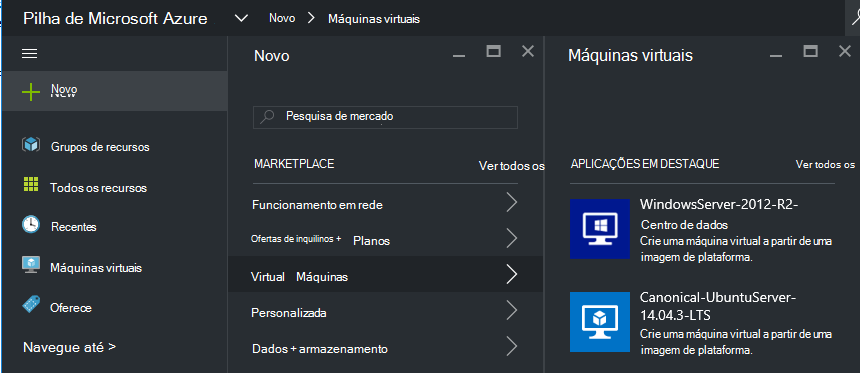
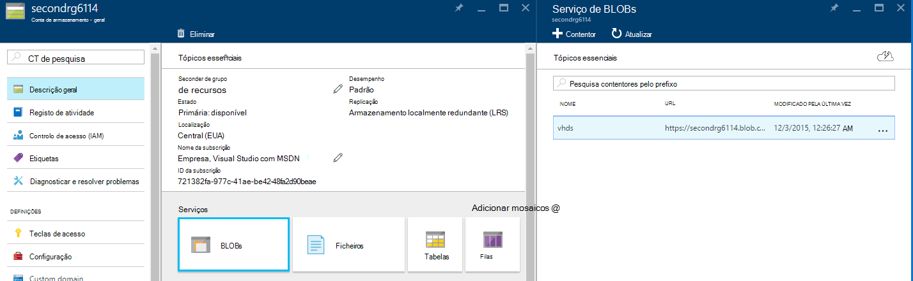
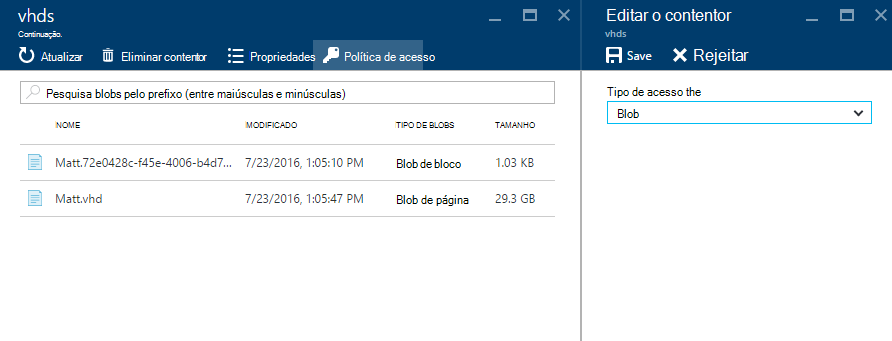
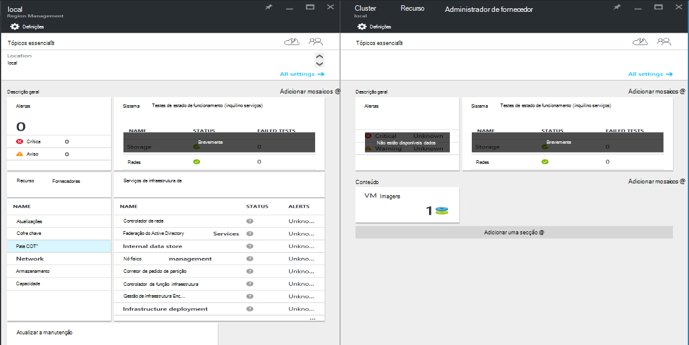
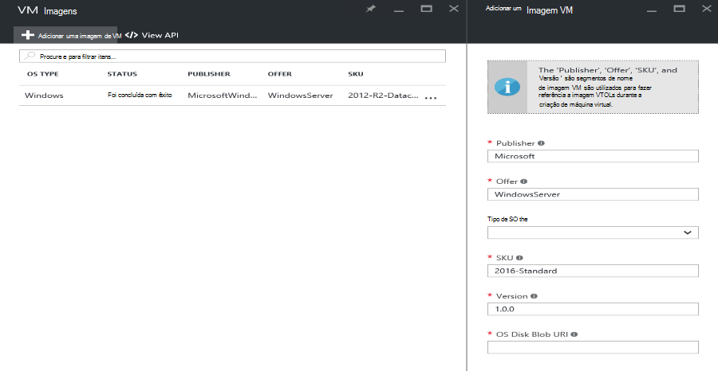

<properties
    pageTitle="Adicionar uma imagem VM a pilha de Azure | Microsoft Azure"
    description="Adicionar Windows ou Linux VM imagem personalizada da sua organização para a inquilinos utilizar"
    services="azure-stack"
    documentationCenter=""
    authors="mattmcg"
    manager="darmour"
    editor=""/>

<tags
    ms.service="azure-stack"
    ms.workload="na"
    ms.tgt_pltfrm="na"
    ms.devlang="na"
    ms.topic="get-started-article"
    ms.date="09/26/2016"
    ms.author="mattmcg"/>

# <a name="make-a-custom-virtual-machine-image-available-in-azure-stack"></a>Disponibilizar uma imagem personalizada máquina virtual Azure empilhados


Pilha Azure permite aos administradores disponibilizar imagens VM, tal como VHD personalizados da respetiva organização, a suas inquilinos. Imagens podem ser referenciadas por modelos de Gestor de recursos do Azure ou adicionadas para IU Azure Marketplace com a criação de um item de Marketplace. Uma imagem do Windows Server 2012 R2 é incluída por predefinição no Azure pilha Technical Preview.

> [AZURE.NOTE] Imagens VM com itens Marketplace podem ser implementadas selecionar **Novo** na interface de utilizador e, em seguida, selecionando a categoria de **máquinas virtuais** . Os itens de imagem VM estão listados.


## <a name="add-a-vm-image-to-marketplace-with-powershell"></a>Adicionar uma imagem VM ao Marketplace com PowerShell

Se a imagem VM VHD estiver disponível localmente no consola do VM (ou outro dispositivo ligado externamente), utilize os seguintes passos:

1. Prepare uma imagem do disco rígido virtual sistema operativo Windows ou Linux no formato VHD (não VHDX).
    -   Para imagens do Windows, o artigo [carregar uma imagem VM do Windows Azure para implementações do Gestor de recursos](virtual-machines-windows-upload-image.md) contém instruções de preparação de imagem na secção **preparar o VHD para carregar** .
    -   Para Linux imagens, siga os passos para preparar a imagem ou utilizar uma imagem existente do Azure pilha Linux conforme descrito no artigo [máquinas virtuais de implementar Linux na pilha de Azure](azure-stack-linux.md).

2. Clonar do [repositório de ferramentas de pilha Azure](https://aka.ms/azurestackaddvmimage)e, em seguida, importe o módulo **ComputeAdmin**

    ```powershell
    Import-Module .\ComputeAdmin\AzureStack.ComputeAdmin.psm1
    ```

3. Adicione a imagem VM ao invocar o cmdlet VMImage adicionar.
    -  Inclua o publisher, oferta, SKU e a versão para a imagem em VM. Estes parâmetros são utilizados por modelos de Gestor de recursos do Azure que fazem referência a imagem VM.
    -  Especificar osType como Windows ou Linux.
    -  Incluir o seu ID de inquilino do Azure Active Directory no formulário * &lt;myaadtenant&gt;*. onmicrosoft.com.
    - Segue-se uma invocação de exemplo do script:

    ```powershell
       Add-VMImage -publisher "Canonical" -offer "UbuntuServer" -sku "14.04.3-LTS" -version "1.0.0" -osType Linux -osDiskLocalPath 'C:\Users\AzureStackAdmin\Desktop\UbuntuServer.vhd' -tenantID <myaadtenant>.onmicrosoft.com
    ```

    > [AZURE.NOTE] O cmdlet pedidos de credenciais para adicionar a imagem VM. Fornecer o administrador de credenciais do Azure Active Directory, tais como serviceadmin@ * &lt;myaadtenant&gt;*. onmicrosoft.com, a confirmar.  

O comando faz o seguinte:
- Autentica para o ambiente de pilha de Azure
- Os carregamentos pendentes local VHD para uma conta de armazenamento temporário recentemente criado
- Adiciona a imagem VM para o repositório de imagem VM
- Cria um item de Marketplace

Para verificar se o comando foi executado com êxito, aceda ao Marketplace no portal do e, em seguida, certifique-se de que a imagem VM está disponível na categoria **máquinas virtuais** .

> 

Segue-se uma descrição dos parâmetros do comando.


| Parâmetro | Descrição |
|----------| ------------ |
|**tenantID** | O ID de inquilino do Azure Active Directory no formulário de * &lt;AADTenantID*. onmicrosoft.com&gt;. |
|**Publisher** | O publisher nome segmento a imagem de VM inquilinos utilizar quando implementar a imagem. Um exemplo é 'Microsoft'. Não inclua um espaço ou outros carateres especiais neste campo.|
|**oferta** | O oferta nome segmento a imagem de VM inquilinos utilizar quando implementar a imagem VM. Um exemplo é 'WindowsServer'. Não inclua um espaço ou outros carateres especiais neste campo. |
| **SKU** | O SKU nome segmento a imagem de VM inquilinos utilizar quando implementar a imagem VM. Um exemplo é 'Datacenter2016'. Não inclua um espaço ou outros carateres especiais neste campo. |
|**versão** | A versão da imagem VM que inquilinos utilizar quando implementar a imagem VM. Esta versão está no formato * \#.\#. \#*. Um exemplo é '1.0.0'. Não inclua um espaço ou outros carateres especiais neste campo.|
| **osType** | OsType da imagem tem de ser 'Windows' ou 'Linux'. |
|**osDiskLocalPath** | O caminho local para o disco de SO VHD que está a carregar como uma imagem VM para Azure pilha. |
|**dataDiskLocalPaths**| Uma matriz opcional dos caminhos locais para discos de dados que podem ser carregados como parte da imagem VM.|
|**CreateGalleryItem**| Um sinalizador booleano que determina se pretende criar um item no Marketplace. A predefinição é definida como verdadeiro.|
|**título**| O nome a apresentar do item de Marketplace. A predefinição é definida para o Publisher-oferta-Sku da imagem VM.|
|**Descrição**| A descrição do Marketplace item. |
|**osDiskBlobURI**| Opcionalmente, este script também aceita um armazenamento de BLOBs URI para osDisk.|
|**dataDiskBlobURIs**| Opcionalmente, este script também aceita uma matriz de armazenamento de BLOBs URIs para adicionar discos de dados para a imagem.|


## <a name="add-a-vm-image-through-the-portal"></a>Adicionar uma imagem de VM através do portal

> [AZURE.NOTE] Este método necessita de criar o item de Marketplace separadamente.

Um requisito de imagens é que pode ser referenciadas por um armazenamento de Blobs do URI. Preparar uma imagem do disco rígido virtual sistema operativo Windows ou Linux no formato VHD (não VHDX) e, em seguida, carregar a imagem para uma conta de armazenamento no Azure ou na pilha de Azure. Se a sua imagem já é carregada ao armazenamento Blob no Azure ou na pilha de Azure, pode ignorar este passo.

Siga os passos do artigo [carregar uma imagem VM do Windows Azure para implementações do Gestor de recursos](https://azure.microsoft.com/documentation/articles/virtual-machines-windows-upload-image/) por passo **carregar a imagem VM à sua conta de armazenamento**. Tenha em atenção o seguinte:

-   Para uma imagem Linux, siga as instruções para preparar a imagem ou utilizar uma imagem existente do Azure pilha Linux conforme descrito no artigo [máquinas virtuais de implementar Linux na pilha de Azure](azure-stack-linux.md).

- É mais eficiente para carregar uma imagem para o armazenamento de Blobs do Azure pilha que ao armazenamento de Blobs do Azure porque demora menos tempo para transmitir a imagem VM para o repositório de imagem do Azure pilha. Ao seguir as instruções de carregamento, certifique-se o passo [PowerShell autenticar com a Microsoft Azure pilha](azure-stack-deploy-template-powershell.md) para o passo 'Login to Azure' substituí-los.

- Anote o armazenamento de BLOBs URI onde carregar a imagem. Que tem o seguinte formato: * &lt;storageAccount&gt;/&lt;blobContainer&gt;/&lt;targetVHDName&gt;*. vhd

2.  Para tornar o blob acessíveis de forma anónima, vá para o contentor de armazenamento de BLOBs conta onde a imagem VM VHD foi carregada para **Blob** e, em seguida, selecione a **Política de acesso**. Se pretender, em vez disso, pode gerar uma assinatura de acesso partilhado para o contentor e incluí-lo como parte do blob URI.





1.  Inicie sessão no Azure pilha como administrador. Aceda a **Gestão de região**. Em seguida, em **RPs**, selecione **Calcular fornecedor de recursos** > **VM imagens** > **Adicionar.**

    

2.  No pá seguinte, introduza o publisher, oferta, SKU e a versão da imagem VM. Estes segmentos de nome referem-se à imagem VM no Gestor de recursos do Azure modelos. Certifique-se selecionar o **osType** corretamente. Para **osDiskBlobURI**, introduza o URI onde a imagem foi carregada no passo 1. Clique em **Criar** para começar a criar a imagem VM.

    

3.  O estado de imagem VM muda para 'Com êxito' quando a imagem é adicionada com êxito.

4.  Inquilinos podem implementar a imagem de VM ao especificar o publisher, oferta, SKU e a versão da imagem VM num modelo de Gestor de recursos do Azure. Para disponibilizar a imagem VM mais facilmente para consumo de inquilino na interface de utilizador, é melhor para [criar um item de Marketplace](azure-stack-create-and-publish-marketplace-item.md).
