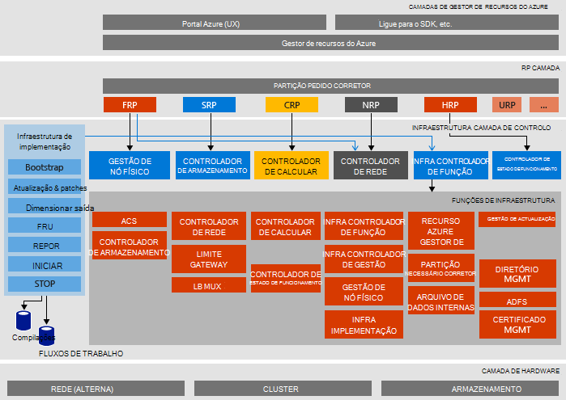

<properties
    pageTitle="Arquitetura do Microsoft Azure pilha prova de conceito (conceito) | Microsoft Azure"
    description="Ver a arquitetura do Microsoft Azure pilha conceito."
    services="azure-stack"
    documentationCenter=""
    authors="heathl17"
    manager="byronr"
    editor=""/>

<tags
    ms.service="azure-stack"
    ms.workload="na"
    ms.tgt_pltfrm="na"
    ms.devlang="na"
    ms.topic="article"
    ms.date="10/25/2016"
    ms.author="helaw"/>

# Arquitetura de conceito de pilha do Microsoft Azure

O conceito de pilha Azure é uma implementação de um nó de 2 de pré-visualização técnica do Azure pilha. Todos os componentes são instalados em máquinas virtuais em execução num computador anfitrião único. 

## Diagrama de arquitectura lógica
O diagrama seguinte ilustra a arquitetura lógica do conceito de pilha Azure e os seus componentes.

## Funções de máquina virtual
O conceito de pilha Azure oferece utilizando as seguintes VMs no anfitrião do conceito de serviços:

 - **MAS ACS01** Máquina virtual serviços de armazenamento do Azure pilha de alojamento.

 - **MAS ADFS01** Máquina virtual alojamento serviços de Federação do Active Directory.  Esta máquina virtual não é utilizada no técnico de pré-visualização de 2.  

 - **MAS ASQL01**  Máquina virtual fornecer um arquivo de dados internas para funções de infraestrutura de pilha de Azure.  

 - **MAS BGPNAT01** Máquina virtual serve como um router de limite e fornece capacidades NAT e VPN para Azure pilha.

 - **MAS CA01** Fornecer serviços de certificação de certificados para serviços de função Azure pilha máquina de virtual.

 - **MAS CON01** Disponível para os programadores para instalar o PowerShell, Visual Studio e outras ferramentas de máquina de virtual.

 - **MAS DC01** Máquina virtual serviços do Active Directory, DNS e DHCP para Microsoft Azure pilha de alojamento.

 - **MAS GWY01** Máquina virtual fornecer limite serviços de gateway como ligações de site para o site VPN para redes de inquilino.

 - **MAS NC01**  Máquina virtual controlador de rede, o que faz a gestão dos serviços de rede do Azure pilha de alojamento.  

 - **MAS SLB01**  Máquina virtual fornece balanceamento de carga serviços na pilha de Azure para inquilinos e serviços de infraestrutura de pilha de Azure.  

 - **MAS SUS01**  Virtual máquina alojamento Windows Server Update Services e responsável pela fornecer as atualizações às restantes máquinas virtuais do Azure pilha.

 - **MAS WAS01**  Máquina virtual alojamento portal e serviços do Gestor de recursos do Azure.

 - **MAS XRP01** Máquina virtual que aloja os fornecedores de recurso principais do Microsoft Azure pilha, incluindo os fornecedores de recurso cluster, rede e armazenamento.

## Serviços de armazenamento
Serviços de armazenamento no sistema operativo no anfitrião do físico incluem:

 - **Serviço de ACS Blob** Azure consistentes armazenamento Blob serviço, que fornece serviços de armazenamento de BLOBs e tabela.

 - **SoFS** Servidor de ficheiros de registo de saída de escala.

 - **ReFS CSV** Cluster de sistema do ficheiro e são partilhadas Volume.

 - **Disco virtual**, **Espaço de armazenamento**e **Armazenamento espaços direta** são a tecnologia subjacente do armazenamento respetivos no Windows Server para ativar o fornecedor de recursos de armazenamento do Microsoft Azure pilha core.

## Próximos passos

[Implementar pilha Azure](azure-stack-deploy.md)

[Cenários primeiros para experimentar](azure-stack-first-scenarios.md)

