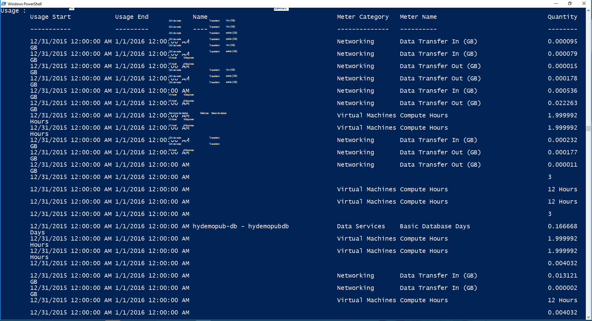

<properties
    pageTitle="Faturação do cliente e encargos empilhados Azure | Microsoft Azure"
    description="Saiba como obter informações de utilização de recursos a partir do Azure pilha."
    services="azure-stack"
    documentationCenter=""
    authors="AlfredoPizzirani"
    manager="byronr"
    editor=""/>

<tags
    ms.service="azure-stack"
    ms.workload="na"
    ms.tgt_pltfrm="na"
    ms.devlang="na"
    ms.topic="article"
    ms.date="10/18/2016"
    ms.author="alfredop"/>

# Cliente faturação e encargos Azure empilhados

Agora que estiver a utilizar o Azure pilha, é uma boa ideia refletir sobre como monitorizar a utilização. Fornecedores de serviços dependem de informações de utilização para faturar aos seus clientes e para compreender o custo de fornecer serviços.
Empresas, também, normalmente controle a utilização por departamento.

Pilha Azure não é um sistema de faturação. Não encargo dos inquilinos para os recursos que utilizam. Mas, Azure pilha de ter a infraestrutura para recolher e agregar dados de utilização para cada fornecedor único recurso. Pode aceder a estes dados e exportá-lo para um sistema de faturação, utilizando uma placa de faturação ou exportá-lo para uma ferramenta de análise de negócio como o Microsoft Power BI.

## Que informações de utilização posso encontrar e como?

Fornecedores de recursos do Azure pilha geram registos de utilização em intervalos de hora a hora. Os registos mostram a quantidade de cada recurso que foi consumida e qual a subscrição consumidas o recurso. Os dados são armazenados. Pode aceder aos dados através do REST API.

Um administrador de serviços pode obter dados de utilização para todas as subscrições do inquilino. Inquilinos individuais, podem obter apenas as suas próprias informações.

Registos de utilização contêm informações sobre o armazenamento, rede e a utilização de cluster. Para obter uma lista de metros, consulte [Este artigo](azure-stack-usage-related-faq.md).

## Obter informações sobre a utilização

Para gerar registos, é essencial de que tem a executar e utilizar ativamente o sistema de recursos. Se não tem a certeza se tiver qualquer recursos em execução, no Azure Marketplace pilha implementar, em seguida, execute uma máquina de virtual (VM). Observe a VM pá de monitorização para se certificar de que está em execução.

Recomendamos que execute cmdlets do Windows PowerShell para ver dados de utilização.
PowerShell chamadas APIs a utilização do recurso.

1.  [Instalar e configurar o Azure PowerShell](https://azure.microsoft.com/en-us/documentation/articles/powershell-install-configure/).

2.  Para iniciar sessão para o Gestor de recursos do Azure, utilize o cmdlet do PowerShell **AzureRmAccount de início de sessão**.

3.  Para selecionar a subscrição que utilizou para criar recursos, escreva **Get-AzureRmSubscription – SubscriptionName "seu sub" | Selecione AzureRmSubscription**.

4.  Para obter os dados, utilize o cmdlet do PowerShell [**Get-UsageAggregates**](https://msdn.microsoft.com/en-us/library/mt619285.aspx).
    Se estiverem disponíveis dados de utilização, é devolvido no PowerShell, tal como no exemplo seguinte. PowerShell devolve 1.000 linhas de utilização por chamada.
    Pode utilizar o argumento de *continuação de notas* para obter os conjuntos de linhas para além de 1.000 primeiro. Para mais informações sobre dados de utilização, consulte a [referência da API a utilização de recursos](azure-stack-provider-resource-api.md).

    

## Próximos passos

[Utilização de recursos do fornecedor API](azure-stack-provider-resource-api.md)

[Utilização de recursos API de inquilinos](azure-stack-tenant-resource-usage-api.md)

[Perguntas mais frequentes relacionados com a utilização](azure-stack-usage-related-faq.md)
