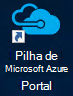

<properties
    pageTitle="Ligar a pilha Azure | Microsoft Azure"
    description="Saiba como ligar pilha Azure"
    services="azure-stack"
    documentationCenter=""
    authors="ErikjeMS"
    manager="byronr"
    editor=""/>

<tags
    ms.service="azure-stack"
    ms.workload="na"
    ms.tgt_pltfrm="na"
    ms.devlang="na"
    ms.topic="get-started-article"
    ms.date="10/18/2016"
    ms.author="erikje"/>

# <a name="connect-to-azure-stack"></a>Ligar a pilha Azure
Para gerir recursos, tem de ligar para o computador do Azure pilha conceito. Pode utilizar qualquer uma das seguintes opções de ligação:

 - Ambiente de trabalho remoto: permite-um único utilizador em simultâneo ligar rapidamente a partir do computador conceito.
 - Rede privada virtual (VPN): permite que vários utilizadores em simultâneo ligar a partir dos clientes fora infraestrutura do Azure pilha (requer configuração).

## <a name="connect-with-remote-desktop"></a>Ligar-se ao ambiente de trabalho remoto
Com uma ligação de ambiente de trabalho remoto, um único utilizador em simultâneo pode trabalhar com o portal para gerir os recursos. Também pode utilizar ferramentas na máquina MAS CON01 virtual.

1.  Inicie sessão no computador físico Azure pilha conceito.

2.  Abrir uma ligação de ambiente de trabalho remoto e ligue a MAS CON01. Introduza **AzureStack\AzureStackAdmin** como o nome de utilizador e palavra-passe administrativa fornecidos durante a configuração do Azure pilha.  

3.  No ambiente de trabalho MAS CON01, faça duplo clique no ícone do **Portal do Microsoft Azure pilha** (https://portal.azurestack.local/) para abrir o [portal](azure-stack-key-features.md#portal).

    

4.  Inicie sessão com as credenciais do Azure Active Directory especificadas durante a instalação.

## <a name="connect-with-vpn"></a>Ligar-se a VPN
Ligações de rede privada virtual permitir que vários utilizadores em simultâneo ligar a partir dos clientes fora infraestrutura do Azure pilha. Pode utilizar o portal gerir resoures. Também pode utilizar ferramentas, tal como o Visual Studio e do PowerShell, no seu cliente local.

1.  Instale o módulo AzureRM utilizando o seguinte comando:
   
    ```PowerShell
    Install-Module -Name AzureRm -RequiredVersion 1.2.6 -Scope CurrentUser
    ```   
   
2. Transfira os scripts de ferramentas do Azure pilha.  Estes ficheiros podem ser transferidos ao navegar para o [repositório de GitHub](https://github.com/Azure/AzureStack-Tools)ou a executar o seguinte script do Windows PowerShell como administrador de suporte:
    
    >[AZURE.NOTE]  Os passos seguintes requerem PowerShell 5.0.  Para verificar a sua versão, execute $PSVersionTable.PSVersion e comparar a versão "Principal".  

    ```PowerShell
       
       #Download the tools archive
       invoke-webrequest https://github.com/Azure/AzureStack-Tools/archive/master.zip -OutFile master.zip

       #Expand the downloaded files. 
       expand-archive master.zip -DestinationPath . -Force

       #Change to the tools directory
       cd AzureStack-Tools-master
    ````

3.  Na mesma sessão do PowerShell, navegue para a pasta de **Ligar** e importar o módulo AzureStack.Connect.psm1:

    ```PowerShell
    cd Connect
    import-module .\AzureStack.Connect.psm1
    ```

4.  Para criar a ligação do Azure pilha VPN, execute o seguinte o Windows PowerShell. Antes de executar, preencha a palavra-passe de administrador e campos de endereço do Azure pilha anfitrião. 
    
    ```PowerShell
    #Change the IP Address below to match your Azure Stack host
    $hostIP = "<HostIP>"

    # Change password below to reference the password provided for administrator during Azure Stack installation
    $Password = ConvertTo-SecureString "<Admin Password>" -AsPlainText -Force

    # Add Azure Stack One Node host & CA to the trusted hosts on your client computer
    Set-Item wsman:\localhost\Client\TrustedHosts -Value $hostIP -Concatenate
    Set-Item wsman:\localhost\Client\TrustedHosts -Value mas-ca01.azurestack.local -Concatenate  

    # Update Azure Stack host address to be the IP Address of the Azure Stack POC Host
    $natIp = Get-AzureStackNatServerAddress -HostComputer $hostIP -Password $Password

    # Create VPN connection entry for the current user
    Add-AzureStackVpnConnection -ServerAddress $natIp -Password $Password

    # Connect to the Azure Stack instance. This command (or the GUI steps in step 5) can be used to reconnect
    Connect-AzureStackVpn -Password $Password 
    ```

5. Quando lhe for pedido, anfitrião do Azure pilha de fidedignidade.

6. Quando lhe for pedido, instale um certificado (o pedido é apresentado atrás da janela de sessão do Powershell).

7. Para testar a ligação portal, num browser da Internet, navegue para *https://portal.azurestack.local*.

8. Para rever e gerir a ligação do Azure pilha, utilize **redes** no seu cliente:

    

>[AZURE.NOTE] Esta ligação VPN não fornece conectividade para VMs ou outros recursos. Para obter informações sobre a conectividade de recursos, consulte o artigo [Uma ligação VPN de nó](azure-stack-create-vpn-connection-one-node-tp2.md)


## <a name="next-steps"></a>Próximos passos
[Primeira tarefas](azure-stack-first-scenarios.md)

[Instalar e ligar-se com o PowerShell](azure-stack-connect-powershell.md)

[Instalar e ligar com clip](azure-stack-connect-cli.md)


