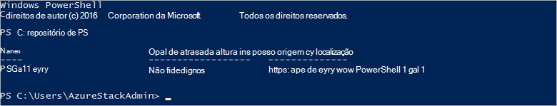

<properties
    pageTitle="Ligar a pilha Azure com PowerShell | Microsoft Azure"
    description="Saiba como gerir Azure pilha com PowerShell"
    services="azure-stack"
    documentationCenter=""
    authors="HeathL17"
    manager="byronr"
    editor=""/>

<tags
    ms.service="azure-stack"
    ms.workload="na"
    ms.tgt_pltfrm="na"
    ms.devlang="na"
    ms.topic="article"
    ms.date="10/19/2016"
    ms.author="helaw"/>

# Instalar o PowerShell e ligar a pilha de Azure
Neste guia, iremos guiá através dos passos para ligar a pilha de Azure com PowerShell. Uma vez concluída, estes passos também ajudam a gerir e implementar recursos.

## Instalar os cmdlets do PowerShell de pilha do Azure

1.  Cmdlets de AzureRM são instalados a partir da Galeria de PowerShell. Para começar, abra uma consola do PowerShell no MAS CON01 e execute o seguinte comando para devolver uma lista de PowerShell repositórios disponíveis:

        Get-PSRepository

      

2.  Execute o seguinte comando para instalar o módulo AzureRM:

        Install-Module -Name AzureRM -RequiredVersion 1.2.6 -Scope CurrentUser

    >[AZURE.NOTE] *-Âmbito UtilizadorActual* é opcional. Se pretender mais do que o utilizador atual tenha acesso ao módulos, utilize uma linha de comandos elevada e deixe desativar o parâmetro do *âmbito* .

3.  Para confirmar a instalação do AzureRM módulos, execute os seguintes comandos:

        Get-Command -Module AzureRM.AzureStackAdmin

## Ligar a pilha Azure
Um módulo está disponível para transferência processa configurar a ligação do PowerShell para Azure pilha por si.  Visite o [Azure pilha de ferramentas](http://aka.ms/ConnectToAzureStackPS) para o módulo e passos adicionais. 

## Obter uma lista de subscrições
Nesta secção, verifique os cmdlets do PowerShell estiver a executar o contra Azure pilha retrieving e selecionando uma subscrição para utilização.

Execute o seguinte comando para obter uma lista de subscrições de pilha de Azure associada à sua conta:

    Get-AzureRmSubscription

## Próximos passos
[Implementar modelos com PowerShell](azure-stack-deploy-template-powershell.md)

[Ligar-se com o clip Azure](azure-stack-connect-cli.md)

[Implementar modelos com o Visual Studio](azure-stack-deploy-template-visual-studio.md)

