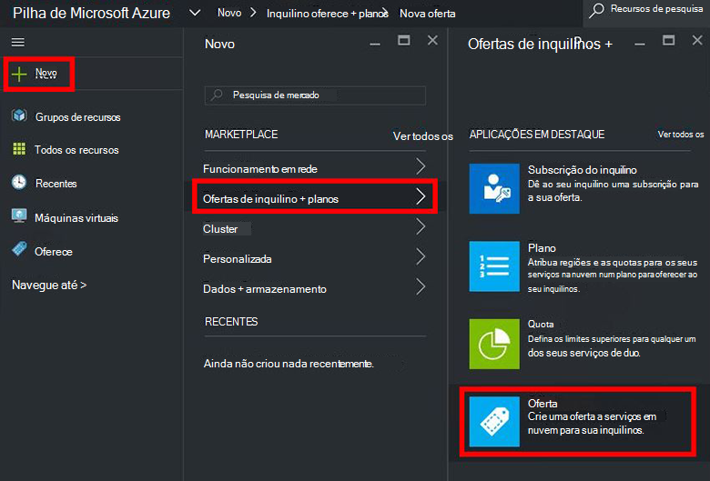
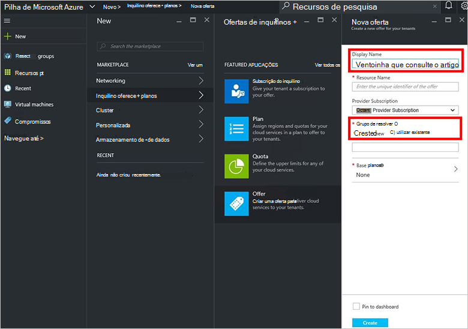
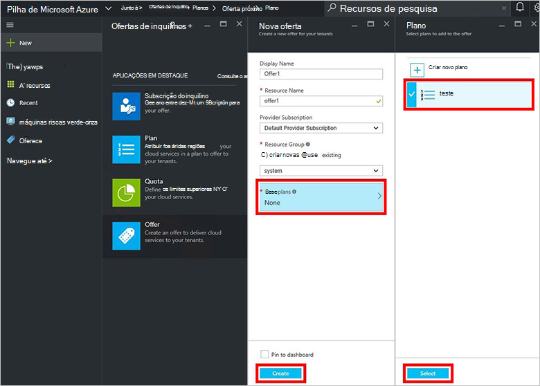
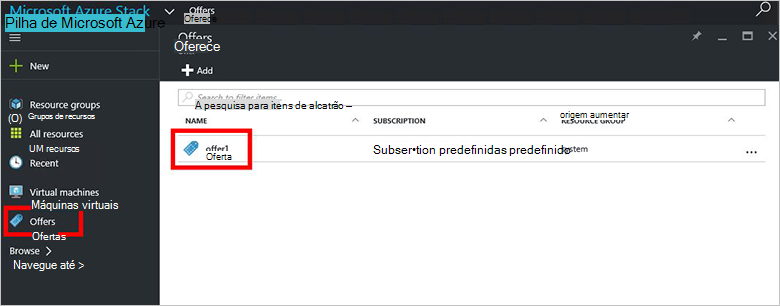
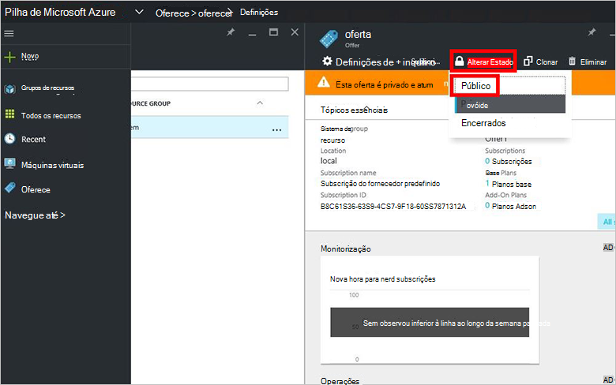

<properties
    pageTitle="Criar uma oferta na pilha de Azure | Microsoft Azure"
    description="Como administrador do serviço, saiba como criar uma oferta para sua inquilinos na pilha de Azure."
    services="azure-stack"
    documentationCenter=""
    authors="ErikjeMS"
    manager="byronr"
    editor=""/>

<tags
    ms.service="azure-stack"
    ms.workload="na"
    ms.tgt_pltfrm="na"
    ms.devlang="na"
    ms.topic="get-started-article"
    ms.date="09/26/2016"
    ms.author="erikje"/>

# Criar uma oferta Azure empilhados

[Oferece](azure-stack-key-features.md#services-plans-offers-and-subscriptions) são grupos de um ou mais planos que Fornecedores de apresentam a inquilinos para comprar ou subscrever. Este documento mostra-lhe como criar uma oferta que inclui o [plano que criou](azure-stack-create-plan.md) no último passo. Esta oferta dá subscritores a capacidade de aprovisionar máquinas virtuais.

1.  [Inicie sessão no](azure-stack-connect-azure-stack.md#log-in-as-a-service-administrator) portal do como um administrador de serviços e, em seguida, clique em **Novo** > **inquilino oferece + planos** > **oferecer**.
    

2.  Na pá **Oferecer novas** , introduza **Nome a apresentar** e o **Nome do recurso**e, em seguida, selecione um **Grupo de recursos**nova ou existente. O nome a apresentar é nome amigável a oferta. Apenas o administrador pode ver o nome do recurso. É o nome que os administradores utilizam para trabalhar com a oferta como um recurso de Gestor de recursos do Azure.

    

3.  Clique em **Planos Base** e, na pá **Planear** , selecione os planos que pretende incluir na oferta de e, em seguida, clique em **Seleccionar**. Clique em **Criar** para criar a oferta.

    
    
4. Clique em **oferece** e, em seguida, clique na oferta que acabou de criar.

    

5.  Clique em **Alterar Estado**e, em seguida, clique em **público**.
  
    

Ofertas devem ser feitas públicas para a inquilinos obter a vista completa quando subscrever. Podem ser ofertas:

- **Público**: visível para os inquilinos.

- **Privado**: visível apenas para os administradores de serviço. Útil enquanto rascunhos o plano ou oferta, ou se pretender que o administrador do serviço aprovar a cada subscrição.

- **Decommissioned**: fechadas para subscritores do novos. Pode utilizar o administrador do serviço desactivado para impedir que as subscrições futuras, mas deixar subscritores atuais inalterada.

Alterações para a oferta não estão imediatamente visíveis para o inquilino. Para ver as alterações, pode ter de terminar sessão/início de sessão para ver a nova subscrição no "Seletor de subscrição" quando criar grupos de recursos/recursos.

## Próximos passos

[Subscrever uma oferta e, em seguida, aprovisionar uma VM](azure-stack-subscribe-plan-provision-vm.md)
