<properties
    pageTitle="Criar um plano Azure empilhados | Microsoft Azure"
    description="Como administrador do serviço, crie um plano que permite subscritores aprovisionar virtual máquinas."
    services="azure-stack"
    documentationCenter=""
    authors="ErikjeMS"
    manager="byronr"
    editor=""/>

<tags
    ms.service="azure-stack"
    ms.workload="na"
    ms.tgt_pltfrm="na"
    ms.devlang="na"
    ms.topic="get-started-article"
    ms.date="09/26/2016"
    ms.author="erikje"/>

# Criar um plano Azure empilhados

[Planos](azure-stack-key-features.md#services-plans-offers-and-subscriptions) são agrupamentos de um ou mais serviços. Como um fornecedor, pode criar planos para oferecer ao seu inquilinos. Por sua vez, os inquilinos subscrever as ofertas de utilizar os planos e serviços incluem. Este exemplo mostra como criar um plano que inclui o cluster, a rede e a fornecedores de recursos de armazenamento. Este plano dá subscritores a capacidade de aprovisionar máquinas virtuais.

1.  Num browser da internet, navegue para https://portal.azurestack.local.

2.  [Inicie sessão no](azure-stack-connect-azure-stack.md#log-in-as-a-service-administrator) portal de pilha do Azure como um administrador de serviços e introduza as suas credenciais de administrador do serviço (a conta que criou no passo 5 da secção [executar o script PowerShell](azure-stack-run-powershell-script.md) ) e, em seguida, clique em **Iniciar sessão**.

    Administradores do serviço podem criar ofertas e planos e gerir utilizadores.

3.  Para criar um plano e oferta inquilinos podem subscrever, clique em **Novo** > **inquilino oferece + planos** > **plano**.

    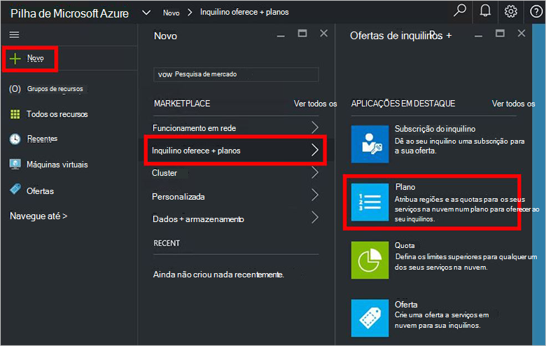

4.  Pá **Novo plano** , preencha **Nome a apresentar** e **Nome do recurso**. O nome a apresentar é nome amigável o plano que inquilinos ver. Apenas o administrador pode ver o nome do recurso. É o nome que os administradores utilizam para trabalhar com o plano de um recurso de Gestor de recursos do Azure.

    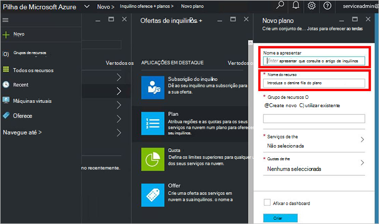

5.  Criar um novo **Grupo de recursos**ou selecione uma existente, como um contentor para o plano (por exemplo, "OffersAndPlans")

    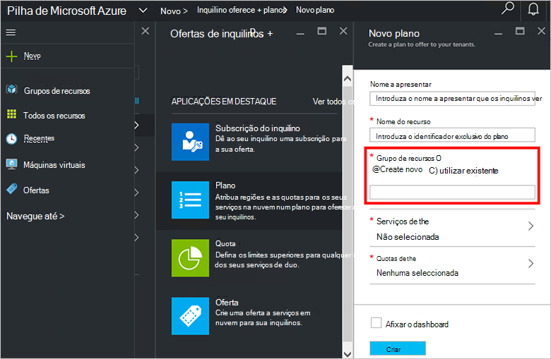

6.  Clique em **Serviços**, selecione **Microsoft.Compute**, **Microsoft.Network**e **Microsoft.Storage**e, em seguida, clique em **Selecionar**.

    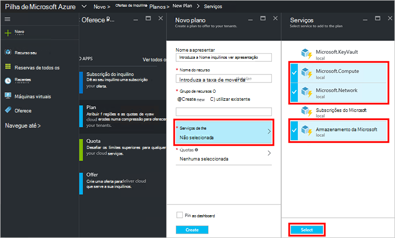

7.  Clique em **Quotas**, clique em **Microsoft.Storage (local)**e, em seguida, selecione a quota predefinida ou clique em **Criar nova quota** para personalizar a quota de.

    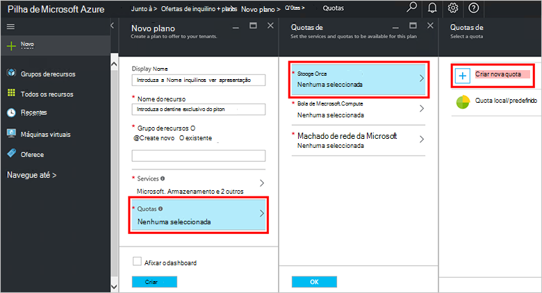

8.  Escreva um nome para a quota de, clique em **Definições de Quota**, defina os valores de quota e clique em **OK**e, em seguida, clique em **Criar**.

    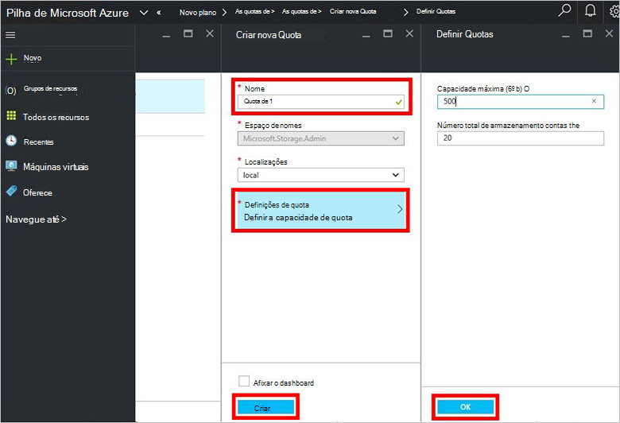

9. Clique em **Microsoft.Network (local)**e, em seguida, selecione a quota predefinida ou clique em **Criar nova quota** para personalizar a quota de.

    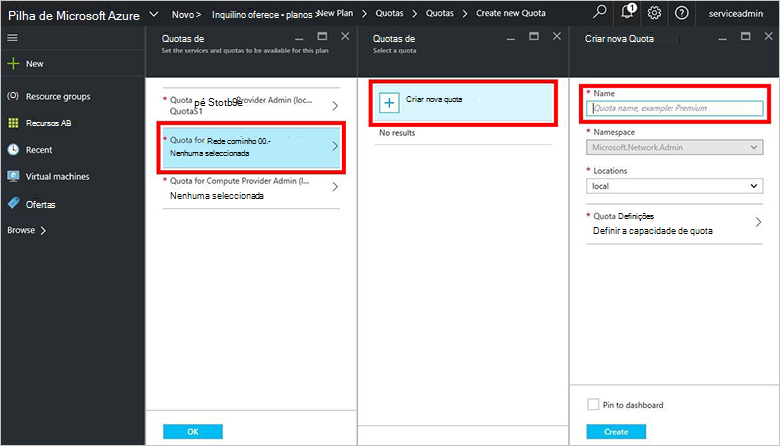

10. Escreva um nome para a quota de, clique em **Definições de Quota**, defina os valores de quota e clique em **OK**e, em seguida, clique em **Criar**.

    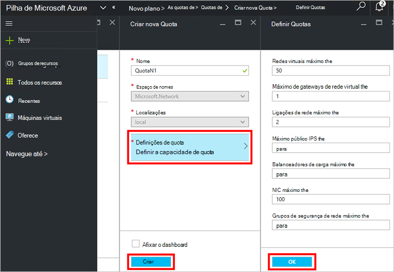

11. Clique em **Microsoft.Compute (local)**e, em seguida, selecione a quota predefinida ou clique em **Criar nova quota** para personalizar a quota de.

    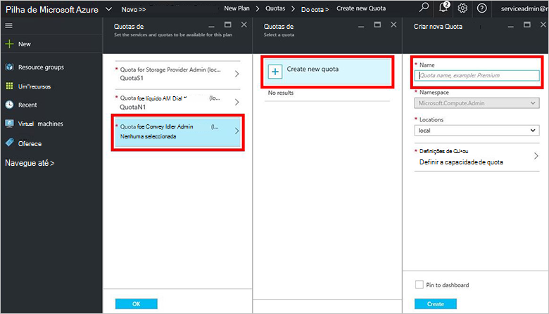

12.  Escreva um nome para a quota de, clique em **Definições de Quota**, defina os valores de quota e clique em **OK**e, em seguida, clique em **Criar**.

    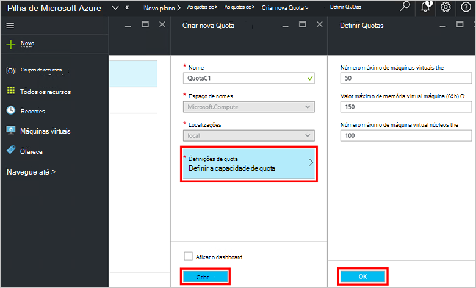

13. Na pá **Quotas** , clique em **OK**e, em seguida, no pá **Novo plano** , clique em **Criar** para criar o plano.

    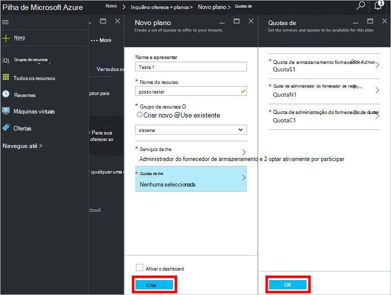

14. Para ver o seu novo plano, clique em **todos os recursos**, em seguida, procure o plano e clique no respetivo nome.

    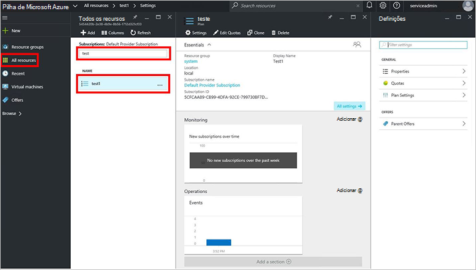

## Próximos passos

[Criar uma oferta](azure-stack-create-offer.md)
