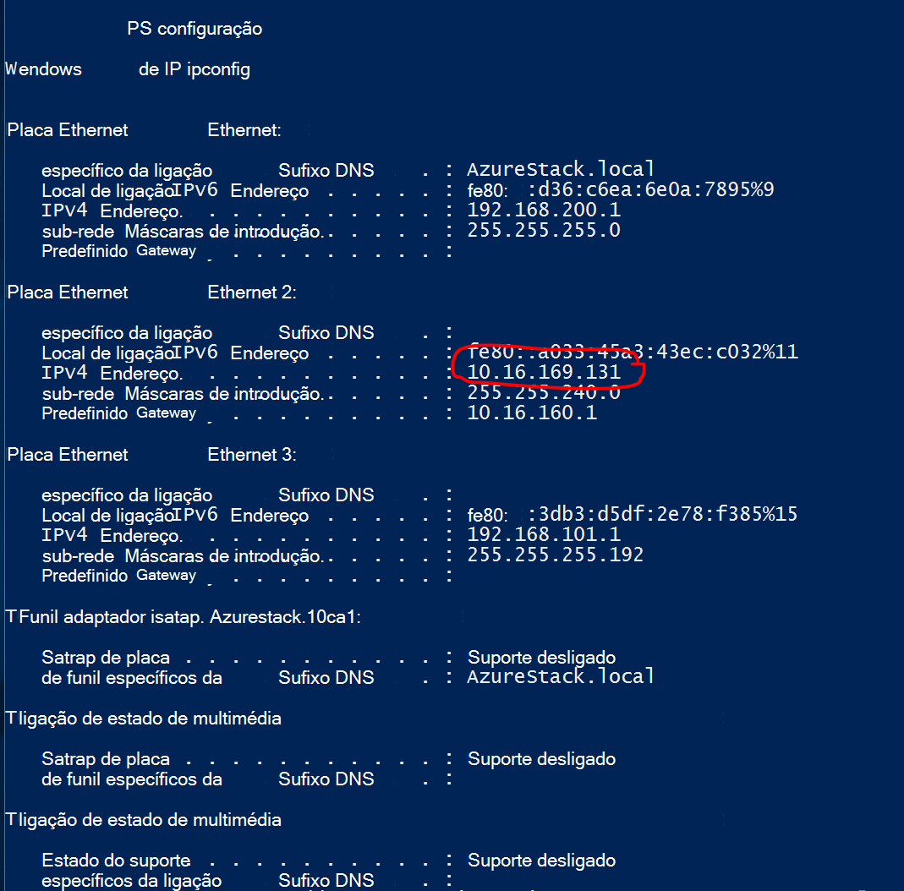

<properties
    pageTitle="Criar uma ligação de Site para o Site VPN entre duas redes Virtual em diferentes ambientes de conceito de pilha de Azure | Microsoft Azure"
    description="Procedimento passo a passo que irá permitir que um administrador na nuvem criar uma ligação VPN do Site para o Site entre dois ambientes de conceito um nó no TP2."
    services="azure-stack"
    documentationCenter=""
    authors="ScottNapolitan"
    manager="darmour"
    editor=""/>

<tags
    ms.service="azure-stack"
    ms.workload="na"
    ms.tgt_pltfrm="na"
    ms.devlang="na"
    ms.topic="get-started-article"
    ms.date="09/26/2016"
    ms.author="scottnap"/>

# Criar uma ligação VPN do Site para o Site entre duas redes Virtual em diferentes ambientes de conceito de pilha de Azure

## Descrição geral

Este artigo explica os passos para criar uma ligação VPN do Site para o Site entre duas redes virtuais nos dois ambientes de Azure pilha prova-de-conceito separadas. O objetivo disto é ajudar as pessoas que estejam a avaliar o Site para o Site gateways compreender como configurar ligações de VPN entre redes virtuais nas duas implementações Azure pilha diferentes.  Processo de fazê-lo, irá obter um Noções sobre o funcionamento de VPN Gateways na pilha de Azure.

>[AZURE.NOTE] Este documento aplica-se especificamente para o conceito de TP2 do Azure pilha.

### Diagrama de ligação

Segue-se um diagrama que mostra os nossos configuração deve aspeto quando podemos terminados.

### Antes de começar

Para concluir esta configuração, tem os seguintes itens para que certifique-se de que a tenha estes pontos antes de começar.

-   Dois servidores que cumprem os requisitos de hardware do Azure pilha conceito definidos pelos [Pré-requisitos de implementação do Azure pilha](azure-stack-deploy.md)e os outros pré-requisitos definidos por esse documento.

-   O pacote de implementação do Azure pilha pré-visualização técnica 2.

## Implementar os ambientes conceito

Irá implementar dois ambientes Azure pilha conceito para concluir esta configuração.

-   Para cada conceito implementar, pode simplesmente seguir as instruções de implementação detalhadas no artigo [Implementar o conceito de pilha de Azure](azure-stack-run-powershell-script.md).
    Vamos irá referir-se para cada ambiente conceito neste documento forma genérica como POC1 e POC2.

## Configurar Quotas para cluster, armazenamento e de rede

Tem de configurar Quotas para cluster, armazenamento e de rede para que estes serviços podem ser associada associados um plano e, em seguida, pode subscrever uma oferta de inquilinos.

>[AZURE.NOTE] Tem de fazer estes passos para cada ambiente Azure pilha conceito.

A experiência para criar as Quotas de serviços foi alterada de TP1. Os passos sobre como criar Quotas no TP2 podem ser encontrados em <http://aka.ms/mas-create-quotas>. Pode aceitar as predefinições para todas as definições de quota para este exercício.

## Criar um plano e oferta

[Planos](azure-stack-key-features.md) são agrupamentos de um ou mais serviços. Como um fornecedor, pode criar planos para oferecer ao seu inquilinos. Por sua vez, os inquilinos subscrever as ofertas de utilizar os planos e serviços incluem.

>[AZURE.NOTE] Terá de executar estes passos para cada ambiente Azure pilha conceito.

1.  Primeiro, crie um plano. Para fazer isto, pode seguir os passos no artigo [criar um plano](azure-stack-create-plan.md) online.

2.  Crie uma oferta de seguir os passos descritos no [artigo criar uma oferta na pilha de Azure](azure-stack-create-offer.md).

3.  Iniciar sessão no Portal do como administrador inquilino e [subscrever a oferta criou] (azure-pilha-subscrever-plano-aprovisionar-vm.md.

## Criar os recursos de rede no conceito 1

Agora que vamos criar realmente os recursos que precisamos de definir o nossa configuração. Os passos seguintes ilustram o que recomendamos vai ser a fazer. Estas instruções irão ser que mostra como criar recursos através do Portal do, mas pode ser feita a mesma coisa através do PowerShell.

### Inicie sessão como um inquilino

Um administrador de serviços pode iniciar sessão como um inquilino para testar os planos, ofertas e subscrições que podem utilizar os respetivos inquilinos. Se ainda não tiver uma, [criar uma conta de inquilino](azure-stack-add-new-user-aad.md) antes que iniciar sessão.

### Criar a rede virtual & sub-rede VM

1.  Inicie sessão com uma conta de inquilino.

2.  No portal do Azure, clique no ícone de **Novo** .

     
3.  Selecione o **funcionamento em rede** a partir do Marketplace menu.

4.  Clique no item de **Rede Virtual** no menu.

5.  Clique no botão **Criar** perto da parte inferior da pá de descrição do recurso. Introduza os seguinte valores para os campos adequados de acordo com a tabela seguinte.

  	| **Campo**             | **Valor** |
  	|----------------------- | ------ |
  	| Nome                  |vnet 01 |
  	| Espaço de endereços         | 10.0.10.0/23 |
  	| Nome de sub-rede           | 01 sub-rede |
  	| Intervalo de endereços de sub-rede  | 10.0.10.0/24 |

6.  Deverá ver a subscrição que criou anteriormente povoada no campo de **subscrição** .

7.  Grupo de recursos, pode criar um novo grupo de recursos ou se já tiver um, selecione utilizar existente.

8.  Verifique se a localização predefinida.

9.  Clique no botão **Criar** .

### Criar a Gateway sub-rede

1.  Abra o recurso de rede Virtual que acabou de criar (Vnet 01) a partir do Dashboard.

2.  No separador Definições, selecione sub-redes

3.  Clique no botão de **Gateway sub-rede** para adicionar uma sub-rede de Gateway para a rede Virtual.

     
4.  O nome da sub-rede está definido para **GatewaySubnet** por predefinição.
    Sub-redes gateway são especiais e tem de ter este nome específico para poder funcionar corretamente.

5.  No campo de **intervalo de endereço** , introduza **10.0.11.0/24**.

6.  Clique no botão **Criar** para criar a sub-rede de Gateway.

### Criar um Gateway de rede Virtual

1.  No portal do Azure, clique no ícone de **Novo** .

    

2.  Selecione o **funcionamento em rede** a partir do Marketplace menu.

3.  Selecione o **gateway de rede Virtual** a partir da lista de recursos de rede.

4.  Reveja a descrição e clique em **Criar**.

5.  No campo **nome** escreva **GW1**.

6.  Clique no item de **Rede Virtual** para selecionar uma rede virtual.
    Selecione **Vnet 01** a partir da lista.

7.  Clique no item de menu do **endereço IP público** . Quando abre o pá de endereço IP público escolher, clique no botão Criar novo.

8.  No campo **nome** , introduza **GW1 PiP** e clique em **Ok.**

9.  O **tipo de Gateway** deve ter **VPN** selecionada por predefinição. Manter esta definição.

10. O **tipo de VPN** deve ter **com base em encaminhar** selecionada por predefinição.
    Manter esta definição.

11. Certifique-se de **subscrição** e a **localização** estão corretas. Se preferir pode afixar o recurso ao Dashboard. Clique em **Criar**.

### Criar um Gateway de rede Local

O recurso de Gateway de rede Local é um pouco estranha nosso cenário.
É o mesmo recurso que localizar no Azure, no entanto, no Azure-normalmente concebido para representar um dispositivo físico, no local que pretende utilizar para ligar para o gateway de rede virtual no Azure. No nosso exemplo, ambas as extremidades da ligação são gateways de rede realmente virtual!

Uma forma a ter em conta sobre esta forma mais genérica que o recurso de Gateway de rede Local está sempre destina-se para indicar o gateway remoto no final da ligação. Devido à forma como o conceito foi concebido, é realmente necessário fornecer o endereço da placa de rede externa a VM NAT do outros conceito como o endereço IP público do Gateway de rede Local. Em seguida, podemos irá criar mapeamentos NAT na VM NAT para se certificar de que ambas as extremidades estão correctamente ligadas.

### Obter o endereço IP da placa externa da NAT VM

1.  Iniciar sessão no computador físico Azure pilha para POC2.

2.  [Tecla Windows] + R para abrir o menu **Executar** , escreva **mstsc** e visitas enter.

3.  No campo **computador** , introduza o nome **MAS BGPNAT01** e clique no botão **Ligar** .

4.  Clique no Menu Iniciar e com o botão direito no PowerShell e selecione **Executar como administrador**.

5.  Tipo de **IPConfig/todos os**.

6.  Localize a placa de Ethernet que está ligado à rede no local e tome nota do endereço IPv4 vinculado a essa placa. No meu ambiente é **10.16.167.195** mas seu será algo diferente.

7.  Registo este endereço. Este é o que irá utilizamos como o endereço IP público do recurso que criamos no POC1 Gateway de rede Local.

### Criar o recurso de Gateway de rede Local

1.  Iniciar sessão no computador físico Azure pilha para POC1.

2.  No campo de **computador** , introduza o nome **MAS CON01** e clique no botão **Ligar** .

3.  No portal do Azure, clique no ícone de **Novo** .

    

4.  Selecione o **funcionamento em rede** a partir do Marketplace menu.

5.  Selecione o **gateway de rede local** a partir da lista de recursos.

6.  No campo **nome** , introduza **POC2 GW**.

7.  Vamos não sabe o endereço IP do nosso outro Gateway, mas que é ok porque pode voltar atrás e alterá-la mais tarde. Por agora, introduza **10.16.167.195** no **campo de endereço IP**.

8.  No campo **Espaço de endereços** , introduza o espaço de endereços da Vnet que recomendamos estará a criar no POC2. Isto vai ser **10.0.20.0/23** por isso, introduza esse valor.

9.  Verifique se a sua **subscrição**, o **Grupo de recursos** e a **localização** estão corretas tudo e clique em **Criar**.

### Criar a ligação

1.  No portal do Azure, clique no ícone de **Novo** .

     

2.  Selecione o **funcionamento em rede** a partir do Marketplace menu.

3.  Selecione a **ligação** a partir da lista de recursos.

4.  Na pá de definições **básicas** , selecione **Site para site (IPSec)** como o **tipo de ligação**.

5.  Selecione a **subscrição**, o **Grupo de recursos** e a **localização** e clique em **Ok**.

6.  Na pá **Definições** , selecione o **Gateway de rede Virtual** (**GW1**) que criou anteriormente.

7.  Selecione o **local** **Gateway de rede** (**POC2 GW**) que criou anteriormente.

8.  No campo **Nome da ligação** , introduza **POC1 POC2**.

9.  No campo de **Chave partilhados (PSK)** introduza **12345**. Clique em **Ok**.

### Criar uma VM

Para validar dados viajar através da ligação VPN, precisa de VMs para enviar e receber dados em cada conceito. Vamos criar uma VM no POC1 agora e colocá-la na nossa sub-rede VM no nosso rede virtual.

1. No portal do Azure, clique no ícone de  **Novo** .

     

2.  Selecione **máquinas virtuais** do Marketplace menu.

3.  Na lista de imagens de máquina virtual, selecione a imagem do **Centro de dados do Windows Server 2012 R2** .

4.  No pá **Noções básicas** , no campo **nome** , introduza o valor **VM01**.

5.  Introduza um nome de utilizador válido e palavra-passe. Irá utilizar esta conta para iniciar sessão para a VM após ter sido criada.

6.  Fornecer uma **subscrição**, o **Grupo de recursos** e a **localização** e, em seguida, clique em **Ok**.

7.  No pá **tamanho** , selecione um tamanho da memória virtual para esta instância e, em seguida, clique em **Selecionar**.

8.  No separador Definições, pode aceite as predefinições, certifique-se de que a rede de Virtual selecionada é **VNET-01** e de sub-rede está definida para **10.0.10.0/24**apenas. Clique em **Ok**.

9.  Reveja as definições do pá de **Resumo** e clique em **Ok**.

## Criar os recursos de rede no conceito 2

### Inicie sessão como um inquilino

Um administrador de serviços pode iniciar sessão como um inquilino para testar os planos, ofertas e subscrições que podem utilizar os respetivos inquilinos. Se ainda não tiver uma, [criar uma conta de inquilino](azure-stack-add-new-user-aad.md) antes que iniciar sessão.

### Criar a rede virtual & sub-rede VM

1. Inicie sessão com uma conta de inquilino.

2. No portal do Azure, clique no ícone de  **Novo** .

     

3.  Selecione o **funcionamento em rede** a partir do Marketplace menu.

4.  Clique no item **da rede Virtual** no menu.

5.  Clique no botão **Criar** perto da parte inferior da pá de descrição do recurso. Introduza os seguintes valores para os campos adequados do indicadas na tabela abaixo.

  	|**Campo**              |**Valor** |
  	| ----------------------|----------|
  	| Nome                  | vnet 02 |
  	| Espaço de endereços         | 10.0.20.0/23 |
  	| Nome de sub-rede           | sub-rede 02 |
  	| Intervalo de endereços de sub-rede  | 10.0.20.0/24 |

6.  Deverá ver a subscrição que criou anteriormente povoada no campo de **subscrição** .

7.  Grupo de recursos, pode criar um novo grupo de recursos ou se já tiver um, selecione utilizar existente.

8.  Verifique se a **localização**de predefinida. Se pretender, pode afixar a rede para o Dashboard para facilitar o acesso virtual.

9.  Clique no botão **Criar** .

### Criar a Gateway sub-rede

1.  Abra o recurso de rede Virtual que criou (**Vnet 02**) a partir do Dashboard.

2.  No pá **Definições** , selecione **sub-redes.**

3.  Clique no botão de **Gateway sub-rede** para adicionar uma sub-rede de Gateway para a rede Virtual.

     

4.  O nome da sub-rede está definido para **GatewaySubnet** por predefinição.
    Sub-redes gateway são especiais e tem de ter este nome específico para poder funcionar corretamente.

5.  No campo de **intervalo de endereço** , introduza **10.0.20.0/24**.

6.  Clique no botão **Criar** para criar a sub-rede de Gateway.

### Criar um Gateway de rede Virtual

1. No portal do Azure, clique no ícone de  **Novo** .

     

2.  Selecione o **funcionamento em rede** a partir do Marketplace menu.

3.  Selecione o **gateway de rede Virtual** a partir da lista de recursos de rede.

4.  Reveja a descrição e clique em **Criar**.

5.  No campo **nome** escreva **GW2**.

6.  Clique no item de **Rede Virtual** para selecionar uma rede virtual.
    Selecione **Vnet 02** a partir da lista.

7.  Clique no item de menu do **endereço IP público** . Quando abre o pá de endereço IP público escolher, clique no botão Criar novo.

8.  No campo **nome** , introduza **GW2 PiP** e clique em **Ok.**

9.  O **tipo de Gateway** deve ter **VPN** selecionada por predefinição. Manter esta definição.

10. O **tipo de VPN** deve ter **com base em encaminhar** selecionada por predefinição.
    Manter esta definição.

11. Certifique-se de **subscrição** e a **localização** estão corretas. Se preferir pode afixar o recurso ao Dashboard. Clique em **Criar**.

### Criar um Gateway de rede Local

#### Obter o endereço IP da placa externa da NAT VM

1.  Iniciar sessão no computador físico Azure pilha para POC1.

2.  Prima e mantenha [tecla Windows] + R para abrir o menu **Executar** , escreva **mstsc** e visitas introduza.

3.  No campo **computador** , introduza o nome **MAS BGPNAT01** e clique no botão **Ligar** .

4.  Clique no Menu Iniciar e com o botão direito no PowerShell e selecione **Executar como administrador**.

5.  Tipo de **IPConfig/todos os**.

6.  Localize a placa de Ethernet que está ligado à rede no local e tome nota do endereço IPv4 vinculado a essa placa. No meu ambiente é **10.16.169.131** mas seu será algo diferente.

7.  Registo este endereço. Este é o que irá mais tarde utilizamos como o endereço IP público do recurso que criamos no POC1 Gateway de rede Local.

#### Criar o recurso de Gateway de rede Local

1.  Iniciar sessão no computador físico Azure pilha para POC2.

2.  No campo **computador** , introduza o nome **MAS CON01** e clique no botão **Ligar** .

3. No portal do Azure, clique no ícone de **Novo** .

     

4.  Selecione o **funcionamento em rede** a partir do Marketplace menu.

5.  Selecione o **gateway de rede local** a partir da lista de recursos.

6.  No campo **nome** , introduza **POC1 GW**.

7.  Agora, é necessário o endereço IP público podemos gravados para o gateway de rede Virtual na POC1. Introduza **10.16.169.131** no **campo de endereço IP**.

8.  No campo **Espaço de endereços** , introduza o espaço de endereços **Vnet** 01 a partir do POC1 - **10.0.0.0/16**.

9.  Verifique se a sua **subscrição**, o **Grupo de recursos** e a **localização** estão corretas tudo e clique em **Criar**.

## Criar a ligação

1. No portal do Azure, clique no ícone de  **Novo** .

     

2.  Selecione o **funcionamento em rede** a partir do Marketplace menu.

3.  Selecione a **ligação** a partir da lista de recursos.

4.  Na pá de definições **básicas** , selecione **Site para site (IPSec)** como o **tipo de ligação**.

5.  Selecione a **subscrição**, o **Grupo de recursos** e a **localização** e clique em **Ok**.

6.  Na pá **Definições** , selecione o **Gateway de rede Virtual** (**GW1**) que criou anteriormente.

7.  Selecione o **local** **Gateway de rede** (**POC1 GW**) que criou anteriormente.

8.  No campo **Nome da ligação** , introduza **POC2 POC1**.

9.  No campo de **Chave partilhados (PSK)** introduza **12345**. Se escolher um valor diferente, lembre-se de que tem de corresponder o valor de chave partilhado atribuída no POC1. Clique em **Ok**.

## Criar uma VM

Criar uma VM no POC1 agora e colocá-la na nossa sub-rede VM no nosso rede virtual.

1.  No portal do Azure, clique no ícone de **Novo** .

     

2.  Selecione **máquinas virtuais** do Marketplace menu.

3.  Na lista de imagens de máquina virtual, selecione a imagem do **Centro de dados do Windows Server 2012 R2** .

4.  No pá **Noções básicas** , no campo **nome** , introduza o valor **VM02**.

5.  Introduza um nome de utilizador válido e palavra-passe. Irá utilizar esta conta para iniciar sessão para a VM após ter sido criada.

6.  Fornecer uma **subscrição**, o **Grupo de recursos** e a **localização** e, em seguida, clique em **Ok**.

7.  No pá **tamanho** , selecione um tamanho da memória virtual para esta instância e, em seguida, clique em **Selecionar**.

8.  No separador Definições, pode aceite as predefinições, certifique-se de que a rede de Virtual selecionada é **VNET 02** e de sub-rede está definida para **20.0.0.0/24**apenas. Clique em **Ok**.

9.  Reveja as definições do pá de **Resumo** e clique em **Ok**.

## Configurar a VM NAT no cada conceito para traversal do gateway

Porque o conceito foi concebido para ser autónomo e isoladas da rede em que é implementado anfitrião do físico, que os gateways estão ligados à rede VIP "Externos" não é realmente externa, mas estiver oculto atrás de um router efetuar NAT endereços de rede tradução (). O router é realmente um Windows Server VM (**MAS BGPNAT01**) a ser executada a função de encaminhamento e serviços de acesso remoto (RRAS) em infraestrutura do conceito. Precisamos de configurar o NAT na VM MAS BGPNAT01 para permitir a ligação VPN do Site para o Site para se ligar em ambas as extremidades.

>[AZURE.NOTE] É necessária para ambientes de conceito apenas esta configuração.

### Configurar NAT

Tem de seguir estes passos em ambientes conceito ambos.

1.  Iniciar sessão no computador físico Azure pilha para POC1.

2.  Prima e mantenha [tecla Windows] + R para abrir o menu **Executar** , escreva **mstsc** e visitas introduza.

3.  No campo **computador** , introduza o nome **MAS BGPNAT01** e clique no botão **Ligar** .

4.  Clique no Menu Iniciar e com o botão direito no PowerShell e selecione **Executar como administrador**.

5.  Tipo de **IPConfig/todos os**.

6.  Localize a placa de Ethernet que está ligado à rede no local e tome nota do endereço IPv4 vinculado a essa placa. No meu ambiente é **10.16.169.131** (dentro de um círculo vermelho abaixo), mas seu será algo diferente.

     

7.  Introduza o seguinte comando do PowerShell para designar o endereço NAT externo para as portas que a autenticação de IKE. Lembre-se alterar o endereço IP ao que corresponde ao seu ambiente.

        Add-NetNatExternalAddress -NatName BGPNAT -IPAddress 10.16.169.131 PortStart 499 -PortEnd 501

8. Em seguida, podemos irá criar um mapeamento NAT estático para mapear o endereço externo para o endereço IP público de Gateway para mapear a porta ISAKMP 500 para a fase 1 do túnel IPSEC.

        Add-NetNatStaticMapping -NatName BGPNAT -Protocol UDP -ExternalIPAddress 10.16.169.131 -InternalIPAddress 192.168.102.1 -ExternalPort 500 -InternalPort 500

9.  Por fim, precisamos de fazer NAT traversal que usa a porta 4500 para estabelecer o túnel IPEC concluído com êxito sobre dispositivos NAT.

         Add-NetNatStaticMapping -NatName BGPNAT -Protocol UDP -ExternalIPAddress 10.16.169.131 -InternalIPAddress 192.168.102.1 -ExternalPort 4500 -InternalPort 4500

10.  Repita os passos 1-9 no POC2.

## Testar a ligação

Agora que foi estabelecida a ligação de Site para o Site que podemos deve validar que poderemos obter o tráfego de que o atravessam. Esta tarefa é simple como envolve apenas o início de sessão para um dos VMs criámos no ambiente quer conceito e o ping VM criámos no outro ambiente. Para se certificar de que estamos são colocar no tráfego através da ligação de Site para o Site, queremos para se certificar de que estamos ping do endereço de IP direta (DIP) da VM na sub-rede remota, não a VIP. Para fazer isto, precisamos de saber o que é o endereço na outra extremidade da nossa ligação.

### Iniciar sessão no inquilino VM no POC1

1.  Iniciar sessão no computador físico Azure pilha para POC1 e inicie sessão Portal ao utilizar uma conta de inquilino.

3.  Clique no ícone de **máquinas virtuais** na barra de navegação à esquerda.

4.  Localize **VM01** que criou anteriormente na lista de VMs e clique na mesma.

5. No pá para a máquina virtual clique em **Ligar**.

     

6.  Abra uma linha de comandos a partir de dentro da VM e escreva **IPConfig/todos os**.

7.  Localizar o **Endereço IPv4** em saída e tome nota do mesmo. Este é o endereço que irá ping a partir POC2. Neste ambiente, o endereço é **10.0.10.4**, mas no seu ambiente poderão ser diferente. No entanto deve se situar dentro da sub-rede **10.0.10.0/24** que foi criada anteriormente.

### Iniciar sessão no inquilino VM no POC2

1.  Iniciar sessão no computador físico Azure pilha para POC2 e inicie sessão no portal utilizando uma conta de inquilino.

3.  Clique no ícone de **máquinas virtuais** na barra de navegação à esquerda.

4.  Localize **VM02** que criou anteriormente na lista de VMs e clique na mesma.

5.  No pá para a máquina virtual clique em **Ligar**.

     

6.  Abra uma linha de comandos a partir de dentro da VM e escreva **IPConfig/todos os**.

7.  Deverá visualizar um endereço de IPv4 abrangido pelo 10.0.20.0/24. Na minha laboratório de teste, o endereço é 10.0.20.4, mas seu poderão ser diferentes.

8.  Agora a partir da VM no POC2 podemos pretende ping VM no POC1, através do túnel. Para fazer isto, podemos ping DIP podemos gravadas a partir do VM01.
    Na minha laboratório trata-se 10.0.10.4, mas certifique-se de que o ping ao endereço que se encontram no seu laboratório. Deverá visualizar um resultado que tem este aspeto.

     

9.  Uma resposta a partir da VM remota indica um teste com êxito! Pode fechar a janela VM ligar ou, se quiser, experimente efetuar algumas outras transferências de dados para testar a ligação (como uma cópia do ficheiro).

### Visualizar dados transferir estatísticas através da ligação de gateway

Se quiser saber a quantidade de dados é prisma sua ligação de Site para o Site, estas informações ficam disponíveis no pá a ligação. Este teste também é outra forma de boa para verificar que realmente correu ping que apenas enviado através da ligação VPN.

1.  Enquanto ainda tem sessão iniciada numa **ClientVM** no POC2, inicie sessão do **Portal do Microsoft Azure pilha conceito** com a sua conta de inquilino.

2.  Clique no item de menu **Procurar** e selecione **ligações**.

3.  Clique na ligação **POC2 POC1** na lista.

4.  No pá ligação, pode ver as estatísticas para dados e dados de saída. Na imagem abaixo, pode ver que alguns números maiores que ping basta seriam de conta para. Se ao facto fizemos também algumas transferências de ficheiros. Deverá ver alguns valores de zero aí.

     
