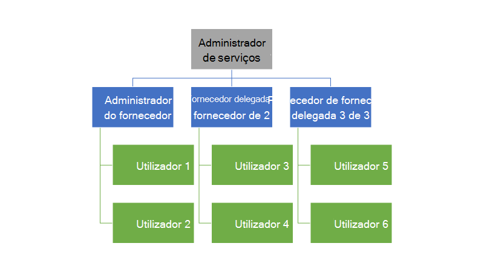
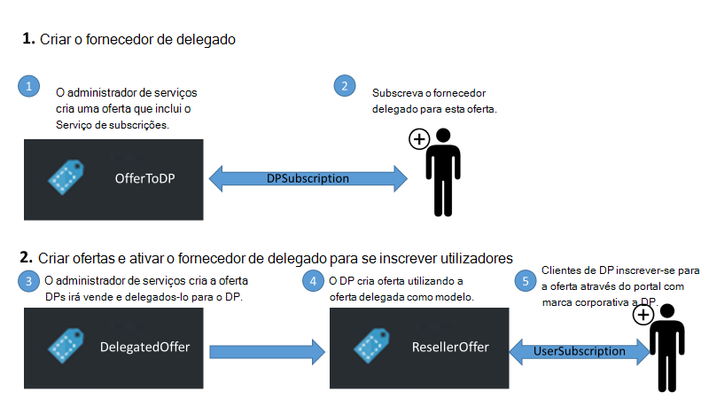
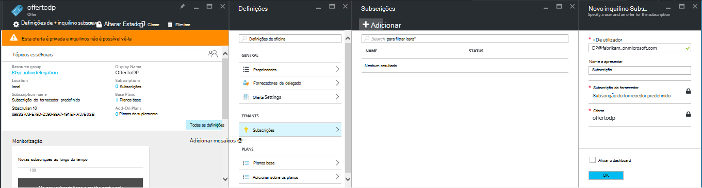
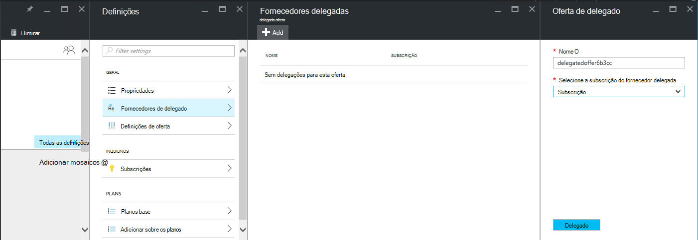
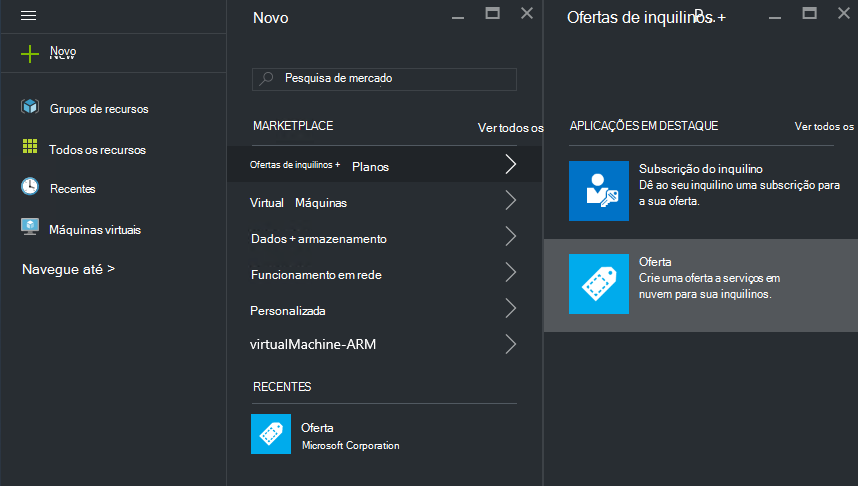
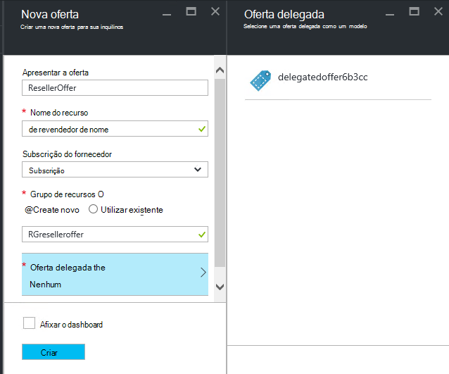
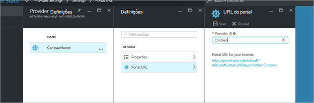
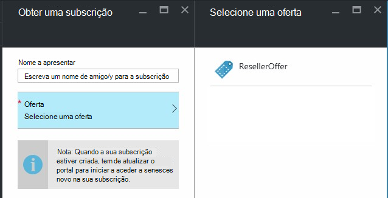

<properties
    pageTitle="Delegar ofertas Azure empilhados | Microsoft Azure"
    description="Saiba como colocar outras pessoas responsável pelo criar ofertas e inscrever-se os utilizadores para si."
    services="azure-stack"
    documentationCenter=""
    authors="AlfredoPizzirani"
    manager="byronr"
    editor=""/>

<tags
    ms.service="azure-stack"
    ms.workload="na"
    ms.tgt_pltfrm="na"
    ms.devlang="na"
    ms.topic="article"
    ms.date="10/07/2016"
    ms.author="alfredop"/>

#Delegar ofertas Azure empilhados

Como administrador do serviço, muitas vezes pretende colocar a outras pessoas responsável pelo criar ofertas e inscrever-se os utilizadores para si. Por exemplo, pode ocorrer se for um fornecedor de serviços e revendedores para inscrever-se de clientes e geri-los em seu nome. Também pode acontecer numa empresa se fazem parte de um grupo de TI central e pretender divisões ou subsidiárias inscrever-se os utilizadores sem a intervenção.

Delegação de ajuda-o com estas tarefas, ajudando-o a chegar e gerir utilizadores mais do que iria não poderá fazer diretamente. A ilustração seguinte mostra um nível de delegação, mas Azure pilha suporta vários níveis. Fornecedores delegadas sucessivamente podem delegar a outros fornecedores, até cinco níveis.

Os administradores podem delegar a criação de ofertas e inquilinos para os outros utilizadores utilizando a funcionalidade de delegação.

##Funções e os passos na delegação

Para compreender a delegação, tenha em atenção que existem três funções envolvidos:

-   O **administrador do serviço** gere a infraestrutura do Azure pilha, cria um modelo de oferta e delegados outras pessoas para oferecê-lo aos seus utilizadores.

-   Os utilizadores delegados chamam **delegada fornecedores**. Pode pertencem a outras organizações (tal como outras inquilinos do Azure Active Directory).

-   **Os utilizadores** inscrever-se para as ofertas e utilizá-los para gerir as cargas de trabalho, VMs a criar, armazenar dados, etc.

Como é mostrado no seguinte gráfico, existem dois passos na configuração de delegação.

1.  Identifique os fornecedores de delegado. Fazê-lo ao subscrevê-los a uma oferta com base num plano que contenha apenas o serviço de subscrições.
    Os utilizadores que subscrevem o esta oferta adquirir algumas das funcionalidades do administrador de serviços, incluindo a capacidade para expandir ofertas e inicie sessão utilizadores para-los.

2.  Delegar uma oferta para o fornecedor de delegado. Esta oferta funciona como um modelo para o que pode oferecer o fornecedor do delegado. O fornecedor delegado é agora possível levar a oferta, escolha um nome para a mesma (mas não alterar dos seus serviços e as quotas) e oferecem-lo aos clientes.

Agir como delegados fornecedores, os utilizadores têm de estabelecer uma relação com o fornecedor principal; por outras palavras, que necessitam criar uma subscrição. Neste cenário, esta subscrição identifica os fornecedores de delegada como tendo à direita para apresentadas ofertas em nome do fornecedor principal.

Uma vez é estabelecida desta relação, o administrador do sistema pode delegar uma oferta para o fornecedor de delegado. O fornecedor delegado agora é possível levar a oferta, mude o nome (mas não alterar mérito) e oferecem-lo aos seus clientes.

Para estabelecer um fornecedor de delegado, uma oferta de delegado e, certifique-se de que os utilizadores podem inscrever-se para a mesma, realizar as instruções nas secções seguintes.

##Configurar o funções

Para ver um fornecedor delegado no trabalho, tem contas adicionais do Azure Active Directory para além da sua conta de administrador do serviço. Se não tivê-las, crie duas contas. As contas podem pertencer a qualquer inquilino AAD. Vamos irá referem-se aos mesmos como o fornecedor delegado (DP) e o utilizador.

| **Função** | **Direitos organizacionais** |
| -------------------- | ----------------------- |
|  Fornecedor de delegado | Utilizador |
| Utilizador | Utilizador |

##Identificar os fornecedores de delegado

1.  Iniciar sessão como administrador do serviço.

2.  Crie a oferta que permitirá a inquilinos para se tornar delegados fornecedores. Isto requer que cria um plano e uma oferta com base no mesmo:

    um.  [Criar um plano](azure-stack-create-plan.md).
        Este plano deve incluir apenas o serviço de subscrições. Neste artigo, iremos utilizar um plano denominado PlanForDelegation.

    b.  [Criar uma oferta](azure-stack-create-offer.md) 
     com base neste plano. Neste artigo, utilizamos uma oferta denominada OfferToDP.

    c.  Uma vez concluída a criação da oferta, adicione o ID de utilizador do fornecedor delegado como um inquilino para esta oferta ao clicar em     **subscrições** &gt; **Adicionar** &gt; **Nova subscrição de inquilino**.

  

> [AZURE.NOTE]Como com todas as ofertas de pilha de Azure, tem a opção de efetuar a oferta públicos e permitindo que os utilizadores inscrevê-lo, ou mantê-lo privado e ter o administrador do serviço de gerir a inscrição. Fornecedores delegadas são normalmente um pequeno grupo e pretende controlar quem admitido à mesma, para que o mantendo esta oferta privadas irá sentido na maioria dos casos.

##Administrador de serviços cria a oferta delegada

Agora estabeleceram fornecedor delegada. O passo seguinte é criar plano e oferta que vai ao delegado, e que irão utilizar os seus clientes. Deve definir esta oferta exatamente como pretende que os clientes para visualizá-la, porque o fornecedor delegado não conseguir alterar os planos e as quotas de incluir.

1.  Como administrador do serviço, [criar um plano](azure-stack-create-plan.md) e [uma oferta](azure-stack-create-offer.md) com base no mesmo. Este artigo, utilizamos uma oferta denominada DelegatedOffer.
> [AZURE.NOTE]Esta oferta não necessita de ser tornado público. Podem ser efetuada público se optar por, mas, na maioria dos casos, pretender apenas fornecedores de delegado tenha acesso à mesma. Assim que a delegar uma oferta privada, tal como descrito nos passos seguintes, o fornecedor delegado terá acesso à mesma.

2.  Delegar a oferta. Aceda ao DelegatedOffer e, no painel Definições, clique em **Delegada fornecedores** &gt; **Adicionar**.

3.  Selecione subscrição do fornecedor delegada na caixa de lista pendente e clique em **delegado**.

> 

##Fornecedor delegada personaliza a oferta

Iniciar sessão como o fornecedor delegado e criar uma nova oferta utilizando a oferta delegada como um modelo.

1.  Clique em **Novo** &gt; **inquilino oferece + planos** &gt; **oferecer**.

    

2.  Atribua um nome para a oferta. Aqui vamos escolher ResellerOffer. Selecione a oferta delegada para baseá-lo e, em seguida, clique em **Criar**.
    
    

    >[AZURE.NOTE] Tenha em atenção a diferença em comparação comparada para oferecer criação como experientes pelo administrador de serviços. O fornecedor delegado não construir a oferta de planos base e planos do suplemento; posteriormente, só pode escolher a partir de ofertas que tenham sido delegadas para lhe e não irá efetuar alterações às mesmas.

3. Tornar a oferta público ao clicar em **Procurar** &gt; **oferece**, selecionar a oferta e, clicando em **Alterar Estado**.

4. O fornecedor delegado expõe estas ofertas através do portal dele próprio URL. Tenha em atenção que estas ofertas estão visíveis apenas através deste delegada portal. Para encontrar e alterar este URL:

    um.  Clique em **Procurar** &gt; **definições do fornecedor** &gt; **URL do Portal**.

    b.  Se pretender, altere o ID do fornecedor.

    c.  Copiar o portal de URL para uma localização diferente, tal como o bloco de notas.

    
<!-- -->
Concluiu a criação de uma oferta delegada como um fornecedor de delegada agora. Terminar a sessão como o fornecedor do delegado. Feche o separador do browser que tenha sido utilizar.

##Inscrever-se para a oferta

1.  Numa nova janela do browser, aceda ao portal do delegada URL que guardou no passo anterior. Inicie sessão no portal do como utilizador. Nota: tem de utilizar o portal do delegado para este passo. A oferta delegada não estarão visível em contrário.

2.  No dashboard de, clique em **obter uma subscrição**. Irá ver que apenas as ofertas delegadas criadas pelo fornecedor da delegada são apresentadas ao utilizador:

> 

Isto conclui o processo de delegação de oferta. O utilizador pode agora inscrever-se para esta oferta ao obter uma subscrição do mesmo.

##Delegação de várias camadas

Delegação de várias camadas permite ao fornecedor delegado delegar a oferta para outras entidades. Esta opção permite-, por exemplo, a criação de canais mais aprofundadas do revendedor, na qual o fornecedor de gestão de pilha de Azure delegados uma oferta para distribuidor, que por sua vez delegados para revendedor.
Pilha Azure suporta até cinco níveis de delegação.

Para criar várias camadas de delegação de oferta, o fornecedor delegado delegados sucessivamente a oferta ao fornecedor de seguinte. O processo é o mesmo para o fornecedor de delegado, tal como estava para o administrador do serviço (consulte o [administrador de serviços cria a oferta delegada](#service-admin-creates-the-delegated-offer)).

##Próximos passos
[Aprovisionar uma VM](azure-stack-provision-vm.md)
