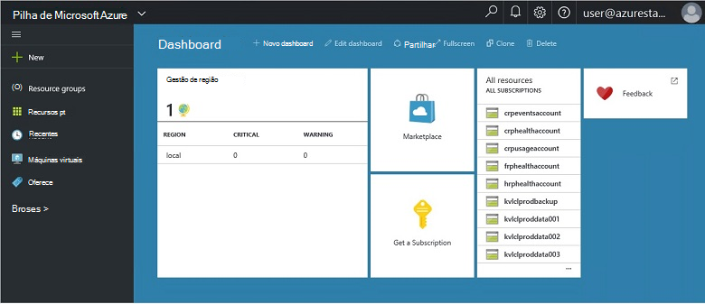
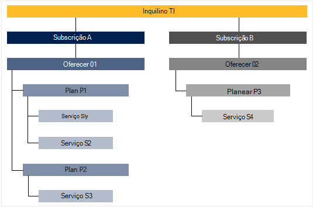

<properties
    pageTitle="Funcionalidades e conceitos Azure empilhados chave | Microsoft Azure"
    description="Saiba mais sobre as funcionalidades-chave e conceitos na pilha de Azure."
    services="azure-stack"
    documentationCenter=""
    authors="Heathl17"
    manager="byronr"
    editor=""/>

<tags
    ms.service="azure-stack"
    ms.workload="na"
    ms.tgt_pltfrm="na"
    ms.devlang="na"
    ms.topic="article"
    ms.date="10/25/2016"
    ms.author="helaw"/>

# Principais funcionalidades e conceitos Azure empilhados

Se estiver familiarizado com o Microsoft Azure pilha, estes termos e as descrições de funcionalidade poderão ser úteis.

## Pessoas

Existem duas variedades de utilizadores do Microsoft Azure pilha, o administrador do serviço e o inquilino (cliente).

-  Um **administrador de serviços** pode configurar e gerir fornecedores de recursos, ofertas de inquilino, planos, serviços, quotas e preços.
-  Um **inquilino** adquire (ou compras) serviços que o administrador do serviço oferece. Inquilinos podem aprovisionar, monitorizar e gerir os serviços que eles subscreveu, como Web Apps, armazenamento e máquinas virtuais.

## Portal

Os métodos principais de interagir com Microsoft Azure pilha é o portal e PowerShell.

O portal do Microsoft Azure pilha é uma instância do seu servidores do portal do Azure. É um web site que fornece uma experiência de gestão personalizada para administradores do serviço e inquilinos com o controlo de acesso baseado em funções (RBCA) para recursos e a capacidade de nuvem, permitindo-aplicação rápida, desenvolvimento de serviço e implementação.

## Regiões, serviços, planos, ofertas e subscrições

Na pilha de Azure, são entregues serviços a inquilinos utilizando regiões, subscrições, ofertas e planos. Podem subscrever inquilinos várias ofertas. Ofertas podem ter um ou mais planos e planos podem ter um ou mais serviços.

Exemplo de hierarquia de subscrições de um inquilino para ofertas, cada uma com diversas larguras de planos e serviços.

### Regiões
Regiões de pilha Azure são um elemento básico de escala e gestão.  Uma organização poderá ter várias regiões com recursos disponíveis em cada região.  Regiões também podem ter ofertas de serviços diferente disponíveis.

### Serviços

Microsoft Azure pilha permite aos fornecedores a entrega de uma grande variedade de serviços e aplicações, tais como máquinas virtuais, SQL Server bases de dados, o SharePoint, Exchange e mais.

### Planos

Planos são agrupamentos de um ou mais serviços. Como um fornecedor, criar planos para oferecer ao seu inquilinos. Por sua vez, os inquilinos subscrever as ofertas de utilizar os planos e serviços incluem.

Cada serviço adicionado a um plano pode ser configurado com as definições de quota para o ajudar a gerir a sua capacidade de nuvem. As quotas podem incluir restrições, tal como limites VM, RAM e CPU e são aplicadas por subscrição de utilizador. Podem ser diferenciar quotas pela localização. Por exemplo, um plano de serviços de cluster de região A poderia ter uma quota de duas máquinas virtuais, 4GB de RAM e 10 núcleos de CPU.

Ao compor uma oferta, o administrador do serviço pode incluir **planos base**. Estes planos base estão incluídos por predefinição quando subscreve um inquilino para essa oferta. Assim que um utilizador subscreve (e a subscrição é criada), o utilizador tem acesso a todos os fornecedores de recurso especificado nesses planos base (com as quotas correspondentes).

O administrador do serviço também pode incluir **planos do suplemento** numa oferta. Planos de suplementos não estão incluídos por predefinição na subscrição. Suplemento planos são disponíveis numa oferta que pode adicionar um proprietário de subscrição para as suas subscrições de adicionais planos (quotas).

### Oferece

Ofertas são os grupos dos planos de uma ou mais fornecedores de apresentam a inquilinos para comprar (subscrever). Por exemplo, alfa oferecer pode conter plano A (a partir de 1 de região que contém um conjunto de serviços de cluster) e planear B (a partir de 2 de região que contém um conjunto de serviços de armazenamento e de rede).

Uma oferta vem com um conjunto de planos base e administradores do serviço, podem criar planos do suplemento que inquilinos podem adicionar a sua subscrição.

### Subscrições

Uma subscrição é como inquilinos comprar as ofertas. Uma subscrição é uma combinação de um inquilino com uma oferta. Um inquilino pode ter subscrições para várias ofertas. Cada subscrição aplica-se para apenas uma oferta. Subscrições de um inquilino determinam quais os planos/os serviços que estes possam aceder.

Subscrições ajudam os fornecedores de organizar acesso e utilização de recursos na nuvem e serviços.

## Gestor de recursos do Azure

Ao utilizar o Gestor de recursos do Azure, pode trabalhar com os recursos da infraestrutura num modelo de declaritive, com base no modelo.   Fornece uma interface única que pode utilizar para implementar, gerir e monitorizar o seu componentes da solução, tal como máquinas virtuais, contas de armazenamento, aplicações web e bases de dados. Para obter orientação e informações completas, consulte o artigo [Descrição geral do Gestor de recursos do Azure](../azure-resource-manager/resource-group-overview.md).

### Grupos de recursos

Grupos de recursos são coleções de recursos, serviços e aplicações — e cada recurso tem um tipo, tal como máquinas virtuais, redes virtuais, IPs público, contas de armazenamento e Web sites. Cada recurso tem de ser num grupo de recursos e para ajudam a grupos de recursos logicamente organizar recursos, tais como carga de trabalho ou localização.

Eis algumas coisas importantes a ter em consideração quando definir um grupo de recursos:

-   Cada recurso só pode existir no grupo de um recurso.

-   Irá implementar, atualizar e eliminar itens num grupo de recursos em conjunto. Se um recurso, tal como um servidor de base de dados, tem de existir um ciclo de implementação diferente, deverá no outro grupo de recursos.

-   Pode adicionar ou remover um recurso a um grupo de recursos em qualquer altura.

-   Pode mover um recurso a partir de um grupo de recursos para outro grupo.

-   Um grupo de recursos pode conter recursos que residem na regiões diferentes.

-   Um grupo de recursos pode ser utilizado para organizar o controlo de acesso para ações administrativas.

-   Um recurso pode ser associado a um recurso no outro grupo de recursos quando os dois recursos tem interagir uns com os outros, mas não partilhar o mesma ciclo de vida. Por exemplo, várias aplicações tem de ligar a uma base de dados, mas nessa base de dados não pode ser atualizado ou eliminado ao mesmo ritmo como as aplicações.

-   No Microsoft Azure pilha, recursos, tais como os planos e ofertas também são geridos em grupos de recursos.

-   Pode implementar um grupo de recursos.  Isto é útil para fins de testes ou desenvolvimento.  

### Azure modelos de Gestor de recursos

Com o Gestor de recursos do Azure, pode criar um modelo simple (no formato JSON) que define a implementação e configuração da sua aplicação. Este modelo é conhecido como um modelo de Gestor de recursos do Azure e fornece uma forma declarativa para definir a implementação. Ao utilizar um modelo, pode repetidamente implementar a aplicação em todo o ciclo de vida de aplicação e ter confiança que os recursos são implementados num estado consistente.

## Fornecedores de recursos (RPs) — RP de rede, calcular RP, armazenamento RP

Fornecedores de recursos são os serviços web que formam a Fundação para todos os IaaS baseadas no Azure e serviços de PaaS. Gestor de recursos do Azure depende RPs diferentes para fornecer acesso a serviços um depare.

Existem três RPs principal: rede, armazenamento e cluster. Cada um dos seguintes RPs ajuda a configurar e controlar os seus recursos respetivos. Administradores do serviço, também podem adicionar novos fornecedores de recursos personalizadas.

### Calcular RP

O fornecedor de recursos de calcular (CRP) permite que os inquilinos do Azure pilha criar os seus próprios máquinas virtuais. Também fornece da funcionalidade para o administrador do serviço configurar o e configurar o fornecedor de recursos para inquilinos. O CRP inclui a capacidade de criar máquinas virtuais, bem como as extensões de Máquina Virtual. O serviço de extensão Máquina Virtual ajuda fornecem capacidades de IaaS para Windows e Linux máquinas virtuais.

### Rede RP

Fornecedor de recursos de rede (NRP) fornece uma série de funcionalidades de Software definidos funcionamento em rede (SDN) e função de rede virtualização (NFV) para o cloud privado. Estas funcionalidades são compatíveis com a nuvem Azure pública para que podem ser escritos uma vez e implementados tanto na nuvem pública Azure ou no local Microsoft Azure pilha modelos da aplicação. A rede RP dá-lhe um controlo de rede mais granular, etiquetas de metadados, configuração mais rápida, personalização rápida e forma repetida e várias interfaces de controlo (incluindo o PowerShell, .NET SDK, Node.JS SDK, com base no resto API). Pode utilizar o NRP para criar grupos de segurança de rede balanceadores, IPs público, no caso de carga software, redes virtuais, entre outros.

### Armazenamento RP

O armazenamento RP oferece quatro Azure consistentes serviços de armazenamento: blob, tabela, fila de espera e gestão de contas. Também oferece um serviço de administração do armazenamento na nuvem para facilitar a gestão de fornecedor de serviço dos serviços de armazenamento Azure consistentes. Armazenamento Azure fornece a flexibilidade de poder armazenar e obter grandes quantidades de dados não estruturados, como documentos e ficheiros de multimédia com Blobs do Azure, e NoSQL estruturada com base dados com tabelas do Azure. Para mais informações sobre o armazenamento do Windows Azure, consulte o artigo [Introdução ao Microsoft Azure armazenamento](../storage/storage-introduction.md).

#### Armazenamento de BLOBs

Armazenamento de BLOBs armazena qualquer conjunto de dados. Um blob pode ser qualquer tipo de texto ou dados binários, como um documento, ficheiro de multimédia ou instalador de aplicações. Armazenamento de tabela armazena conjuntos de dados estruturados. Armazenamento de tabela é um arquivo de dados com o atributo chave NoSQL, que permite desenvolvimento rápido e de acesso rápido às grandes quantidades de dados. Armazenamento de filas fornece mensagens fiável para processamento de fluxo de trabalho e para a comunicação entre os componentes de serviços em nuvem.

Cada blob é organizada um contentor. Contentores também fornecem uma forma útil para atribuir políticas de segurança para grupos de objetos. Uma conta de armazenamento pode conter qualquer número de membros em contentores e um contentor pode incluir qualquer número de blobs, por excesso para o limite de capacidade 500 TB da conta de armazenamento. Blob ofertas três os tipos de armazenamento de blobs, bloquear blobs, acrescentar blobs e blobs de página (discos). Bloquear blobs estão otimizados para streaming e armazenar objetos na nuvem e são uma ótima escolha para armazenar documentos, ficheiros de multimédia, etc as cópias de segurança. Acrescentar blobs são semelhantes às blobs bloco, mas estão otimizados para acrescentar operações. Um blob acrescentar pode ser atualizado apenas ao adicionar um novo bloco para o fim. Acrescentar blobs são uma boa escolha para cenários como registo, onde os novos dados tem de ser escritos apenas para o fim do blob. Página blobs estão otimizados para que representa IaaS discos e suporte aleatório escreve e pode ser até 1 TB de tamanho. Uma rede de máquina virtual Azure anexados IaaS disco é um VHD armazenado como um blob de página.

#### Armazenamento de tabela

Armazenamento de tabela é arquivo de chave/atributo de NoSQL da Microsoft – que tem uma estrutura sem esquemas, tornando diferente a partir de bases de dados relacionais tradicionais. Uma vez que dados armazena falta esquemas, é fácil a adaptar-se os dados como as necessidades da sua evolve de aplicação. Armazenamento de tabela é fácil de utilizar, para que os programadores podem criar aplicações rapidamente. Armazenamento de tabela é um arquivo de chave de atributo, que significa que está armazenado cada valor numa tabela com um nome de propriedade escrito. O nome da propriedade pode ser utilizado para filtrar e especificar critérios de seleção. Uma coleção de propriedades e os respetivos valores incluir uma entidade. Desde esquemas de falta de armazenamento de tabela, duas entidades na mesma tabela podem conter coleções de sites diferentes das propriedades e as propriedades que podem ser de diferentes tipos. Pode utilizar o armazenamento de tabela para armazenar flexíveis conjuntos de dados, tais como os dados de utilizador para aplicações web, livros de endereços, informações sobre o dispositivo e qualquer outro tipo de metadados que requer o seu serviço. Pode armazenar qualquer número de entidades numa tabela e uma conta de armazenamento pode conter qualquer número de tabelas, por excesso para o limite de capacidade da conta de armazenamento.

#### Armazenamento de fila de espera
Armazenamento de fila Azure fornece nuvem mensagens entre componentes da aplicação. Estruturar os pedidos de escala, componentes da aplicação com frequência são desacoplados, para que estes podem dimensionar de forma independente. Armazenamento de filas fornece mensagens assíncrona para comunicação entre os componentes de aplicação, se estiverem em execução na nuvem, no ambiente de trabalho, num servidor no local ou num dispositivo móvel. Armazenamento de filas também suporta a gerir tarefas assíncronas e de construção de fluxos de trabalho do processo.

## Controlo de acesso (RBAC) baseado em funções

Pode utilizar RBAC para conceder acesso de sistema para os utilizadores autorizados, grupos e serviços, atribuindo-lhes funções num nível de recurso individual, grupo de recursos ou subscrição. Cada função define o nível de acesso que um utilizador, grupo ou serviço tem sobre os recursos do Microsoft Azure pilha.

Azure RBAC tem três funções básicas que se aplicam a todos os tipos de recursos: proprietário, contribuinte e leitor. Proprietário tem acesso total a todos os recursos, incluindo o direito de acesso de delegado para outras pessoas. Contribuinte pode criar e gerir todos os tipos de recursos Azure mas não pode conceder acesso a outras pessoas. Leitor só pode ver os recursos Azure existentes. O resto das funções RBAC no Azure permitir a gestão dos recursos Azure específicos. Por exemplo, a função Contribuinte Máquina Virtual permite criação e gestão de máquinas virtuais mas não permitir a gestão de rede virtual ou a sub-rede que liga a máquina virtual.

## Dados de utilização

Microsoft Azure pilha recolhe e agrega dados de utilização em todos os fornecedores de recursos para fornecer um relatório conciso por utilizador. Dados podem ser tão simples como contar recurso consumidas ou tão complexas como contadores individuais de desempenho e a escala. Os dados estão disponíveis através de REST API. Existe um Azure consistentes API do inquilino, bem como fornecedor delegada fornecedor APIs e para obter dados de utilização entre todas as subscrições do inquilino. Estes dados podem ser utilizados para integrar com uma ferramenta de externas ou serviço para faturação ou encargos.

## Próximos passos

[Implementar pilha Azure pré-visualização técnica 2 (conceito)](azure-stack-deploy.md)
