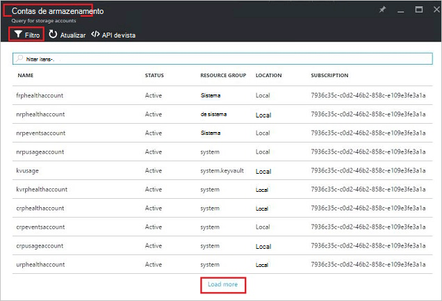

<properties
    pageTitle="Gerir contas de armazenamento do Azure pilha | Microsoft Azure"
    description="Saiba como localizar, gerir, recuperar e recuperar contas do Azure pilha de armazenamento"
    services="azure-stack"
    documentationCenter=""
    authors="AniAnirudh"
    manager="darmour"
    editor=""/>

<tags
    ms.service="azure-stack"
    ms.workload="na"
    ms.tgt_pltfrm="na"
    ms.devlang="na"
    ms.topic="get-started-article"
    ms.date="09/26/2016"
    ms.author="anirudha"/>

# <a name="manage-storage-accounts-in-azure-stack"></a>Gerir contas de armazenamento na pilha Azure

Saiba como gerir contas de armazenamento no Azure pilha de localizar, recuperar e recuperar a capacidade de armazenamento com base nas necessidades de negócio.

## <a name="find-a-storage-account"></a>Localizar uma conta de armazenamento

Na lista de contas de armazenamento na região pode ser visualizada na pilha de Azure por:

1.  Num browser da internet, navegue para [https://portal.azurestack.local](https://portal.azurestack.local/).

2.  Inicie sessão no portal do Azure pilha como um administrador (utilizando as credenciais fornecidas durante a implementação)

3.  No dashboard de predefinido – encontre lista **Gestão de região** e clique na região que pretende explorar – por exemplo **(local**).

    

4.  Selecione **armazenamento** a partir da lista de **Fornecedores de recursos** .

    

5.  Agora, no pá de administração do fornecedor de recurso armazenamento – desloque para baixo para o separador "Armazenamento contas" e clique na mesma.

    
    
    A página resultante é a lista de contas de armazenamento na região.

    

Por predefinição, são apresentadas as contas primeiros 10. Pode optar por obter mais clicando na hiperligação "carregar mais" na parte inferior da lista <br>
OU <br>
Se estiver interessado numa conta de armazenamento particular – pode **filtrar e obter contas relevantes** apenas.<br>

Para filtrar para contas:

1. Clique no botão Filtro na parte superior da pá.

2. No pá filtro,-permite-lhe especificar o **nome da conta**,  **ID da subscrição** ou **Estado** para ajustar a lista de contas de armazenamento para que seja apresentado. Utilizá-los conforme adequado.

3. Clique em Atualizar. Na lista, deverá actualizar em conformidade.

    

4. Para repor o filtro – clique no botão filtro, desmarque terminar as seleções e atualizar.

Caixa de texto de pesquisa, na parte superior a pá de lista de contas de armazenamento, permite-lhe realçar o texto seleccionado na lista de contas. Este é muito útil maiúscula quando o nome completo ou o id não está disponível facilmente.<br>
Pode utilizar o texto livre aqui para ajudar a encontrar a conta que lhe interessam.


## <a name="look-at-account-details"></a>Veja os detalhes da conta

Após ter localizado contas que se estiver interessado em visualizar, pode clicar na conta do específica para ver os certos detalhes. Uma nova pá será aberto com os detalhes de conta, como o tipo de conta, hora de criação, localização, etc.


## <a name="recover-a-deleted-account"></a>Recuperar uma conta eliminada

Poderá ser uma situação onde pretender para recuperar uma conta eliminada.<br>
No AzureStack existe uma forma muito simple para fazê-lo.

1.  Aceda a navegar para a lista de contas de armazenamento. [Consulte o artigo localizar uma conta de armazenamento](#find-a-storage-account)

2.  Localize a essa conta específica na lista. Poderá ter de filtrar.

3.  Verifique o 'Estado' da conta. Deverá aparecer "eliminados".

4.  Clique na conta que é aberta a pá de detalhes de conta.

5.  Na parte superior deste pá – localize o botão "recuperar" e clique na mesma.

6.  Confirmar ao premir "Sim"

    

7.  A recuperação ter está, agora no processo … espera para indicação de que foi efetuada com êxito.
    Também pode clicar no ícone de "campainha" na parte superior do portal para ver indicações de progresso.

    

  Assim que a conta recuperada é sincronizada com êxito, um pode voltar a utilizá-lo.

### <a name="some-gotchas"></a>Algumas Dilemas

- A conta eliminada mostra o estado como "fora do retenção".

  Isto significa que a conta eliminada tiver excedido o período de retenção e pode não ser recuperável deixem.

- Não mostrar a conta eliminada na lista de contas.

  Isto poderia significa que a conta eliminada já foi lixo recolhido. Neste caso não é possível recuperá-la deixem. Consulte o artigo "recuperar capacidade" abaixo.

## <a name="set-retention-period"></a>Definir o período de retenção

Definição do período de retenção permite que um administrador especificar um período de tempo em dias (entre 0 e 9999 dias) durante o qual qualquer conta eliminada potencialmente pode ser recuperada. O período de retenção predefinido está definido para 15 dias. Definir o valor para "0" significa que a qualquer conta eliminada imediatamente vai estar fora de retenção e marcados para recolha de lixo periódicos.

Para alterar o período de retenção

1.  Num browser da internet, navegue para [https://portal.azurestack.local](https://portal.azurestack.local/).

2.  Inicie sessão no portal do Azure pilha como um administrador (utilizando as credenciais fornecidas durante a implementação)

3.  No dashboard de predefinido – encontre lista **Gestão de região** e clique na região que pretende explorar – por exemplo **(local**).

4.  Selecione **armazenamento** a partir da lista de **Fornecedores de recursos** .

5.  Clique no ícone definições no canto superior para abrir o separador definição.

6.  Clique em configuração - período de retenção.

7.  Pode editar o valor e guardá-lo.

 Este valor serão imediatamente eficazes e refletir ao longo de toda a região.


## <a name="reclaim-capacity"></a>Recuperar a capacidade

É um dos efeitos de lado de ter um período de retenção que uma conta eliminada irão continuar a capacidade de consumir até que a mesma terminar o período de retenção. Agora como um administrador que poderá ter uma forma para recuperar isto eliminado espaço de contas apesar do período de retenção ainda não tiver expirado. Atualmente pode utilizar uma linhacmd explicitamente substituir o período de retenção e recuperar imediatamente a capacidade. Para fazê-lo –

1.  Partindo do princípio que ter Azure PowerShell instalado e configurado. Se não siga as instruções aqui: para instalar a versão mais recente do PowerShell do Azure e associá-la com a sua subscrição Azure, consulte o artigo [como instalar e configurar o Azure PowerShell](http://azure.microsoft.com/documentation/articles/powershell-install-configure/).
    Para mais informações sobre os cmdlets do Gestor de recursos do Azure, consulte o artigo [Utilizar o PowerShell Azure com o Gestor de recursos do Azure](http://go.microsoft.com/fwlink/?LinkId=394767)

2.  Execute este cmdlet:

    ```
    PS C:\\>; Clear-ACSStorageAccount -ResourceGroupName system
    -FarmName <your farmname>
    ```

> Para obter mais detalhes, consulte a [documentação de powershell AzureStack](https://msdn.microsoft.com/library/mt637964.aspx)

> [AZURE.NOTE] A executar este cmdlet irá eliminar permanentemente a conta e os seus conteúdos. Já não serão recuperável. Utilize com cuidado.

