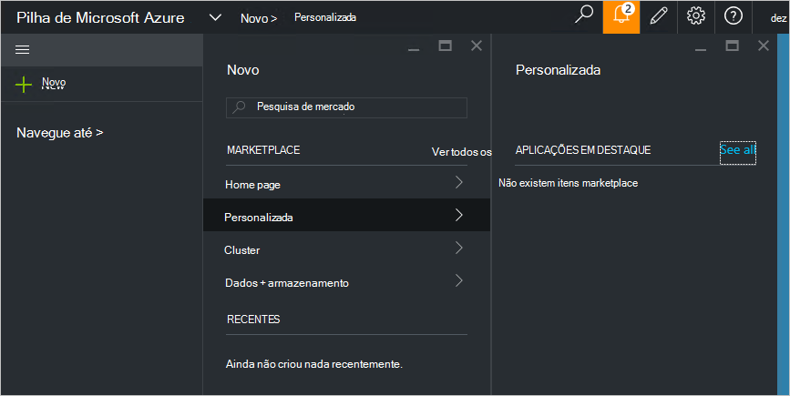

<properties
    pageTitle="Publicar um item de marketplace personalizado na pilha de Azure (administrador de serviços) | Microsoft Azure"
    description="Como administrador do serviço, saiba como publicar um item de marketplace personalizado na pilha de Azure."
    services="azure-stack"
    documentationCenter=""
    authors="rupisure"
    manager="byronr"
    editor=""/>

<tags
    ms.service="azure-stack"
    ms.workload="na"
    ms.tgt_pltfrm="na"
    ms.devlang="na"
    ms.topic="article"
    ms.date="09/26/2016"
    ms.author="rupisure"/>

# O pilha Azure Marketplace

Mercado é uma coleção de itens personalizadas para a pilha de Azure, como o serviços, aplicações e recursos. É o local onde os inquilinos fornecidos para criar novos recursos e implementar novas aplicações. Administradores do serviço, podem adicionar itens personalizados para o Marketplace e inquilinos irão ver imediatamente.

Para abrir o Marketplace, clique em **Novo**.

Mercado é atualizado em cinco minutos.

## Itens Marketplace

Tem de cada item Marketplace:

-   Um modelo de Gestor de recursos do Azure para recursos de aprovisionamento

-   Metadados, como cadeias, ícones e outros materiais de marketing

-   Informações de formatação para apresentar o item no portal

Cada item publicado no mercado utiliza um formato de denominado o pacote de galeria Azure (azpkg). Recursos de implementação ou runtime (por exemplo, código, ficheiros de zip com o software ou imagens de máquina virtual) devem ser adicionados a pilha de Azure separadamente, não como parte do Marketplace Item. 

## Próximos passos

[Criar e publicar um item de marketplace](azure-stack-create-and-publish-marketplace-item.md)
