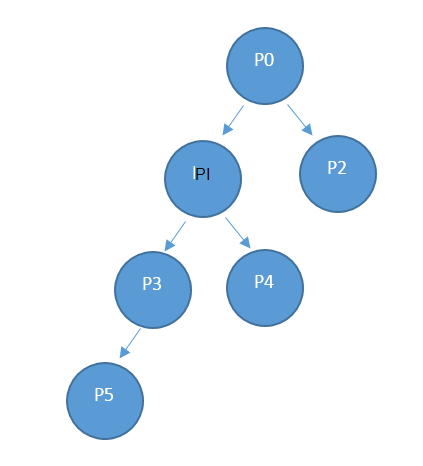

<properties
    pageTitle="Utilização de recursos do fornecedor API | Microsoft Azure"
    description="Referência para utilização de recursos API, que obter informações sobre a utilização do Azure pilha."
    services="azure-stack"
    documentationCenter=""
    authors="AlfredoPizzirani"
    manager="byronr"
    editor=""/>

<tags
    ms.service="azure-stack"
    ms.workload="na"
    ms.tgt_pltfrm="na"
    ms.devlang="na"
    ms.topic="article"
    ms.date="10/18/2016"
    ms.author="alfredop"/>

# Utilização de recursos do fornecedor API

O fornecedor de termo aplica-se para o administrador do serviço e para qualquer fornecedores delegadas. Administradores de serviço e de fornecedores de delegado podem utilizar a API a utilização do fornecedor para ver a utilização da suas inquilinos diretas. Por exemplo, P0 pode chamar a API do fornecedor para obter informações sobre a utilização da P1 e da P2 utilização do direta e P1 pode ligar para a utilização obter informações sobre P3 e E4.

## Referência da API da chamada

### Pedido

O pedido obtém detalhes consumo para as subscrições pedidas e para o período de tempo requerido. Não existe nenhuma corpo do pedido.

Esta utilização API é uma API do fornecedor, por isso o autor da chamada tem de ser atribuída uma função de leitor, contribuinte ou proprietário na subscrição do fornecedor.

| **Método**  | **URI pedido** |
| ------------ | ------------------------------------------------------------------------------------------------------------------------------------------------------------------------------------------------------------------------------------------------------------------------------------------------------ |
|  OBTER        | https://{armendpoint}/subscriptions/{subId}/providers/Microsoft.Commerce/subscriberUsageAggregates?reportedStartTime={reportedStartTime}&reportedEndTime={reportedEndTime}&aggregationGranularity={granularity}&subscriberId={sub1.1}&api-version=2015-06-01-preview&continuationToken={token-value} |

### Argumentos

| **Argumento**              | **Descrição** |
| -------------------------- | --------------------------------------------------------------------------------------------------------------------------------------------------------------------------------------------------------------------------------------------------------------------------------------------------------------------------------------------------------- |
| *armendpoint*             | Azure ponto final de Gestor de recursos do seu ambiente do Azure pilha. Convenção de pilha de Azure está que o nome do ponto final de processador https://api a formatar. {nome do domínio}'. Por exemplo, se o nome do domínio for azurestack.local, em seguida, o ponto final de processador será https://api.azurestack.local. |
| *subId*                   | ID da subscrição do utilizador ao qual está a fazer a chamada. |
| *reportedStartTime*       | Hora de início a consulta. O valor de *data/hora* deve ser na UTC e no início da hora, por exemplo, 13:00. Para agregação diária, defina este valor para meia-noite do UTC. O que é o formato *escape* ISO 8601, por exemplo, 2015-06-16T18% 3a53% 3a11% 2b00% 3a00Z, onde os dois pontos são escape para % 3a e plus escape para % 2b, para que seja URI amigável. |
| *reportedEndTime*         | Hora de fim da consulta. As restrições de que se aplicam a *reportedStartTime* também se aplicam a este argumento. O valor para *reportedEndTime* não pode ser no futuro. |
| *aggregationGranularity*  | Parâmetro opcional que tem dois valores de potenciais descontínuos: diariamente e por hora. À medida que os valores sugerem, um devolve os dados no granularidade diária e o outro é uma resolução de hora a hora. A opção diária é a predefinição. |
| *subscriberId*            | ID da subscrição. Para obter dados filtrados, é necessário o ID da subscrição de um inquilino direto do fornecedor. Se não for especificado nenhum parâmetro de ID da subscrição, a chamada devolve dados de utilização para inquilinos direta do fornecedor. |
| *versão da API*             | Versão do protocolo que é utilizado para tornar este pedido. Tem de utilizar 2015-06-01-pré-visualização. |
| *continuationToken*       | Token obtidos a partir da última chamada para o fornecedor de utilização de API. Isto é necessário quando uma resposta for maior que 1.000 linhas. Este é o marcador para o progresso da. Se não existir, os dados serem recuperados desde o início do dia ou hora, com base na granularidade transmitido. |

### Resposta

OBTER /subscriptions/sub1/providers/Microsoft.Commerce/subscriberUsageAggregates?reportedStartTime=reportedStartTime=2014-05-01T00%3a00%3a00%2b00%3a00 & reportedEndTime = 2015-06-01T00% 3a00% 3a00% 2b00% 3a00 & aggregationGranularity = diária & subscriberId = sub1.1 & versão api = 1.0

{

"valor":\[

{

"id": "/subscriptions/sub1.1/providers/Microsoft.Commerce/UsageAggregate/sub1.1-

meterID1 ",

"nome": "sub1.1 meterID1"

"tipo": "Microsoft.Commerce/UsageAggregate",

"Propriedades": {

"subscriptionId": "sub1.1",

"usageStartTime": "2015-03-03T00:00:00 + 00:00",

"usageEndTime": "2015-03-04T00:00:00 + 00:00",

"instanceData": "{\\" Microsoft.Resources\\": {\\" URI do recurso\\":\\" resourceUri1\\",\\"localização\\

":\\" Alasca\\",\\" etiquetas\\": nulo,\\" informações adicionais\\": nulo}}",

"quantidade":2.4000000000,

"meterId": "meterID1"

}

},

…

### Detalhes da resposta

| **Argumento**       | **Descrição**
| ------------------ | ------------------------------------------------------------------------------------------------------------- |
| *ID*               | ID exclusivo do agregado de utilização
| *nome*             | Nome do agregado de utilização
| *tipo*             | Definição de recursos
| *subscriptionId*   | Identificador de subscrição do utilizador pilha Azure
| *usageStartTime*   | UTC hora de início a balde de utilização a que pertence este agregado de utilização
| *usageEndTime*     | Hora de fim UTC da balde de utilização a que pertence este agregado de utilização
| *instanceData*     | Valor da chave pares dos detalhes de instância (num novo formato):  *URI do recurso*: totalmente qualificado ID do recurso, que inclui os grupos de recursos e o nome da instância   *localização*: região em que este serviço foi executado   *etiquetas*: etiquetas de recursos que são especificadas pelo utilizador   *informações adicionais*: mais detalhes sobre o recurso a ser consumido, por exemplo, tipo de imagem ou a versão do SO |
| *quantidade*         | Quantidade de consumo de recursos que ocorreram neste período de tempo |
| *meterId*          | ID exclusivo para o recurso que foi consumidas (também denominados *ResourceID*) |

## Próximos passos

[Utilização de recursos do inquilino referência da API](azure-stack-tenant-resource-usage-api.md)

[Perguntas mais frequentes relacionados com a utilização](azure-stack-usage-related-faq.md)
