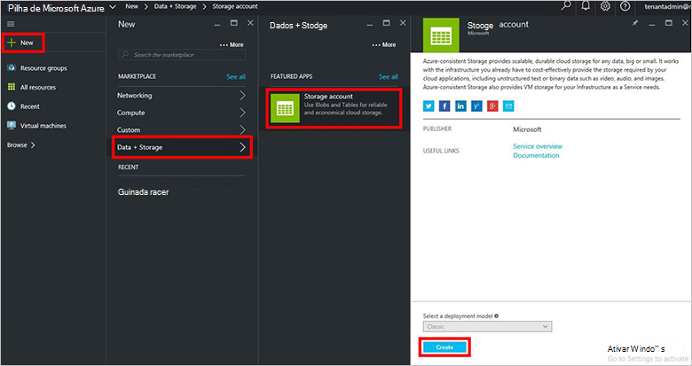
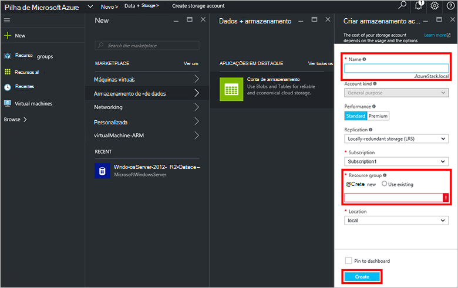
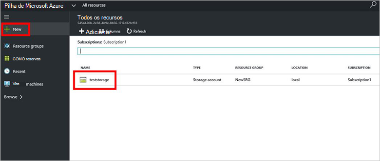

<properties
    pageTitle="Contas de armazenamento na pilha de Azure | Microsoft Azure"
    description="Saiba como criar uma conta de armazenamento do Azure pilha."
    services="azure-stack"
    documentationCenter=""
    authors="ErikjeMS"
    manager="byronr"
    editor=""/>

<tags
    ms.service="azure-stack"
    ms.workload="na"
    ms.tgt_pltfrm="na"
    ms.devlang="na"
    ms.topic="get-started-article"
    ms.date="09/26/2016"
    ms.author="erikje"/>

# Contas de armazenamento na pilha de Azure

Contas de armazenamento incluem serviços Blob e tabela e o espaço de nomes exclusivo para os objetos de dados de armazenamento. Por predefinição, os dados na sua conta estão disponíveis apenas para si, o proprietário da conta de armazenamento.

1.  No computador Azure pilha conceito, inicie sessão no `https://portal.azurestack.local` como [um administrador](azure-stack-connect-azure-stack.md#log-in-as-a-service-administrator)e, em seguida, clique em **Novo** > **dados + armazenamento** > **conta de armazenamento**.

    

2.  Na pá **criar a conta de armazenamento** , escreva um nome para a sua conta de armazenamento. Criar um novo **Grupo de recursos**, ou selecione uma existente e, em seguida, clique em **Criar** para criar a conta de armazenamento.

    

3. Para ver a sua nova conta de armazenamento, clique em **todos os recursos**, em seguida, procure a conta de armazenamento e clique no respetivo nome.

    
    
## Próximos passos

[Utilizar modelos de Gestor de recursos do Azure](azure-stack-arm-templates.md)

[Saiba mais sobre contas de armazenamento Azure](../storage/storage-create-storage-account.md)

[Transferir o guia de validação de armazenamento Azure consistentes pilha Azure](http://aka.ms/azurestacktp1doc)
