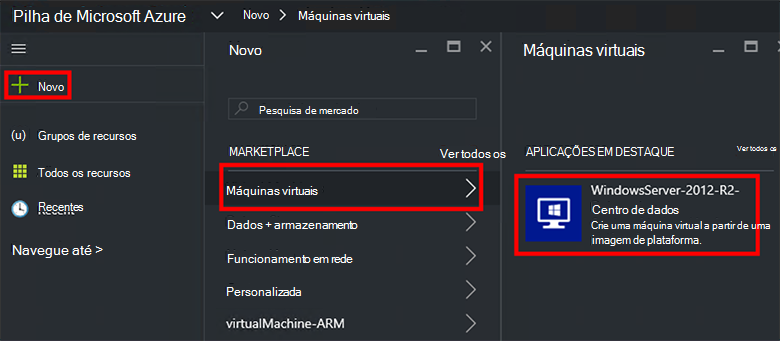
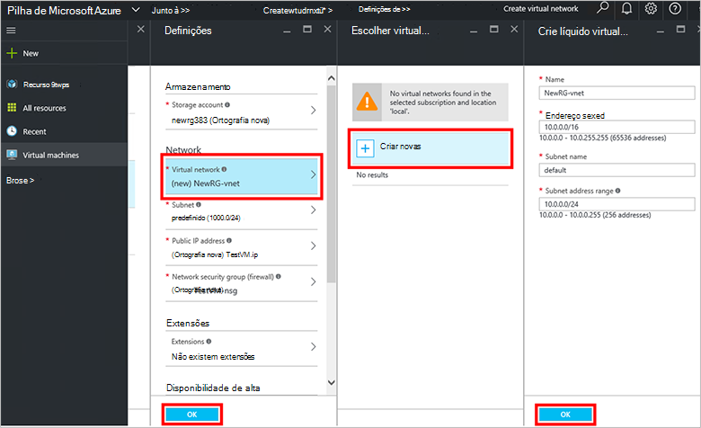
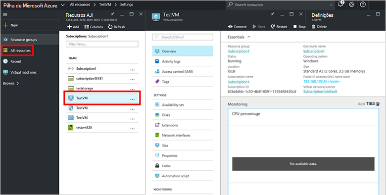

<properties
    pageTitle="Aprovisionar uma VM Azure empilhados (inquilino) | Microsoft Azure"
    description="Como um inquilino, saiba como pode aprovisionar uma VM na pilha de Azure."
    services="azure-stack"
    documentationCenter=""
    authors="ErikjeMS"
    manager="byronr"
    editor=""/>

<tags
    ms.service="azure-stack"
    ms.workload="na"
    ms.tgt_pltfrm="na"
    ms.devlang="na"
    ms.topic="get-started-article"
    ms.date="10/12/2016"
    ms.author="erikje"/>

# Aprovisionar uma máquina virtual

Como administrador, pode criar máquinas virtuais para avaliar recursos antes de perguntá-las se nos planos.

## Aprovisionar uma máquina virtual

1.  No computador Azure pilha conceito, inicie sessão no `https://portal.azurestack.local` como [um administrador](azure-stack-connect-azure-stack.md#log-in-as-a-service-administrator)e, em seguida, clique em **Novo** > **máquinas virtuais** > **WindowsServer-2012-R2-Centro de dados**.  

    

2.  Na pá **Noções básicas** , escreva um **nome**, **nome de utilizador**e **palavra-passe**. Para **tipo de disco VM**, selecione **disco**. Selecione uma **subscrição**. Criar um **grupo de recursos**, ou selecione uma existente e, em seguida, clique em **OK**.  

3.  Na pá **Escolher um tamanho** , clique em **A1 básica**e, em seguida, clique em **Selecionar**.  

4.  No pá **Definições** , clique em **Rede Virtual**. Na pá **rede virtual escolher** , clique em **Criar novo**. Na pá **criar rede virtual** , aceitar todas as predefinições e clique em **OK**. Na pá **Definições** , clique em **OK**.

    

5.  Na pá **Resumo** , clique em **OK** para criar a máquina virtual.  

6. Para ver a sua nova máquina virtual, clique em **todos os recursos**, em seguida, procure a máquina virtual e clique no respetivo nome.

    

## Próximos passos

[Contas de armazenamento](azure-stack-provision-storage-account.md)
