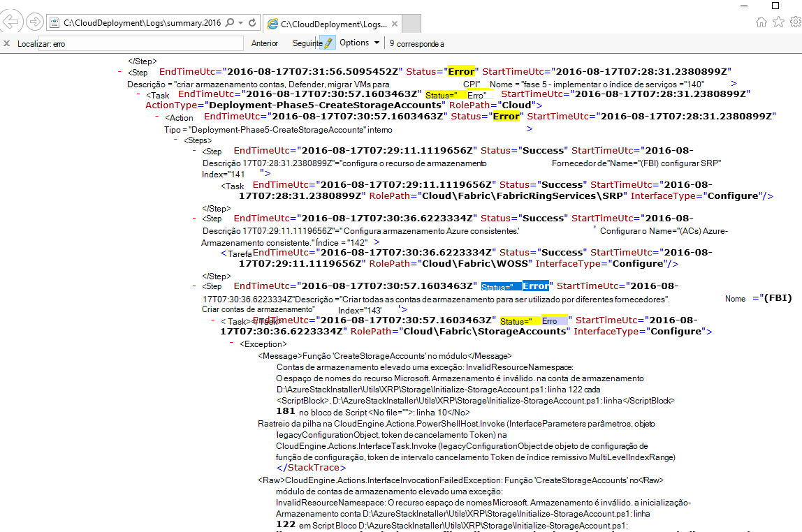
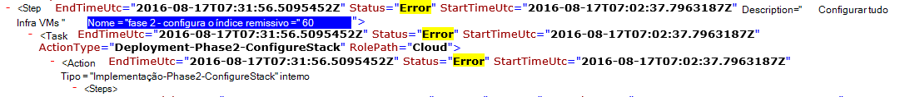

<properties
    pageTitle="Volte a executar uma implementação a partir de um passo falha | Microsoft Azure"
    description="Se tiver uma falha durante a implementação, pode tentar os seguintes passos para voltar a executar a implementação a partir de onde falhou."
    services="azure-stack"
    documentationCenter=""
    authors="ErikjeMS"
    manager="byronr"
    editor=""/>

<tags
    ms.service="azure-stack"
    ms.workload="na"
    ms.tgt_pltfrm="na"
    ms.devlang="na"
    ms.topic="get-started-article"
    ms.date="09/26/2016"
    ms.author="erikje"/>
    
# Volte a executar uma implementação a partir de um passo falha
  
Se tiver uma falha durante a implementação, pode tentar os seguintes passos para voltar a executar a implementação a partir de onde falhou.

## Localizar a falha

Nota de tomar de falha, especificamente a parte que chame no qual passo a invocação Ocorreu uma falha. Por exemplo,

**2016 08-x 17 00:30:57 erro 1 > 1 > ação: invocação do passo 60.140.143 falhou. Parar a invocação de plano de ação.**

Este é o passo de implementação onde começarão a voltar a executar da implementação.

## Localizar mais detalhes sobre a falha

Se pretender obter mais detalhes sobre o erro, encontrar associado **Resumo. AAAA-MM-DD.tt.N.log.xml** no **C:\CloudDeployment\Logs\* * pasta.
Procurar a cadeia "Erro" e siga-a para baixo através de saída até ver uma grande quantidade de texto não formatado XML que contém a mensagem de erro (esta secção com frequência coincide com a última instância da cadeia "Erro"). Por exemplo:

Também pode utilizar estas informações para controlar o passo volte a executar, siga os números "Indexar" para cima a partir do último desse erro. Na imagem acima, pode ver (começando a partir da parte inferior): 143, 140 e, em seguida, se deslocar para cima, verá 60:

Isto colocar todas as (juntos de cima para baixo), obtém 60.140.143, tal como faria no resultado de consola do PS da falha (conforme visto na secção "Falha de localizar" acima).

## Execute novamente a implementação de um passo específico

Agora que tem no passo que a implementação Ocorreu uma falha na, pode tentar a - voltar a executar de implementação desse passo.

> [AZURE.IMPORTANT] Os seguintes comandos tem de ser executados por utilizador corretas, no contexto com a falha que ocorreram. Se a falha ocorreu antes de anfitrião do foi associado ao domínio, executar estes passos como conta de administrador local. Se a falha ocorreu depois de anfitrião do foi aderido ao domínio, execute estes passos como o administrador do domínio (azurestack\azurestackadmin).

### Executar o comando invocar EceAction

1. A partir de uma consola PS elevada, importe os módulos seguintes:

        Import-Module C:\CloudDeployment\CloudDeployment.psd1 -Force
        Import-Module C:\CloudDeployment\ECEngine\EnterpriseCloudEngine.psd1 -Force 

2. Em seguida, execute o seguinte comando (por exemplo, um ponto acima utilizado aqui):

        Invoke-EceAction -RolePath Cloud -ActionType Deployment -Start 60.140.143 -Verbose

3.  Este iniciará de implementação do passo identificado pela-parâmetro de arranque do comando invocar EceAction

### Resultados de um - voltar a executar/início

Independentemente a opção escolher, a implementação começará novamente especificado - comece a parâmetro.

1.  Se a falha for recuperável, irão continuar a implementação através de conclusão.

2.  Se a implementação falhar novamente...
    
    - mesmo local: a falha provavelmente não é recuperável e aprofundar é necessário.

    - um novo local após onde tiver falhado este período de tempo: pode tentar estes passos para obter interação novamente.

    - um novo local antes de onde tiver falhado este período de tempo: algo correu mal com uma chamada de idempotent, requer o inquérito.

## Próximos passos

[Ligar a pilha Azure](azure-stack-connect-azure-stack.md)

