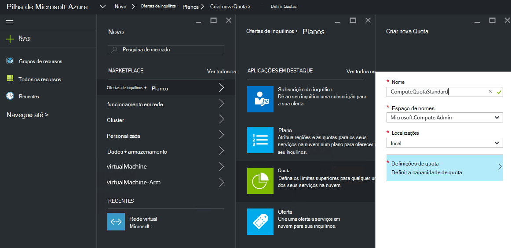
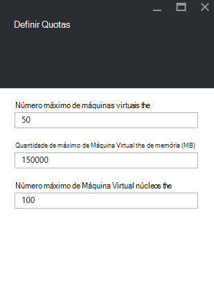
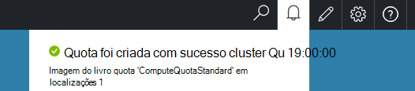

<properties
    pageTitle="As quotas de empilhados Azure | Microsoft Azure"
    description="Os administradores definir quotas para restringir a quantidade máxima de recursos inquilinos tem acesso."
    services="azure-stack"
    documentationCenter=""
    authors="mattmcg"
    manager="byronr"
    editor=""/>

<tags
    ms.service="azure-stack"
    ms.workload="na"
    ms.tgt_pltfrm="na"
    ms.devlang="na"
    ms.topic="get-started-article"
    ms.date="09/26/2016"
    ms.author="mattmcg"/>

# Definir quotas Azure empilhados

As quotas de definem os limites de recursos que uma subscrição de inquilino pode aprovisionar ou consumir. Por exemplo, uma quota poderão permitir que um inquilino criar VMs até cinco. Para adicionar um serviço para um plano, o administrador tem de configurar as definições de quota para esse serviço.

As quotas de são configuráveis por serviço e por localização, permitir que os administradores fornecer granular controlo sobre o consumo de recursos. Os administradores podem criar um ou mais recursos de quota e associá-las planos, que significa que podem fornecer ofertas diferenciadas aos seus serviços. As quotas de um determinado serviço podem ser criadas a partir do pá de administração do **Fornecedor de recursos** para esse serviço.

Um inquilino que subscreve a uma oferta que contém vários planos pode utilizar todos os recursos que estão disponíveis em cada um dos planos.

## Para criar uma quota de IaaS

1.  Num browser, aceda ao [https://portal.azurestack.local](https://portal.azurestack.local/).

    Inicie sessão no portal do Azure pilha como um administrador (ao utilizar as credenciais que forneceu durante a implementação).

2.  Selecione **Novo**e, em seguida, selecione **Quota**.

3.  Selecione o primeiro para a qual pretende criar uma quota de serviço. Quota de IaaS, siga estes passos para os serviços de cluster, rede e armazenamento.
Neste exemplo, vamos criar primeiro uma quota para o serviço de cluster. Na lista de **espaço de nomes** , selecione o espaço de nomes de **Microsoft.Compute.Admin** .

    > 

4.  Escolha a localização onde a quota de é definida (por exemplo, 'local').

5.  No item **As definições de Quota** , obtenho a informação **definir a capacidade de Quota**. Clique neste item para configurar as definições de quota.

6.  No pá **Definir Quotas** , vê todos os recursos de cluster para os quais pode configurar limites. Cada tipo tem um valor predefinido que está associado com-lo. Pode alterar estes valores ou pode selecionar o botão **Ok** na parte inferior da pá para aceitar as predefinições.

    > 

7.  Depois de ter configurado os valores e clicado em **Ok**, é apresentado o item de **Definições de Quota** como **configurado**. Clique em **Ok** para criar o recurso de **Quota** .

    Deverá ver uma notificação que indica que o recurso de quota está a ser criado.

8.   Após o conjunto de quota foi criado com êxito, receberá uma notificação segunda. A quota de serviço de cluster está agora pronta para ser associada a um plano. Repita estes passos com os serviços de armazenamento e de rede e estiver pronto para criar um plano de IaaS!

    >   

## Calcular tipos de quota

|**Tipo**                    |**Valor predefinido**| **Descrição**|
|--------------------------- | ------------------------------------|------------------------------------------------------------------|
|Número máximo de máquinas virtuais   |50|O número máximo de máquinas virtuais que pode criar uma subscrição desta localização. |
|Número máximo de máquina virtual núcleos              |100|O número máximo de núcleos que pode criar uma subscrição na seguinte localização (por exemplo, uma VM A3 tem quatro núcleos).|
|Valor máximo de memória máquina virtual (GB)         |150|A quantidade máxima de RAM que pode ser aprovisionado em megabytes (por exemplo, uma VM A1 consome 1,75 GB de RAM).|

> [AZURE.NOTE] Calcule não são impostas nesta pré-visualização técnica.

## Tipos de quota de armazenamento

|**Item**                           |**Valor predefinido**   |**Descrição**|
|---------------------------------- |------------------- |-----------------------------------------------------------|
|Capacidade máxima (GB)              |500                 |Capacidade de armazenamento total que pode ser consumida por uma subscrição na seguinte localização.|
|Número total de contas de armazenamento   |20                  |O número máximo de contas de armazenamento que pode criar uma subscrição desta localização.|

## Tipos de quota de rede

|**Item**                                                   |**Valor predefinido**   |**Descrição**|
|----------------------------------------------------------| ------------------- |--------------------------------------------------------------------------------------------------------------------------------------------------------------------|
| IPs público máximo                         |50                  |O número máximo de IPs público que pode criar uma subscrição desta localização. |
| Redes virtuais máximo                   |50                  |O número máximo de redes virtuais que pode criar uma subscrição desta localização. |
| Gateways de rede virtual máximo           |1                   |O número máximo de gateways de rede virtual (VPN Gateways) que pode criar uma subscrição desta localização. |
| Ligações de rede máximo                |2                   |O número máximo de ligações de rede (ponto a ponto ou site para o site) que pode criar uma subscrição através de todos os gateways de rede virtual na seguinte localização. |
| Balanceadores de carga máximo                     |50                  |O número máximo de balanceadores de carga que pode criar uma subscrição desta localização. |
| NIC máximo                               |100                 |O número máximo de interfaces de rede que pode criar uma subscrição desta localização. |
| Grupos de segurança de rede máximo            |50                  |O número máximo de grupos de segurança de rede que pode criar uma subscrição desta localização. |
