<properties
    pageTitle="Implementar o fornecedor de recursos do SQL Server Azure pilha | Microsoft Azure"
    description="Passos detalhados para implementar uma placa de fornecedor de recursos do SQL Server na pilha de Azure."
    services="azure-stack"
    documentationCenter=""
    authors="Dumagar"
    manager="byronr"
    editor=""/>

<tags
    ms.service="multiple"
    ms.workload="na"
    ms.tgt_pltfrm="na"
    ms.devlang="na"
    ms.topic="article"
    ms.date="09/26/2016"
    ms.author="dumagar"/>

# Implementar o SQL Server recurso fornecedor adaptador na pilha Azure

> [AZURE.NOTE] As seguintes informações só se aplica a implementações do Azure pilha TP1.

Utilize este artigo para seguir os passos detalhados para configurar o SQL Server recurso fornecedor adaptador na pilha Azure prova do conceito. Consulte o artigo [utilizar bases de dados do SQL Azure pilha](azure-stack-sql-rp-deploy-short.md) para compreender as capacidades de fornecedor de recurso e de arquitectura.

## Configurar o passos antes de implementar

Antes de implementar o fornecedor de recursos, terá de:

- Tem uma imagem do Windows Server predefinida com .NET 3.5
- Desativar a segurança avançada do Internet Explorer (IE)
- Instalar a versão mais recente do PowerShell do Azure

### Criar uma imagem do Windows Server, incluindo .NET 3.5

Pode ignorar este passo se tiver transferido os bits Azure pilha após 23/2/2016 uma vez que a imagem predefinida de Windows Server 2012 R2 base inclui .NET 3.5 framework nesta transferência e versões posteriores.

Se tiver transferido antes de 23/2/2016, tem de criar um centro de dados VHD do Windows Server 2012 R2 com imagem .NET 3.5 e definir é como a imagem predefinida no repositório de plataforma imagem.

### Desativar o IE as funcionalidades de segurança e ativar cookies

Para implementar um fornecedor de recursos, execute o integrada Scripting ambiente (ISe do PowerShell) como um administrador, pelo que necessita permitir os cookies e JavaScript no perfil do Internet Explorer que utilizar para iniciar sessão no Azure Active Directory para suplementos de início de sessão administrador e utilizador.

**Para desativar a opção IE segurança avançada:**

1. Inicie sessão no computador Azure pilha prova de conceito (conceito) como AzureStack/administrador e, em seguida, abra o Gestor de servidor.

2. Desative a **Configuração de segurança avançada IE** para administradores e utilizadores.

3. Inicie sessão no máquina virtual **ClientVM.AzureStack.local** como administrador e, em seguida, abra o Gestor de servidor.

4. Desative a **Configuração de segurança avançada IE** para administradores e utilizadores.

**Para ativar cookies:**

1. No ecrã Iniciar do Windows, clique em **todas as aplicações**, clique em **Windows acessórios**, com o botão direito **Do Internet Explorer**, aponte para **mais**e, em seguida, clique em **Executar como administrador**.

2. Se lhe for pedido, verifique **a utilização recomendada, segurança**e, em seguida, clique em **OK**.

3. No Internet Explorer, clique em **Ferramentas (ícone de engrenagem)** &gt; **Opções da Internet** &gt; separador **Privacidade** .

4. Clique em **Avançadas**, certifique-se de que ambos os botões **Aceitar** estão selecionados, clique em **OK**e, em seguida, clique novamente em **OK** .

5. Feche o Internet Explorer e reinicie o ISE do PowerShell como administrador.

### Instalar uma versão de compatível Azure pilha do PowerShell do Azure

1. Desinstale quaisquer Azure PowerShell existente a partir do seu VM de cliente.

2. Inicie sessão no computador Azure pilha conceito como AzureStack/administrador.

3. Utilizar o ambiente de trabalho remoto, inicie sessão no computador virtuais **ClientVM.AzureStack.local** como administrador.

4. Abra o painel de controlo, clique em **desinstalar um programa** &gt; clique em **Azure PowerShell** &gt; clique em **desinstalar**.

5. [Transferir o PowerShell Azure mais recente que suporta pilha Azure](http://aka.ms/azstackpsh) e instalá-lo.

    Depois de instalar o PowerShell, pode executar esta verificação script PowerShell para se certificar de que se pode ligar à sua instância de pilha de Azure (deve ser apresentada uma página web de início de sessão).

## Arranque de implementação do fornecedor de recurso PowerShell

1. Ligar o ambiente de trabalho remoto do Azure pilha conceito clientVm.AzureStack.Local e inicie sessão no como azurestack\\azurestackuser.

2. [Transferir os binários SQLRP](http://aka.ms/massqlrprfrsh) ficheiro. Poderá ter de remover o bloco de segurança de transferência do Internet clicando no ficheiro, seleccionar **Propriedades** e a partir do separador **Geral** , escala **Desbloquear**, **OK**. Isto deve impedir exceções 'Não foi possível carregar ficheiro ou assemblagem' relacionados com a DeploymentTelemetry.dll e as exceções de implementação de rastreio subsequentes.

3. Extrair os ficheiros para d:\\SQLRP.

4. Executar a d:\\SQLRP\\Bootstrap.cmd ficheiro como um administrador (azurestack\\administrador).

    Esta abre o ficheiro Bootstrap.ps1 no ISE do PowerShell.

5. Quando a janela de ISE do PowerShell concluir carregamento, clique no botão Reproduzir ou prima F5.

    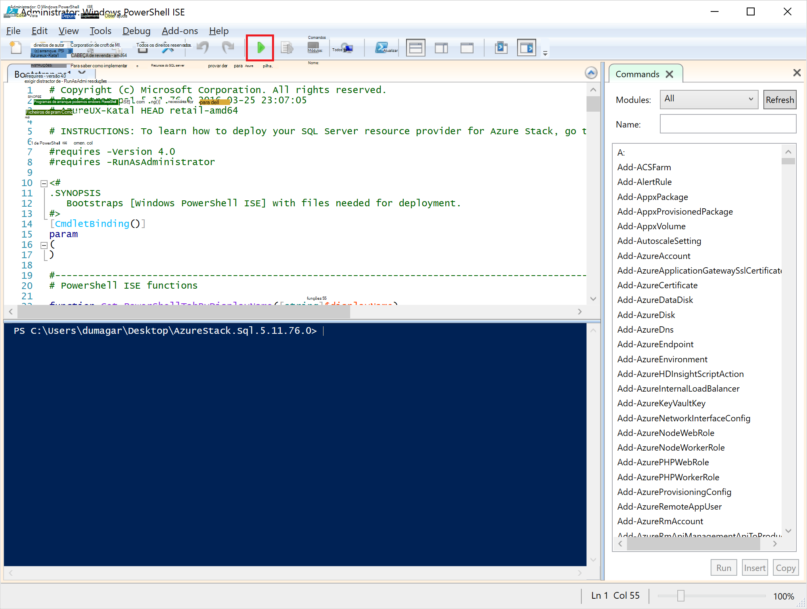

    Irá carregar dois separadores principais, cada que contém todos os scripts e ficheiros de que precisa para implementar o fornecedor do recurso.

## Preparar a pré-requisitos

Clique no separador **Pré-requisitos de preparar** para:

- Criar certificados necessários
- Carregar artefactos para uma conta de armazenamento na pilha de Azure
- Publicar itens de galeria

### Criar os certificados necessários
Este script **Novo SslCert.ps1** adiciona o \_. Um certificado AzureStack.local.pfx SSL à d:\\SQLRP\\pré-requisitos\\BlobStorage\\pasta contentor. O certificado protege a comunicação entre o fornecedor do recurso e a instância local do Gestor de recursos Azure.

1. No separador **Pré-requisitos de preparar** principal, clique no separador **Novo SslCert.ps1** e executá-la.

2. Na linha de comandos que aparece, escreva uma palavra-passe PFX protege a chave privada e, em seguida, **Tome nota desta palavra-passe**. Terá de-la mais tarde.

### Carregar todos os artefactos para uma conta de armazenamento na pilha de Azure

1. Clique no separador de **Carregamento-Microsoft.Sql-RP.ps1** e executá-la.

2. Na caixa de diálogo Windows PowerShell credencial pedido, escreva as credenciais de administrador do serviço de pilha de Azure.

3. Quando lhe for pedido para o Azure Active Directory inquilino ID, escreva o seu nome de domínio completamente qualificado de inquilino do Azure Active Directory: por exemplo, microsoftazurestack.onmicrosoft.com.

    Uma janela de pop-up pede credenciais.

    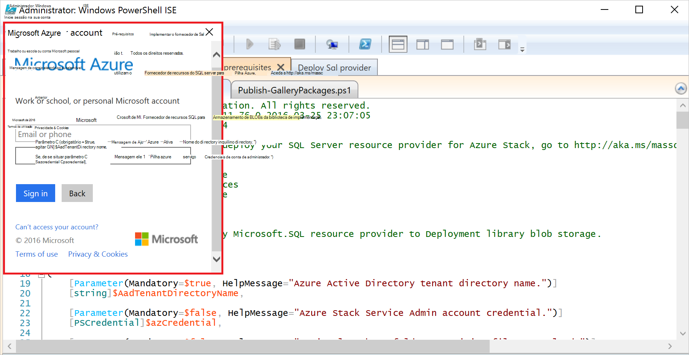

    > [AZURE.TIP] Se não aparecer pop-up, que quer ainda não tiver sido desativada IE as funcionalidades de segurança para ativar o JavaScript este computador e o utilizador ou ainda não o tiver aceite cookies IE. Consulte o artigo [configurar o passos antes de implementar](#set-up-steps-before-you-deploy).

4. Escreva as suas credenciais de administrador de serviços de pilha Azure e, em seguida, clique em **Iniciar sessão**.

### Publicar itens da Galeria para criação de recursos posterior

Selecione o separador **Publicar GalleryPackages.ps1** e executá-la. Este script adiciona dois itens marketplace marketplace o portal Azure pilha conceito que pode utilizar para implementar recursos de base de dados como itens marketplace.

## Implementar o fornecedor de recursos do SQL Server VM

Agora que tenham preparados o conceito de pilha Azure com os certificados necessários e os itens de marketplace, pode implementar um fornecedor de recursos do SQL Server. Clique no separador de **fornecedor implementar SQL** para:

   - Forneça os valores num ficheiro de JSON que referencia o processo de implementação
   - Implementar o fornecedor de recursos
   - Atualizar o DNS local
   - Registe-se a placa de fornecedor de recurso do SQL Server

### Forneça os valores no ficheiro JSON

Clique em **Microsoft.Sqlprovider.Parameters.JSON**. Este ficheiro tem parâmetros de que necessita do modelo de Gestor de recursos do Azure para implementar corretamente Azure pilha.

1. Preencha os parâmetros no ficheiro JSON **vazia** :

    - Certifique-se de que fornecer a **adminusername** e **adminpassword** para a VM de fornecedor de recursos de SQL:

        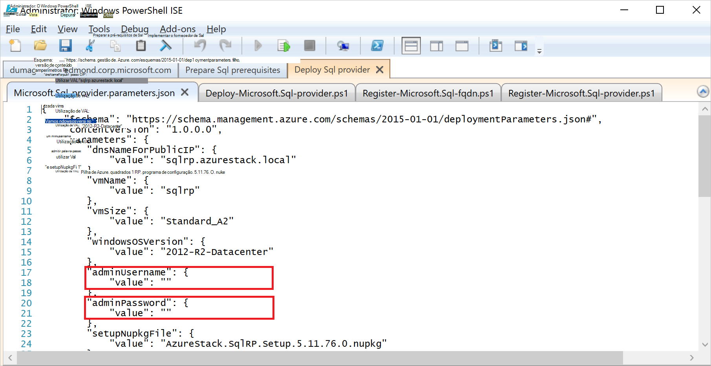

    - Certifique-se de que forneça a palavra-passe para o parâmetro **SetupPfxPassword** que efetuou uma nota no passo [preparar prequisites](#prepare-prerequisites) :

    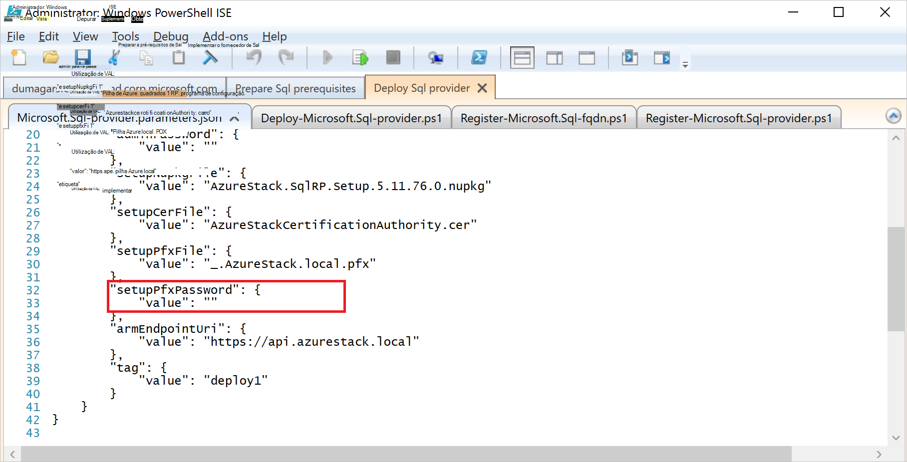

2. Clique em **Guardar** para guardar o ficheiro de parâmetro.

### Implementar o fornecedor de recursos

1. Clique no separador **Implementar-Microsoft.sql-provider.PS1** e executar o script.
2. Escreva o seu nome de inquilino no Azure Active Directory quando lhe for pedido.
3. Na janela de pop-up, submeta as suas credenciais de administrador do serviço de pilha de Azure.

A implementação completa poderá demorar entre 25 e 55 minutos no algumas POCs de pilha Azure altamente utilizada. Os passos mais longo estará a extensão de configuração de estado pretendida (DSC) e a execução do PowerShell, que é o passo final. Cada poderá demorar 10 25 minutos.

### Atualizar o DNS local

1. Clique no separador **Register-Microsoft.SQL-fqdn.ps1** e executar o script.
2. Quando lhe for pedido para o Azure Active Directory inquilino ID, introduzir o seu nome de domínio completamente qualificado de inquilino do Azure Active Directory: por exemplo, **microsoftazurestack.onmicrosoft.com**.

### Registar o fornecedor de recursos RP de SQL##

1. Clique no separador **Register-Microsoft.SQL-provider.ps1** e executar o script.

2. Quando lhe for pedido para introduzir as credenciais, utilize os seguintes valores para o nome de utilizador e palavra-passe:

   - **sqlRpUsername**
   - **sqlRpPassw0rd**

   > [AZURE.IMPORTANT] Estes são os valores *literais* que precisa para escrever quando lhe for pedido para introduzir as credenciais. Estes não são marcadores de posição. * *Fazer *não* tipo * * username\password que guardou no ficheiro de parâmetro antes de implementar a VM.

## Verificar a implementação utilizando o Portal de pilha do Azure

1. Terminar a sessão de ClientVM e volte a iniciar sessão como **AzureStack\AzureStackUser**.

2. No ambiente de trabalho, clique em **Azure pilha conceito Portal** e inicie sessão no portal como administrador do serviço.

3. Certifique-se de que a implementação bem sucedido. Clique em **Procurar** &gt; **Grupos de recursos** &gt; clique no grupo de recursos que utilizou (a predefinição é **SQLRP**) e, em seguida, certifique-se de que a parte essentials da pá (metade superior) lê **implementação com êxito**.

      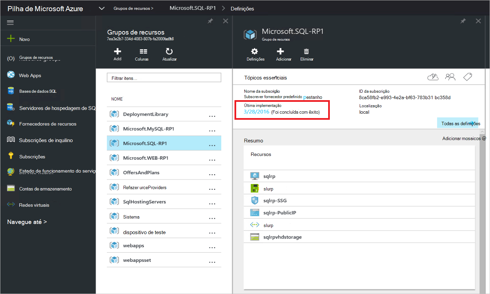

4. Certifique-se de que o registo bem sucedido. Clique em **Procurar** &gt; **fornecedores de recurso**e, em seguida, procure **SQL Local**:

      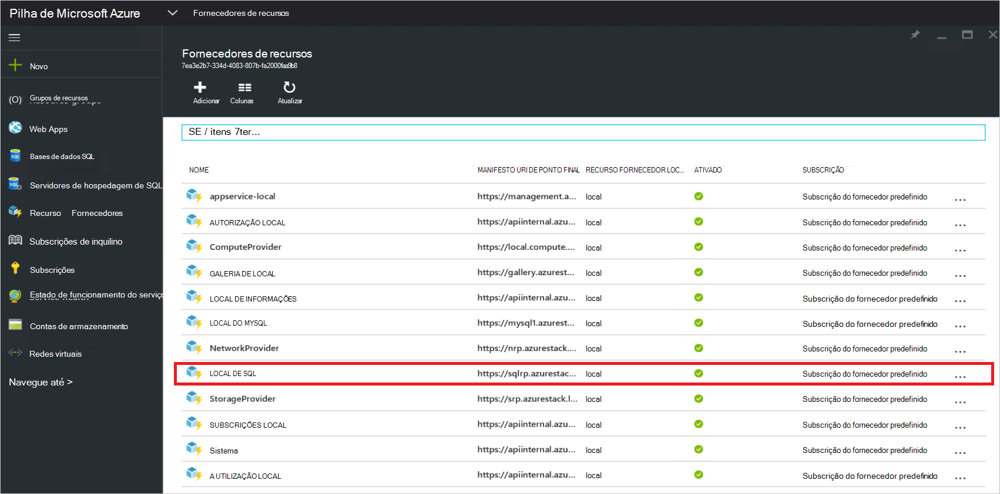

## Fornecem a capacidade para o seu fornecedor de recursos de SQL ao ligá-lo ao alojamento SQL server

1. Inicie sessão no portal do Azure pilha conceito como um administrador de serviços

2. Clique em **recurso fornecedores** &gt; **SQL Local** &gt; **aceda a gestão de recursos do fornecedor** &gt; **servidores** &gt; **Adicionar**.

    O **Servidores de alojamento de SQL** pá é onde pode ligar o fornecedor de recursos do SQL Server para reais instâncias do SQL Server que servir back-end do fornecedor de recursos.

    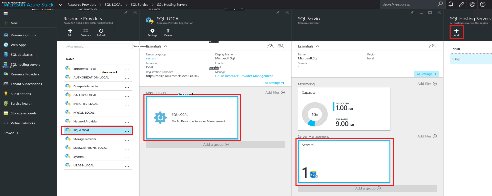

3. Preencha o formulário com os detalhes de ligação do seu instância do SQL Server. Por predefinição, o SQL Server pré-configurado denominado "SQLRP" com o nome de utilizador do administrador "sa" e a palavra-passe realçado no parâmetro "adminpassword" nos parâmetros que JSON está em execução na VM.

## Criar a sua primeira base de dados do SQL para testar a sua implementação

1. Inicie sessão no portal do Azure pilha conceito como administrador do serviço.

2. Clique em **Procurar** &gt; **bases de dados SQL** &gt; **Adicionar**
  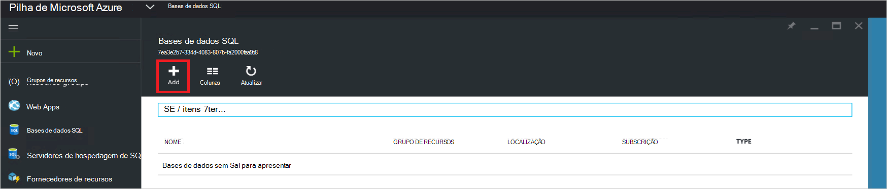

3. Preencha o formulário com detalhes de base de dados, incluindo um **Nome de servidor**, **Início de sessão do servidor de administração**e **palavra-passe** de um novo *servidor virtual* pá o **Novo servidor** .

    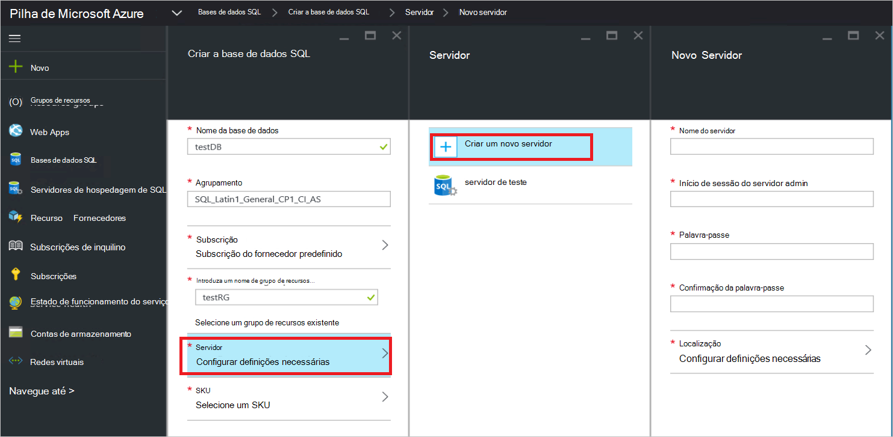

    O servidor virtual é uma construção artificial. Esta não mapear para o SQL Server propriamente dito mas em vez disso manifestos através do nome de utilizador no interior da cadeia de ligação, o fornecedor do recurso gera no final deste processo. **Nota a palavra-passe entrada em separado para o servidor virtual**. O portal nunca irá apresentar a palavra-passe.

4. Lhe for pedido para escolher uma camada comparar para a base de dados.

    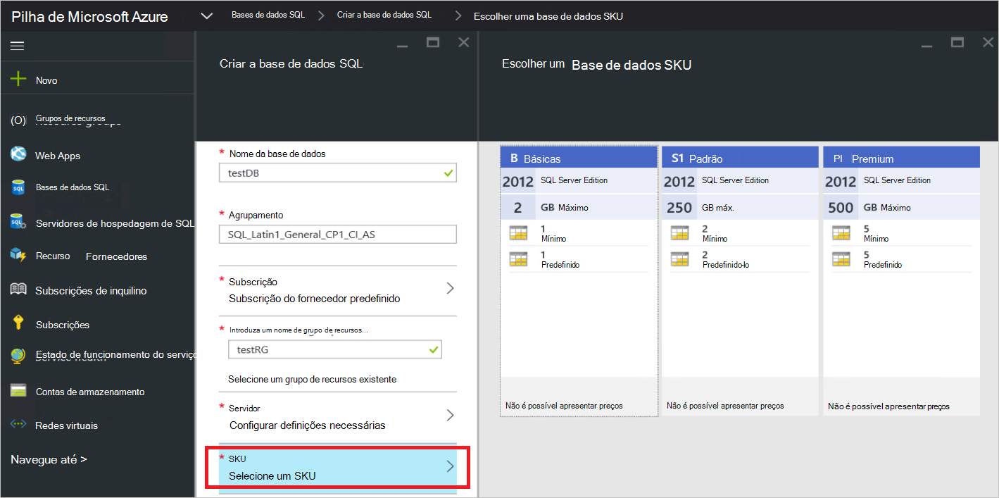

    Camadas não estão implementadas nesta versão, mas o seu consumo é registado pelo Gestor de recursos do Azure como uma forma de exibir os diferenciação que pode criar no imposição de quota etc.

5. Submeter o formulário e aguarde que a implementação para concluir.

6. Na pá resultante, repare o campo "Cadeia de ligação". Pode utilizar essa cadeia em qualquer aplicação do que requer o acesso do SQL Server (por exemplo, uma aplicação web) na sua pilha Azure.

    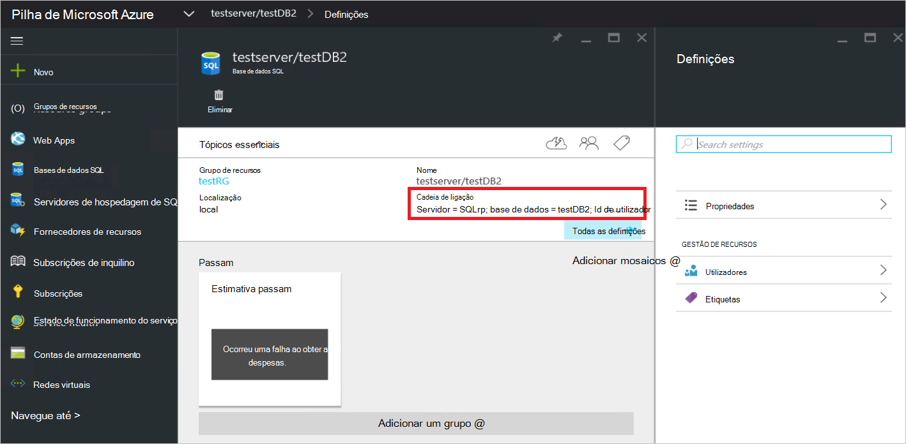

## Próximos passos

Experimente outros [PaaS serviços](azure-stack-tools-paas-services.md) como o [fornecedor de recursos do servidor do MySQL precisar](azure-stack-mysql-rp-deploy-short.md) e o [fornecedor de recursos do Web Apps](azure-stack-webapps-deploy.md).
