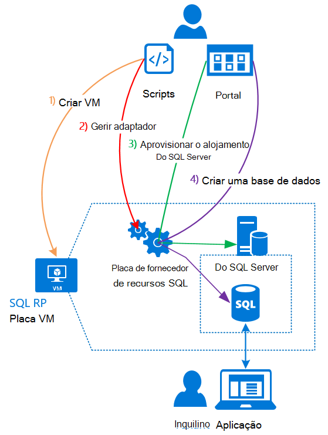

<properties
    pageTitle="Utilizar bases de dados SQL Azure pilha | Microsoft Azure"
    description="Saiba como implementar o bases de dados SQL como um serviço na pilha de Azure e os passos rápidos para implementar o adaptador de fornecedor de recursos do SQL Server."
    services="azure-stack"
    documentationCenter=""
    authors="Dumagar"
    manager="byronr"
    editor=""/>

<tags
    ms.service="multiple"
    ms.workload="na"
    ms.tgt_pltfrm="na"
    ms.devlang="na"
    ms.topic="article"
    ms.date="09/26/2016"
    ms.author="dumagar"/>

# Utilizar bases de dados SQL Azure pilha

> [AZURE.NOTE] As seguintes informações só se aplica a implementações do Azure pilha TP1.

Utilize a placa de fornecedor de recursos do SQL Server para expor bases de dados SQL como um serviço de pilha de Azure. Depois de instalar o fornecedor de recursos e os seus utilizadores podem criar bases de dados para aplicações nativo na nuvem, Web site que são baseados no SQL e das cargas de trabalho baseados no SQL sem ter de aprovisionar uma máquina de virtual (VM) que aloja do SQL Server cada vez.

Uma vez que o fornecedor do recurso não tiver todas as capacidades da base de dados do SQL Azure durante a prova de conceito, este artigo começa com uma descrição geral da arquitetura do fornecedor de recursos. Em seguida, obtenha uma descrição geral dos passos para configurar o fornecedor do recurso, com ligações para os passos no [Implementar a placa fornecedor de recursos base de dados SQL Azure pilha conceito](azure-stack-sql-rp-deploy-long.md)mais detalhadas.

## Arquitetura de placa de fornecedor de recursos do SQL Server
O fornecedor do recurso não oferece todos os a base de dados as capacidades da gestão de base de dados do SQL Azure. Por exemplo, agrupamentos de base de dados flexível e a capacidade de marcar o desempenho da base de dados para cima e para baixo no momento não estão disponíveis. No entanto, o fornecedor do recurso suporta o mesmo criar, ler, atualização e operações de eliminar (CRUD) que estão disponíveis na base de dados do SQL Azure.

O fornecedor do recurso é constituído por três componentes:

- **Placa de fornecedor a SQL recurso VM**, que engloba o processo de fornecedor de recurso e os servidores que alojam do SQL Server.
- **O fornecedor do recurso**, que processa pedidos de aprovisionamento e expõe recursos de base de dados.
- **Servidores que alojam do SQL Server**, que disponibiliza a capacidade para bases de dados.

O diagrama conceptual seguinte mostra estes componentes e os passos que atravessam quando implementar o fornecedor de recursos, configurar um servidor que aloja do SQL Server e, em seguida, crie uma base de dados.

## Passos rápidos para implementar o fornecedor de recursos
Utilize estes passos se ainda estiver familiarizado com o Azure pilha. Se pretender obter mais detalhes, siga as hiperligações em cada secção ou ir diretamente para [Implementar a placa fornecedor de recursos base de dados SQL Azure pilha conceito](azure-stack-sql-rp-deploy-long.md).

1.  Certifique-se de que concluir a todos os [Configurar passos antes de implementar](azure-stack-sql-rp-deploy-long.md#set-up-steps-before-you-deploy) o fornecedor de recurso:

  - 3,5 .NET framework já está configurado na imagem do Windows Server base. (Se tiver transferido os bits Azure pilha após 23 de Fevereiro de 2016, pode ignorar este passo.)
  - [Uma versão do Azure PowerShell, que é compatível com o Azure pilha está instalada](http://aka.ms/azStackPsh).
  - Nas definições de segurança do Internet Explorer no ClientVM, [o Internet Explorer segurança melhorada está desativada e os cookies estão activados](azure-stack-sql-rp-deploy-long.md#Turn-off-IE-enhanced-security-and-enable-cookies).

2. [Transferir o ficheiro de binários do SQL Server RP](http://aka.ms/massqlrprfrsh) e extraia-o para ClientVM no seu conceito de pilha Azure.

3. [Executar scripts e bootstrap.cmd](azure-stack-sql-rp-deploy-long.md#Bootstrap-the-resource-provider-deployment-PowerShell-and-Prepare-for-deployment).

    Um conjunto de scripts é agrupado por dois separadores principais abertas na integrada Scripting ambiente (ISe do PowerShell). Executar os scripts carregados sequência da esquerda para a direita em cada separador.

    1. Execute scripts no separador **preparar** da esquerda para a direita para:

        - Crie um certificado de caracteres universais para assegurar a comunicação entre o fornecedor de recursos e o Gestor de recursos do Azure.
        - Carregue os certificados e todos os outros artefactos para uma conta de armazenamento para Azure pilha.
        - Publica pacotes de Galeria de modo a que pode implementar SQL e recursos através da galeria.

        > [AZURE.IMPORTANT] Se qualquer um dos scripts bloqueia por nenhum motivo evidente após submeter o seu inquilino do Azure Active Directory, as definições de segurança poderão estar a bloquear uma DLL necessário para a implementação para executar. Para resolver este problema, procure Microsoft.AzureStack.Deployment.Telemetry.Dll na sua pasta do fornecedor de recursos, botão direito do rato-lo, clique em **Propriedades**e, em seguida, selecione **Desbloquear** no separador **Geral** .

    1. Execute scripts no separador **Implementar** da esquerda para a direita para:

        - [Implementar uma VM](azure-stack-sql-rp-deploy-long.md#Deploy-the-SQL-Server-Resource-Provider-VM) que aloja o seu fornecedor de recursos e o SQL Server. Este script faz referência a um ficheiro de parâmetro JSON, que necessita de atualizar com alguns valores antes de executar o script.
        - [Registe-se um registo DNS local](azure-stack-sql-rp-deploy-long.md#Update-the-local-DNS) que mapas ao seu fornecedor de recurso VM.
        - [Registe-se o seu fornecedor de recurso](azure-stack-sql-rp-deploy-long.md#Register-the-SQL-RP-Resource-Provider) com o Gestor de recursos de Azure local.

        > [AZURE.IMPORTANT] Todos os scripts partem do pressuposto de que a imagem do sistema operativo base cumpra os pré-requisitos (.NET 3.5 instalado, JavaScript e cookies activados na ClientVM e uma versão compatível do Azure PowerShell instalado). Se obtiver erros ao executar os scripts, verifique que preenchidas os pré-requisitos.

6. [Ligar o fornecedor de recursos num servidor que está a alojar o SQL Server](#Provide-capacity-to-your-SQL-Resource-Provider-by-connecting-it-to-a-hosting-SQL-server) no portal do Azure pilha. Clique em **Procurar** &gt; **fornecedores de recurso** &gt; **SQLRP** &gt; **aceda a gestão de recursos do fornecedor** &gt; **servidores** &gt; **Adicionar**.

    Utilize "sa" para o nome de utilizador e a palavra-passe que utilizou quando implementou o fornecedor de recurso VM.

7. Para [testar o seu fornecedor de recursos do SQL Server nova](/azure-stack-sql-rp-deploy-long.md#create-your-first-sql-database-to-test-your-deployment), implemente uma base de dados do SQL no portal do Azure pilha. Clique em **Criar** &gt; **personalizada** &gt; **base de dados do SQL Server**.

Isto deve obter o seu fornecedor de recursos do SQL Server para cima e a ser executada em cerca de 45 minutos (dependendo do hardware).
