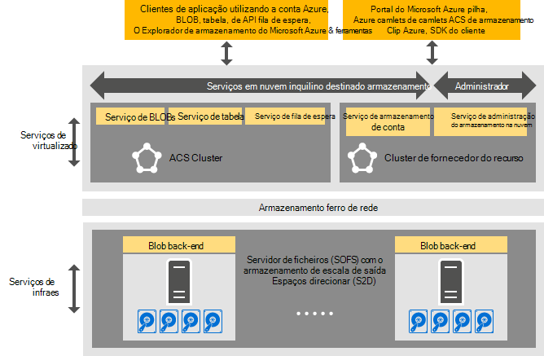

<properties
    pageTitle="Introdução ao Azure consistentes armazenamento | Microsoft Azure"
    description="Saiba mais sobre o armazenamento Azure consistentes"
    services="azure-stack"
    documentationCenter=""
    authors="AniAnirudh"
    manager="darmour"
    editor=""/>

<tags
    ms.service="azure-stack"
    ms.workload="na"
    ms.tgt_pltfrm="na"
    ms.devlang="na"
    ms.topic="get-started-article"
    ms.date="09/26/2016"
    ms.author="anirudha"/>

# Introdução ao Azure consistentes armazenamento
Armazenamento Azure consistentes é o conjunto de serviços em nuvem armazenamento no Microsoft Azure pilha. Fornece Azure consistentes armazenamento blob, tabela, fila de espera e funcionalidade de gestão de conta com semântica Azure consistentes. Também fornece funcionalidade para o ajudar a um administrador de nuvem gerir armazenamento serviços. Este artigo apresenta armazenamento Azure consistentes e explica como o serviços em nuvem armazenamento Azure empilhados complementam corretamente as [capacidades de armazenamento definidos pelo software no Windows Server 2016](https://blogs.technet.microsoft.com/windowsserver/2016/04/14/ten-reasons-youll-love-windows-server-2016-5-software-defined-storage/)de rich.

Armazenamento Azure consistentes fornece as seguintes vastas categorias de funcionalidade:

- **BLOBs**: página blobs, bloquear blobs e acrescentar blobs com   [BLOBs do Azure consistentes](https://msdn.microsoft.com/library/azure/dd179355.aspx#Anchor_1) 
   comportamento

- **Tabelas**: entidades, partições e outras propriedades da tabela com   [a tabela Azure consistentes](https://msdn.microsoft.com/library/azure/dd179355.aspx#Anchor_3) 
   comportamento

- **Filas**: fiáveis persistentes mensagens e e filas com   [fila Azure consistentes](https://msdn.microsoft.com/library/azure/dd179355.aspx#Anchor_2) 
   comportamento

- **Contas**: gestão de recursos de conta de armazenamento com a   [conta Azure consistentes](https://azure.microsoft.com/documentation/articles/storage-create-storage-account/) 
   comportamento para contas de armazenamento geral aprovisionado através de de [modelo de implementação do Gestor de recursos do Azure](https://azure.microsoft.com/documentation/articles/resource-manager-deployment-model/)

- **Administração**: gestão dos serviços de armazenamento interno de armazenamento de inquilino destinado e Azure consistente (abordado no outros artigos)

## Arquitetura de armazenamento Azure consistentes

Figura 1. Armazenamento Azure consistentes: vista de solução

## Armazenamento Azure consistentes foi virtualizado serviços e clusters

No Azure consistentes arquitetura de armazenamento, todos os inquilino ou armazenamento acessível pelo administrador de serviços são foi virtualizados. Isto é, são executadas no serviço gerido fornecedor, altamente disponível que VMS com base em [Hyper-V](https://technet.microsoft.com/library/dn765471.aspx) funcionalidade no [Windows Server 2016](http://www.microsoft.com/server-cloud/products/windows-server-2016/).
Apesar das VMs estão disponíveis altamente com base em tecnologia [Clusters de activação pós-falha do Windows Server](https://technet.microsoft.com/library/dn765474.aspx) , os serviços de armazenamento foi virtualizado Azure consistentes próprios são agrupadas convidado altamente, disponíveis, serviços baseados na [Azure Service ferro a tecnologia de apoio](http://azure.microsoft.com/campaigns/service-fabric/).

Armazenamento Azure consistentes utiliza duas clusters de serviço ferro uma implementação do Azure pilha.
O serviço do fornecedor de recursos de armazenamento é implementado num cluster ferro de serviço ("RP cluster") que também é partilhado por outros serviços do fornecedor de recursos base destinadas. Serviços de caminho de dados – incluindo Blob, tabela e fila de foi virtualizado o resto do armazenamento de serviços – estão alojados num cluster de serviço ferro segundo ("Azure consistentes cluster armazenamento").

## Serviço de BLOBs e armazenamento definidos pelo software

O Blob serviço novamente terminar, outro lado, é executado diretamente os nós de cluster de [Servidor de ficheiros de registo de saída de escala](https://technet.microsoft.com/library/hh831349.aspx) . Numa arquitetura de solução Azure pilha, servidor de ficheiros de registo de saída de escala se baseia o [Armazenamento espaços direta](https://technet.microsoft.com/library/mt126109.aspx)-cluster baseado, nada partilhado activação pós-falha. Figura 1 ilustra os principais serviços de componentes de armazenamento Azure consistentes e o seu modelo de implementação distribuído. Como ver no diagrama, armazenamento Azure consistentes dovetails com funcionalidades de armazenamento definidos pelo software existentes no Windows Server 2016. Especiais de hardware são necessário para o armazenamento do Azure consistente para além destes requisitos de plataforma Windows Server.

## Armazenamento Farm

O Farm do armazenamento está a coleção de infraestrutura de armazenamento, recursos e serviços de back-end que fornecem em conjunto inquilino destinado serviços e de administrador destinado Azure consistentes armazenamento numa implementação do Azure pilha. Especificamente, o Farm de armazenamento inclui o seguinte:

- Hardware de armazenamento (por exemplo, nós de servidor de ficheiros de registo de saída de escala, discos)

- Recursos de ferro armazenamento (por exemplo, partilhas de SMB)

- Serviços relacionados com o armazenamento de ferro de serviço (por exemplo, Blob ponto final serviço desativar o Azure consistentes cluster de armazenamento)

- Serviços relacionados com armazenamento que são executados em nós de servidor de ficheiros de registo de saída de escala (por exemplo, o serviço de BLOBs)

## Cenários de utilização do armazenamento IaaS e PaaS

Blobs de página de armazenamento Azure consistentes, tal como no Azure, fornecem os discos virtuais no infraestrutura todos os como uma utilização do serviço (IaaS) cenários:

- Criar uma VM utilizando o disco SO personalizada no blob página

- Criar uma VM utilizando a imagem personalizada do SO no blob página

- Criar uma VM utilizando uma imagem do Azure Marketplace num novo blob de página

- Criar uma VM utilizando um disco em branco num novo blob de página

Da mesma forma, para a plataforma como cenários de serviço (PaaS), Azure consistentes blobs de bloco de armazenamento, acrescentar blobs, filas, e as tabelas funcionam tal como no Azure.

## Funções de utilizador

Armazenamento Azure consistentes é útil para duas funções de utilizador:

- Proprietários de aplicação, incluindo os programadores e TI empresariais. Já não tiver a manter ou implementar duas versões de uma aplicação e scripts que efetuar a mesma tarefa através de uma nuvem pública e uma nuvem alojado/privado num centro de dados. Armazenamento Azure consistentes fornece serviços de armazenamento através do REST API, SDK, cmdlet e portal Azure pilha.

- Fornecedores de serviços, incluindo TI, empresariais que implementar e gerir serviços em nuvem armazenamento multi-inquilino, com base no Microsoft Azure pilha.

## Próximos passos

- [Armazenamento azure consistentes: as diferenças e considerações] (azure-pilha-acs-diferenças-tp2.md)
