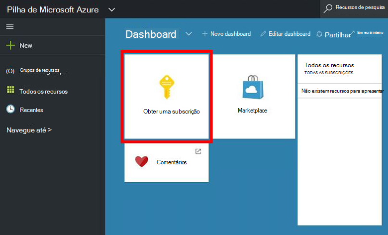
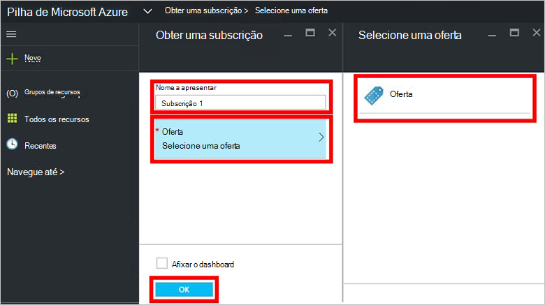
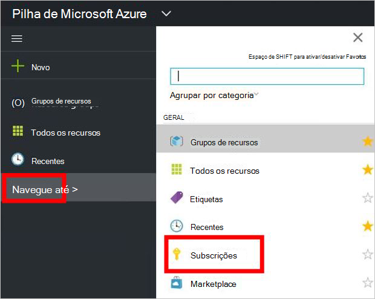

<properties
    pageTitle="Subscrever uma oferta e, em seguida, aprovisionar uma VM Azure empilhados (inquilino) | Microsoft Azure"
    description="Como um inquilino, saiba como subscrever uma oferta e, em seguida, aprovisionar uma VM na pilha de Azure."
    services="azure-stack"
    documentationCenter=""
    authors="ErikjeMS"
    manager="byronr"
    editor=""/>

<tags
    ms.service="azure-stack"
    ms.workload="na"
    ms.tgt_pltfrm="na"
    ms.devlang="na"
    ms.topic="get-started-article"
    ms.date="09/26/2016"
    ms.author="erikje"/>

# Subscrever uma oferta

Agora que tiver [criado uma oferta](azure-stack-create-offer.md), teste que o seu inquilinos podem criar uma subscrição.

1.  No computador Azure pilha conceito, inicie sessão no `https://portal.azurestack.local` como [um inquilino](azure-stack-connect-azure-stack.md#log-in-as-a-tenant) e clique em **obter uma subscrição**.

    

2.  No campo **Nome a apresentar** , escreva um nome para a sua subscrição, clique em **oferecer**, clique das ofertas no pá a **Escolher uma oferta** e, em seguida, clique em **Criar**.

    

4.  Para ver a subscrição que criou, clique em **Procurar**, clique em **subscrições**, em seguida, clique em sua nova subscrição.  

    

Depois de subscrever uma oferta, atualize o portal para ver os serviços que fazem parte da nova subscrição.

## Próximos passos

[Aprovisionar uma máquina virtual](azure-stack-provision-vm.md)
