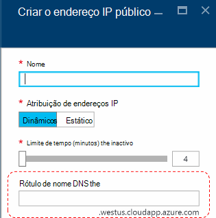
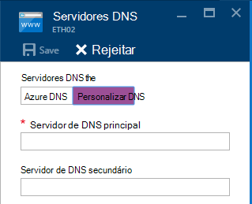
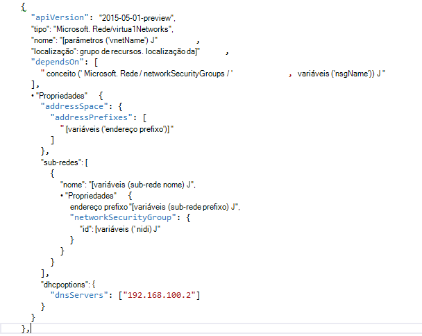

<properties
    pageTitle="Noções sobre o DNS na pilha Azure TP2 | Microsoft Azure"
    description="Noções sobre novas funcionalidades de DNS e funcionalidades no Azure pilha TP2"
    services="azure-stack"
    documentationCenter=""
    authors="ScottNapolitan"
    manager="darmour"
    editor=""/>

<tags
    ms.service="azure-stack"
    ms.workload="na"
    ms.tgt_pltfrm="na"
    ms.devlang="na"
    ms.topic="get-started-article"
    ms.date="09/26/2016"
    ms.author="scottnap"/>

# Introdução ao iDNS para pilha de Azure
================================

iDNS é uma nova funcionalidade no tecnologia de 2 de pré-visualização para pilha de Azure permite-lhe resolver os nomes de DNS externos (como http://www.bing.com).
Também permite registar os nomes de rede virtuais interna. Ao fazê-lo, pode resolver na mesma rede virtual VMs pelo nome em vez de em endereço IP, sem ter de fornecer as entradas do servidor DNS personalizadas.

For algo sem que tenha sido sempre não existem no Azure, mas agora está disponível no Windows Server 2016 e Azure pilha, demasiado.

O que faz iDNS?
------------------

Com iDNS na pilha de Azure, obtenha as seguintes capacidades, sem ter de especificar entradas do servidor DNS personalizadas.

-   Partilhada serviços de resolução do nome DNS para das cargas de trabalho do inquilino.

-   Serviço DNS autoritativos de resolução do nome e registo DNS no interior da rede virtual do inquilino.

-   Serviço de DNS recursiva para resolução de nomes de inquilino VMs da Internet. Inquilinos já não precisa de especificar entradas de DNS personalizadas para resolver os nomes de Internet (por exemplo, www.bing.com).

Ainda pode trazer o seu próprio DNS e utilizar os servidores DNS personalizados, se pretender. Mas, se apenas pretende conseguir resolver DNS da Internet os nomes dos e ser possível ligar a outras máquinas virtuais na mesma rede virtual, não precisa de especificar nada e apenas funcionam.

O que faz iDNS não?
---------------------

O que iDNS não permite que o utilizador efetue é criar um registo DNS para um nome que pode ser resolvido de fora da rede virtual.

No Azure, tem a opção de especificar uma etiqueta de nome DNS que pode ser associada um endereço IP público. Pode escolher a etiqueta (prefixo), mas Azure escolhe o sufixo, que é baseado na região onde a criar o endereço IP público.

Na imagem acima, Azure irá criar um "Um" registo no DNS para o rótulo de nome DNS especificado na zona **westus.cloudapp.azure.com**. O prefixo e sufixo juntos compõem uma completamente qualificado nome de domínio (FQDN) que possa ser resolvido a partir de qualquer lugar na Internet pública.

Na TP2, Azure pilha suporta apenas iDNS para o registo de nome interno, para que não pode fazer o seguinte.

-   Crie um registo DNS numa zona DNS alojado (por exemplo, azurestack.local) existente.

-   Crie uma zona DNS (como Contoso.com).

-   Crie um registo em seu próprio DNS zone personalizado.

-   Suporta a compra de nomes de domínio.

Alterações no DNS a partir do Azure pilha TP1
-----------------------------------

Na versão de pré-visualização de tecnologia 1 (TP1) da pilha de Azure tinha que fornecer os servidores DNS personalizados se pretende que o possam resolver anfitriões por nome em vez de endereço IP. Isto significa que se estivesse a criar uma rede virtual ou uma VM, tinha que fornecer pelo menos uma entrada do servidor DNS. Para o ambiente de TP1 conceito destinar introduzir IP do servidor de DNS de ferro conceito, nomeadamente 192.168.200.2.

Se tiver criado uma VM através do portal do, tinha selecione **Custom DNS** na rede virtual ou definições da placa ethernet.

No TP2, pode selecionar Azure DNS e não precisa de especificar entradas do servidor DNS personalizadas.

Se tiver criado uma VM através de um modelo com a sua própria imagem, tinha que adicionar a propriedade **DHCPOptions** e resolução para trabalhar de nomes de servidor de DNS para obter o DNS. A imagem seguinte mostra o que esta velhos.

No TP2, já não precisa de efetuar estas alterações aos modelos VM para permitir que o seu VMs resolver os nomes de Internet. Deverá simplesmente funcionar.