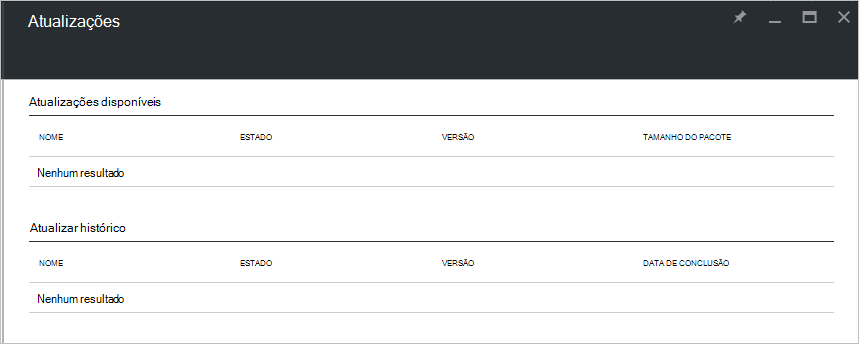

<properties
    pageTitle="As atualizações no Azure pilha | Microsoft Azure"
    description="Saiba mais sobre as atualizações no Azure pilha"
    services="azure-stack"
    documentationCenter=""
    authors="HeathL17"
    manager="byronr"
    editor=""/>

<tags
    ms.service="azure-stack"
    ms.workload="na"
    ms.tgt_pltfrm="na"
    ms.devlang="na"
    ms.topic="article"
    ms.date="09/26/2016"
    ms.author="Helaw"/>

# Gestão de atualizações Azure empilhados
2 de pré-visualização técnica apresenta uma pré-visualização da experiência de gestão de pilha de Azure atualizações.  Neste tópico, irá navegue para o nó de atualizações.  

## Pá atualizações
1.  Para aceder a pá atualizações, clique em **Procurar** e, em seguida, clique em **atualizações**.

2.  Clique na localização **local** .

3.  Irá ver um ecrã listar atualizações disponíveis e actualizar o histórico.  No 2 de pré-visualização técnica, actualizações não estarão disponíveis para a instalação.  

    

## Próximos passos
- [Compreender a pilha Azure conceito arquitetura](azure-stack-architecture.md)      
- [Compreender a pré-requisitos de implementação](azure-stack-deploy.md)
- [Implementar pilha Azure](azure-stack-run-powershell-script.md)
 
    
  

  

