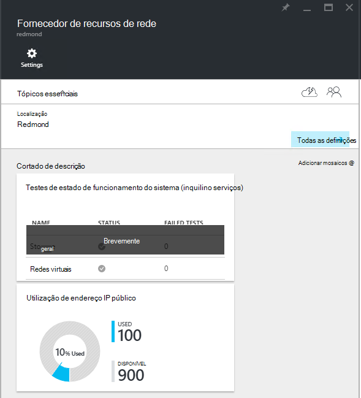

<properties
    pageTitle="Ver consumo do endereço IP público no TP2 | Microsoft Azure"
    description="Os administradores podem visualizar o consumo de endereços IP públicos numa região"
    services="azure-stack"
    documentationCenter=""
    authors="ScottNapolitan"
    manager="darmour"
    editor=""/>

<tags
    ms.service="azure-stack"
    ms.workload="na"
    ms.tgt_pltfrm="na"
    ms.devlang="na"
    ms.topic="get-started-article"
    ms.date="09/26/2016"
    ms.author="scottnap"/>

# Ver consumo do endereço IP público no Azure pilha TP2

Como administrador do serviço, pode ver o número de endereços IP públicos que foi alocada a inquilinos, o número de endereços IP públicos que ainda estão disponíveis para a atribuição e a percentagem de endereços IP públicos que foi alocada nessa localização.

O mosaico de **Utilização do endereço IP público** mostra o número total de endereços IP públicos que ter sido consumida através de todos os conjuntos de endereços IP públicos no ferro, se tiver sido utilizados para inquilinos instâncias, os serviços de infraestrutura de ferro ou recursos de endereço IP públicos que foram explicitamente criados por inquilinos IaaS VM.

O objetivo neste mosaico é permitem aos administradores de pilha de Azure ter uma noção do número total de endereços IP públicos que tenham sido consumida na seguinte localização. Isto ajuda a determinar se estes estão a ficar com pouco este recurso de administradores.

Pá **Definições** , o item de menu **Endereços IP públicos** em **recursos de inquilino** lista apenas esses endereços IP públicos que foram *explicitamente criado por inquilinos*. Como tal, o número de **utilizados** endereços IP públicos sobre a **Utilização do endereço IP público** dispor em mosaico sempre é diferente do (maior que) o número no mosaico **Endereços IP públicos** em **recursos de inquilino**.

## Ver as informações de utilização de endereço IP públicas

Para ver o número total de endereços IP públicos que ter sido consumida na região:

1.  No portal do Azure pilha, clique em **Procurar**e, em seguida, selecione **Fornecedores de recursos**.

2.  Na lista de **Fornecedores de recurso**, selecione **Administrador de fornecedor de recursos de rede**.

3.  Em alternativa, pode clicar em **Procurar | Localizações** e selecione a localização que pretende ver a partir da lista. Em seguida, no mosaico **Fornecedores de recurso** , selecione **Administrador de fornecedor de recursos de rede**.

4.  O pá de destino do **Fornecedor de recursos de rede** apresenta o mosaico de **Utilização do endereço IP público** na secção **Overview** .

Tenha em atenção que o **utilizados** número representa o número de IP público endereços de IP público todos os endereços conjuntos de dados nessa localização que estão atribuídos. O **disponível** número representa o número de IP público endereços de IP público todos os conjuntos de dados que não foram atribuídos e ainda estão disponíveis do endereço. O **% utilizados** número representa o número de endereços atribuídos ou utilizados como uma percentagem do número total de endereço IP público endereços no endereço IP público todos os conjuntos de dados nessa localização do endereço.

## Ver os endereços IP públicos que foram criados subscrições do inquilino

Para ver uma lista de endereços IP públicos que foram explicitamente criadas subscrições do inquilino numa região específico, ir para o pá **Definições** da **Rede recurso fornecedor de administrador**e, em seguida, selecione **Endereços IP público**.

Poderá reparar que alguns endereços IP públicos que tenham sido atribuídos dinamicamente aparecem na lista, mas não possui um endereço eles associados ainda. Isto acontece porque o recurso de endereço tem ainda foi criado no fornecedor de recursos de rede, mas não no controlador de rede.

O controlador de rede não atribuir um endereço para este recurso até que está vinculado realmente a uma interface, uma placa de interface de rede (NIC), um balanceador de carga ou um gateway de rede virtual. Quando o endereço IP público estiver dependente de uma interface, o controlador de rede atribui um endereço IP para o mesmo e, esta aparece no campo **endereço** .

## Ver a pública informações resumo tabela de endereços IP

Existem um número de diferentes casos em que os endereços IP públicos são atribuídos para determinar se o endereço aparece uma lista ou outro.

| **Caso de atribuição de endereço IP público** | **É apresentado na resumo de utilização** | **É apresentado na lista de endereços IP pública inquilino** |
| ------------------------------------- | ----------------------------| ---------------------------------------------- |
| Endereço IP público dinâmico ainda não atribuído a um balanceador NIC ou para carregar (temporária) | N | Sim |
| Dinâmico endereço IP público atribuído a uma imagem ou para carregar balanceador. | Sim | Sim |
| Público endereço IP estático atribuído a um balanceador de inquilino NIC ou para carregar. | Sim | Sim |
| Público endereço IP estático atribuído a um ponto final de serviço do ferro infraestrutura. | Sim | N |
| Endereço IP público implicitamente criada para instâncias IaaS VM e utilizado para NAT saída da rede virtual. Estes são criados nos bastidores sempre que um inquilino cria uma instância VM para que VMs possam enviar informações de à Internet. | Sim | N |
