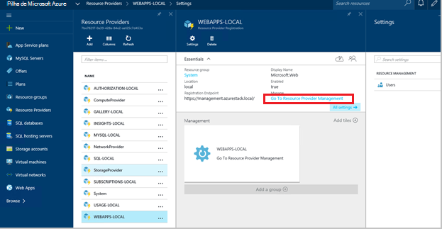
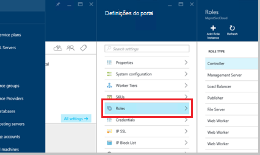
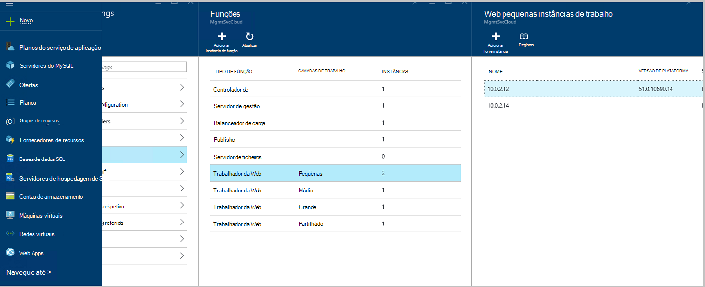
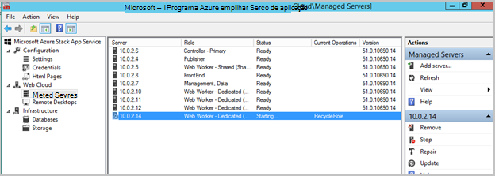
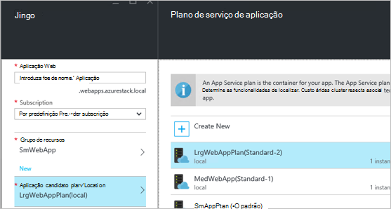
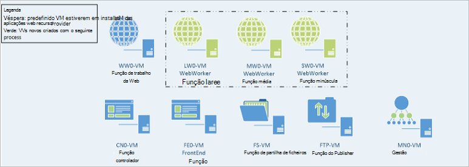

<properties
    pageTitle="Trabalhador funções da Web Web Apps adicionar mais | Microsoft Azure"
    description="Orientação detalhada para dimensionamento Azure pilha Web App"
    services="azure-stack"
    documentationCenter=""
    authors="kathm"
    manager="slinehan"
    editor=""/>

<tags
    ms.service="azure-stack"
    ms.workload="app-service"
    ms.tgt_pltfrm="na"
    ms.devlang="na"
    ms.topic="article"
    ms.date="09/26/2016"
    ms.author="kathm"/>

#   <a name="web-apps-adding-more-web-worker-roles"></a>Aplicações Web: Adicionar mais funções de trabalho da web

> [AZURE.NOTE] As seguintes informações só se aplica a implementações do Azure pilha TP1.

Este artigo fornece instruções sobre como dimensionar perfis de trabalho de web Web Apps. Contém passos para criar funções de administrador do web adicionais trabalhador a web apps ofertas de qualquer tamanho de suporte.

Pilha Azure suporta implementações da aplicação web gratuito e partilhadas. Para adicionar outros tipos, terá de adicionar mais funções de trabalho da web.

Se não tiver a certeza qual foi implementado com a instalação de aplicações Web predefinida, pode rever informações adicionais [aqui](azure-stack-webapps-overview.md).

Os passos seguintes são necessários para escala web trabalhador funções:

1.  [Criar uma nova máquina virtual](#step-1-create-a-new-vm-to-support-the-new-instance-size)

2.  [Configure a máquina virtual](#step-2-configure-the-virtual-machine)

3.  [Configurar a função de trabalho de web no portal do Azure pilha](#step-3-configure-the-web-worker-role-in-the-azure-stack-portal)

4.  [Configurar o plano de serviço de aplicação](#step-4-configure-app-service-plans)

##<a name="step-1-create-a-new-vm-to-support-the-new-instance-size"></a>Passo 1: Criar uma nova VM para suportar o novo tamanho de instância

Crie uma máquina virtual conforme descrito [neste artigo](azure-stack-provision-vm.md), garantindo que são efetuadas as seleções seguintes:

 - Nome de utilizador e palavra-passe: fornecem o mesmo nome de utilizador e palavra-passe fornecida quando instalou o Web Apps.

 - Subscrição: Utilize a subscrição de fornecedor predefinido.

 - Grupo de recursos: selecione **AppService Local**.

> [AZURE.NOTE]Armazene as máquinas virtuais para funções de trabalho no mesmo grupo de recursos do Web Apps aplicação for implementada. (Isto é recomendado para este lançamento.)

##<a name="step-2-configure-the-virtual-machine"></a>Passo 2: Configurar a Máquina Virtual

Assim que tiver concluído a implementação, configuração que se segue é necessário para suportar a função de trabalho da web:

1.  Abrir o Gestor de servidor no computador anfitrião e clique em **Ferramentas** &gt; **HyperV Gestor**.

2.  Ligar ao utilizar o protocolo de ambiente de trabalho remoto (RDP) para a nova máquina virtual que criou no passo 1. O nome do servidor encontra-se no painel de resumo quando cada VM está selecionada.

3.  Abra o PowerShell clicando no botão **Iniciar** e escrevendo PowerShell. Botão direito do rato **PowerShell.exe**e selecione **Executar como administrador** para abrir o PowerShell no modo de administrador.

4.  Copiar e colar cada dos seguintes comandos (uma de cada vez) para a janela do PowerShell e prima enter:

    ```netsh advfirewall firewall set rule group="File and Printer Sharing" new enable=Yes```
    ```netsh advfirewall firewall set rule group="Windows Management Instrumentation (WMI)" new enable=yes```
    ```reg add HKLM\\SOFTWARE\\Microsoft\\Windows\\CurrentVersion\\Policies\\system /v LocalAccountTokenFilterPolicy /t REG\_DWORD /d 1 /f```

5.  Reinicie o computador virtual.

> [AZURE.NOTE]Nota: Estes são os requisitos mínimos para Web Apps. São as predefinições da imagem Windows 2012 R2 incluído com o Azure pilha. As instruções foi fornecidas para referência futura e para aqueles que utilizam uma imagem diferente.

##<a name="step-3-configure-the-web-worker-role-in-the-azure-stack-portal"></a>Passo 3: Configurar a função de trabalho de web no portal do Azure pilha

1.  Abra o portal de como o administrador do serviço no **ClientVM**.

2.  Navegue para **fornecedores de recurso** &gt; **WEBAPPS LOCAL**.

    
 
3.  Clique em **Ir para a gestão de recursos do fornecedor**.

4.  Clique em **funções**.

    
 
5.  Clique em **Adicionar ocorrência de função**.

6.  Clique na **camada** que pretende implementar a nova instância para (pequeno, médio, grande ou partilhada).

    
 
7.  Configure o seguinte:
 - Nomedoservidor: Forneça o endereço IP do servidor que criou anteriormente (na secção 1).
 - Função tipo: Web trabalhador.
 - Camadas de trabalho: Correspondências camada tamanho seleccionado.

8. Clique em **OK.**

9. Inicie sessão no CN0 VM e abra a **Gestão da nuvem Web MMC**.

10. Navegue para a **nuvem Web** &gt; **servidores geridos**.

11. Clique no nome de servidor que acabou de implementada. Reveja a coluna de estado e aguarde para mover para o próximo passo até que o estado está "Pronta".

    

##<a name="step-4-configure-app-service-plans"></a>Passo 4: Configurar os planos do serviço de aplicação

> [AZURE.NOTE]Na versão atual do Web Apps, planos de serviço de aplicação devem ser armazenados em grupos de recursos em separado. Criar um grupo de recursos para cada tamanho do web app e coloque os planos de aplicação nos seus grupos de recurso apropriado.

1.  Inicie sessão no portal na ClientVM.

2.  Navegue para o **Novo** &gt; **Web e Mobile**.

3.  Selecione a aplicação web que pretende implementar.

4.  Forneça as informações para a aplicação web e, em seguida, selecione **AppService plano / localização**.

-   Clique em **Criar novo**.

-   Crie o seu novo plano, selecionar a camada comparar correspondente para o plano.

> [AZURE.NOTE]Pode criar vários planos neste pá. Antes de implementar, no entanto, certifique-se de que selecionou o plano adequado.

O exemplo seguinte mostra dos planos de vários disponíveis:    

##<a name="final-web-app-service-vm-configuration"></a>Configuração de VM de serviço do final do Web App

A imagem abaixo fornece uma vista do ambiente de assim que tiver dimensionada as funções de trabalho da web. Os itens verdes representam novas adições de função.
    
