<properties
     pageTitle="Como criar um pedido de suporte Azure | Microsoft Azure"
     description="Como criar um pedido de suporte Azure."
     services="Azure Supportability"
     documentationCenter=""
     authors="ganganarayanan"
     manager="scotthit"
     editor=""/>

<tags
     ms.service="azure-supportability"
     ms.workload="na"
     ms.tgt_pltfrm="na"
     ms.devlang="na"
     ms.topic="article"
     ms.date="10/25/2016"
     ms.author="gangan"/>

# Como criar um pedido de suporte do Azure

## Resumo
Clientes Azure podem criar e gerir pedidos de suporte no portal do Azure, [https://portal.azure.com](https://portal.azure.com).
>[AZURE.NOTE] O portal Azure para Alemanha está [https://portal.microsoftazure.de](https://portal.microsoftazure.de) e para o portal de administração pública Azure [https://portal.azure.us](https://portal.azure.us).

Com base nos comentários, podemos atualizou a experiência de pedido de suporte concentrar-se nas três objetivos principais:

- **Streamlined**: reduzir cliques e pás para tornar o processo de submeter um pedido de suporte simples.
- **Integrado**: ao que está a resolução de problemas de um problema com um recurso Azure, deverá ser mais fácil abrir um pedido de suporte para esse recurso sem mudar contexto.
- **Efficient**: recolher as informações da chave seu engenharia de suporte terá de forma eficiente resolver o problema.

## Introdução
Pode criar um pedido de suporte a partir do menu de navegação superior ou diretamente a partir do pá recurso.

**A partir da barra de navegação superior**

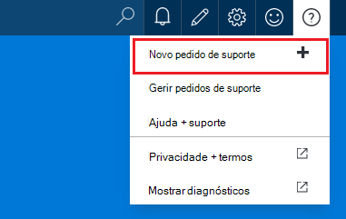

**A partir de um pá de recursos**

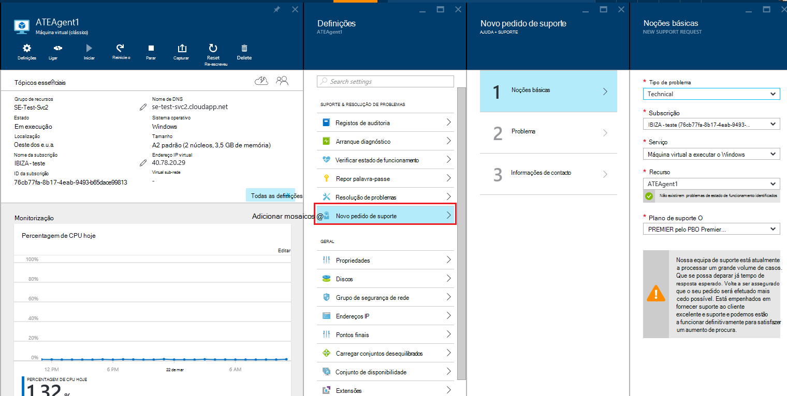

## Noções básicas
O primeiro passo do processo de pedido de suporte recolhe informações básicas sobre o problema e o seu plano de suporte.

Vamos um exemplo: está com dificuldades técnicas com o seu máquina virtual e suspeitar um problema de conectividade de rede.
Selecionar o serviço ("Máquina Virtual a executar o Windows") e o recurso (o nome da sua máquina virtual) o primeiro passo do assistente, inicia o processo de obter ajuda para este problema.

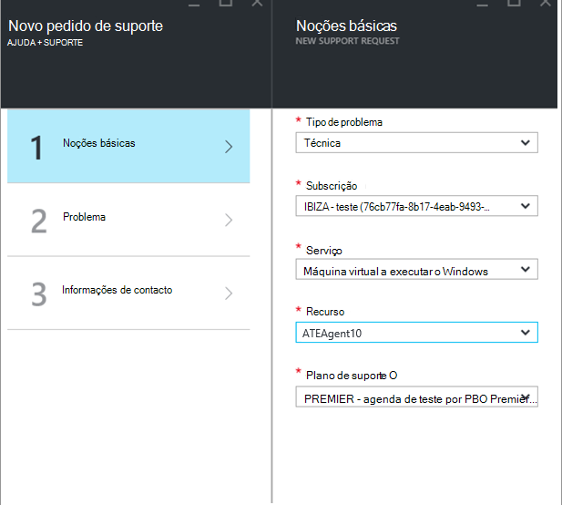

>[AZURE.NOTE] Azure fornece suporte ilimitado para gestão de subscrição (coisas como faturação, ajustes de quota e transferências de conta). Para obter suporte técnico, precisa de um plano de suporte. [Saiba mais sobre os planos de suporte](https://azure.microsoft.com/support/plans).

## Problema
O segundo passo do assistente reúne detalhes adicionais sobre o problema. Fornecer detalhes precisos neste passo nos permite para encaminhar o seu caso para a melhor engenharia de suporte para o problema e para começar a diagnosticar o problema mais cedo possível.

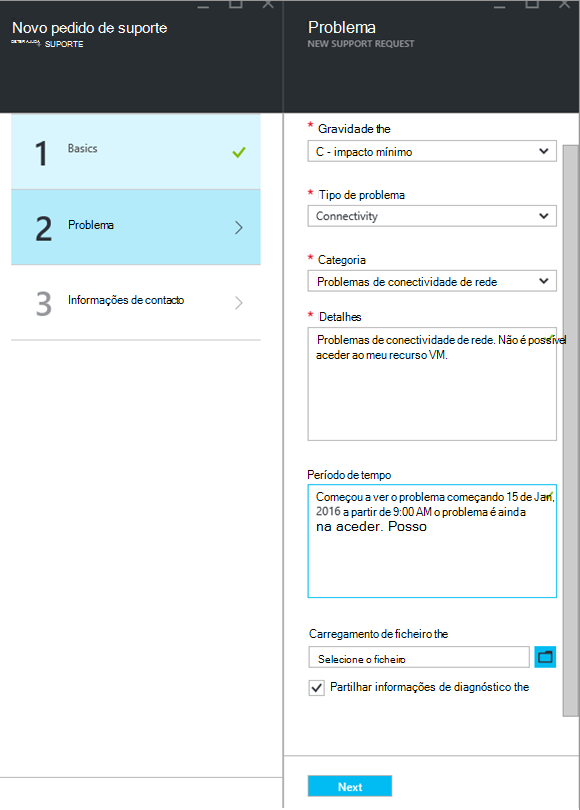

Continuar com o exemplo de conectividade de máquina virtual dos acima, teria preencha este formulário para indicar um problema de conectividade de rede e seria fornece mais detalhes sobre o problema, incluindo a hora aproximada quando ocorreu ao problema.

## Ajuda relacionados
Alguns problemas, disponibilizamos ligações de ajuda relacionados para resolver o problema. Se não ajudar os documentos recomendados, pode continuar a durante o processo para criar um pedido de suporte.
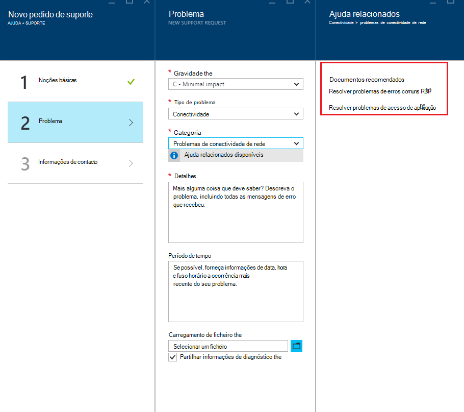

## Informações de contacto
O último passo do Assistente de confirma as informações de contacto para que saiba como contactá-lo.
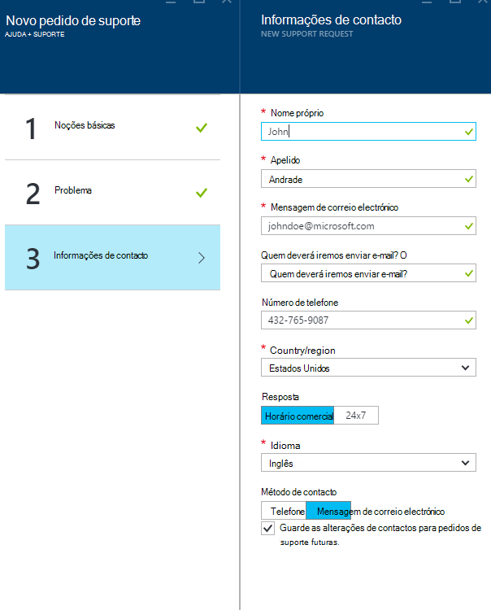

Dependendo da gravidade do seu problema, poderá ser-lhe pedido para indicar se optar por-nos contactá-lo durante o horário comercial ou se preferir uma resposta 24 x 7, o que significa que poderemos contactá-lo em qualquer altura.
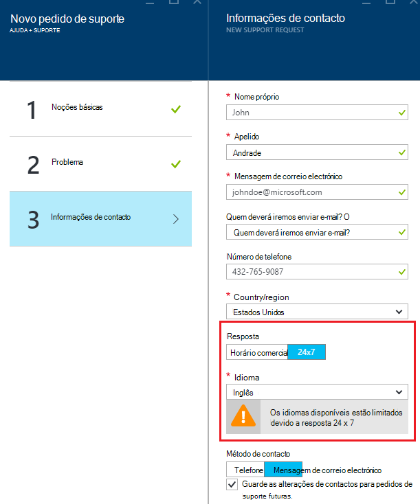

## Gerir pedidos de suporte
Depois de criar o pedido de suporte, pode ver os detalhes a partir da página **Gerir pedidos de suporte** .

**A partir da barra de navegação superior**

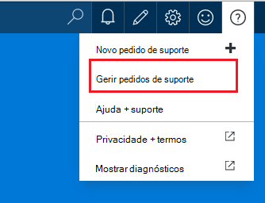

Na página **Gerir pedidos de suporte** , pode ver todos os pedidos de suporte e o respetivo estado.
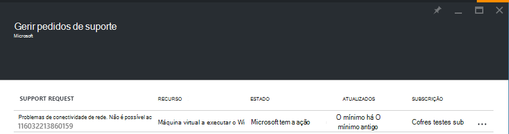

Selecione o pedido de suporte para ver os detalhes, incluindo gravidade e a hora esperada, irá demorar para um técnico de suporte responder.
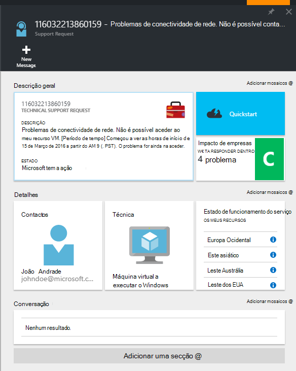

Se quiser alterar a gravidade do pedido de, clique no mosaico de **um impacto comercial** . No exemplo anterior, o pedido atualmente está definido para c gravidade.

Clicar no mosaico do mostra-lhe a lista de severities que pode atribuir a um pedido de suporte abertos.

>[AZURE.NOTE] O nível de gravidade máxima depende do seu plano de suporte. [Saiba mais sobre os planos de suporte](https://azure.microsoft.com/support/plans).

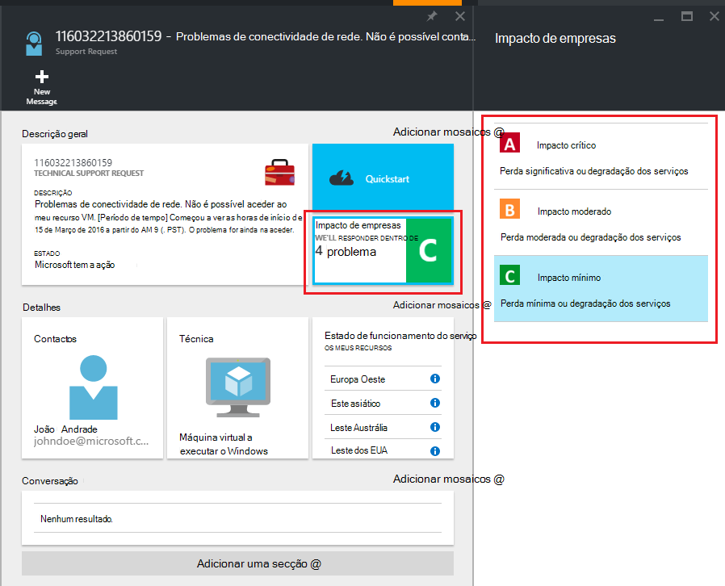

## Comentários
Estamos sempre abrir para comentários e sugestões! Envie-nos seus [sugestões](https://feedback.azure.com/forums/266794-support-feedback). Para além disso, pode participar com-nos através do [Twitter](https://twitter.com/azuresupport) ou os [fóruns do MSDN](https://social.msdn.microsoft.com/Forums/azure).

## Saiba mais
[FAQ de suporte do Azure](https://azure.microsoft.com/support/faq)
