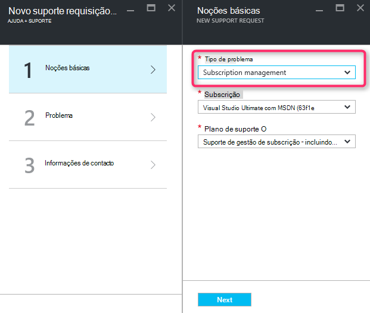

<properties
     pageTitle="Série SKU indisponível | Microsoft Azure"
     description="Algumas séries de SKU não estão disponíveis para a subscrição seleccionada para esta região."
     services="Azure Supportability"
     documentationCenter=""
     authors="ganganarayanan"
     manager="scotthit"
     editor=""/>

<tags
     ms.service="azure-supportability"
     ms.workload="na"
     ms.tgt_pltfrm="na"
     ms.devlang="na"
     ms.topic="article"
     ms.date="08/12/2016"
     ms.author="gangan"/>

# Série SKU indisponível

Em algumas regiões, a determinados SKUs não estão automaticamente disponíveis no novas subscrições.  Isto pode ocorrer quando [são introduzidos SKUs mais eficazes numa região](https://azure.microsoft.com/updates/announcing-new-dv2-series-virtual-machine-size/) e a popularidade do legado SKU recusa.
É apresentada a mensagem "*não está disponível para a subscrição seleccionada para esta região SKU alguns série*" ao criar um pedido de suporte para aumentar cluster core quota.

Pode rever disponibilidade SKU na página [Serviços Azure por região](https://azure.microsoft.com/regions/#services) . 

Para pedir acesso a um SKU que restringiu da sua subscrição, crie um pedido de suporte "Gestão da subscrição".

- Na página informações básicas, selecione o tipo de problema como "Gestão da subscrição" e clique em "Seguinte".

- Na página do problema, selecione o tipo de problema como "Outras perguntas gerais" e introduza a região exata e SKU que não está a ver.
Isto ajuda a acelerar o processo de suporte.

- Na página informações de contacto, introduza os detalhes do contacto e clique em "Criar".

## Comentários
Estamos sempre abrir para comentários e sugestões! Envie-nos seus [sugestões](https://feedback.azure.com/forums/266794-support-feedback). Para além disso, pode participar com-nos através do [Twitter](https://twitter.com/azuresupport) ou os [fóruns do MSDN](https://social.msdn.microsoft.com/Forums/azure).

## Saiba mais
[FAQ de suporte do Azure](https://azure.microsoft.com/support/faq)
