<properties
    pageTitle="Recuperar dados a partir de outro servidor DPM no cofre cópia de segurança | Microsoft Azure"
    description="Recupere os dados que tenha protegido de forma a cofre uma cópia de segurança do Azure a partir de qualquer servidor DPM registado para esse cofre."
    services="backup"
    documentationCenter=""
    authors="nkolli1"
    manager="shreeshd"
    editor=""/>

<tags
    ms.service="backup"
    ms.workload="storage-backup-recovery"
    ms.tgt_pltfrm="na"
    ms.devlang="na"
    ms.topic="article"
    ms.date="08/08/2016"
    ms.author="giridham;jimpark;trinadhk;markgal"/>

# Recuperar dados a partir de outro servidor DPM no cofre cópia de segurança
Agora pode recuperar os dados que tenha protegido de forma a cofre uma cópia de segurança do Azure a partir de qualquer servidor DPM registado para esse cofre. O processo para fazê-lo por isso, está totalmente integrado no consola de gestão do DPM e é semelhante a outros recuperação fluxos de trabalho.

Para recuperar dados de outro servidor DPM no cofre cópia de segurança terá [UR7 de Gestor de proteção de dados do Centro de sistema](https://support.microsoft.com/en-us/kb/3065246) e o [agente de cópia de segurança do Azure mais recente](http://aka.ms/azurebackup_agent).

## Recuperar dados de outro servidor DPM
Para recuperar dados a partir de outro servidor DPM:

1. No separador de **recuperação** da consola de gestão de DPM, clique em **' Adicionar externos DPM'** (na parte superior esquerdo do ecrã).

    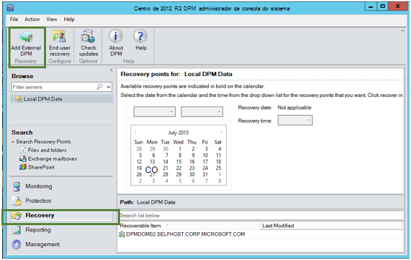

2. Transferir novas **Cofre credenciais** do cofre associado ao **servidor DPM** onde está a ser recuperados os dados, selecione o servidor DPM a partir da lista dos servidores DPM registado com o cópia de segurança cofre e fornecer a **frase de encriptação** associados ao servidor DPM cujos dados está a ser recuperados.

    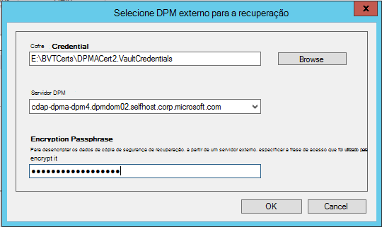

    >[AZURE.NOTE] Apenas os servidores DPM associados com o mesmo Cofre de registo podem recuperar uns dos outros dados.

    Assim que o servidor externo DPM com êxito for adicionado, pode procurar os dados de servidor externo de DPM e servidor DPM local a partir do separador de **recuperação** .

3. Navegar na lista disponível de servidores de produção protegida pelo servidor DPM externo e selecione a origem de dados adequado.

    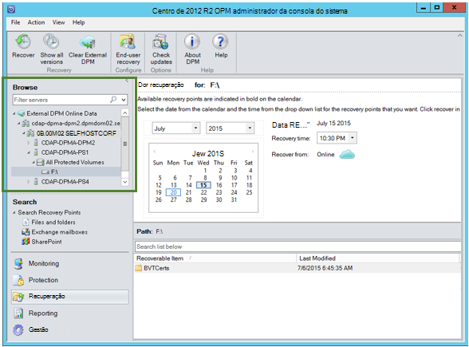

4. Selecione **o mês e ano** a partir dos **pontos de recuperação** de lista pendente, selecione a **data de recuperação** de necessários para quando o ponto de recuperação foi criado e selecione a **hora de recuperação**.

    Será apresentada uma lista de ficheiros e pastas no painel inferior que pode ser consultado e recuperado para qualquer localização.

    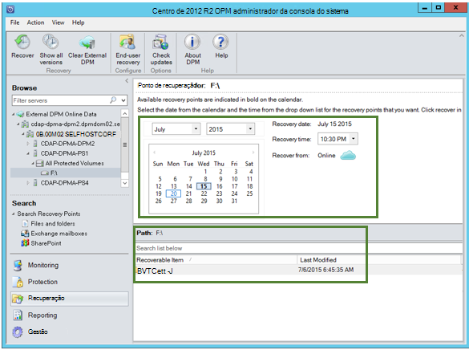

5. Clique com o botão direito do rato no item adequado e clique em **recuperar**.

    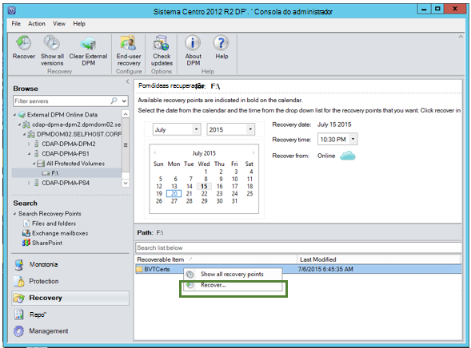

6. Reveja o **recuperar a seleção**. Verifique se os dados e hora da cópia de segurança a ser recuperada, bem como a origem a partir do qual foi criada a cópia de segurança. Se a seleção está incorreta, clique em **Cancelar** para navegar de volta para o separador de recuperação para selecionar o ponto de recuperação adequado. Se a seleção está correta, clique em **seguinte**.

    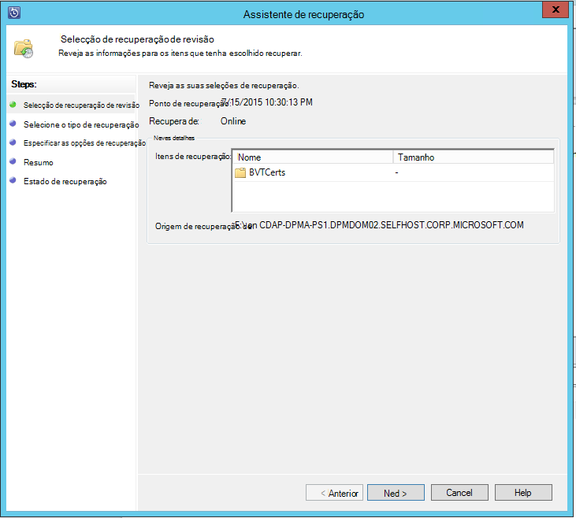

7. Selecione **recuperar para uma localização alternativa**. **Navegue** para a localização correta para a recuperação.

    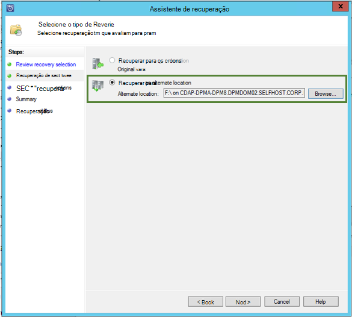

8. Selecione a opção relacionados com **Criar cópia**, **Ignorar**ou **Substituir**.
    - **Criar cópia** irá criar uma cópia do ficheiro na eventualidade de não existe um conflito de nome.
    - **Ignorar** irá ignorar recuperar o ficheiro na eventualidade de não existe um conflito de nome.
    - **Substituir** irá substituir a cópia existente na localização especificada trabalho um conflito de nome.

    Selecione a opção adequada para **restaurar a segurança**. Pode aplicar as definições de segurança do computador de destino onde estão a ser recuperar os dados ou as definições de segurança que estavam aplicáveis ao produto no momento que o ponto de recuperação foi criado.

    Identifique se vai ser enviada uma **notificação** assim que a recuperação for concluída com êxito.

    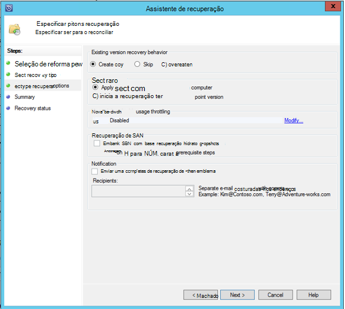

9. O ecrã de **Resumo** lista as opções escolhidas até ao momento. Ao clicar em **'Recuperar'**, os dados serão recuperados para a localização apropriada no local.

    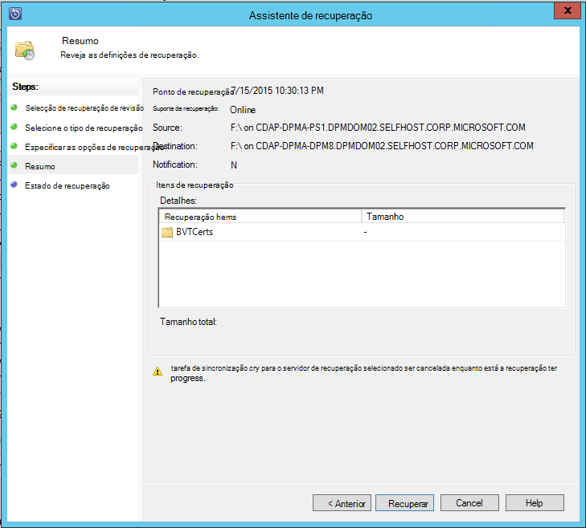

    >[AZURE.NOTE] A tarefa de recuperação pode ser monitorizada no separador **monitorização** do servidor DPM.

    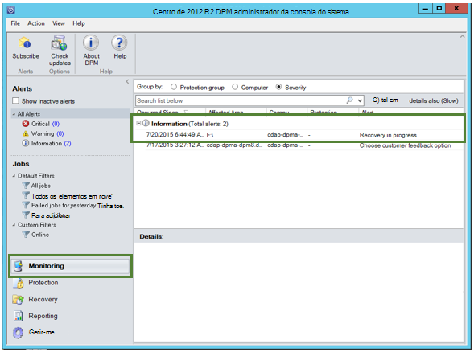

10. Pode clicar em **Limpar DPM externos** no separador **recuperação** do servidor DPM para remover a vista do servidor DPM externo.

    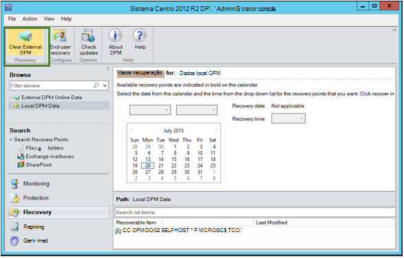

## Resolução de problemas de mensagens de erro
|Não. |  Mensagem de erro | Passos de resolução de problemas |
| :-------------: |:-------------| :-----|
|1.|        Este servidor não está registado cofre especificado pela credencial cofre.|  **Causa:** Este erro é apresentada quando o ficheiro de credenciais do cofre selecionado não faça parte do cofre cópia de segurança associado DPM servidor no qual está tentada a recuperação.   **Resolução:** Transferir o ficheiro de credenciais do cofre do Cofre de palavras cópia de segurança a que o servidor DPM está registado.|
|2.|        Os dados recuperáveis não estão disponíveis ou o servidor seleccionado não é um servidor DPM.|   **Causa:** Existem que outros servidores DPM com DPM 2012 R2 UR7 registados para a cópia de segurança do Cofre de palavras, ou os servidores DPM com DPM 2012 R2 UR7 não tem transferido ainda os metadados ou o servidor selecionado não é servidor DPM (também conhecidos por Windows Server ou Windows Client).   **Resolução:** Se existirem outros servidores DPM registados para o cópia de segurança cofre, certifique-se de que SCDPM 2012 R2 UR7 e cópia de segurança de Azure mais recente agente estão instalados.  Se existirem outros servidores DPM registados para o cópia de segurança cofre com DPM 2012 R2 UR7, aguarde para um dia após a instalação do UR7 para iniciar o processo de recuperação. A tarefa efectuadas durante a noite irá carregar os metadados para todas as cópias de segurança anteriormente protegidas na nuvem. Os dados estarão disponíveis para a recuperação.|
|3.|        Nenhum servidor de DPM está registado para deste cofre.|   **Causa:** Não existem outros DPM servidores com DPM 2012 R2 UR7 ou acima que estão registados para cofre a partir do qual está a ser tentada a recuperação. **Resolução:** Se existirem outros servidores DPM registados para o cópia de segurança cofre, certifique-se de que SCDPM 2012 R2 UR7 e cópia de segurança de Azure mais recente agente estão instalados. Se existirem outros servidores DPM registados para o cópia de segurança cofre com DPM 2012 R2 UR7, aguarde para um dia após a instalação do UR7 para iniciar o processo de recuperação. A tarefa efectuadas durante a noite irá carregar os metadados para todas as cópias de segurança anteriormente protegidas na nuvem. Os dados estarão disponíveis para a recuperação.|
|4.|        Não corresponder a frase de acesso de encriptação fornecida com frase associado ao servidor seguinte:**<server name>**|  **Causa:** A frase de acesso de encriptação utilizado no processo de encriptação dos dados a partir de dados do servidor DPM que estão a ser recuperados não corresponder a frase de acesso de encriptação fornecido. O agente é não é possível desencriptar os dados. Por conseguinte, a recuperação ter falha. **Resolução:** Forneça a exata mesmo encriptação frase de acesso associado ao servidor DPM cujos dados estão a ser recuperados.|

## Perguntas mais frequentes:
1. **Por que motivo não consigo adicionar um servidor DPM externo a partir de outro servidor DPM depois de instalar a UR7 e agent Azure cópia de segurança mais recente?**

    A) para os servidores DPM existentes com origens de dados que são protegidos na nuvem (ao utilizar uma linha de atualizações anteriores ao atualizar Rollup 7), tem de aguardar pelo menos um dia depois de instalar a UR7 e agent mais recente do Azure cópia de segurança para iniciar o *servidor de adicionar DPM externos*. Isto é necessário para carregar os metadados dos grupos de proteção DPM para Azure. Isto ocorre a primeira vez através de uma tarefa efectuadas durante a noite.

2. **O que é a versão mínima do agente de cópia de segurança do Azure necessário?**

    A) a versão mínima do agent Azure cópia de segurança para ativar esta funcionalidade é 2.0.8719.0.  Azure versão de agente de cópia de segurança pode ser verificada através da navegação a painel de controlo **>** itens do painel de controlo de todos os **>** programas e funcionalidades **>** agente de serviços de recuperação do Microsoft Azure. Se a versão for menor que 2.0.8719.0, transfira o [mais recente agente de cópia de segurança do Azure](https://go.microsoft.com/fwLink/?LinkID=288905) e instalar.

    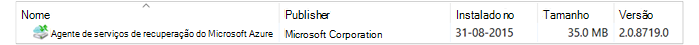

## Passos seguintes:
• [Azure FAQ de cópia de segurança](backup-azure-backup-faq.md)
