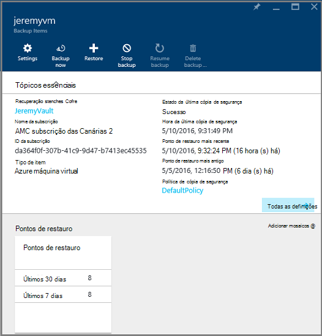

<properties
    pageTitle="Restaurar máquinas virtuais a partir da cópia de segurança através do portal Azure | Microsoft Azure"
    description="Restaurar uma máquina virtual Azure a partir de um ponto de recuperação através do portal Azure"
    services="backup"
    documentationCenter=""
    authors="markgalioto"
    manager="cfreeman"
    editor=""
    keywords="restaurar a cópia de segurança; como restaurar; ponto de recuperação;"/>

<tags
    ms.service="backup"
    ms.workload="storage-backup-recovery"
    ms.tgt_pltfrm="na"
    ms.devlang="na"
    ms.topic="article"
    ms.date="08/10/2016"
    ms.author="trinadhk; jimpark;"/>

# Utilizar o portal do Azure para restaurar máquinas virtuais

> [AZURE.SELECTOR]
- [Restaurar VMs no portal de clássico](backup-azure-restore-vms.md)
- [Restaurar VMs no portal do Azure](backup-azure-arm-restore-vms.md)

Proteger os seus dados ao efetuar instantâneos dos seus dados em intervalos definidos. Estes instantâneos são conhecidos como pontos de recuperação e são armazenados na cofres de serviços de recuperação. Se ou quando é necessário reparar ou reconstruir uma VM, pode restaurar a VM a partir de qualquer um dos pontos recuperação guardado. Quando restaura um ponto de recuperação, devolvem ou reverter a VM para o estado quando o ponto de recuperação foi disponibilizado. Este artigo explica como restaurar uma VM.

> [AZURE.NOTE] Azure tem dois modelos de implementação para criar e trabalhar com recursos: [Gestor de recursos e clássica](../resource-manager-deployment-model.md). Este artigo fornece informações e procedimentos para restaurar a VMs implementados a utilizar o modelo de Gestor de recursos.

## Restaurar um ponto de recuperação

1. Inicie sessão no [portal do Azure](http://portal.azure.com/)

2. No Azure menu, clique em **Procurar** e na lista de serviços, **Serviços de recuperação**. A lista de serviços é ajustado para o que escreve. Quando vir **cofres de serviços de recuperação de**, selecione-o.

    

    É apresentada a lista de cofres na subscrição.

    

3. A partir da lista, selecione o Cofre associado a VM que pretende restaurar. Quando clica no cofre, abre o seu dashboard.

    

4. Agora que se encontra no dashboard de cofre. Nos **Itens de cópia de segurança** de mosaico, clique em **máquinas virtuais do Azure** para apresentar VMs associadas cofre.

    

    O **Itens de cópia de segurança** pá abre e apresenta a lista de máquinas virtuais Azure.

    

5. A partir da lista, selecione uma VM para abrir o dashboard. O dashboard VM abre-se para a área de monitorização, que contém o mosaico de pontos de restaurar.

    

6. No menu de dashboard VM, clique em **Restaurar**

    

    O restauro pá é aberta.

    

7. No pá **Restaurar** , clique em **Restaurar ponto** para abrir o pá **ponto selecione Restaurar** .

    

    Por predefinição, a caixa de diálogo apresenta todos os pontos de restauro de últimos 30 dias. Utilize o **filtro** para alterar o intervalo de tempo dos pontos de restauro mostrado. Por predefinição, os pontos de restauro de toda a consistência são apresentados. Modificar **Restaurar todos os pontos** de filtro para selecionar uma consistência específica de pontos de restauro. Para mais informações sobre cada tipo de restauro ponto, consulte a explicação de [consistência](./backup-azure-vms-introduction.md#data-consistency)de dados.  
    - Escolha a **consistência do ponto de restaurar** a partir desta lista:
        - Pontos de restauro consistentes, uma falha de sistema
        - Pontos de consistentes restauro da aplicação,
        - Pontos de restaurar consistentes do sistema de ficheiros
        - Todos os pontos de restauro.  

8. Selecione um ponto de restauro e clique em **OK**.

    

    O pá **Restaurar** mostra que o ponto de restauro está definido.

    

9. No pá **Restaurar** , **Restaurar configuração** é apresentado automaticamente depois de restaurar ponto é definido.

    

## Escolher uma configuração de restaurar VM

Agora que tiver selecionado o ponto de restauro, escolha uma configuração para o restauro VM. As opções para configurar a VM restaurada são utilizar: Azure portal ou PowerShell.

> [AZURE.NOTE] Portal fornece uma opção de criação rápida para VM restaurado. Se pretende personalizar a configuração de VM da VM restaurado to-be, utilizar o PowerShell para restaurar cópias de segurança discos e anexe-os a escolha de configuração de VM. Consulte [Restaurar uma VM com configurações de rede especial](#restoring-vms-with-special-network-configurations).

1. Se ainda não estiver lá, aceda à pá **Restaurar** . Certifique-se de um **ponto de restauro** tiver sido seleccionada e clique em **Restaurar configuração** para abrir o pá de **configuração de recuperação** .

    

2. No pá **Restaurar configuração** , introduza ou selecione valores para cada um dos seguintes campos:
    - **Nome da Máquina Virtual** - fornecer um nome para a VM. O nome deve ser exclusivo para o grupo de recursos (para VM implementado Gestor de recursos) ou serviço na nuvem (para uma VM clássico). Não é possível substituir a máquina virtual se já existe na subscrição.
    - **Grupo de recursos** - utilizar um grupo de recursos existente ou crie um novo. Se está a restaurar uma VM clássico, utilize este campo para especificar o nome de um serviço na nuvem novo. Se estiver a criar um novo serviço de nuvem/grupo de recursos, o nome deve ser globalmente exclusivo. Normalmente, o nome do serviço de nuvem está associado um URL público - por exemplo: [cloudservice]. cloudapp.net. Se tentar utilizar um nome para o serviço de nuvem/grupo de recursos na nuvem que já tenha sido utilizado, Azure atribui o serviço de nuvem/grupo de recursos o mesmo nome que a VM. Azure apresenta serviços em grupos/nuvem recurso e VMs não associadas a quaisquer grupos afinidade. Para mais informações, consulte o artigo [como migrar a partir de grupos de afinidade a uma rede Virtual regionais (VNet)](../virtual-network/virtual-networks-migrate-to-regional-vnet.md).
    - **Rede virtual** - selecione a rede virtual (VNET) ao criar a VM. O campo fornece todas as VNETs associados à subscrição. Grupo de recursos da VM é apresentado entre parênteses.
    - **Sub-rede** - se a VNET tiver sub-redes, a primeira sub-rede está selecionada por predefinição. Se existirem sub-redes adicionais, selecione a sub-rede pretendida.
    - **Conta de armazenamento** - este menu lista as contas de armazenamento na mesma localização, como o Cofre de serviços de recuperação. Quando escolher uma conta de armazenamento, selecione uma conta que partilha na mesma localização que o Cofre de serviços de recuperação. Contas de armazenamento que são redundante zona não são suportadas. Se não existirem sem contas de armazenamento com a mesma localização, como o Cofre de serviços de recuperação, terá de criar um antes de iniciar a operação de restaurar. Tipo de replicação a conta de armazenamento é mencionado entre parênteses.

    > [AZURE.NOTE] Se está a restaurar uma VM implementado Gestor de recursos, tem de identificar uma rede virtual (VNET). Uma rede virtual (VNET) é opcional para um VM clássica.

3. No pá **Restaurar configuração** , clique em **OK** para concluir a configuração de restaurar.

4. No pá **Restaurar** , clique em **Restaurar** para acionar a operação de restaurar.

    

## Controlar a operação de restauro

Assim que acionar a operação de restauro, o serviço de cópia de segurança cria uma tarefa para controlar a operação de restaurar. O serviço de cópia de segurança também cria e mostra temporariamente a notificação na área de notificações do portal. Se não vir a notificação, pode sempre de clicar no ícone de notificações para ver as suas notificações.

Para ver a operação enquanto está a processar ou para ver quando-concluída, abra a lista de tarefas de cópia de segurança.

1. No Azure menu, clique em **Procurar** e na lista de serviços, **Serviços de recuperação**. A lista de serviços é ajustado para o que escreve. Quando vir **cofres de serviços de recuperação de**, selecione-o.

    

    É apresentada a lista de cofres na subscrição.

    

2. A partir da lista, selecione o Cofre associado a VM que restaurado. Quando clica no cofre, abre o seu dashboard.

3. No dashboard de cofre relativamente às **Tarefas de cópia de segurança** de mosaico, clique em **máquinas virtuais do Azure** para apresentar as tarefas associadas cofre.

    

    A **Tarefas de cópia de segurança** pá abre e apresenta a lista de tarefas.

    

## Restaurar VMs com configurações de rede especial
É possível fazer cópia de segurança e restaurar VMs com as seguintes configurações de rede especiais. No entanto, estas configurações implicam uma atenção algumas especial ao aceder durante o processo de restaurar.

- VMs em Balanceador de carga (interna e externa)
- VMs com vários IPs reservadas
- VMs com vários NIC

>[AZURE.IMPORTANT] Ao criar a configuração de rede especial para VMs, tem de utilizar o PowerShell para criar VMs a partir de discos restaurados.

Para recriar totalmente as máquinas virtuais depois de restaurar no disco, siga estes passos:

1. Restaurar os discos a partir de um cofre de serviços de recuperação através do [PowerShell](../backup-azure-vms-automation.md#restore-an-azure-vm)

2. Criar a configuração de VM necessária para o Balanceador de carga / IP reservado vários do NIC/múltiplo, utilizando os cmdlets do PowerShell e a utilização pretendido-la para criar a VM de configuração.
    - Criar VM no serviço na nuvem com [Balanceador de carga interno](https://azure.microsoft.com/documentation/articles/load-balancer-internal-getstarted/)
    - Criar VM para ligar [Internet opostas Balanceador de carga] (https://azure.microsoft.com/en-us/documentation/articles/load-balancer-internet-getstarted/)
    - Criar VM com [vários NIC](https://azure.microsoft.com/documentation/articles/virtual-networks-multiple-nics/)
    - Criar VM com [vários IPs reservada](https://azure.microsoft.com/documentation/articles/virtual-networks-reserved-public-ip/)

## Próximos passos
Agora que pode restaurar o seu VMs, consulte o artigo resolução de problemas para obter informações sobre erros comuns com VMs. Além disso, consulte o artigo sobre como gerir tarefas com o seu VMs.

- [Resolução de problemas de erros](backup-azure-vms-troubleshoot.md#restore)
- [Gerir máquinas virtuais](backup-azure-manage-vms.md)
