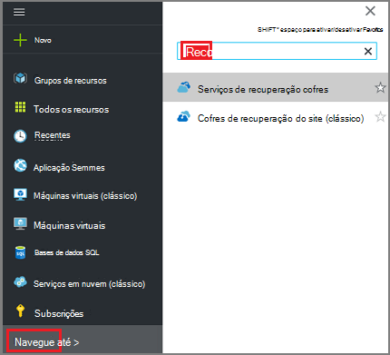
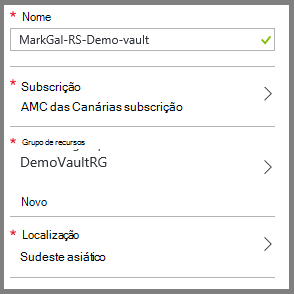
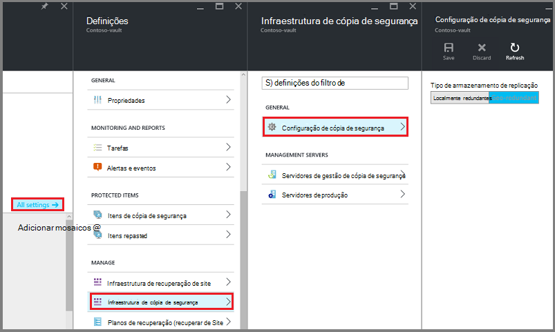
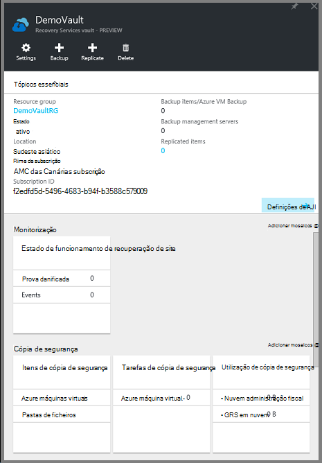
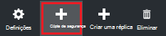
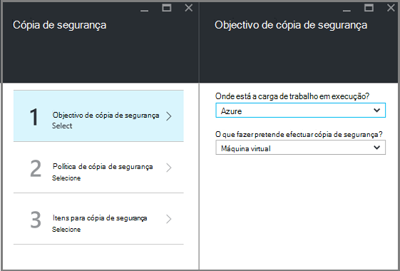
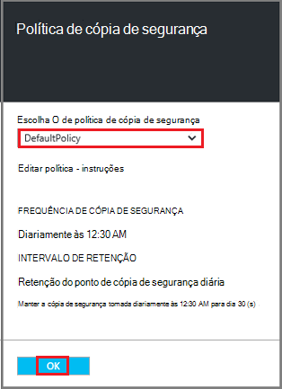
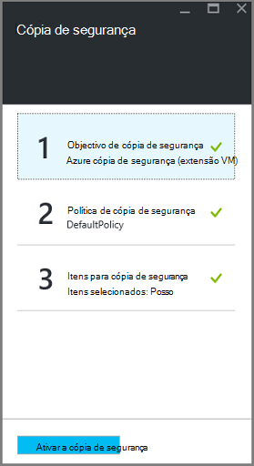

<properties
    pageTitle="Preparar o seu ambiente para agregar implementado Gestor de recursos máquinas virtuais | Microsoft Azure"
    description="Certifique-se de que o seu ambiente está preparado para cópias de segurança máquinas virtuais no Azure"
    services="backup"
    documentationCenter=""
    authors="markgalioto"
    manager="cfreeman"
    editor=""
    keywords="cópias de segurança; cópias de segurança;"/>

<tags
    ms.service="backup"
    ms.workload="storage-backup-recovery"
    ms.tgt_pltfrm="na"
    ms.devlang="na"
    ms.topic="article"
    ms.date="08/21/2016"
    ms.author="trinadhk; jimpark; markgal;"/>


# <a name="prepare-your-environment-to-back-up-resource-manager-deployed-virtual-machines"></a>Preparar o seu ambiente para agregar implementado Gestor de recursos máquinas virtuais

> [AZURE.SELECTOR]
- [Modelo do Gestor de recursos](backup-azure-arm-vms-prepare.md)
- [Modelo clássico](backup-azure-vms-prepare.md)

Este artigo fornece os passos para preparar o seu ambiente para agregar uma máquina de virtual implementado Gestor de recursos (VM). Os passos demonstrados nos procedimentos de utilizam o portal do Azure.  

O serviço de cópia de segurança do Azure tem dois tipos de cofres (para subir cofres e cofres de serviços de recuperação) para proteger a sua VMs. Uma cópia de segurança cofre protege VMs implementados a utilizar o modelo de implementação clássica. Recuperação serviços cofre protege **VMs ambas implementado Classic ou implementado Gestor de recursos** . Tem de utilizar uma Cofre de serviços de recuperação de proteger uma VM implementado Gestor de recursos.

>[AZURE.NOTE] Azure tem dois modelos de implementação para criar e trabalhar com recursos: [Gestor de recursos e clássica](../resource-manager-deployment-model.md). Consulte o artigo [preparar o seu ambiente para agregar Azure máquinas virtuais](backup-azure-vms-prepare.md) para obter detalhes sobre como trabalhar com o modelo de implementação de clássica VMs.

Antes de poder proteger ou agregar uma máquina de virtual implementado Gestor de recursos (VM), certifique-se que destes pré-requisitos existem:

- Criar um cofre de serviços de recuperação (ou identificar um cofre de serviços de recuperação existente) *na mesma localização, como a VM*.
- Selecione um cenário, definir a política de cópia de segurança e definir itens para proteger.
- Verifique a instalação do agente de VM no máquina virtual.
- Verificar a conectividade da rede

Se souber que estas condições já existem no seu ambiente, em seguida, avance para [agregar um artigo de VMs](backup-azure-vms.md). Se precisar de configurar ou verificar, qualquer um destes pré-requisitos, este artigo orienta-o através dos passos para preparar esse pré-requisito.


## <a name="limitations-when-backing-up-and-restoring-a-vm"></a>Limitações quando cópias de segurança e restaurar uma VM

Antes de preparar o seu ambiente, Noções sobre as limitações.

- Cópias de segurança máquinas virtuais com mais de 16 discos de dados não são suportada.
- Cópias de segurança máquinas virtuais com um endereço IP reservado e nenhum ponto final definido não são suportada.
- Cópia de segurança das máquinas virtuais de Linux com extensão Docker não é suportada. 
- Dados de cópia de segurança não incluem as unidades de rede instalado anexadas a VM. 
- Substituir uma máquina virtual existente durante o restauro não é suportada. Se tentar para restaurar a VM quando existe a VM, a operação de restaurar falha.
- Região de publicação em cópia de segurança e restauro não é suportada.
- Pode criar cópias máquinas virtuais em todas as regiões públicas do Azure (consulte a [lista de verificação](https://azure.microsoft.com/regions/#services) das regiões suportados). Se a região que procurava não for suportada hoje, não irá aparecer na lista pendente durante a criação do cofre.
- Pode agregar máquinas virtuais apenas para o sistema operativo selecione versões:
  - **Linux**: cópia de segurança Azure suporta [uma lista de distribuições que são reconhecidos por Azure](../virtual-machines/virtual-machines-linux-endorsed-distros.md) exceto Core SO Linux.  Outros distribuições trazer o-proprietário-Linux também poderão funcionar, desde que o agente VM está disponível na máquina virtual e suporte para obter Python existe.
  - **Windows Server**: versões mais antigas do que o Windows Server 2008 R2 não são suportadas.
- Restaurar um controlador de domínio (CC) VM que faz parte de uma configuração multi Cc é suportado apenas através do PowerShell. Leia mais sobre como [restaurar um controlador de domínio multi CC](backup-azure-restore-vms.md#restoring-domain-controller-vms).
- Restaurar máquinas virtuais que tem as seguintes configurações de rede especiais é suportado apenas através do PowerShell. VMs criadas utilizando o fluxo de trabalho de restaurar na IU não terão estas configurações de rede depois de concluída a operação de restaurar. Para saber mais, consulte o artigo [Restaurar VMs com configurações de rede especial](backup-azure-restore-vms.md#restoring-vms-with-special-netwrok-configurations).
  - Máquinas virtuais em configuração do Balanceador de carga (interna e externa)
  - Máquinas virtuais com vários endereços IP reservadas
  - Máquinas virtuais com vários adaptadores de rede

## <a name="create-a-recovery-services-vault-for-a-vm"></a>Criar um cofre de serviços de recuperação para uma VM

Recuperação serviços Cofre é uma entidade que armazena os pontos de recuperação que foram criados ao longo do tempo e de cópias de segurança. O Cofre de serviços de recuperação também contém as políticas de cópia de segurança associadas com as máquinas virtuais protegidas.

Para criar uma recuperação serviços cofre:

1. Inicie sessão no [portal do Azure](https://portal.azure.com/).

2. No menu concentrador, clique em **Procurar** e na lista de recursos, **Serviços de recuperação**. À medida que começa a escrever, irá filtrar a lista com base no seu teclado. Clique em **Serviços de recuperação cofre**.

     <br/>

    É apresentada a lista de serviços de recuperação cofres.

3. No menu de **Serviços de recuperação cofres** , clique em **Adicionar**.

    

    O pá cofre serviços de recuperação abre-se, perguntar para fornecer um **nome**, a **subscrição**, o **grupo de recursos**e a **localização**.

    

4. Para o **nome**, introduza um nome amigável para identificar o cofre. O nome tem de ser exclusivo para a subscrição Azure. Escreva um nome que contém entre 2 e 50 carateres. Tem de iniciar por uma letra e pode conter apenas letras, números e hífenes.

5. Clique em **subscrição** para ver a lista de subscrições disponível. Se não tiver a certeza de qual para utilizar a sua subscrição, utilize a predefinição (ou sugeridos) subscrição. Haverá múltiplas escolhas apenas se a sua conta institucional está associada com múltiplas subscrições Azure.

6. Clique em **grupo de recursos** para ver a lista de grupos de recursos disponível ou clique em **Novo** para criar um novo grupo de recursos. Para obter informações completas sobre grupos de recursos, consulte o artigo [Descrição geral do Gestor de recursos do Azure](../azure-resource-manager/resource-group-overview.md)

7. Clique em **localização** para selecionar a região geográfica para o cofre. O cofre, **tem** de ser na mesma região como as máquinas virtuais que pretende proteger.

    >[AZURE.IMPORTANT] Se tem a certeza da localização na qual está a VM, feche fora da caixa de diálogo de criação do cofre e ir para a lista de máquinas virtuais no portal. Se tiver máquinas virtuais em várias regiões, terá de criar um cofre de serviços de recuperação em cada região. Crie o Cofre na primeira localização antes de passar para a seguinte. Não é necessário para especificar as contas de armazenamento para armazenar os dados de cópia de segurança – o Cofre de serviços de recuperação e o serviço de cópia de segurança do Azure tratar este automaticamente.

8. Clique em **Criar**. Pode demorar algum tempo para o Cofre de serviços de recuperação seja criada. Monitorize as notificações de estado na área superior direita no portal. Quando estiver criado cofre, aparece na lista de serviços de recuperação cofres.

    

    Agora que criou cofre, saiba como configurar a replicação de armazenamento.

## <a name="set-storage-replication"></a>Definir a replicação de armazenamento

A opção de replicação de armazenamento permite-lhe escolher entre armazenamento geo redundantes e armazenamento localmente redundante. Por predefinição, o seu Cofre tem armazenamento geo redundante. Deixe a opção definida como armazenamento geo redundante se esta é a cópia de segurança principal. Selecione armazenamento localmente redundante se pretender que uma opção de menos dispendiosa que não se adequarem como resistente. Leia mais informações sobre [geo redundantes](../storage/storage-redundancy.md#geo-redundant-storage) e opções de armazenamento [redundantes localmente](../storage/storage-redundancy.md#locally-redundant-storage) num [Descrição geral de replicação de armazenamento do Windows Azure](../storage/storage-redundancy.md).

Para editar a definição de replicação de armazenamento:

1. Selecione o seu Cofre para abrir o dashboard do cofre e pá as definições. Se a pá **Definições** não abrir, clique em **todas as definições** no dashboard de cofre.

2. No pá **Definições** , clique em **Cópia de segurança infraestrutura** > **Configuração de cópia de segurança** para abrir o pá de **Configuração de cópia de segurança** . Na pá **Configuração de cópia de segurança** , selecione a opção de replicação de armazenamento para o cofre.

    

    Depois de escolher a opção de armazenamento para o cofre, está pronto para associar a VM cofre. Para começar a associação, deve descobrir e registar as máquinas virtuais Azure.


## <a name="select-a-backup-goal-set-policy-and-define-items-to-protect"></a>Selecione um objetivo de cópia de segurança, definir a política e definir itens para proteger

Antes de registar uma VM com cofre, execute o processo de deteção para se certificar de que estão identificadas qualquer máquinas virtuais novas que tenham sido adicionadas à subscrição. As consultas de processo Azure para a lista de máquinas virtuais da subscrição, juntamente com informações adicionais, como o nome do serviço na nuvem e a região. No portal do Azure, cenário refere-se para o que vai colocar para o Cofre de serviços de recuperação. A política é a agenda para com que frequência e quando forem tomados pontos de recuperação. A política também inclui o intervalo de retenção para os pontos de recuperação.

1. Se já tiver um aberto Cofre de serviços de recuperação, avance para o passo 2. Se não possui um serviços de recuperação do Cofre de palavras aberta, mas são no portal do Azure, no menu concentrador, clique em **Procurar**.

  - Na lista de recursos, escreva **Serviços de recuperação**.
  - À medida que começa a escrever, irá filtrar a lista com base no seu teclado. Quando vir **cofres de serviços de recuperação**, clique na mesma.

     <br/>

    É apresentada a lista de serviços de recuperação cofres.
  - Na lista de serviços de recuperação cofres, selecione um cofre.

    O dashboard selecionado Cofre é aberta.

    

2. A partir do menu de dashboard cofre clique em **cópia de segurança** para abrir o pá de cópia de segurança.

    

    Quando abre o pá, o serviço de cópia de segurança procura qualquer VMs novos na subscrição.

    

3. No pá cópia de segurança, clique em **objectivo de cópia de segurança** para abrir o pá de objectivo de cópia de segurança.

    

4. No pá objectivo de cópia de segurança, configure **onde está a carga de trabalho em execução** para Azure e **o que fazer pretende efectuar cópia de segurança** para Máquina Virtual, em seguida, clique em **OK**.

    Fecha a pá de objectivo de cópia de segurança e abre o pá de política de cópia de segurança.

    

5. No pá de política de cópia de segurança, selecione a política de cópia de segurança que pretende aplicar ao Cofre de palavras e clique em **OK**.

    

    Os detalhes da política predefinida estão listados nos detalhes. Se pretender criar uma nova política, selecione **Criar novo** a partir do menu pendente. No menu pendente também fornece uma opção para mudar o tempo quando o instantâneo é despendido, para 7 PM. Para obter instruções sobre como definir uma política de cópia de segurança, consulte o artigo [definir uma política de cópia de segurança](backup-azure-vms-first-look-arm.md#defining-a-backup-policy). Assim que clica em **OK**, a política de cópia de segurança está associada com o cofre.

    Em seguida, selecione VMs para associar o cofre.

6. Selecione as máquinas virtuais para associar a política especificada e clique em **Selecionar**.

    

    Se não vir a VM pretendida, verifique se existe na mesma localização Azure como o Cofre de serviços de recuperação.

7. Agora que definiu todas as definições para cofre, no pá a cópia de segurança clique em **Ativar a cópia de segurança** na parte inferior da página. Isto implementa a política cofre e os VMs.

    

A fase seguinte preparação estiver a instalar o agente VM ou certificar-se de que o agente VM está instalado.


## <a name="install-the-vm-agent-on-the-virtual-machine"></a>Instalar o agente de VM na máquina virtual

O agente de VM Azure tem de estar instalado no computador virtual Azure para a extensão de cópia de segurança trabalhar. Se a VM foi criada a partir da Galeria Azure, em seguida, o agente VM já existe na máquina virtual. Estas informações são fornecidos em relação às situações onde se *não* utilizar uma VM criado a partir da Galeria Azure - por exemplo migradas uma VM a partir de um centro de dados no local. Neste caso, o agente VM tem de ser instalada para proteger a máquina virtual.

Saiba mais sobre o [Agente de VM](https://go.microsoft.com/fwLink/?LinkID=390493&clcid=0x409) e [como instalar o agente VM](../virtual-machines/virtual-machines-windows-classic-manage-extensions.md).

Se ocorrerem problemas de cópias de segurança a VM Azure, verifique que o agente de VM Azure corretamente está instalado no computador virtual (consulte a tabela abaixo). Se tiver criado uma VM personalizada, [Certifique-se de que a caixa de verificação **instalar o agente VM** está selecionada](../virtual-machines/virtual-machines-windows-classic-agents-and-extensions.md) antes da máquina virtual está aprovisionado.

A tabela seguinte fornece informações adicionais sobre a VM agente para Windows e Linux VMs.

| **Operação** | **Windows** | **Linux** |
| --- | --- | --- |
| Instalar o agente VM | <li>Transfira e instale o [agente MSI](http://go.microsoft.com/fwlink/?LinkID=394789&clcid=0x409). Terá privilégios de administrador para concluir a instalação. <li>[Atualize a propriedade VM](http://blogs.msdn.com/b/mast/archive/2014/04/08/install-the-vm-agent-on-an-existing-azure-vm.aspx) para indicar que o agente está instalado. | <li> Instale o mais recente [Linux agente](https://github.com/Azure/WALinuxAgent) a partir de GitHub. Terá privilégios de administrador para concluir a instalação. <li> [Atualize a propriedade VM](http://blogs.msdn.com/b/mast/archive/2014/04/08/install-the-vm-agent-on-an-existing-azure-vm.aspx) para indicar que o agente está instalado. |
| Atualizar o agente VM | Atualizar o agente VM é tão simple como reinstalar o [agente de VM binários](http://go.microsoft.com/fwlink/?LinkID=394789&clcid=0x409). <br>Certifique-se de que nenhuma operação de cópia de segurança está em execução enquanto o agente VM está a ser atualizado. | Siga as instruções em [atualizar o agente de VM Linux ](../virtual-machines-linux-update-agent.md). <br>Certifique-se de que nenhuma operação de cópia de segurança está em execução enquanto o agente VM está a ser atualizado. |
| Validar a instalação do agente de VM | <li>Navegue para a pasta de *C:\WindowsAzure\Packages* na Azure VM. <li>Deverá localizar o ficheiro de WaAppAgent.exe apresentar.<li> Com o botão direito no ficheiro, aceda às **Propriedades**e, em seguida, selecione o separador **Detalhes** . O campo de versão do produto deve ser 2.6.1198.718 ou superior. | N/D |


### <a name="backup-extension"></a>Extensão de cópia de segurança

Quando o agente VM estiver instalado no computador virtual, o serviço de cópia de segurança do Azure instala a extensão de cópia de segurança para o agente de VM. O serviço de cópia de segurança do Azure actualiza de forma totalmente integrada e correcções a extensão de cópia de segurança.

A extensão de cópia de segurança é instalada pelo serviço de cópia de segurança, se ou não a VM está em execução. Uma VM em execução fornece maior dar a oportunidade de obter um ponto de recuperação aplicação consistente. No entanto, o serviço de cópia de segurança do Azure continua a fazer cópia de segurança a VM mesmo se estiver desativada e não foi possível instalar a extensão. Isto é conhecido como Offline VM. Neste caso, o ponto de recuperação serão *Falha consistente*.


## <a name="network-connectivity"></a>Conectividade da rede

Para gerir os instantâneos VM, a extensão de cópia de segurança necessita de conectividade para os endereços IP públicos Azure. Sem a ligação à Internet à direita, tempo limite para pedidos de HTTP a máquina virtual e a operação de cópia de segurança falhar. Se a sua implementação tiver restrições de acesso no local (através de um grupo de segurança de rede (NSG), por exemplo), em seguida, escolha uma das seguintes opções para fornecer um caminho de limpar para o tráfego de cópia de segurança:

- [Lista branca de IP do Centro de dados Azure intervalos](http://www.microsoft.com/en-us/download/details.aspx?id=41653) - consulte o artigo para obter instruções sobre como à lista branca os endereços IP.
- Implemente um servidor de proxy HTTP para encaminhar o tráfego.

Ao escolher qual a opção a utilizar, os compromissos são entre capacidade de gestão e controlo granular e custo.

|Opção|Vantagens|Desvantagens|
|------|----------|-------------|
|Intervalos IP lista branca| Não existem custos adicionais.<br><br>Para abrir um NSG access, utilize o cmdlet <i>Set-AzureNetworkSecurityRule</i> . | Complexa para gerir o afetada como intervalos IP alterar ao longo do tempo.<br><br>Fornece acesso a totalidade do Azure e não apenas armazenamento.|
|HTTP proxy| Controlo granular no proxy sobre os URLs de armazenamento permitidos.<br>Acesso a VMs única ponto da Internet.<br>Não sujeito a alterações de endereço IP do Azure.| Custos adicionais para executar uma VM com o software de proxy.|

### <a name="whitelist-the-azure-datacenter-ip-ranges"></a>Intervalos de IP lista branca o Centro de dados do Azure

Lista branca os intervalos IP do Centro de dados Azure, consulte o artigo o [Azure Web site](http://www.microsoft.com/en-us/download/details.aspx?id=41653) para obter mais detalhes nos intervalos IP e instruções.

### <a name="using-an-http-proxy-for-vm-backups"></a>Utilizar um servidor proxy HTTP para cópias de segurança VM
Quando cópias de segurança de uma VM, a extensão de cópia de segurança na VM envia os comandos de gestão de instantâneo ao armazenamento do Azure utilizando um API HTTPS. Encaminha o tráfego de cópia de segurança extensão através de um HTTP proxy, uma vez que é o único componente configurado para o acesso à Internet público.

>[AZURE.NOTE] Não existe nenhuma recomendação para o software de proxy que deverá ser utilizado. Certifique-se de que escolha um proxy que seja compatível com os passos de configuração abaixo.

A imagem de exemplo abaixo mostra os passos de configuração de três necessárias para utilizar um servidor proxy HTTP:

- Aplicação VM encaminha todo o tráfego de HTTP vinculado para a Internet pública através de VM de Proxy.
- Proxy VM permite tráfego de entrada de VMs na rede virtual.
- O grupo de segurança de rede (NSG) com o nome NSF bloqueio necessita de um segurança regra permitindo Internet tráfego de saída do Proxy VM.


Para utilizar um servidor proxy HTTP para comunicar com a Internet pública, siga estes passos:

#### <a name="step-1-configure-outgoing-network-connections"></a>Passo 1. Configurar ligações de saída de rede

###### <a name="for-windows-machines"></a>Para máquinas com o Windows
Isto irá programa de configuração configuração do servidor proxy para a conta de sistema Local.

1. Transferir [PsExec](https://technet.microsoft.com/sysinternals/bb897553)
2. Executar o seguinte comando de elevada,

     ```
     psexec -i -s "c:\Program Files\Internet Explorer\iexplore.exe"
     ```
     Será aberto a janela do internet explorer.
3. Aceda a ferramentas -> Opções da Internet -> ligações -> definições de LAN.
4. Verifique as definições de proxy para a conta de sistema. Definir Proxy IP e porta.
5. Feche o Internet Explorer.

Isto irá configurar uma configuração do proxy globais e será utilizado para qualquer tráfego de saída HTTP/HTTPS.

Se tiver o programa de configuração de um servidor proxy numa conta de utilizador atual (não uma conta de sistema Local), utilize o seguinte script para aplicá-los a SYSTEMACCOUNT:

```
   $obj = Get-ItemProperty -Path Registry::”HKEY_CURRENT_USER\Software\Microsoft\Windows\CurrentVersion\Internet Settings\Connections"
   Set-ItemProperty -Path Registry::”HKEY_USERS\S-1-5-18\Software\Microsoft\Windows\CurrentVersion\Internet Settings\Connections" -Name DefaultConnectionSettings -Value $obj.DefaultConnectionSettings
   Set-ItemProperty -Path Registry::”HKEY_USERS\S-1-5-18\Software\Microsoft\Windows\CurrentVersion\Internet Settings\Connections" -Name SavedLegacySettings -Value $obj.SavedLegacySettings
   $obj = Get-ItemProperty -Path Registry::”HKEY_CURRENT_USER\Software\Microsoft\Windows\CurrentVersion\Internet Settings"
   Set-ItemProperty -Path Registry::”HKEY_USERS\S-1-5-18\Software\Microsoft\Windows\CurrentVersion\Internet Settings" -Name ProxyEnable -Value $obj.ProxyEnable
   Set-ItemProperty -Path Registry::”HKEY_USERS\S-1-5-18\Software\Microsoft\Windows\CurrentVersion\Internet Settings" -Name Proxyserver -Value $obj.Proxyserver
```

>[AZURE.NOTE] Se observar "(407) autenticação de Proxy obrigatório" no registo do servidor proxy, verifique a autenticação está configurado corretamente.

######<a name="for-linux-machines"></a>Para Linux máquinas

Adicionar a linha seguinte para o ```/etc/environment``` ficheiro:

```
http_proxy=http://<proxy IP>:<proxy port>
```

Adicione as seguintes linhas para o ```/etc/waagent.conf``` ficheiro:

```
HttpProxy.Host=<proxy IP>
HttpProxy.Port=<proxy port>
```

#### <a name="step-2-allow-incoming-connections-on-the-proxy-server"></a>Passo 2. Permita ligações de entrada no servidor proxy:

1. No servidor proxy, abra a Firewall do Windows. É a forma mais fácil para aceder a firewall procurar a Firewall do Windows com segurança avançada.

    

2. Na caixa de diálogo Firewall do Windows, **Regras de entrada** com o botão direito e clique em **Nova regra...**.

    

3. No **Assistente de novas regras de entrada**, selecione a opção **personalizada** para o **Tipo de regra** e clique em **seguinte**.
4. Na página para selecionar o **programa**, selecione **Todos os programas** e clique em **seguinte**.

5. Na página de **todas as portas e protocolos** , introduza as seguintes informações e clique em **seguinte**:

    

    - para o *tipo de protocolo* selecione *TCP*
    - para a *Porta Local* selecione *Portas específicas*, no campo abaixo especificar a ```<Proxy Port>``` que tenha sido configurado.
    - para *porta remota* selecione *Todas as portas*

    Para o resto do assistente, clique em tudo para o fim e dê um nome a esta regra.

#### <a name="step-3-add-an-exception-rule-to-the-nsg"></a>Passo 3. Adicione uma regra de exceção para a NSG:

Numa linha de comandos do Azure PowerShell, introduza o seguinte comando:

O comando seguinte adiciona uma exceção para o NSG. Esta exceção permite que o tráfego TCP a partir de qualquer porta 10.0.0.5 qualquer endereço da Internet na porta 80 (HTTP) ou 443 (HTTPS). Se introduzir uma porta específica na Internet pública, certifique-se adicionar essa porta para o ```-DestinationPortRange``` também.

```
Get-AzureNetworkSecurityGroup -Name "NSG-lockdown" |
Set-AzureNetworkSecurityRule -Name "allow-proxy " -Action Allow -Protocol TCP -Type Outbound -Priority 200 -SourceAddressPrefix "10.0.0.5/32" -SourcePortRange "*" -DestinationAddressPrefix Internet -DestinationPortRange "80-443"
```


*Estes passos utilizam os nomes específicos e valores para este exemplo. Utilize os nomes e os valores para a sua implementação ao introduzir, ou cortar e colar detalhes no seu código.*


Agora que sabe que tenha conectividade de rede, está pronto para criar uma cópia de segurança a VM. Consulte o artigo [criar uma cópia de segurança VMs implementado Gestor de recursos](backup-azure-arm-vms.md).

## <a name="questions"></a>Perguntas?
Se tiver dúvidas, ou se existir qualquer funcionalidade que pretende ver incluídas, [envie-nos comentários](http://aka.ms/azurebackup_feedback).

## <a name="next-steps"></a>Próximos passos
Agora que tenham preparados o seu ambiente para cópias de segurança a VM, o próximo passo lógico é criar uma cópia de segurança. O artigo planeamento fornece informações mais detalhadas sobre cópias de segurança VMs.

- [Criar uma cópia de segurança máquinas virtuais](backup-azure-vms.md)
- [Planear a sua infraestrutura de cópia de segurança VM](backup-azure-vms-introduction.md)
- [Gerir máquina virtual cópias de segurança](backup-azure-manage-vms.md)
