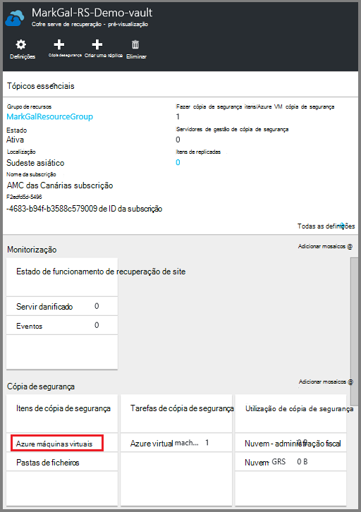
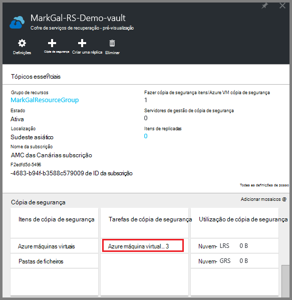
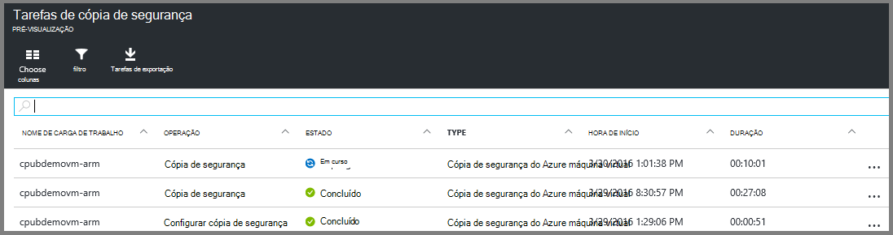

<properties
    pageTitle="Criar uma cópia de segurança Azure VMs para cofre serviços de recuperação | Microsoft Azure"
    description="Descobrir o, registe-se e agregar Azure máquinas virtuais para um cofre de serviços de recuperação com estes procedimentos para cópia de segurança do Azure máquina virtual."
    services="backup"
    documentationCenter=""
    authors="markgalioto"
    manager="cfreeman"
    editor=""
    keywords="cópia de segurança de máquina virtual; criar uma cópia de segurança máquina virtual; recuperação de cópia de segurança e falhas; cópia de segurança do processador vm"/>

<tags
    ms.service="backup"
    ms.workload="storage-backup-recovery"
    ms.tgt_pltfrm="na"
    ms.devlang="na"
    ms.topic="article"
    ms.date="07/29/2016"
    ms.author="trinadhk; jimpark; markgal;"/>

# Agregar Azure VMs para cofre serviços de recuperação

> [AZURE.SELECTOR]
- [Agregar VMs para serviços de recuperação Cofre](backup-azure-arm-vms.md)
- [Agregar VMs Cofre de cópia de segurança](backup-azure-vms.md)

Este artigo fornece o procedimento para cópias de segurança Azure VMs (implementado Gestor de recursos e implementado clássico) para um cofre de serviços de recuperação. A maioria dos trabalhos de cópias de segurança VMs flui para a preparação. Antes de poder fazer cópia de segurança ou proteger uma VM, tem de concluir os [Pré-requisitos](backup-azure-arm-vms-prepare.md) para preparar o seu ambiente para proteger a sua VMs. Assim que tiver concluído as pré-requisitos, em seguida, pode iniciar a operação de tirar um instantâneo da sua VM para subir.

>[AZURE.NOTE] Azure tem dois modelos de implementação para criar e trabalhar com recursos: [Gestor de recursos e clássica](../resource-manager-deployment-model.md). Pode proteger VMs implementado Gestor de recursos e VMs clássica com serviços de recuperação cofres. Consulte o artigo [criar uma cópia de segurança Azure máquinas virtuais](backup-azure-vms.md) para obter detalhes sobre como trabalhar com o modelo de implementação de clássica VMs.

Para obter informações adicionais, consulte os artigos [Planear a sua infraestrutura de cópia de segurança VM no Azure](backup-azure-vms-introduction.md) e [máquinas virtuais Azure](https://azure.microsoft.com/documentation/services/virtual-machines/).

## Acionar o tarefa de cópia

A política associada cofre serviços de recuperação, para subir define com que frequência e quando a operação de cópia de segurança é executado. Por predefinição, a primeira cópia de segurança agendada é a cópia de segurança inicial. Até que a cópia de segurança inicial ocorre, o último Estado de cópia de segurança no pá **Tarefas de cópia de segurança** mostra como **aviso (cópia de segurança inicial pendentes)**.

A menos que a cópia de segurança inicial vence começar a muito mais cedo, é recomendável que execute **fazer cópia de segurança agora**. O procedimento seguinte inicia a partir do dashboard do cofre. Este procedimento serve para executar a tarefa de cópia de segurança inicial assim que acabar de todos os pré-requisitos. Se já tiver sido executada a tarefa de cópia de segurança inicial, este procedimento não está disponível. A política de cópia de segurança associada determina a tarefa de cópia de segurança seguinte.  

Para executar a tarefa de cópia de segurança inicial:

1. No dashboard de cofre, no mosaico **cópia de segurança** , clique em **máquinas virtuais do Azure**.  
    

    É aberta a pá de **Itens de cópia de segurança** .

2. No pá **Itens de cópia de segurança** , com o botão direito no cofre que pretende fazer cópia de segurança e clique em **cópia de segurança agora**.

    

    A tarefa de cópia de segurança é acionada.  

    

3. Para ver que foi concluída a cópia de segurança inicial, no dashboard de cofre, no mosaico **Trabalhos de cópia de segurança** , clique em **máquinas virtuais Azure**.

    

    É aberta a pá trabalhos de cópia de segurança.

4. No pá **trabalhos de cópia de segurança** , pode ver o estado de todas as tarefas.

    

    >[AZURE.NOTE] Como parte da operação de cópia de segurança, o serviço de cópia de segurança do Azure emite um comando a extensão da cópia de segurança no cada máquina virtual para esvaziar a todas as gravações e tirar um instantâneo consistente.

    Quando tiver terminada a tarefa de cópia de segurança, o estado é *concluído*.

## Resolução de problemas de erros
Se encontrar problemas durante a segurança o seu máquina virtual, consulte o [artigo resolução de problemas de VM](backup-azure-vms-troubleshoot.md) para obter ajuda.

## Próximos passos

Agora que tiver protegido a VM, consulte o artigo os seguintes artigos para tarefas de gestão adicional pode fazer com o seu VMs e como restaurá VMs.

- [Gerir e monitorizar o seu máquinas virtuais](backup-azure-manage-vms.md)
- [Restaurar máquinas virtuais](backup-azure-arm-restore-vms.md)
