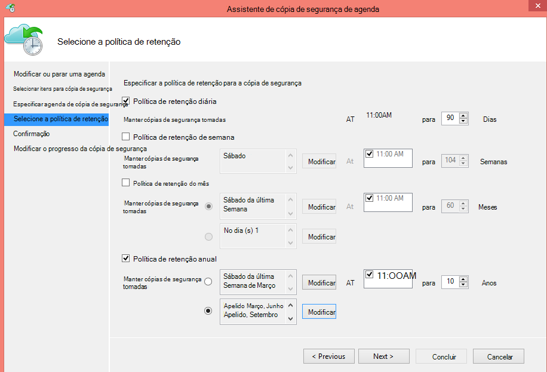

<properties
   pageTitle="Utilizar o Azure cópia de segurança para substituir a sua infraestrutura de banda | Microsoft Azure"
   description="Saiba como cópia de segurança do Azure fornece a semântica de banda gosto permite-lhe fazer cópia de segurança e restaurar os dados no Azure"
   services="backup"
   documentationCenter=""
   authors="trinadhk"
   manager="vijayts"
   editor=""/>
<tags
   ms.service="backup"
   ms.devlang="na"
   ms.topic="article"
   ms.tgt_pltfrm="na"
   ms.workload="storage-backup-recovery"
   ms.date="09/27/2016"
   ms.author="jimpark;trinadhk;markgal"/>

# Utilizar o Azure cópia de segurança para substituir a sua infraestrutura de banda

Clientes de cópia de segurança e o Gestor de proteção de dados do sistema Centro Azure podem:

- Agregar dados agendas que melhor se adequar às necessidades organizacionais.
- Manter os dados de cópia de segurança para períodos mais longos
- Tornar o Azure necessita de uma parte da sua retenção a longo prazo (em vez de banda).

Este artigo explica como clientes podem ativar as políticas de retenção e de cópia de segurança. Os clientes que utilizam bandas abordar os respetivos longo-prazo-retenção agora precisa de ter uma alternativa viável e avançada com a disponibilidade desta funcionalidade. A funcionalidade é ativada na versão mais recente do Azure cópia de segurança (que se encontra disponível [aqui](http://aka.ms/azurebackup_agent)). Os clientes do Centro de sistema DPM terá de actualizar para, pelo menos, DPM 2012 R2 UR5 antes de utilizar DPM com o serviço de cópia de segurança do Azure.

## O que é a agenda de cópia de segurança?
A agenda de cópia de segurança indica a frequência da operação de cópia de segurança. Por exemplo, as definições no ecrã seguinte indicam que cópias de segurança sejam tomadas diariamente às 6 pm e à meia-noite.

Os clientes também podem agendar uma cópia de segurança semanal. Por exemplo, as definições no ecrã seguinte indicam que cópias de segurança sejam tomadas cada Domingo alternativo & quarta-feira na 9:30 e 1:00 AM.

## O que é a política de retenção?
A política de retenção Especifica a duração para o qual a cópia de segurança tem de ser armazenada. Em vez de apenas especificando uma "política simples" para todos os pontos de cópia de segurança, clientes podem especificar políticas de retenção diferente com base em quando a cópia de segurança é disponibilizada. Por exemplo, o ponto de cópia de segurança tomado diariamente, que funciona como um ponto de recuperação operacionais avançados, é preservado para cerca de 90 dias. O ponto de cópia de segurança tomado no final de cada trimestre para fins de auditoria é mantido durante uma duração mais longa.

O número total de "pontos de retenção" especificado nesta política é 90 (diários pontos) + 40 (um de cada trimestre de 10 anos) = 130.

## Exemplo – colocar em ambos em conjunto

1. **Política de retenção diária**: cópias de segurança tomadas diariamente são armazenadas durante sete dias.
2. **Política de retenção semanal**: cópias de segurança tomadas diariamente a meia-noite e 6 PM Sábado são preservadas para quatro semanas
3. **Política de retenção mensal**: cópias de segurança tomadas, meia-noite e 6 pm do último Sábado de cada mês são preservadas por 12 meses
4. **Política de retenção anual**: são preservadas cópias de segurança tomadas à meia-noite do último Sábado de cada de Março de 10 anos

O número total de "pontos de retenção" (pontos a partir da qual um cliente pode restaurar dados) no diagrama anterior é calculado da seguinte forma:

- dois pontos por dia, durante sete dias = 14 pontos de recuperação
- dois pontos por semana de quatro semanas = 8 pontos de recuperação
- dois pontos por mês de 12 meses = 24 pontos de recuperação
- um ponto por ano por recuperação de 10 anos = 10 pontos

O número total de pontos de recuperação é 56.

> [AZURE.NOTE] Cópia de segurança do Azure ainda não possui uma restrição no número de pontos de recuperação.

## Configuração avançada
Ao clicar em **Modificar** no ecrã anterior, clientes tem mais flexibilidade na especificação de agendas de retenção.

## Próximos passos
Para mais informações sobre Azure cópia de segurança, consulte:

- [Introdução ao Azure cópia de segurança](backup-introduction-to-azure-backup.md)
- [Experimente a cópia de segurança do Azure](backup-try-azure-backup-in-10-mins.md)
