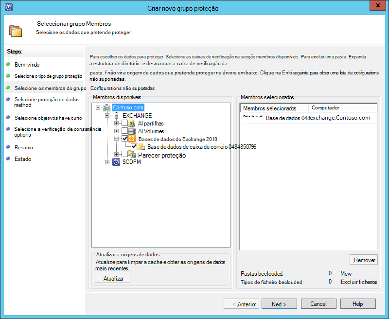
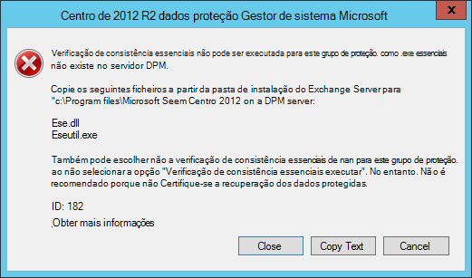
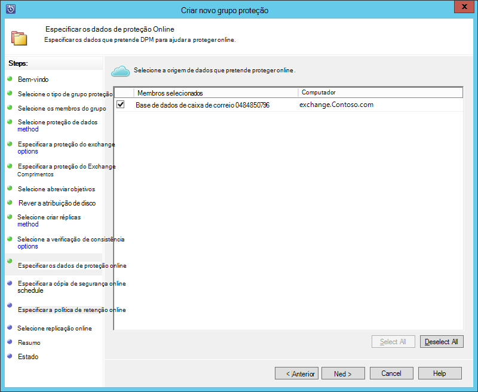
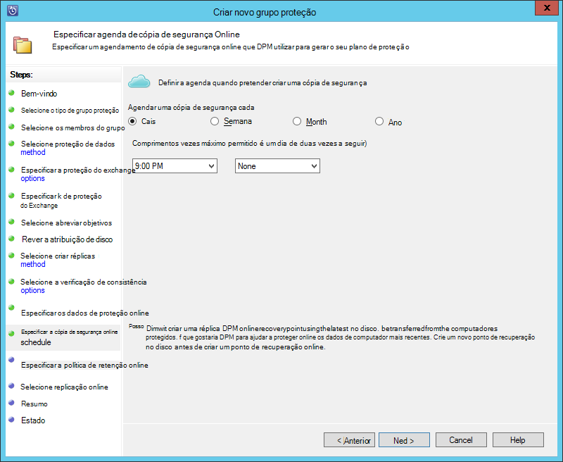
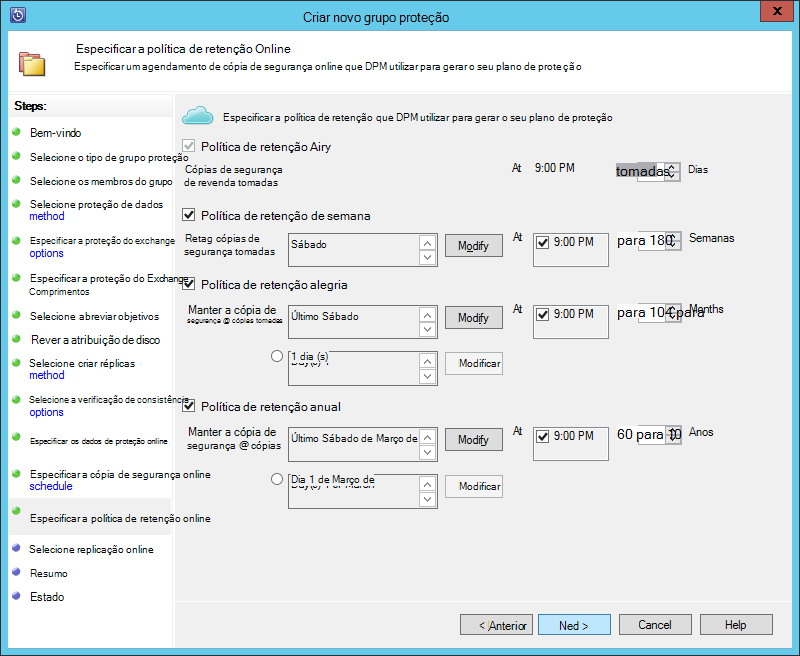
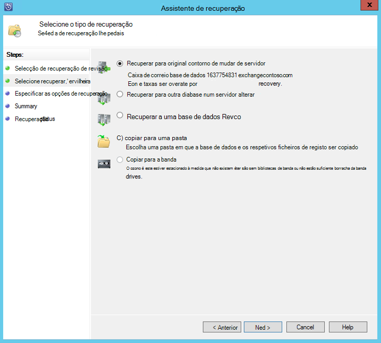

<properties
    pageTitle="Cópia de segurança de um servidor do Exchange para Azure cópia de segurança com o sistema Centro 2012 R2 DPM | Microsoft Azure"
    description="Saiba como criar cópia de segurança de um servidor do Exchange para cópia de segurança do Azure utilizando sistema Centro 2012 R2 DPM"
    services="backup"
    documentationCenter=""
    authors="MaanasSaran"
    manager="NKolli1"
    editor=""/>

<tags
    ms.service="backup"
    ms.workload="storage-backup-recovery"
    ms.tgt_pltfrm="na"
    ms.devlang="na"
    ms.topic="article"
    ms.date="08/15/2016"
    ms.author="anuragm;jimpark;delhan;trinadhk;markgal"/>

# Agregar um servidor do Exchange para Azure cópia de segurança com o sistema Centro 2012 R2 DPM
Este artigo descreve como configurar um servidor de sistema Centro 2012 R2 dados Protection Gestor (DPM) para agregar um Microsoft Exchange server Azure cópia de segurança.  

## Atualizações
Para registar com êxito o servidor DPM com cópia de segurança do Azure, tem de instalar as atualizações mais recentes para sistema Centro 2012 R2 DPM e a versão mais recente do agente de cópia de segurança do Azure. Obter as atualizações mais recentes do [Catálogo da Microsoft](http://catalog.update.microsoft.com/v7/site/Search.aspx?q=System%20Center%202012%20R2%20Data%20protection%20manager).

>[AZURE.NOTE] Para obter exemplos neste artigo, versão 2.0.8719.0 do agente de cópia de segurança Azure está instalada e Update Rollup 6 estiver instalado no sistema de centro de 2012 R2 DPM.

## Pré-requisitos
Antes de continuar, certifique-se de que todos os [Pré-requisitos](backup-azure-dpm-introduction.md#prerequisites) para utilizar a cópia de segurança do Microsoft Azure para proteger das cargas de trabalho são satisfeitos. Estes pré-requisitos incluem o seguinte:

- Uma cópia de segurança cofre no site do Azure foi criada.
- Credenciais do agente e cofre tiverem sido transferidas para o servidor DPM.
- O agente é instalado no servidor DPM.
- As credenciais do cofre eram utilizadas para registar o servidor DPM.
- Se estiver a proteger Exchange 2016, actualize para DPM 2012 R2 UR9 ou posterior

## Agente de proteção de DPM  
Para instalar o agente de proteção DPM no servidor Exchange, siga estes passos:

1. Certifique-se de que as firewalls estão corretamente configuradas. Consulte o artigo [Configurar exceções de firewall para o agente](https://technet.microsoft.com/library/Hh758204.aspx).

2. Instalar o agente no servidor do Exchange ao clicar em **Gestão > agentes > instalar** na consola do administrador de DPM. Consulte o artigo [instalar o agente de proteção DPM](https://technet.microsoft.com/library/hh758186.aspx?f=255&MSPPError=-2147217396) para obter passos detalhados.

## Criar um grupo de proteção para o servidor do Exchange

1. Na consola do administrador de DPM, clique em **proteção**e, em seguida, clique em **Novo** no Friso ferramenta para abrir o Assistente para **Criar novo grupo de proteção** .

2. No ecrã de **boas-vindas** do assistente, clique em **seguinte**.

3. No ecrã **Seleccionar o tipo de grupo de proteção** , selecione **Servers** e clique em **seguinte**.

4. Selecione a base de dados de servidor Exchange que pretende proteger e clique em **seguinte**.

    >[AZURE.NOTE] Se estiver a proteger Exchange 2013, consulte os [Pré-requisitos do Exchange 2013](https://technet.microsoft.com/library/dn751029.aspx).

    No seguinte exemplo, a base de dados do Exchange 2010 está selecionada.

    

5. Selecione o método de proteção de dados.

    Atribua um nome do grupo de proteção e, em seguida, selecione ambas as seguintes opções:

    - Pretendo protecção curto prazo utilizando o disco.
    - Pretendo proteção online.

6. Clique em **seguinte**.

7. Se pretender verificar a integridade das bases de dados do Exchange Server, selecione a opção de **Executar Eseutil para verificar a integridade dos dados** .

    Depois de selecionar esta opção, a cópia de segurança consistência verificação será executado no servidor DPM para evitar o tráfego de e/s é gerado ao executar o comando **eseutil** no servidor Exchange.

    >[AZURE.NOTE]Para utilizar esta opção, tem de copiar os ficheiros ESE e Eseutil.exe ao diretório C:\Program Files\Microsoft sistema Centro 2012 R2\DPM\DPM\bin no servidor DPM. Caso contrário, é acionado o seguinte erro:  
    

8. Clique em **seguinte**.

9. Selecione a base de dados para **Cópia de segurança**e, em seguida, clique em **seguinte**.

    >[AZURE.NOTE] Se não selecionar "Cópia de segurança completa" pelo menos uma cópia de Comprimentos de uma base de dados, os registos não serão truncados.

10. Configure os objetivos para **cópia de segurança de curto prazo**e, em seguida, clique em **seguinte**.

11. Reveja o espaço disponível no disco e, em seguida, clique em **seguinte**.

12. Selecione a hora em que o servidor DPM criar a replicação inicial e, em seguida, clique em **seguinte**.

13. Selecione as opções de verificação consistência e, em seguida, clique em **seguinte**.

14. Selecione a base de dados que pretende fazer cópia de segurança do Azure e, em seguida, clique em **seguinte**. Por exemplo:

    

15. Definir a agenda da **Cópia de segurança do Azure**e, em seguida, clique em **seguinte**. Por exemplo:

    

    >[AZURE.NOTE] Tenha em atenção os pontos de recuperação Online são baseados no express completo pontos de recuperação. Por conseguinte, terá de a agendar o ponto de recuperação online depois do tempo especificado para o inteiro express recuperação aponte.

16. Configurar a política de retenção para **Cópia de segurança do Azure**e, em seguida, clique em **seguinte**.

17. Escolha uma opção de replicação online e clique em **seguinte**.

    Se tiver uma base de dados grande, poderá demorar muito tempo para a cópia de segurança inicial criada através da rede. Para evitar este problema, pode criar uma cópia de segurança offline.  

    

18. Confirme as definições e, em seguida, clique em **Criar grupo**.

19. Clique em **Fechar**.

## Recuperar a base de dados do Exchange

1. Para recuperar uma base de dados do Exchange, clique em **recuperação** na consola do administrador de DPM.

2. Localize a base de dados do Exchange que pretende recuperar.

3. Selecione um ponto de recuperação online a partir da lista pendente de *tempo de recuperação* .

4. Clique em **recuperar** para iniciar o **Assistente de recuperação**.

Em aponta recuperação online, existem cinco tipos de recuperação:

- **Recuperar para a localização original do Exchange Server:** Os dados serão recuperados para o servidor Exchange original.
- **Recuperar para outra base de dados num servidor Exchange:** Os dados serão recuperados para outra base de dados no outro servidor Exchange.
- **Recuperar a uma base de dados de recuperação:** Os dados serão recuperados para uma base de dados de recuperação do Exchange (RDB).
- **Copiar para uma pasta de rede:** Os dados serão recuperados para uma pasta de rede.
- **Copiar para a banda:** Se tiver uma biblioteca de bandas ou numa unidade de banda autónomo anexado e configurado no servidor de DPM, o ponto de recuperação será copiado para uma banda gratuita.

    

## Próximos passos

- [FAQ de cópia de segurança Azure](backup-azure-backup-faq.md)
