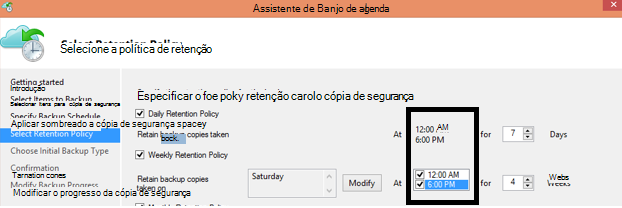

<properties
   pageTitle="FAQ de cópia de segurança Azure | Microsoft Azure"
   description="Respostas às perguntas mais frequentes sobre o serviço de cópia de segurança, agente de cópia de segurança, cópia de segurança e retenção, recuperação, segurança e outras perguntas comuns sobre a recuperação de cópia de segurança e falhas."
   services="backup"
   documentationCenter=""
   authors="markgalioto"
   manager="jwhit"
   editor=""
   keywords="recuperação de cópia de segurança e falhas; serviço de cópia de segurança"/>

<tags
   ms.service="backup"
   ms.workload="storage-backup-recovery"
     ms.tgt_pltfrm="na"
     ms.devlang="na"
     ms.topic="get-started-article"
     ms.date="10/21/2016"
     ms.author="trinadhk; giridham; arunak; markgal; jimpark;"/>

# <a name="azure-backup-service--faq"></a>Azure cópia de segurança serviço-perguntas mais frequentes


Este artigo é uma lista de perguntas mais frequentes (e as respetivas respostas) sobre o serviço de cópia de segurança do Azure. Nossa Comunidade rapidamente, respostas e se uma pergunta é pedida muitas vezes, podemos adicioná-lo deste artigo. As respostas a questões normalmente fornecem referência ou informações de suporte. Pode colocar questões sobre Azure cópia de segurança na secção de Disqus neste artigo ou um artigo relacionado. Também pode publicar perguntas sobre o serviço de cópia de segurança do Azure no [Fórum de debate](https://social.msdn.microsoft.com/forums/azure/home?forum=windowsazureonlinebackup).


## <a name="what-is-the-list-of-supported-operating-systems-from-which-i-can-back-up-to-azure-using-azure-backup-br"></a>O que é a lista dos sistemas operativos suportados a partir do qual que pode criar cópias de segurança para Azure utilizando Azure cópia de segurança? <br/>
Cópia de segurança do Azure suporta a seguinte lista de sistemas operativos para cópia de segurança da pasta de ficheiros, utilizando o servidor de cópia de segurança do Azure e SCDPM cópia de segurança da aplicação.

| Sistema operativo        | Plataforma           | SKU  |
| :------------- |-------------| :-----|
| Windows 8 e SPs mais recentes      | 64 bits | Empresa, Pro |
| Windows 7 e SPs mais recentes      | 64 bits | Ultimate, Enterprise, Professional, casa Premium, Home Basic, Starter |
| Windows 8.1 e SPs mais recentes | 64 bits      |    Empresa, Pro |
| Windows 10      | 64 bits | Enterprise, Pro, Home |
|Windows Server 2012 R2 e SPs mais recentes| 64 bits| Padrão, Centro de dados, Foundation|
|Windows Server 2012 e SPs mais recentes|    64 bits| Centro de dados, Foundation, padrão|
|Armazenamento de Windows Server 2012 R2 e SPs mais recentes  |64 bits|    Padrão, grupo de trabalho|
|Armazenamento de Windows Server 2012 e SPs mais recentes |64 bits |Padrão, grupo de trabalho
|Windows Server 2012 R2 e SPs mais recentes  |64 bits|    Essenciais|
|Windows Server 2008 R2 SP1 |64 bits|    Padrão, Enterprise, Centro de dados, Foundation|
|Windows Server 2008 SP2    |64 bits|    Padrão, Enterprise, Centro de dados, Foundation|

Para cópia de segurança do Azure VM,

- **Linux**: cópia de segurança Azure suporta [uma lista de distribuições que são reconhecidos por Azure](../virtual-machines/virtual-machines-linux-endorsed-distros.md) exceto Core SO Linux.  Outros distribuições trazer o-proprietário-Linux também poderão funcionar, desde que o agente VM está disponível na máquina virtual e suporte para obter Python existe.
- **Windows Server**: versões mais antigas do que o Windows Server 2008 R2 não são suportadas.

## <a name="where-can-i-download-the-latest-azure-backup-agent-br"></a>Onde posso transferir o agente de cópia de segurança do Azure mais recente? <br/>
Pode transferir o agent mais recente para cópias de segurança Windows Server, sistema Centro DPM ou cliente do Windows, a partir de [aqui](http://aka.ms/azurebackup_agent). Se pretender agregar uma máquina virtual, utilize o agente de VM (que instala automaticamente a extensão adequada). O agente VM já está presente em máquinas virtuais criadas a partir da Galeria Azure.

## <a name="which-version-of-scdpm-server-is-supported-br"></a>Qual a versão do servidor SCDPM é suportada? <br/>
Recomendamos que instale o agente de cópia de segurança do Azure [mais recentes](http://aka.ms/azurebackup_agent) sobre as atualizações mais recentes do SCDPM (UR11 partir de 2016 Agosto)

## <a name="when-configuring-the-azure-backup-agent-i-am-prompted-to-enter-the-vault-credentials-do-vault-credentials-expire"></a>Quando configurar o agente de cópia de segurança do Azure, é-me pedido para introduzir as credenciais do cofre. Credenciais do cofre expirar?
Sim, as credenciais do cofre expiram após 48 horas. Se o ficheiro expirar, inicie sessão no portal do Azure e transferir os ficheiros de credenciais do cofre do cofre.

## <a name="is-there-any-limit-on-the-number-of-vaults-that-can-be-created-in-each-azure-subscription-br"></a>Existe algum limite no número de cofres que podem ser criados de cada subscrição Azure? <br/>
Sim. Partir Setembro de 2016, pode criar 25 cofres cópia de segurança por subscrição. Pode criar até 25 cofres de serviços de recuperação por cada região suportado da cópia de segurança Azure por subscrição. Se precisar de mais cofres, em seguida, crie uma nova subscrição.

## <a name="are-there-any-limits-on-the-number-of-serversmachines-that-can-be-registered-against-each-vault-br"></a>Existem quaisquer limites no número de servidores/máquinas que podem ser registados contra cada Cofre? <br/>
Sim, pode registar até 50 máquinas por cofre. Para máquinas virtuais de Azure IaaS, o limite é 200 VMs por cofre. Se tem de registar mais máquinas, crie um novo cofre.

## <a name="how-do-i-register-my-server-to-another-datacenterbr"></a>Como registar o meu servidor de ao centro de dados noutro?<br/>
Dados de cópia de segurança são enviados para o Centro de dados do cofre ao qual está registado. A forma mais fácil para alterar o Centro de dados é desinstalar o agente e reinstalar o agente e registe-se para uma nova cofre que pertence ao centro de dados pretendido.

## <a name="what-happens-if-i-rename-a-windows-server-that-is-backing-up-data-to-azurebr"></a>O que acontece se mudar o nome de servidor do Windows que está cópias de segurança dados para Azure?<br/>
Quando mudar o nome de um servidor, todas as cópias de segurança atualmente configuradas são paradas.
Tem de registar o novo nome do servidor no Cofre de cópia de segurança. Quando cria um novo registo, a primeira operação de cópia de segurança é uma cópia de segurança completa e não uma cópia de segurança utilizarão. Se precisar de recuperar dados que estava anteriormente cópia de segurança para o cofre com o nome do servidor antigo, pode recuperar esses dados utilizando a opção de [**outro servidor**](backup-azure-restore-windows-server.md#recover-to-an-alternate-machine) no Assistente de **Recuperar dados** .

## <a name="what-types-of-drives-can-i-backup-files-and-folders-from-br"></a>Que tipos de unidades pode posso fazer cópia de segurança ficheiros e pastas a partir do? <br/>
O seguinte conjunto de unidades/volumes não consegue aceder a cópia de segurança:

- Amovível: A unidade tem um relatório como um valor fixo para ser utilizado como uma origem de cópia de segurança de item.
- Volumes só de leitura: O volume tem de ser editável para o serviço de cópia sombra (VSS) a função.
- Offline Volumes: O volume tem de estar online para VSS a função.
- Partilha de rede: O volume tem de ser local para o servidor para ser cópia de segurança com cópia de segurança online.
- BitLocker protegida volumes: O volume deve ser desbloqueado antes da cópia de segurança pode ocorrer.
- Identificação de sistema do ficheiro: NTFS é o único sistema de ficheiros suportado para esta versão do serviço de cópia de segurança online.

## <a name="what-file-and-folder-types-can-i-back-up-from-my-serverbr"></a>Que tipos de ficheiros e pastas pode posso criar cópias de segurança a partir do meu servidor?<br/>
São suportados os seguintes tipos de:

- Encriptada
- Comprimido
- Dispersos
- Comprimido + dispersos
- Ligações de disco rígidas: Não suportadas, ignorada
- Ponto de nova análise: Não suportadas, ignorada
- Encriptados + comprimidos: Não suportadas, ignorada
- Encriptada + dispersos: Não suportadas, ignorada
- Sequência comprimida: Não suportadas, ignorada
- Dispersa sequência: Não suportadas, ignorada

## <a name="whats-the-minimum-size-requirement-for-the-cache-folder-br"></a>O que é o requisito de tamanho mínimo para a pasta da cache? <br/>
O tamanho da pasta da cache determina a quantidade de dados é cópias de segurança. A pasta em cache deve ser 5% do espaço necessário para o armazenamento de dados.

## <a name="if-my-organization-has-one-vault-how-can-i-isolate-one-servers-data-from-another-server-when-restoring-databr"></a>Se a minha organização tiver um cofre, como pode posso isolar dados de um servidor a partir de outro servidor ao restaurar os dados?<br/>
Todos os servidores que estão registados para o mesma cofre podem recuperar os dados de cópia de segurança por outros servidores *que utilizam a mesma frase de acesso*. Se tiver servidores cujos dados de cópia de segurança que pretende que isolá a partir de outros servidores na sua organização, utilize uma frase de acesso designada para esses servidores. Por exemplo, os servidores de recursos humanos poderiam utilizam uma frase de encriptação, accounting servidores outra e os servidores de armazenamento um terceiro.

## <a name="can-i-migrate-my-backup-data-or-vault-between-subscriptions-br"></a>Pode posso "Migrar" meu dados de cópia de segurança ou cofre entre subscrições? <br/>
Não. O Cofre é criado num nível de subscrição e não é possível reatribuir para outra subscrição depois de ter sido criada.

## <a name="does-the-azure-backup-agent-work-on-a-server-that-uses-windows-server-2012-deduplication-br"></a>O agente de cópia de segurança do Azure funciona num servidor que utiliza o Windows Server 2012 eliminação de duplicados? <br/>
Sim. O serviço do agente converte os dados deduplicated dados normais quando prepara-lo a operação de cópia de segurança. Em seguida, optimiza os dados de cópia de segurança, encripta os dados e, em seguida, envia os dados encriptados para o serviço de cópia de segurança online.

## <a name="if-i-cancel-a-backup-job-once-it-has-started-is-the-transferred-backup-data-deleted-br"></a>Se cancelar uma tarefa de cópia de segurança depois de ter começado, são os dados de cópia de segurança transferidos eliminados? <br/>
Não. O cópia de segurança cofre armazena os dados de cópia de segurança que tivessem sido transferidos no ponto do cancelamento da. Cópia de segurança do Azure utiliza um mecanismo de ponto de verificação, ocasionalmente, adicionar pontos de verificação para os dados de cópia de segurança durante a cópia de segurança. Uma vez que existem pontos de verificação dos dados de cópia de segurança, o processo de cópia de segurança seguinte pode validar a integridade dos ficheiros. A próxima cópia de segurança acionou seria utilizarão sobre os dados que tivessem sido cópia de segurança anteriormente. Uma cópia de segurança utilizarão fornece uma melhor utilização da largura de banda, para que não é necessário para o qual transferir os mesmos dados repetidamente.

Em caso de cópia de segurança do Azure VM, assim que a tarefa é cancelada, dados transferidos são ignorados e cópia de segurança fresca transfere utilizarão dados a partir da tarefa de cópia de segurança anteriormente com êxito.

## <a name="why-am-i-seeing-the-warning-azure-backups-have-not-been-configured-for-this-server-even-though-i-had-scheduled-regular-backups-previously-br"></a>Por que razão estou a ver o aviso "Azure cópias de segurança não tenham sido configuradas para este servidor" Apesar de cópias de segurança regulares tinha agendado anteriormente? <br/>
Este aviso ocorre quando as definições de cópia de segurança agenda armazenadas no servidor local não são a mesma como as definições de armazenadas no cofre cópia de segurança. Quando o servidor ou as definições de foram recuperadas para conhecidos bom estado, as agendas de cópia de segurança podem perder sincronização. Se receber este aviso, [reconfigurar a política de cópia de segurança](backup-azure-manage-windows-server.md) e, em seguida, **Executar cópia de segurança agora** para voltar a sincronizar o servidor local com o Azure.

## <a name="what-firewall-rules-should-be-configured-for-azure-backup-br"></a>O que firewall regras devem ser configuradas para cópia de segurança do Azure? <br/>
De forma totalmente integrada proteção de dados no-local-para-Azure e carga de trabalho para Azure, recomenda-se de que permite a firewall comunicar com os seguintes URLs:

- www.msftncsi.com
- \*. Microsoft.com
- \*. WindowsAzure.com
- \*. microsoftonline.com
- \*. windows.net

##<a name="can-i-install-the-azure-backup-agent-on-an-azure-vm-already-backed-by-the-azure-backup-service-using-the-vm-extension-br"></a>Posso instalar o agente de cópia de segurança do Azure numa VM Azure já cópias pelo serviço de cópia de segurança do Azure utilizando a extensão VM? <br/>
Totalmente. Cópia de segurança do Azure fornece cópia de segurança de nível de VM para Azure VMs utilizando a extensão de VM. Pode instalar o agente de cópia de segurança do Azure num sistema operativo Windows de convidado para proteger ficheiros e pastas nesse convidado SO.

## <a name="can-i-install-the-azure-backup-agent-on-an-azure-vm-to-back-up-files-and-folders-present-on-temporary-storage-provided-by-the-azure-vm-br"></a>Posso instalar o agente de cópia de segurança do Azure numa VM Azure para criar cópias de ficheiros e pastas presentes no armazenamento temporário fornecido pela VM Azure? <br/>
Pode instalar o agente de cópia de segurança do Azure do sistema operativo Windows de convidado e cópias de segurança de ficheiros e pastas para o armazenamento temporário. No entanto, tenha em atenção que as cópias de segurança falharem depois de dados de armazenamento temporário são limpeza seletiva. Além disso, se os dados de armazenamento temporário foi eliminados, só pode restaurar ao armazenamento de não voláteis.

## <a name="i-have-installed-azure-backup-agent-to-protect-my-files-and-folders-can-i-now-install-scdpm-to-work-with-azure-backup-agent-to-protect-on-premises-applicationvm-workloads-to-azure-br"></a>Posso ter instalado agente de cópia de segurança do Azure para proteger o meu ficheiros e pastas. Agora posso instalar SCDPM para funcionar com o agente de cópia de segurança do Azure para proteger no local aplicação/VM das cargas de trabalho para Azure? <br/>
Para utilizar o Azure cópia de segurança com SCDPM, é aconselhável para instalar o SCDPM em primeiro lugar e apenas, em seguida, para instalar agente de cópia de segurança do Azure. Isto garante integração simples com do agente de cópia de segurança do Azure com SCDPM e permite proteger ficheiros/pastas, das cargas de trabalho a aplicação e VMs para Azure, diretamente a partir da consola de gestão do SCDPM. Instalar o SCDPM depois de instalar o Azure cópia de segurança agente para fins mencionados acima não é avisado ou suportado.

## <a name="what-is-the-length-of-file-path-that-can-be-specified-as-part-of-azure-backup-policy-using-azure-backup-agent-br"></a>O que é o comprimento de caminho do ficheiro que pode ser especificado como parte da política de cópia de segurança do Azure utilizando agente de cópia de segurança do Azure? <br/>  
Agente de cópia de segurança Azure depende NTFS. [Especificação do comprimento filepath é limitada pelo API do Windows](https://msdn.microsoft.com/library/aa365247.aspx#fully_qualified_vs._relative_paths). Em caso de cópias de ficheiros com o comprimento de caminho do ficheiro maior do que aqueles especificado pelo API do Windows, podem escolher os clientes a cópia de segurança da pasta principal ou a unidade de disco de cópia de segurança ficheiros.  

## <a name="what-characters-are-allowed-in-file-path-of-azure-backup-policy-using-azure-backup-agent-br"></a>O que caracteres são permitidos em caminho do ficheiro da política de cópia de segurança do Azure utilizando agente de cópia de segurança do Azure? <br>  
 Agente de cópia de segurança Azure depende NTFS. Permite- [NTFS suportado caracteres](https://msdn.microsoft.com/library/aa365247.aspx#naming_conventions) como parte da especificação de ficheiro.  

## <a name="can-i-use-azure-backup-server-to-create-a-bare-metal-recovery-bmr-backup-for-a-physical-server-br"></a>Posso utilizar o servidor de cópia de segurança do Azure para criar uma cópia de segurança de recuperação de Metal simples (BMR) para um servidor físico? <br/>
Sim.

## <a name="can-i-configure-the-backup-service-to-send-mail-if-a-backup-job-fails-br"></a>Pode configurar o serviço de cópia de segurança para enviar correio se uma tarefa de cópia de segurança falhar? <br/>
Sim, o serviço de cópia de segurança tem várias alertas baseados em eventos que podem ser utilizados com um script PowerShell. Para obter uma descrição completa, consulte o artigo [as notificações de alerta](backup-azure-manage-vms.md#alert-notifications)

## <a name="is-there-a-limit-on-the-size-of-each-data-source-being-backed-up-br"></a>Existe um limite de tamanho de cada origem de dados a ser cópia de segurança? <br/>
Enquanto ao nível do Cofre não existe limite sobre a quantidade de dados que pode fazer cópia de segurança, cópia de segurança do Azure impor uma restrição (para todos os efeitos práticos, estes limites são muito alto) no tamanho máximo da origem de dados. A partir de Agosto de 2015, é a origem de dados de tamanho máximo para os sistemas operativos suportados:

|S.No | Sistema operativo |  Tamanho máximo da origem de dados |
| :-------------: |:-------------| :-----|
|1| Windows Server 2012 ou acima| 54400 GB|
|2| Windows 8 ou superior| 54400 GB|
|3| Windows Server 2008, Windows Server 2008 R2 | 1700 GB|
|4| Windows 7 | 1700 GB|

A seguinte tabela explica como cada tamanho de origem de dados é determinado.

|   Origem de dados  |   Detalhes |
| :-------------: |:-------------|
|Volume |A quantidade de dados a ser cópia de segurança a partir do volume única de uma máquina de servidor ou do cliente|
|Máquina de virtual Hyper-V | Soma dos dados de todas as VHDs da máquina virtual a ser cópias de segurança|
|Base de dados do Microsoft SQL Server | Tamanho do tamanho da base de dados SQL único a ser cópia de segurança |
|Microsoft SharePoint |Soma das bases de dados conteúdos e configuração dentro de um farm do SharePoint que está a ser cópias de segurança|
|Microsoft Exchange |Soma de todos os Exchange bases de dados de um servidor do Exchange a ser cópias de segurança|
|Estado do sistema/BMR |Cada cópia individual do Estado de BMR ou sistema do computador que está a ser cópia de segurança|

## <a name="are-there-limits-on-the-number-of-times-a-backup-job-can-be-scheduled-per-daybr"></a>Existem limites no número de vezes que uma tarefa de cópia de segurança pode ser agendada por dia?<br/>
Sim, pode executar tarefas de cópia de segurança no Windows Server ou cliente do Windows até três vezes / dia. Pode executar tarefas de cópia de segurança no sistema Centro DPM até duas vezes num dia. Pode executar uma tarefa de cópia de segurança para IaaS VMs uma vez por dia.

## <a name="is-there-a-difference-between-the-scheduling-policy-for-dpm-and-windows-server-ie-on-windows-server-without-dpm-br"></a>Existe uma diferença entre a política de agendamento para DPM e Windows Server (ou seja, no Windows Server sem DPM)? <br/>
Sim. Utilizar DPM, pode especificar diárias, semanais, mensais, anuais agendas e. Windows Server (sem DPM) permite-lhe especificar apenas agendas diárias e semanais.

## <a name="is-there-a-difference-between-the-retention-policy-for-dpm-and-windows-serverclient-ie-on-windows-server-without-dpmbr"></a>Existe uma diferença entre a política de retenção para DPM e Windows Server/cliente (ou seja, no Windows Server sem DPM)?<br/>
Não, ambos os DPM e Windows Server/cliente diariamente, têm políticas de retenção semanal, mensal e anual.

## <a name="can-i-configure-my-retention-policies-selectively--ie-configure-weekly-and-daily-but-not-yearly-and-monthlybr"></a>Posso configurar meu retenção políticas seletivamente – isto é, configurar semanais e diárias mas não anualmente e mensal?<br/>
Sim, a estrutura de retenção de cópia de segurança do Azure permite-lhe tem completa flexibilidade de poder definir a política de retenção de acordo com o seus requisitos.

## <a name="can-i-schedule-a-backup-at-6pm-and-specify-retention-policies-at-a-different-timebr"></a>Pode "agendar uma cópia de segurança" na 6 pm e especificar "políticas de retenção" num momento diferente?<br/>
Não. Políticas de retenção apenas podem ser aplicadas em pontos de cópia de segurança. Na seguinte imagem, a política de retenção está especificada para cópias de segurança tomadas, 12: 00 e 6 pm. <br/>


<br/>

## <a name="is-an-incremental-copy-transferred-for-the-retention-policies-scheduled-br"></a>Uma cópia utilizarão é transferida para as políticas de retenção agendadas? <br/>
Não, a cópia utilizarão é enviada com base na data e hora mencionada na página agenda de cópia de segurança. Os pontos que podem ser retidos são determinados com base na política de retenção.

## <a name="if-a-backup-is-retained-for-a-long-duration-does-it-take-more-time-to-recover-an-older-data-point-br"></a>Se uma cópia de segurança é mantida durante uma duração de tempo, demora mais tempo a recuperar um ponto de dados mais antigo? <br/>
 Não – o tempo para recuperar o mais antigo ou o ponto de mais recente é a mesma. Cada ponto de recuperação comporta-se como um ponto completo.

## <a name="if-each-recovery-point-is-like-a-full-point-does-it-impact-the-total-billable-backup-storagebr"></a>Se for cada ponto de recuperação como um ponto completo, afeta o armazenamento total da cópia de segurança cobrar?<br/>
Produtos de ponto de retenção a longo prazo típica armazenam dados de cópia de segurança como pontos completos. Os pontos completos são armazenamento *ineficaz* mas são mais fácil e rápido para restaurar. Cópias utilizarão são armazenamento *eficiente* mas necessitam que restaurar uma cadeia de dados, que impactos o tempo de recuperação. Arquitetura de armazenamento de cópia de segurança Azure dá-lhe o melhor da ambas as mundo por optimizada armazenar dados para restaura rápida, assumindo custos de armazenamento baixa. Esta abordagem de armazenamento de dados garante que a largura de banda a entrada e saída é utilizada eficazmente. A quantidade de armazenamento de dados e o tempo necessário para recuperar os dados, é mantido para um mínimo. Saiba mais informações sobre como guardar [cópias de segurança utilizarão](https://azure.microsoft.com/blog/microsoft-azure-backup-save-on-long-term-storage/) são eficientes.

## <a name="is-there-a-limit-on-the-number-of-recovery-points-that-can-be-createdbr"></a>Existe um limite no número de pontos de recuperação que podem ser criados?<br/>
Não. Vamos ter eliminado limites de pontos de recuperação. Pode criar quantos pontos de recuperação à medida que pretende.

## <a name="why-is-the-amount-of-data-transferred-in-backup-not-equal-to-the-amount-of-data-i-backed-upbr"></a>Por que motivo é transferida a quantidade de dados na cópia de segurança diferente para a quantidade de dados que posso cópias de segurança?<br/>
 Todos os dados que cópias de segurança a partir do Azure agente de cópia de segurança ou SCDPM ou servidor de cópia de segurança do Azure, está comprimido e encriptado antes de a serem transferidos. Depois de compressão e encriptação é aplicada, os dados no cofre cópia de segurança são de 30-40% mais pequeno.

## <a name="is-there-a-way-to-adjust-the-amount-of-bandwidth-used-by-the-backup-servicebr"></a>Existe uma forma para ajustar a quantidade de largura de banda utilizada pelo serviço de cópia de segurança?<br/>
 Sim, utilize a opção de **Alterar as propriedades** no agente de cópia de segurança para ajustar a largura de banda. Ajuste a quantidade de largura de banda e as horas quando utilizar esse largura de banda. Para obter mais informações, consulte a [Limitação de rede](../backup-configure-vault.md#enable-network-throttling).

## <a name="my-internet-bandwidth-is-limited-for-the-amount-of-data-i-need-to-back-up-is-there-a-way-i-can-move-data-to-a-certain-location-with-a-large-network-pipe-and-push-that-data-into-azure-br"></a>Minha largura de banda de internet é limitada para a quantidade de dados que é necessário criar cópias de segurança. Existe uma forma que pode mover dados para uma determinada localização com uma rede de grandes dimensões encaminhar e notificações push esses dados para o Azure? <br/>
Pode agregar dados para o Azure através do processo de cópia de segurança online padrão ou pode utilizar o serviço do Azure importar/exportar para transferir dados para blob armazenamento no Azure. Não existem não existem formas adicionais de introdução a data de cópia de segurança para o armazenamento Azure. Para obter informações sobre como utilizar o serviço do Azure importar/exportar com cópia de segurança do Azure, consulte o artigo [fluxo de trabalho de cópia de segurança Offline](backup-azure-backup-import-export.md) .

## <a name="how-many-recoveries-can-i-perform-on-the-data-that-is-backed-up-to-azurebr"></a>Quantos reembolsos pode executar nos dados que cópias de segurança para Azure<br/>
Não existe nenhum limite o número de reembolsos a partir do Azure cópia de segurança.

## <a name="do-i-have-to-pay-for-the-egress-traffic-from-azure-data-center-during-recoveriesbr"></a>Tenho de ter para o tráfego de saída a partir do Centro de dados Azure pagar durante reembolsos?<br/>
 Não. As cobranças é gratuitas e não são cobrados para o tráfego de saída.

## <a name="is-the-data-sent-to-azure-encrypted-br"></a>Os dados são enviados para Azure encriptado? <br/>
Sim. Os dados são encriptados no computador cliente/servidor/SCDPM no local utilizando AES256 e os dados são enviados através de uma ligação HTTPS segura.

## <a name="is-the-backup-data-on-azure-encrypted-as-wellbr"></a>Se os dados de cópia de segurança no Azure encriptado também?<br/>
 Sim. Os dados enviados para Azure permanecem encriptados (no resto). Microsoft não desencriptar os dados de cópia de segurança em qualquer ponto. Para cópia de segurança do Azure VM, cópia de segurança do Azure depende de encriptação da máquina virtual ou seja, se o seu VM está encriptado utilizar encriptação de disco do Azure ou outra tecnologia de encriptação, cópia de segurança do Azure utiliza que a encriptação para proteger os seus dados.

## <a name="what-is-the-minimum-length-of-encryption-key-used-to-encrypt-backup-data-br"></a>O que é o comprimento mínimo de chave de encriptação utilizado para encriptar dados de cópia de segurança? <br/>
 A chave de encriptação deve ter, pelo menos, 16 caracteres.

## <a name="what-happens-if-i-misplace-the-encryption-key-can-i-recover-the-data-or-can-microsoft-recover-the-data-br"></a>O que acontece se posso mais a chave de encriptação? Posso recuperar os dados (ou) pode Microsoft recuperar os dados? <br/>
A chave utilizada para encriptar os dados de cópia de segurança é apresentar apenas em instalações do cliente. A Microsoft não manter uma cópia no Azure e não tem qualquer acesso à chave. Se o cliente misplaces a tecla, Microsoft não é possível recuperar os dados de cópia de segurança.

## <a name="how-do-i-change-the-cache-location-specified-for-the-azure-backup-agentbr"></a>Como posso alterar a localização da cache especificada para o agente de cópia de segurança do Azure?<br/>
 Aceda sequencialmente através da lista de marca de lista abaixo para alterar a localização da cache.
- Pare o motor de cópia de segurança executando o seguinte comando na linha de comandos elevada:

  ```PS C:\> Net stop obengine```

- Não mova os ficheiros. Em vez disso, copie a pasta de espaço de cache para uma unidade diferente com espaço suficiente. O espaço de cache original pode ser removido depois de confirmar que as cópias de segurança estão a trabalhar com o novo espaço de cache.

- Atualize as seguintes entradas de registo com o caminho para a nova pasta de espaço em cache.<br/>

|Caminho de registo | Chave de registo | Valor |
| ------ | ------- | ------|
| `HKEY_LOCAL_MACHINE\SOFTWARE\Microsoft\Windows Azure Backup\Config` | ScratchLocation | *Nova localização da pasta cache* |
| `HKEY_LOCAL_MACHINE\SOFTWARE\Microsoft\Windows Azure Backup\Config\CloudBackupProvider` | ScratchLocation | *Nova localização da pasta cache* |

- Reinicie o motor de cópia de segurança executando o seguinte comando na linha de comandos elevada:

  ```PS C:\> Net start obengine```

  Assim que a cópia de segurança criação é concluída com êxito na nova localização de cache, pode remover a pasta original da cache.

## <a name="where-can-i-put-the-cache-folder-for-the-azure-backup-agent-to-work-as-expectedbr"></a>Onde pode colocar os da cache para que o agente de cópia de segurança do Azure funcionar como esperado?<br/>
Não são recomendadas seguintes localizações para a pasta da cache:

- Partilhar ou de dados amovível de rede: tem de ser a pasta da cache local para o servidor que necessita de cópias de segurança com cópia de segurança online. Localizações de rede ou de dados amovível como unidades USB não são suportados.
- Offline Volumes: A pasta da cache tem de estar online para cópia de segurança esperada utilizando agente de cópia de segurança do Azure.

## <a name="are-there-any-attributes-of-the-cache-folder-that-are-not-supportedbr"></a>Existem quaisquer atributos da pasta da cache de que não são suportados?<br/>
 Os seguintes atributos ou suas combinações não são suportadas para a pasta da cache:

- Encriptada
- Retirar duplicado
- Comprimido
- Dispersos
- Ponto de nova análise

É recomendável que não a pasta da cache nem os metadados VHD tem os atributos acima para funcionamento esperado do agente de cópia de segurança do Azure.
