<properties
   pageTitle="Cópia de segurança Azure - cópia de segurança Offline ou propagar inicial utilizando o serviço do Azure importar/exportar | Microsoft Azure"
   description="Saiba como a cópia de segurança do Azure permite-lhe enviar dados fora da rede através do serviço do Azure importar/exportar. Este artigo explica propagar offline os dados de cópia de segurança inicial, utilizando o serviço Azure importar exportar."
   services="backup"
   documentationCenter=""
   authors="saurabhsensharma"
   manager="shivamg"
   editor=""/>
<tags
   ms.service="backup"
   ms.devlang="na"
   ms.topic="article"
   ms.tgt_pltfrm="na"
   ms.workload="storage-backup-recovery"
   ms.date="08/16/2016"
   ms.author="jimpark;saurabhsensharma;nkolli;trinadhk"/>

# Fluxo de trabalho de cópia de segurança offline no cópia de segurança do Azure
Cópia de segurança do Azure tem várias eficiência incorporada que poupar nos custos de armazenamento e de rede durante as cópias de segurança completos iniciais dos dados Azure. Cópias de segurança completos iniciais normalmente transferem grandes quantidades de dados e exigem mais largura de banda de rede quando comparado com as cópias de segurança subsequentes transferir apenas a deltas/incrementals. Cópia de segurança do Azure comprime as cópias de segurança iniciais. Durante o processo de propagar offline, cópia de segurança do Azure pode utilizar discos para carregar os iniciais cópia de segurança dados comprimidos offline para Azure.  

O processo offline propagar de cópia de segurança do Azure intimamente está integrado com o [Azure importar/exportar serviço](../storage/storage-import-export-service.md) que permite-lhe transferir dados para Azure utilizando discos. Se tiver terabytes (TBs) de dados de cópia de segurança iniciais que tem de ser transferido através de uma rede latência alta e largura de banda reduzida, pode utilizar o fluxo de trabalho offline propagar para enviar a cópia de segurança inicial num ou mais unidades de disco rígido para um centro de dados Azure. Este artigo fornece uma descrição geral dos passos que concluir este fluxo de trabalho.

## Descrição geral

Com a capacidade de cópia de segurança do Azure e Azure importar/exportar offline propagar, é simples carregar os dados offline para Azure utilizando discos. Em vez de transferir a cópia completa inicial através da rede, os dados de cópia de segurança são escritos uma *localização de transição*. Depois de copiar para a localização de transição utilizando a ferramenta de Azure importar/exportar, são escritos estes dados para uma ou mais unidades SATA, consoante a quantidade de dados. Estas unidades são eventualmente são enviadas ao centro de dados Azure mais próximo.

[Atualizar 2016 de Agosto de cópia de segurança do Azure (e posterior)](http://go.microsoft.com/fwlink/?LinkID=229525) inclui a *ferramenta de preparação do disco Azure*, AzureOfflineBackupDiskPrep, com o nome que:

   - Ajuda-o a preparar-se as unidades para importação Azure utilizando a ferramenta de Azure importar/exportar.
   - Cria automaticamente uma tarefa de importação de Azure para o serviço do Azure importar/exportar no [portal clássica Azure](https://manage.windowsazure.com) por oposição à criação da mesma manualmente com versões mais antigas do Azure cópia de segurança.

Depois do carregamento dos dados a cópia de segurança Azure estiver concluído, cópia de segurança do Azure copia os dados de cópia de segurança para o Cofre cópia de segurança e as cópias de segurança utilizarão são agendadas.

  > [AZURE.NOTE] Para utilizar a ferramenta de preparação do disco Azure, certifique-se de que instalou a actualização de 2016 de Agosto de cópia de segurança do Azure (ou posterior) e executar todos os passos do fluxo de trabalho com o mesmo. Se estiver a utilizar uma versão anterior do Azure cópia de segurança, pode preparar a unidade SATA utilizando a ferramenta de Azure importar/exportar tal como descrito nas secções posteriores deste artigo.

## Pré-requisitos

- [Familiarizar-se com o fluxo de trabalho do Azure importar/exportar](../storage/storage-import-export-service.md).
- Antes de iniciar o fluxo de trabalho, certifique-se o seguinte procedimento:
    - Cofre uma cópia de segurança do Azure foi criada.
    - Credenciais do cofre foram transferidas.
    - O agente de cópia de segurança do Azure ter sido instalado no Windows Server/Windows client ou servidor do Gestor de proteção de dados do sistema Centro e o computador está registado com o Cofre Azure cópia de segurança.
- [Transferir as definições do ficheiro Azure publicar](https://manage.windowsazure.com/publishsettings) no computador a partir do qual planeia criar de segurança dos seus dados.
- Prepare-se numa localização de transição, que poderá ser uma partilha de rede ou unidade adicionais no computador. A localização de transição é armazenamento breves e é utilizada temporariamente durante este fluxo de trabalho. Certifique-se de que a localização de transição tem espaço em disco suficiente para manter a sua cópia inicial. Por exemplo, se está a tentar criar cópia de segurança de servidor de ficheiros de 500 GB, certifique-se de que a área de transição é, pelo menos, 500 GB. (Uma menor quantidade é utilizada devido a compressão.)
- Certifique-se de que está a utilizar uma unidade suportada. Unidades de disco rígido apenas a 3,5 polegadas SATA II/III são suportadas para utilização com o serviço de importar/exportar. Unidades de disco rígido maiores do que 8 TB não são suportadas. Pode anexar um disco SATA II/III externamente a maioria dos computadores utilizando uma placa SATA II/III USB. Consulte a documentação do Azure importar/exportar para o último conjunto de unidades que o serviço de suporte.
- Active o BitLocker no computador ao qual o gravador de unidade SATA está ligado.
- [Transfira a ferramenta de Azure importar/exportar](http://go.microsoft.com/fwlink/?LinkID=301900&clcid=0x409) para o computador para o qual o SATA unidade sénior está ligado. Este passo não é necessário se tiver transferido e instalado a atualização de 2016 de Agosto de cópia de segurança do Azure (ou posterior).

## Fluxo de trabalho
As informações nesta secção ajuda-o a executar o fluxo de trabalho de cópia de segurança offline para que podem ser entregue para um centro de dados do Azure e carregados para o armazenamento do Windows Azure os seus dados. Se tiver questões sobre o serviço de importação ou de qualquer aspecto do processo, consulte a documentação de [Descrição geral do serviço de importação](../storage/storage-import-export-service.md) referenciada anterior.

### Iniciar uma cópia de segurança offline

1. Quando agendar uma cópia de segurança, verá o ecrã seguinte (no Windows Server, o cliente do Windows ou o Gestor de proteção de dados do sistema Centro).

    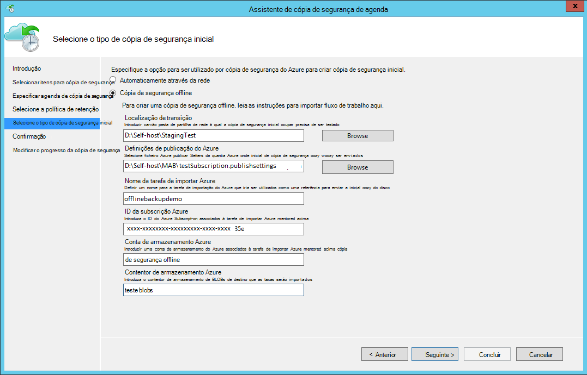

    Eis o ecrã correspondente no Centro de dados proteção Gestor de sistema:  
    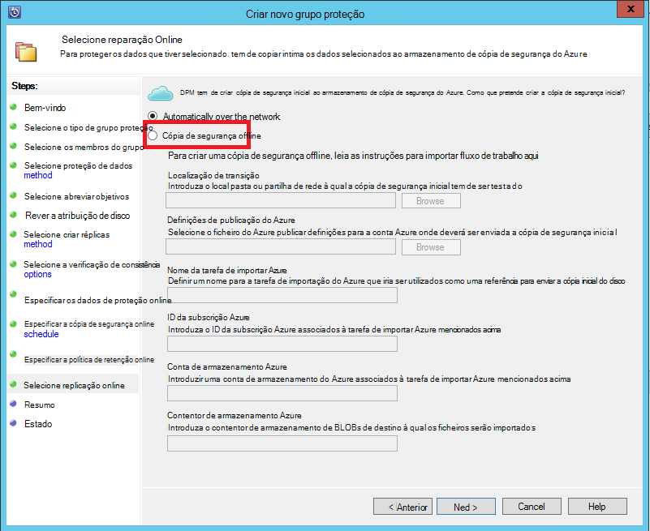

    A descrição das entradas é da seguinte forma:

    - **Localização de transição**: A localização de armazenamento temporário escrita à qual a cópia de segurança inicial. Isto pode ser num computador local ou de uma partilha de rede. Se o computador de cópia e o computador de origem forem diferentes, recomendamos que especifique o caminho de rede completo da localização transição.
    - **Nome da tarefa Azure importar**: O nome exclusivo pelo processo de importação quais Azure serviço e de cópia de segurança do Azure controlar a transferência de dados enviados em discos para Azure.
    - **Definições de publicar Azure**: ficheiro XML que contenha informações sobre o seu perfil de subscrição. Também contém credenciais seguras que estão associadas a sua subscrição. Pode [Transferir o ficheiro](https://manage.windowsazure.com/publishsettings). Forneça o caminho local para o ficheiro de definições de publicar.
    - **ID da subscrição Azure**: Azure o ID da subscrição para a subscrição para onde pretende iniciar a tarefa de importação de Azure. Se tiver múltiplas subscrições Azure, utilize o ID da subscrição que pretende associar a tarefa de importação.
    - **Conta de armazenamento do Azure**: A conta de armazenamento de tipo clássico na subscrição Azure fornecida que será associada à tarefa de importar Azure.
    - **Contentor de armazenamento do Azure**: O nome do blob de armazenamento de destino na conta de armazenamento Azure onde os dados desta tarefa são importados.

    > [AZURE.NOTE] Se registou o servidor para uma Cofre de serviços de recuperação do Azure a partir do [Azure portal](https://portal.azure.com) para as cópias de segurança e não se encontram numa subscrição do fornecedor de solução da nuvem (CSP), ainda pode criar uma conta de armazenamento de tipo clássico a partir do portal do Azure e utilizá-lo para o fluxo de trabalho de cópia de segurança offline.

    Guarde todas estas informações porque tem de introduzi-lo novamente no seguir passos. Apenas a *localização de transição* é necessário se tiver utilizado a ferramenta de preparação do disco Azure para preparar os discos.    

2. Concluir o fluxo de trabalho e, em seguida, selecione **Cópia de segurança agora** na consola de gestão de cópia de segurança do Azure para iniciar a cópia de cópia de segurança offline. A cópia de segurança inicial destina-se para a área de teste como parte deste passo.

    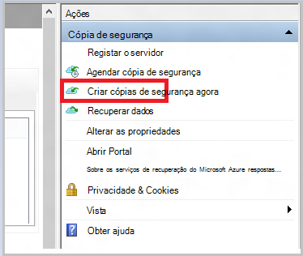

    Para concluir o fluxo de trabalho correspondente no Centro de dados proteção Gestor de sistema, com o botão direito do **Grupo de proteção**e, em seguida, selecione a opção **Criar recuperação ponto** . Em seguida, escolher a opção **Proteção Online** .

    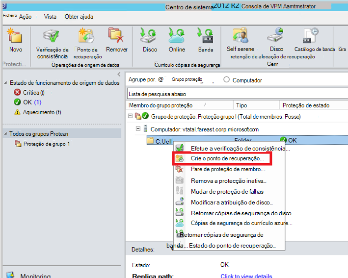

    Após a operação concluída, a localização de transição está pronta para ser utilizado para preparação do disco.

    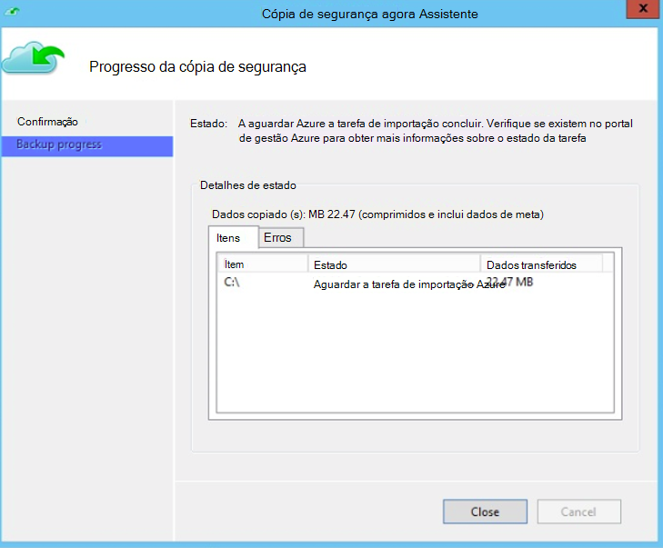

### Preparar uma unidade SATA e criar uma tarefa de importação de Azure utilizando a ferramenta de preparação do disco Azure
A ferramenta de preparação do disco Azure está disponível no directório de instalação do agente de serviços de recuperação (Agosto de 2016 Atualize e posterior) no caminho seguinte.

   *\Microsoft* *Azure* *Recuperação* *Serviços de* * Agent\Utils\*

1. Aceda ao diretório e copie o **AzureOfflineBackupDiskPrep** directório para um computador de cópia no qual as unidades para ser preparada estão instaladas. Certifique-se a seguinte exata relativamente à computador copiar:

      - O computador de cópia pode aceder a localização de transição para o fluxo de trabalho propagar offline utilizando o mesmo caminho de rede que foi fornecido no fluxo de trabalho **Iniciar uma cópia de segurança offline** .

      - BitLocker está ativado no computador.

      - O computador pode aceder ao portal Azure.

      Se for necessário, pode ser o computador de copiar o mesmo que o computador de origem.

2. Abra uma linha de comandos elevada no computador cópia com o directório de ferramenta de preparação do disco Azure como directório actual e execute o seguinte comando:

      *.\AzureOfflineBackupDiskPrep.exe* s: <*Caminho de localização da transição*da > [ñ = <*caminho para PublishSettingsFile*>]

| Parâmetro | Descrição
|-------------|-------------|
|s: <*Caminho de localização da transição*> | Entrada obrigatória que é utilizada para fornecer o caminho para a localização de transição que introduziu no fluxo de trabalho **Iniciar uma cópia de segurança offline** . |
|p: <*caminho para PublishSettingsFile*> | Entrada opcional que é utilizada para fornecer o caminho para o ficheiro de **Definições de publicar Azure** que introduziu no fluxo de trabalho **Iniciar uma cópia de segurança offline** . |

> [AZURE.NOTE] O &lt;caminho para PublishSettingFile&gt; valor é obrigatório quando o computador de cópia e o computador de origem são diferentes.

Quando executa o comando, a ferramenta de pedidos a seleção da tarefa de importação de Azure que corresponde às unidades que precisam de ser preparados. Se apenas uma tarefa de importação única está associada a localização de transição fornecida, verá um ecrã de como aquele que se segue.

   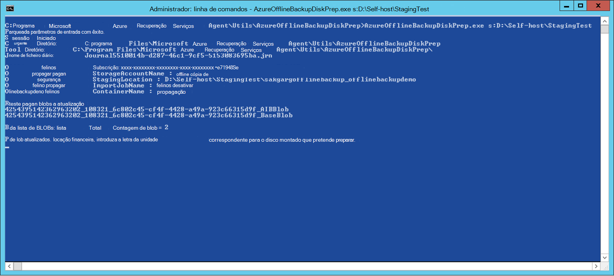  
3. Introduza a letra da unidade sem os dois pontos finais para o disco montado que pretende para se preparar para transferência para Azure. Forneça a confirmação da formatação da unidade quando lhe for pedido.

Em seguida, começa a ferramenta preparar o disco com os dados de cópia de segurança. Poderá ter de anexar discos adicionais quando lhe for pedido pela ferramenta de caso o disco de condição não tem espaço suficiente para os dados de cópia de segurança.  

No final da execução com êxito da ferramenta, um ou mais discos que forneceu são preparados para o envio para Azure. Além disso, é criada uma tarefa de importação com o nome que forneceu durante o fluxo de trabalho **Iniciar uma cópia de segurança offline** no portal do Azure clássico. Por fim, a ferramenta apresenta o endereço de envio ao centro de dados Azure onde precisa de discos devem ser enviados e a ligação para localizar a tarefa de importação no portal do Azure clássico.

    
4. Enviar discos para o endereço que a ferramenta de fornecida e manter o número de controlo para referência futura. 
5. Quando aceder à ligação que a ferramenta de apresentado, verá a conta de armazenamento Azure que especificou no fluxo de trabalho **Iniciar uma cópia de segurança offline** . Aqui pode ver a tarefa de importação recentemente criado no separador **Importar/EXPORTAR** da conta de armazenamento.

   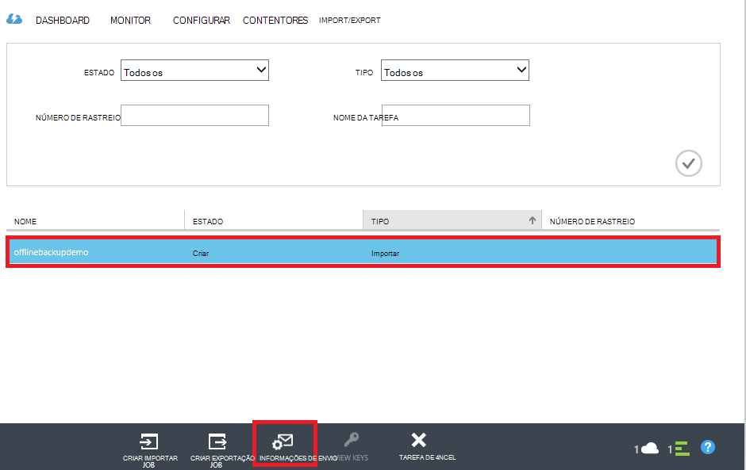 
6. Clique em **Informações do endereço de envio,** na parte inferior da página para atualizar detalhes do contacto, conforme mostrado no ecrã seguinte. A Microsoft utiliza estas informações sobre a enviar os seus discos lhe após a conclusão da tarefa de importação.

   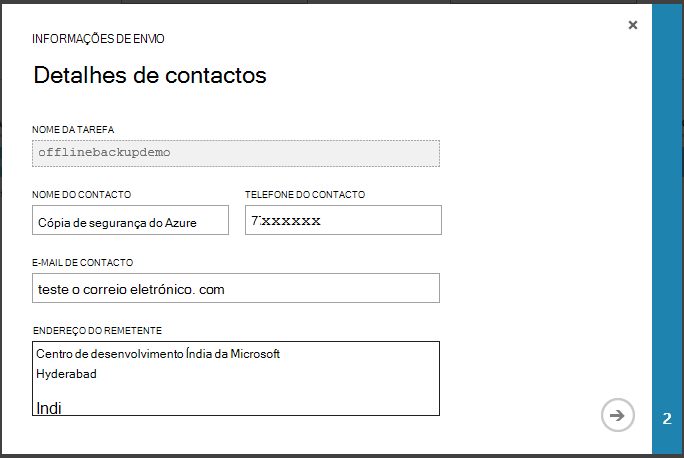 
7. Introduza os detalhes de envio no ecrã seguinte. Forneça os detalhes de **Entrega Carrier** e **Número de rastreio** que correspondem aos discos que enviou para o Centro de dados Azure.

   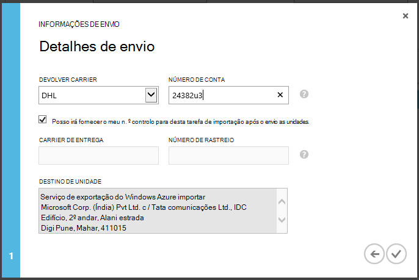 

### Concluir o fluxo de trabalho
Depois de concluir a tarefa de importação, dados de cópia de segurança iniciais estão disponíveis na sua conta de armazenamento. O agente de serviços de recuperação, em seguida, copia os conteúdos dos dados a partir desta conta para a Cofre de cópia de segurança ou serviços de recuperação do Cofre de palavras, consoante o que é aplicável. Da próxima vez cópia de segurança agendada, o agente de cópia de segurança do Azure executa a cópia de segurança utilizarão através da cópia de segurança inicial.

> [AZURE.NOTE] As secções seguintes aplicam-se aos utilizadores de versões anteriores do Azure cópia de segurança que não têm acesso para a ferramenta de preparação do disco Azure.

### Preparar uma unidade SATA

1. Transfira a [Ferramenta do Microsoft Azure importar/exportar](http://go.microsoft.com/fwlink/?linkid=301900&clcid=0x409) para o computador de cópia. Certifique-se de que a localização de transição está acessível a partir do computador que planeia executar o próximo conjunto de comandos. Se for necessário, pode ser o computador de copiar o mesmo que o computador de origem.

2. Deszipe o ficheiro WAImportExport.zip. Execute a ferramenta de WAImportExport que formata a unidade SATA, escreve os dados de cópia de segurança na unidade SATA e encripta-lo. Antes de executar o seguinte comando, certifique-se de que BitLocker está ativado no computador.  

    *.\WAImportExport.exe PrepImport /j: <* JournalFile*> .jrn /id: <*ID de sessão*> /sk: <*StorageAccountKey*> /BlobType:**PageBlob* * /t: <*TargetDriveLetter*>/Formatar / encriptar /srcdir: <*localização de transição*> /dstdir: <*DestinationBlobVirtualDirectory*>/*

    > [AZURE.NOTE] Se tiver instalado a atualização de 2016 de Agosto de cópia de segurança do Azure (ou posterior), certifique-se de que a localização de transição que introduziu é igual a um no ecrã de **Cópia de segurança agora** e contém ficheiros AIB e da Base de Blobs.

| Parâmetro | Descrição
|-------------|-------------|
| /j: <*JournalFile*>| O caminho para o ficheiro de diário. Cada unidade tem de ter um ficheiro de diário. Não tem de ser o ficheiro de diário na unidade de destino. A extensão de ficheiro de diário é .jrn e é criada como parte de executar este comando.|
|/ID: <*ID de sessão*> | O ID da sessão identifica uma sessão de cópia. É utilizado para se certificar de precisa de recuperação de uma sessão de cópia interrompido. Ficheiros que são copiados numa sessão de cópia são armazenados num diretório chamado após o ID da sessão na unidade de destino.|
| /SK: <*StorageAccountKey*> | A chave de conta para a conta de armazenamento à qual os dados são importados. A chave tem de ser a mesma-foi introduzida durante a criação de grupos de cópia de segurança política/proteção.|
| / BlobType | O tipo de Blobs. Este fluxo de trabalho é concluída com êxito apenas se **PageBlob** for especificado. Isto não está a opção predefinida e deve ser mencionado neste comando. |
|/t: <*TargetDriveLetter*> | A letra da unidade sem os dois pontos finais da unidade de disco rígido de destino para a sessão de cópia atual.|
|/Format | A opção para formatar a unidade. Especificar este parâmetro quando a unidade necessita de ser formatado; caso contrário, omita-lo. Antes da ferramenta de formatos a unidade, solicita-lhe uma confirmação a partir da consola. Para suprimir a confirmação, especifique o parâmetro /silentmode.|
|/ encriptar | A opção para encriptar a unidade. Este parâmetro de especificar quando a unidade não tem sido encriptada com BitLocker e tem de ser encriptados pela ferramenta. Se a unidade já tenha sido encriptada com BitLocker, omitir este parâmetro, especifique o parâmetro /bk e forneça a chave de BitLocker existente. Se especificar o parâmetro /format, também terá de especificar a / encriptar parâmetro. |
|/srcdir: <*SourceDirectory*> | O directório de origem que contém os ficheiros sejam copiados para a unidade de destino. Certifique-se de que o nome do directório especificado tem um caminho completo em vez de relativo.|
|/dstdir: <*DestinationBlobVirtualDirectory*> | O caminho para o directório virtual de destino na sua conta de armazenamento Azure. Certifique-se de que utilize nomes de contentor válido quando especificar a directórios virtual de destino ou blobs. Tenha em atenção que nomes do contentor tem de estar em minúsculas.  Este nome do contentor deve ser aquele que introduziu durante a criação de grupos de cópia de segurança política/proteção.|

  > [AZURE.NOTE] Um ficheiro de diário é criado na pasta WAImportExport que captura as informações do fluxo de trabalho completa. Precisa deste ficheiro quando cria uma tarefa de importação no portal do Azure.

  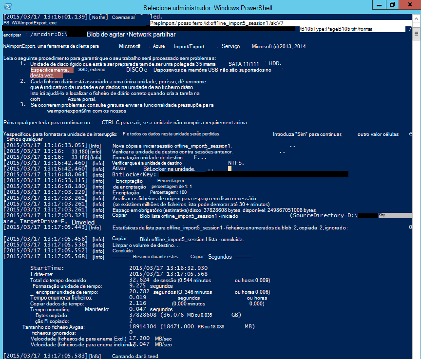

### Criar uma tarefa de importação no portal do Azure
1. Aceda à sua conta de armazenamento no [Azure portal clássico](https://manage.windowsazure.com/), clique em **Importar/exportar**e, em seguida, **Criar a tarefa de importação** no painel de tarefas.

    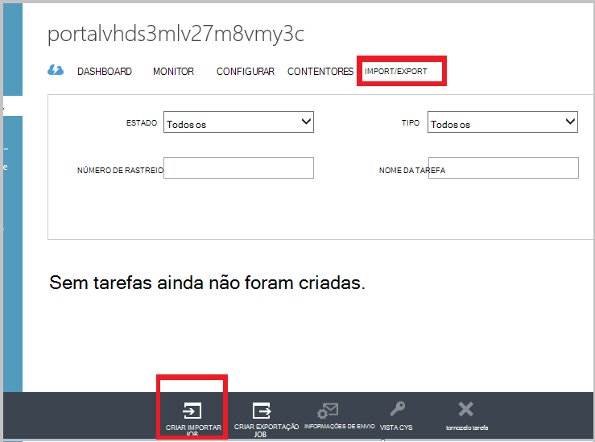

2. No passo 1 do assistente, indicam que tenham preparados sua unidade e que tem o ficheiro de diário unidade disponível.
3. No passo 2 do assistente, fornece informações de contacto da pessoa que é responsável desta tarefa de importação.
4. No passo 3, carregue os ficheiros de diário de unidade obtidos na secção anterior.
5. No passo 4, introduza um nome descritivo para a tarefa de importação que introduziu durante a criação de grupos de cópia de segurança política/proteção. O nome que introduzir pode conter apenas letras em minúsculas, números, hífenes e sublinhado, tem de iniciar por uma letra e não pode conter espaços. É utilizado o nome que escolher para controlar as tarefas enquanto estiverem em curso e depois de estarem concluídas.
6. Em seguida, selecione o seu região do Centro de dados a partir da lista. A região do Centro de dados indica o Centro de dados e o endereço ao qual tem de fornecer o seu pacote.

    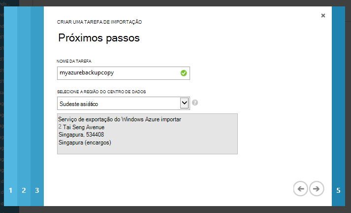

7. No passo 5, selecione o remetente carrier a partir da lista e, introduza o seu número de conta carrier. A Microsoft utiliza esta conta para o envio as unidades lhe depois da tarefa de importação estiver concluída.

8. Enviar o disco e introduza o número de controlo para controlar o estado do envio. Depois do disco são recebidos no Centro de dados, é copiado para a conta de armazenamento e o estado é atualizado.

    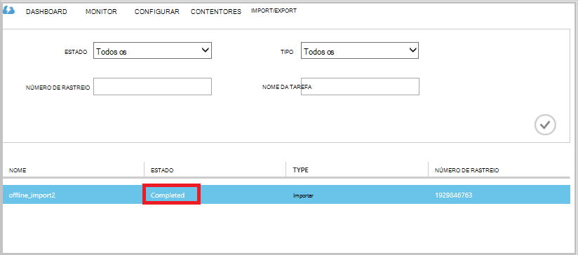

### Concluir o fluxo de trabalho
Depois dos dados de cópia de segurança iniciais estiverem disponíveis na sua conta de armazenamento, o agente de serviços de recuperação do Microsoft Azure copia o conteúdo dos dados a partir desta conta para o Cofre de cópia de segurança ou serviços de recuperação do Cofre de palavras, consoante o que é aplicável. Na próxima vez cópia de segurança agenda, o agente de cópia de segurança do Azure executa a cópia de segurança utilizarão através da cópia de segurança inicial.

## Próximos passos
- Para qualquer questões sobre o fluxo de trabalho do Azure importar/exportar, consulte [utilizar o serviço de importação/exportação do Microsoft Azure para transferir dados ao armazenamento Blob](../storage/storage-import-export-service.md).
- Consulte a secção da cópia de segurança offline das cópias de segurança do Azure [FAQ](backup-azure-backup-faq.md) para quaisquer perguntas sobre o fluxo de trabalho.
