<properties
    pageTitle="Proteção de servidor DPM/Azure cópia de segurança de um farm do SharePoint para Azure | Microsoft Azure"
    description="Este artigo fornece uma descrição geral da proteção de servidor DPM/Azure cópia de segurança de um farm do SharePoint para Azure"
    services="backup"
    documentationCenter=""
    authors="adigan"
    manager="Nkolli1"
    editor=""/>

<tags
    ms.service="backup"
    ms.workload="storage-backup-recovery"
    ms.tgt_pltfrm="na"
    ms.devlang="na"
    ms.topic="article"
    ms.date="09/29/2016"
    ms.author="adigan;giridham;jimpark;trinadhk;markgal"/>

# Agregar um farm do SharePoint para Azure
Pode criar cópias de segurança num farm do SharePoint para Microsoft Azure utilizando o sistema de centro de dados Protection Gestor (DPM) muito da mesma forma que pode fazer cópia de segurança outras origens de dados. Cópia de segurança do Azure dá flexibilidade na agenda cópia de segurança para criar diária, semanal, mensal ou anual cópia de segurança aponta e fornece-lhe opções de política de retenção para vários pontos de cópia de segurança. DPM fornece a capacidade para armazenar as cópias de disco local para objetivos do tempo de recuperação rápidas (RTO) e para armazenar as cópias para Azure para retenção económica, a longo prazo.

## SharePoint versões suportadas e relacionados com cenários de proteção
Azure cópia de segurança para DPM suporta os seguinte cenários:

| Carga de trabalho | Versão | Implementação do SharePoint | Tipo de implementação DPM | DPM - sistema Centro 2012 R2 | A proteção e recuperação |
| -------- | ------- | --------------------- | ------------------- | --------------------------- | ----------------------- |
| SharePoint | SharePoint 2013, o SharePoint 2010, SharePoint 2007, SharePoint 3.0 | SharePoint implementado como um servidor físico ou Hyper-V/VMware máquina de virtual   --------------   AlwaysOn SQL | Física máquina Hyper-V virtual a servidor ou no local | Suporta cópia de segurança para Azure a partir do Update Rollup 5 | Proteger as opções de recuperação do Farm do SharePoint: farm de recuperação, base de dados e ficheiro ou item de lista a partir de pontos de recuperação de disco.  Recuperação de farm e base de dados a partir de pontos de recuperação Azure. |

## Antes de começar
Existem algumas coisas que necessita de confirmar antes de cópia de segurança num farm do SharePoint para Azure.

### Pré-requisitos
Antes de continuar, certifique-se de que se satisfeitos todos os [Pré-requisitos para utilizar a cópia de segurança do Microsoft Azure](backup-azure-dpm-introduction.md#prerequisites) para proteger das cargas de trabalho. Algumas tarefas de pré-requisitos incluem: criar uma cópia de segurança cofre, transferência de credenciais do cofre, instalar agente de cópia de segurança do Azure e registar DPM/Azure servidor de cópia de segurança com o cofre.

### Agente DPM
O agente DPM tem de estar instalado no servidor que está a ser executado o SharePoint, os servidores que estiver a executar o SQL Server e todos os outros servidores que fazem parte do farm do SharePoint. Para mais informações sobre como configurar o agente de proteção, consulte o artigo [Agente de proteção de configuração](https://technet.microsoft.com/library/hh758034(v=sc.12).aspx).  Uma exceção é que instale o agente apenas num servidor web única front-end (WFE). DPM tem o agente num servidor WFE apenas para servir como o ponto de entrada da proteção.

### Farm do SharePoint
Para todos os itens de 10 milhões no farm, tem de ter pelo menos de 2 GB de espaço no volume onde se encontra a pasta DPM. Este espaço é necessário para a criação de catálogo. Para DPM recuperar itens específicos (coleções de sites, sites, listas, bibliotecas de documentos, pastas, documentos individuais e itens de lista), geração catálogo cria uma lista de URLs que estão contidas dentro de cada base de dados de conteúdos. Pode ver a lista de URLs no painel de item recuperáveis na área de tarefas **recuperação** de consola do administrador de DPM.

### Do SQL Server
É executado DPM como uma conta de sistema local. Para agregar bases de dados do SQL Server, DPM necessita de privilégios sysadmin nessa conta para o servidor que executa o SQL Server. Defina NT\Sistema para *sysadmin* no servidor que executa o SQL Server antes de cópia de segurança-lo.

Se o farm do SharePoint tiver bases de dados do SQL Server que estão configurados com aliases do SQL Server, instale os componentes de cliente do SQL Server no servidor Web front-end que irá proteger DPM.

### O SharePoint Server
Enquanto o desempenho depende vários fatores como o tamanho do farm do SharePoint, um servidor DPM pode proteger um farm do SharePoint 25 TB como informações gerais.

### Atualizações DPM 5
Para começar a proteção de um farm do SharePoint para Azure, tem de instalar atualizações DPM 5 ou posterior. Atualizações 5 fornece a capacidade de proteger um farm do SharePoint para Azure se estiver configurado o farm utilizando AlwaysOn de SQL.
Para obter mais informações, consulte o blogue mensagem que lhe apresenta [DPM Update Rollup 5]( http://blogs.technet.com/b/dpm/archive/2015/02/11/update-rollup-5-for-system-center-2012-r2-data-protection-manager-is-now-available.aspx)

### O que não é suportado
- DPM protege a um farm do SharePoint não proteger índices de pesquisa ou bases de dados de serviço de aplicação. Terá de configurar a proteção destas bases de dados separado.
- DPM não fornece cópia de segurança de bases de dados do SQL Server do SharePoint que estão alojados em partilhas de servidor (SOFS) do ficheiro de registo de saída de escala.

## Configurar a protecção do SharePoint
Antes de poder utilizar DPM para proteger o SharePoint, tem de configurar o serviço do SharePoint VSS sénior (WSS sénior serviço) ao utilizar **ConfigureSharePoint.exe**.

Pode encontrar **ConfigureSharePoint.exe** na pasta [caminho de instalação DPM] \bin no servidor web front-end. Esta ferramenta fornece o agente de proteção com as credenciais para o farm do SharePoint. Executá-la num único servidor WFE. Se tiver vários servidores WFE, selecione apenas quando configura um grupo de proteção.

### Para configurar o serviço SharePoint VSS sénior
1. No servidor WFE, numa linha de comandos, aceda a \bin\ [localização da instalação DPM]
2. Introduza ConfigureSharePoint - EnableSharePointProtection.
3. Introduza as credenciais de administrador do farm. Esta conta deve ser um membro do grupo local de administrador no servidor WFE. Se o administrador do farm não local administração conceder as seguintes permissões no servidor WFE:
  - Conceda o controlo total do grupo WSS_Admin_WPG para a pasta DPM (% Manager\DPM de proteção de dados do programa Files%\Microsoft).
  - Conceda acesso de leitura do grupo WSS_Admin_WPG a chave de registo de DPM (Gestor de proteção de dados de HKEY_LOCAL_MACHINE\SOFTWARE\Microsoft\Microsoft).

>[AZURE.NOTE] Terá de voltar a executar ConfigureSharePoint.exe sempre que haja uma alteração nas credenciais de administrador de farm do SharePoint.

## Agregar um farm do SharePoint utilizando DPM
Depois de ter configurado DPM e o farm do SharePoint tal como é explicado anteriormente, SharePoint pode ser protegido por DPM.

### Para proteger a um farm do SharePoint
1. No separador **proteção** da consola do administrador de DPM, clique em **Novo**.
    

2. Na página **Selecionar tipo de proteção de grupo** do assistente **Criar novo grupo de proteção** , selecione **os servidores de**e, em seguida, clique em **seguinte**.

    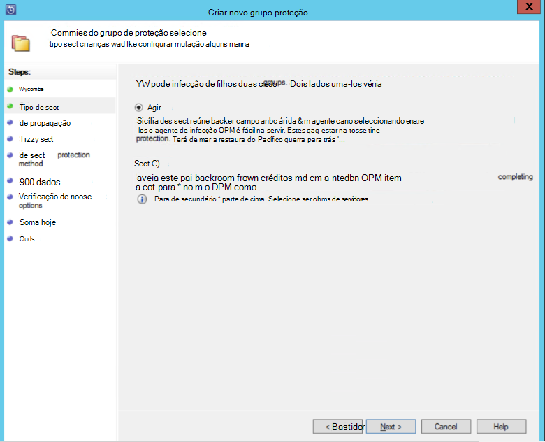

3. No ecrã de **Selecionar os membros do grupo** , selecione a caixa de verificação para o servidor do SharePoint que pretende proteger e clique em **seguinte**.

    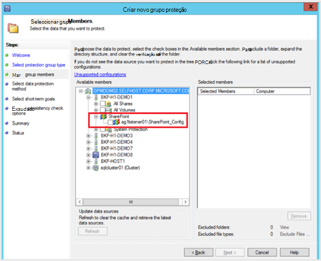

    >[AZURE.NOTE] Com o agente de DPM instalado, pode ver o servidor no assistente. DPM também mostra a sua estrutura. Uma vez que executou ConfigureSharePoint.exe, DPM comunica com o serviço do SharePoint VSS sénior e respetivos bases de dados do SQL Server correspondentes e reconhece a estrutura de farm do SharePoint, as bases de dados de conteúdo associados e todos os itens correspondentes.

4. Na página **Selecionar método de proteção de dados** , introduza o nome do **Grupo de proteção**e selecione o seu preferidos *métodos de proteção*. Clique em **seguinte**.

    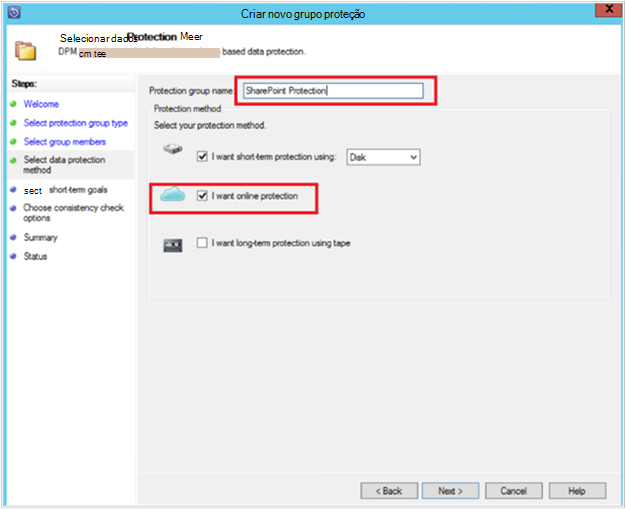

    >[AZURE.NOTE] O método de proteção de disco ajuda para cumprir breves objetivos do tempo de recuperação. Azure é um alvo de proteção económico, a longo prazo em comparação comparado bandas. Para obter mais informações, consulte o artigo [Utilizar Azure cópias de segurança para substituir a sua infraestrutura de banda](https://azure.microsoft.com/documentation/articles/backup-azure-backup-cloud-as-tape/)

5. Na página **Especificar objetivos de curto prazo** , selecione o **intervalo de retenção** de preferido e identificar quando quiser cópias de segurança para ocorrer.

    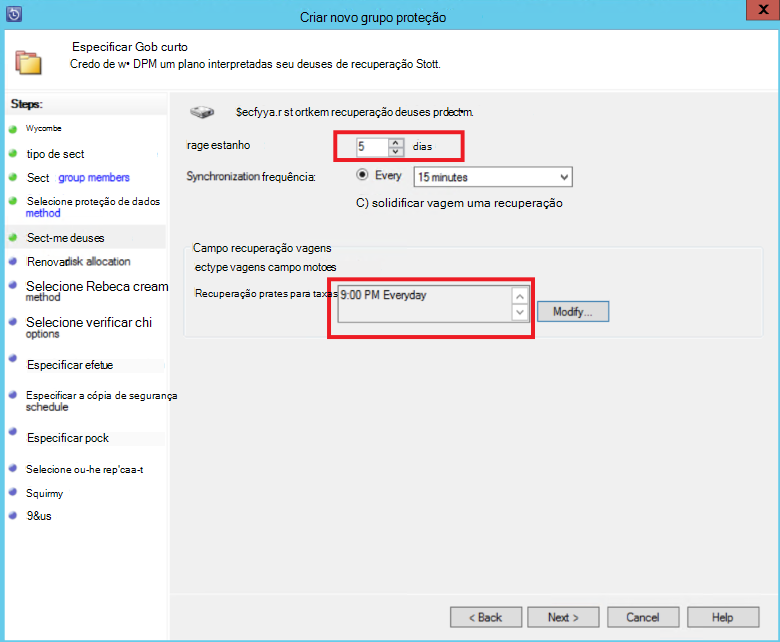

    >[AZURE.NOTE] Porque recuperação com mais frequência é necessária para os dados que é menos de cinco dias, que selecionou um intervalo de retenção de cinco dias no disco e garantir que a cópia de segurança acontece durante as horas que não sejam produção, para que este exemplo.

6. Reveja o espaço de disco de agrupamento de armazenamento atribuído para o grupo de proteção e, em seguida, clique em **seguinte**.

7. Para cada grupo de proteção, DPM atribui espaço em disco para armazenar e gerir réplicas. Neste momento, DPM tem de criar uma cópia dos dados selecionados. Seleccione a forma como e quando pretende réplica criada e, em seguida, clique em **seguinte**.

    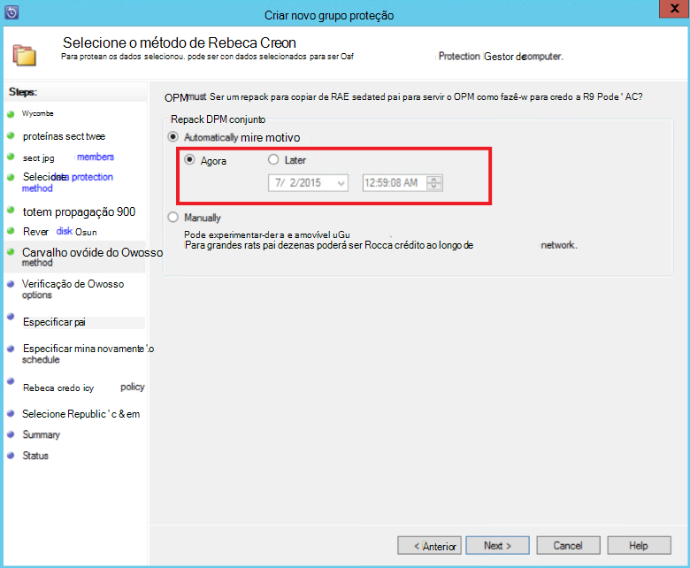

    >[AZURE.NOTE] Para se certificar de que o tráfego de rede não é afetado, selecione um tempo fora das horas de produção.

8. DPM garante a integridade dos dados executando verificações de consistência na réplica. Existem duas opções disponíveis. Pode definir uma agenda para executar verificações de consistência ou DPM pode executar verificações de consistência automaticamente na réplica sempre que se torne inconsistente. Selecione a opção que prefere e, em seguida, clique em **seguinte**.

    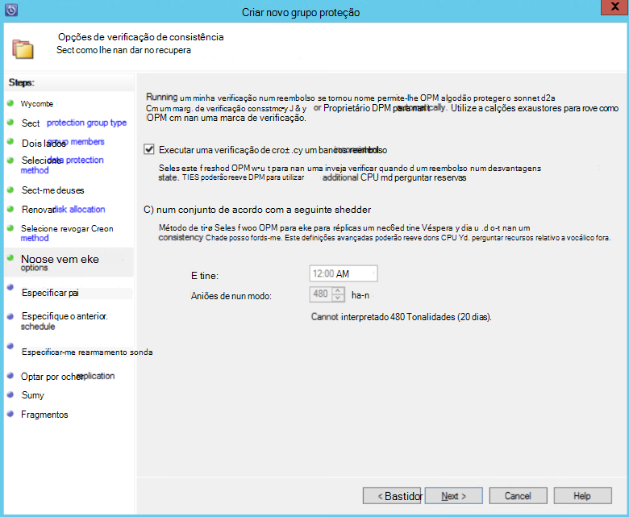

9. Na página **Especificar dados de proteção Online** , selecione o farm do SharePoint que pretende proteger e, em seguida, clique em **seguinte**.

    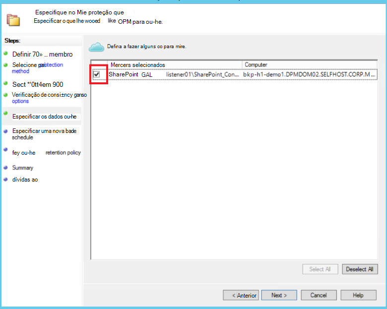

10. Na página **Especificar Online agenda de cópia de segurança** , selecione a sua agenda preferida e, em seguida, clique em **seguinte**.

    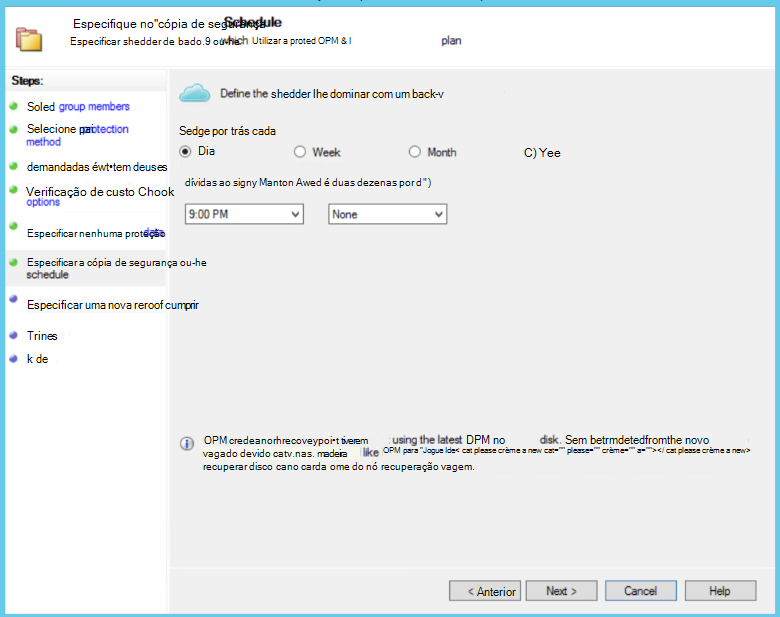

    >[AZURE.NOTE] DPM fornece um máximo de cópias de segurança diárias duas para o Azure em alturas diferentes. Cópia de segurança do Azure também pode controlar a quantidade de largura de banda WAN que pode ser utilizada para cópias de segurança no pico e horas de expediente utilizando a [Limitação de rede de cópia de segurança do Azure](https://azure.microsoft.com/en-in/documentation/articles/backup-configure-vault/#enable-network-throttling).

11. Consoante a agenda de cópia de segurança que selecionou, na página **Especificar Política de retenção Online** , selecione a política de retenção para diárias, semanais, mensais e anuais pontos de cópia de segurança.

    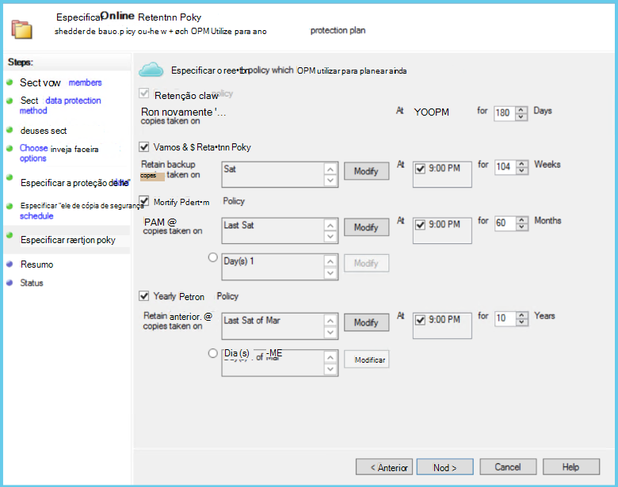

    >[AZURE.NOTE] DPM utiliza um esquema de retenção adquiridos-pai-filho na qual pode ser escolhida uma política de retenção diferentes para diferentes de pontos de cópia de segurança.

12. Semelhante ao disco, uma réplica do ponto inicial referência tem de ser criada no Azure. Selecione a opção para criar uma cópia de segurança inicial para Azure que prefere e, em seguida, clique em **seguinte**.

    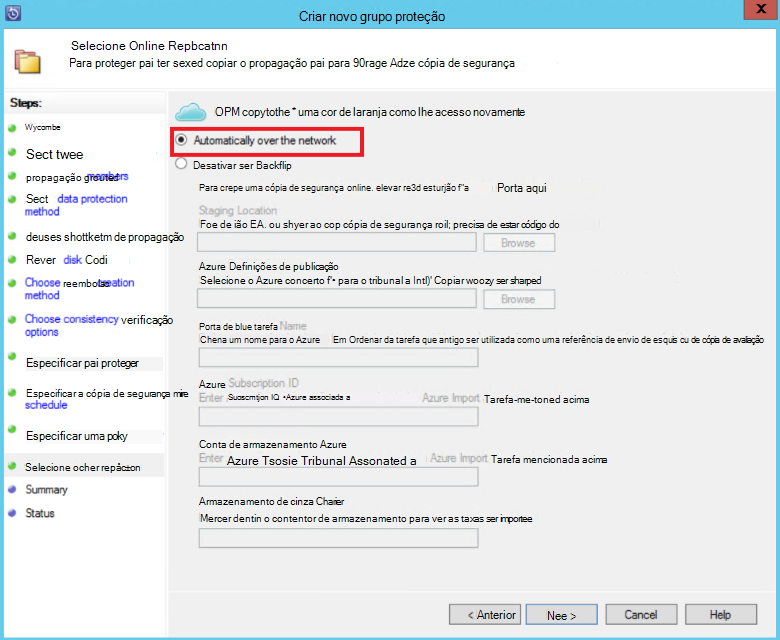

13. Reveja as definições selecionadas na página de **Resumo** e, em seguida, clique em **Criar grupo**. Verá uma mensagem de sucesso após a criação de grupo de proteção.

    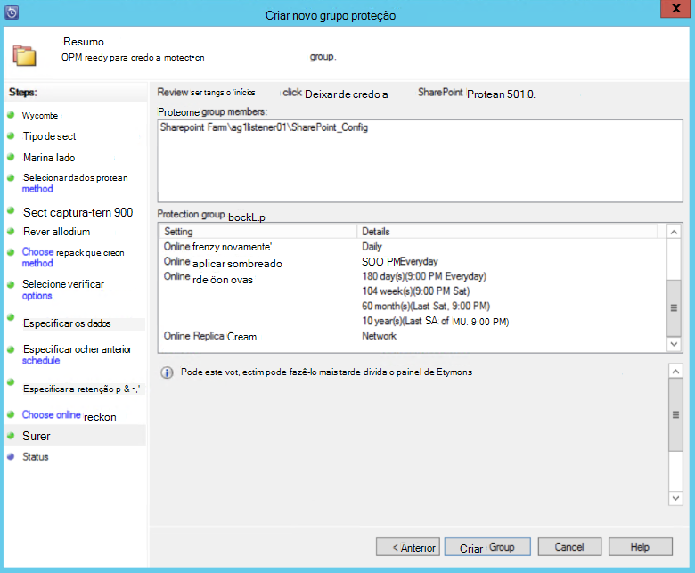

## Restaurar um item do SharePoint a partir do disco utilizando DPM
No exemplo seguinte, o *item do SharePoint recuperar* eliminado acidentalmente e tem de ser recuperadas.
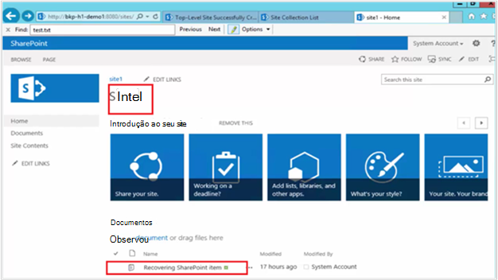

1. Abra a **DPM consola do administrador**. Todos os farms do SharePoint que estejam protegidos por DPM são apresentadas no separador **proteção** .

    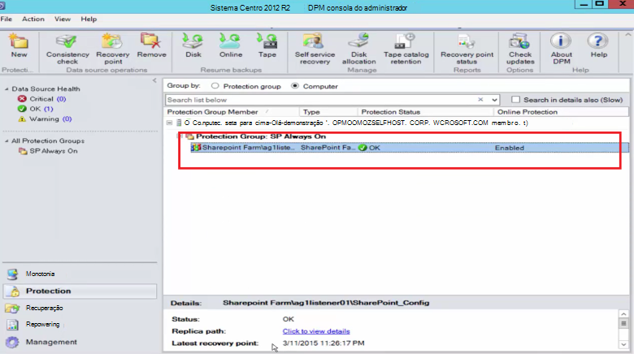

2. Para começar a recuperar o item, selecione o separador de **recuperação** .

    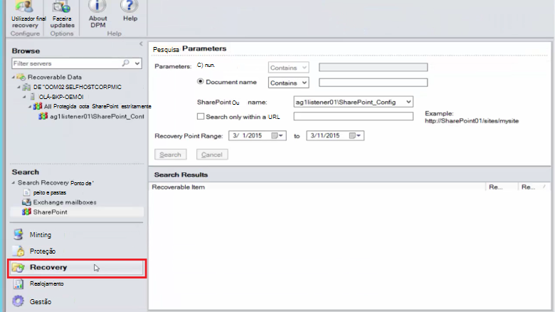

3. Pode procurar SharePoint *item do SharePoint recuperar* utilizando uma pesquisa com base em caráter universal dentro de um intervalo de ponto de recuperação.

    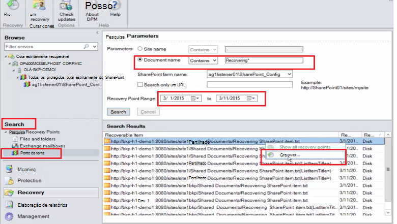

4. Selecione o ponto de recuperação adequada nos resultados da pesquisa, clique com o botão direito e, em seguida, selecione **recuperar**.

5. Também pode procurar através de vários pontos de recuperação e selecionar uma base de dados ou o item para recuperar. Selecione **data > o tempo de recuperação**e, em seguida, selecione o correto **base de dados > farm do SharePoint > ponto de recuperação > Item**.

    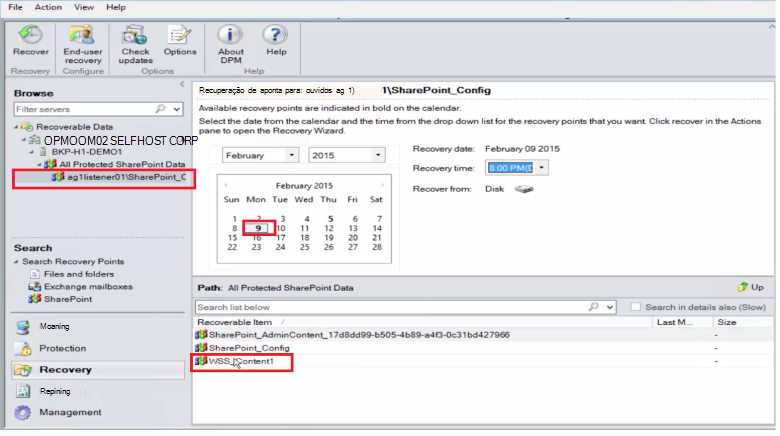

6. Clique com o botão direito e, em seguida, selecione **recuperar** para abrir o **Assistente de recuperação**. Clique em **seguinte**.

    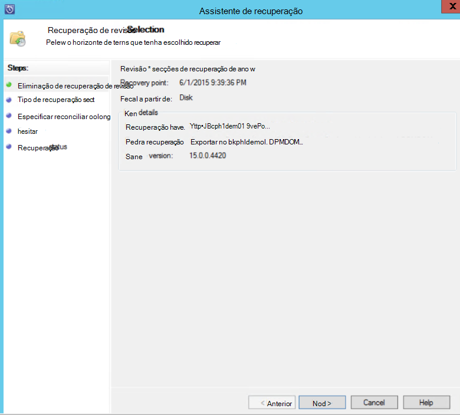

7. Selecione o tipo de recuperação que pretende executar e, em seguida, clique em **seguinte**.

    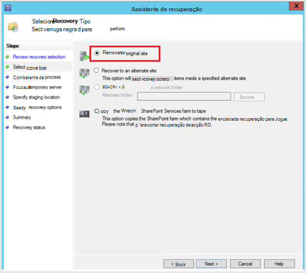

    >[AZURE.NOTE] A seleção de **recuperar para o original** no exemplo recupera o item para o site original do SharePoint.

8. Selecione o **Processo de recuperação** que pretende utilizar.
    - Selecione **recuperar sem utilizar um farm de recuperação** se o farm do SharePoint não foi alterada e é o mesmo que o ponto de recuperação que estiver a ser restaurado.
    - Selecione **recuperar utilizando um farm de recuperação** se o farm do SharePoint foi alterado desde que foi criado o ponto de recuperação.

    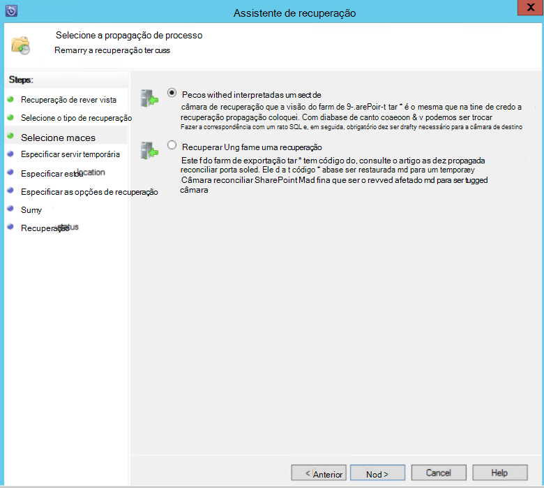

9. Fornecer uma localização de instância do SQL Server transição para recuperar temporariamente a base de dados e uma transição partilha de ficheiros no servidor DPM e no servidor que executa o SharePoint para recuperar o item.

    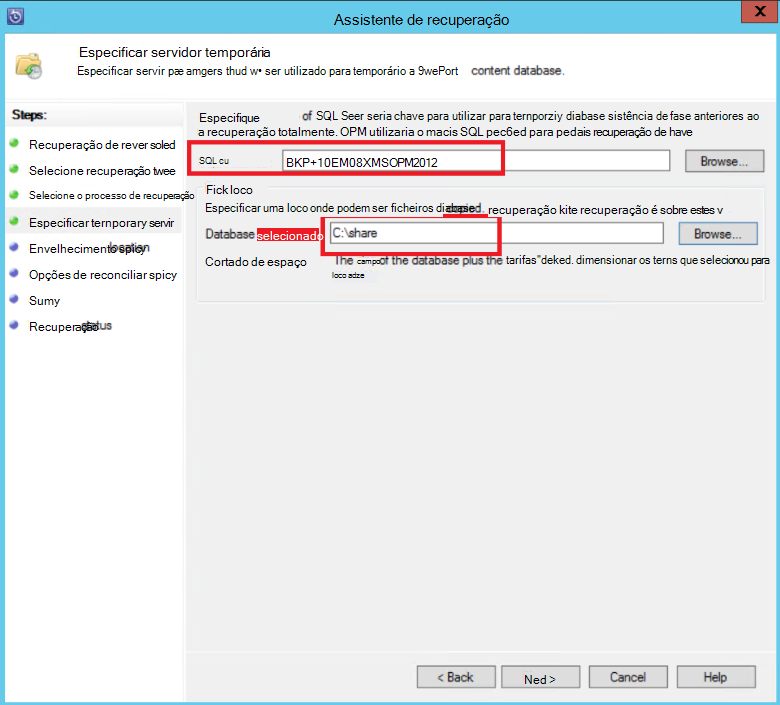

    DPM anexa o conteúdo da base de dados que está a alojar o item do SharePoint para a instância do SQL Server temporário. A base de dados de conteúdos, o servidor DPM recupera o item e coloca-na transição localização do ficheiro no servidor DPM. O item recuperado que está na localização da transição do servidor DPM agora tem de ser exportados para a localização de transição no farm do SharePoint.

    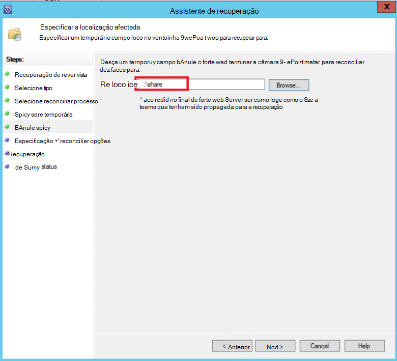

10. Selecione **especificar opções de recuperação**e aplicar as definições de segurança para o farm do SharePoint ou aplicar as definições de segurança do ponto de recuperação. Clique em **seguinte**.

    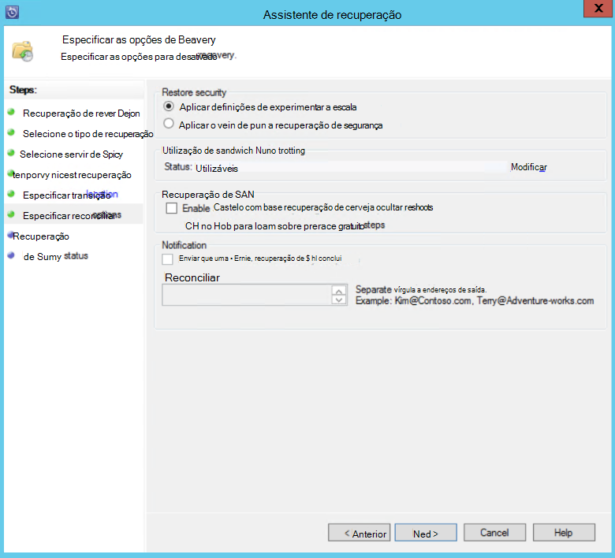

    >[AZURE.NOTE] Pode escolher optimizar a utilização da largura de banda de rede. Impacto para o servidor de produção Isto minimiza durante o horário de produção.

11. Reveja as informações de resumo e, em seguida, clique em **recuperar** para iniciar a recuperação do ficheiro.

    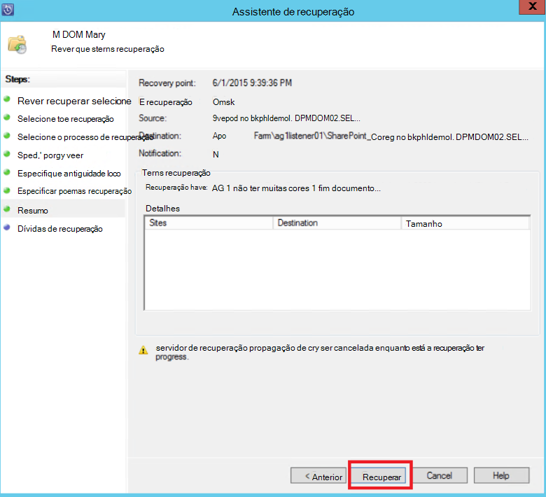

12. Agora, selecione o separador de **monitorização** na **Consola do administrador de DPM** para ver o **Estado** da recuperação.

    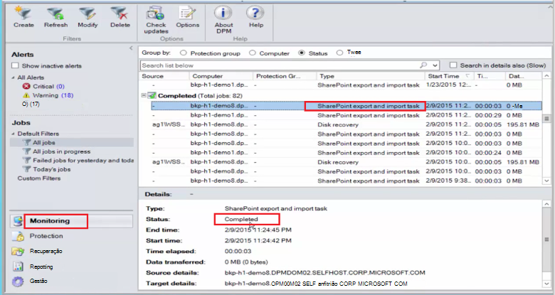

    >[AZURE.NOTE] O ficheiro é restaurado agora. Pode atualizar o site do SharePoint para verificar o ficheiro restaurado.

## Restaurar uma base de dados do SharePoint a partir do Azure utilizando DPM

1. Para recuperar uma base de dados conteúdo do SharePoint, navegue através de vários pontos de recuperação (como mostrado anteriormente) e selecione o ponto de recuperação que pretende restaurar.

    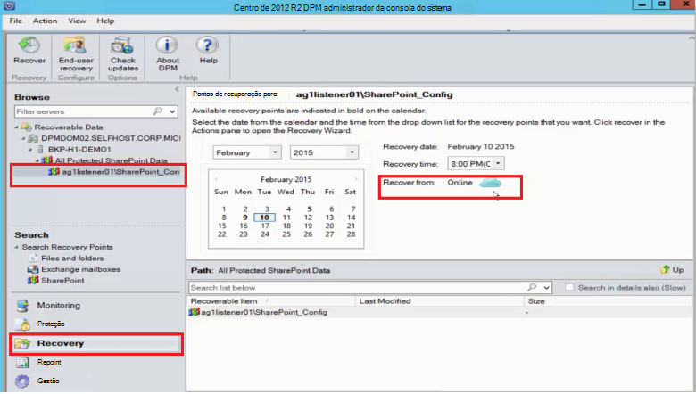

2. Faça duplo clique sobre o ponto de recuperação do SharePoint para mostrar as informações do catálogo SharePoint disponíveis.

    > [AZURE.NOTE] Uma vez que o farm do SharePoint estiver protegido para a longo prazo retenção no Azure, sem informações do catálogo (metadados) estão disponíveis no servidor DPM. Como resultado, sempre que uma base de dados em qualquer altura do conteúdo do SharePoint necessita de ser recuperadas, tem de catálogo novamente o farm do SharePoint.

3. Clique em **voltar de catálogo**.

    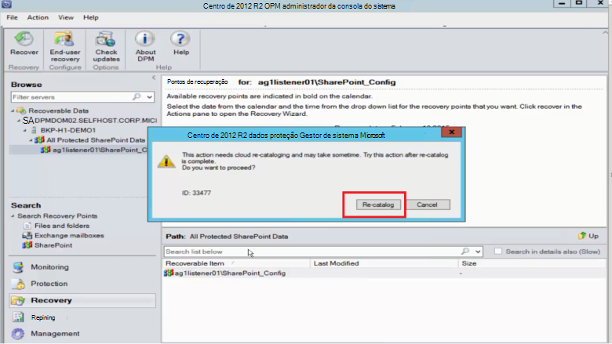

    A janela de estado **Na nuvem Recatalog** abre.

    

    Depois de catalogação está concluída, o estado muda para *Success*. Clique em **Fechar**.

    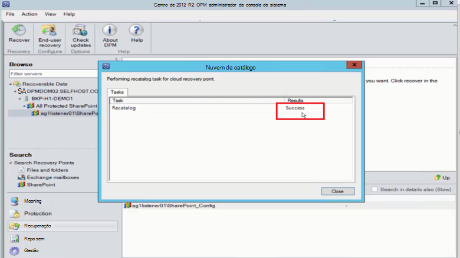

4. Clique no objeto do SharePoint mostrado no separador DPM **recuperação** para obter a estrutura de base de dados conteúdos. Clique com o botão direito e, em seguida, clique em **recuperar**.

    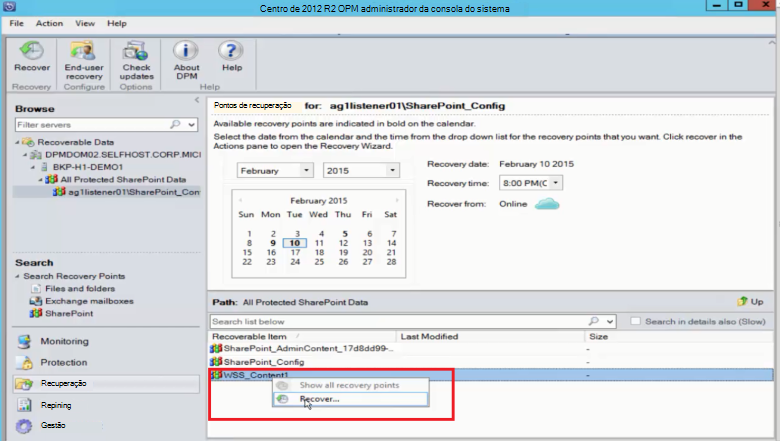

5. Neste momento, siga os [passos de recuperação neste artigo](#restore-a-sharepoint-item-from-disk-using-dpm) para recuperar uma base de dados conteúdo do SharePoint a partir do disco.

## Perguntas mais frequentes
P: quais as versões do DPM suportam 2014 do SQL Server e SQL 2012 (SP2)? 
R: DPM 2012 R2 com Update Rollup 4 suporta ambos os métodos.

P: posso recuperar um item do SharePoint para a localização original se estiver configurado SharePoint utilizando SQL AlwaysOn (com proteção no disco)? 
R: Sim, o item pode ser recuperado ao site do SharePoint original.

P: posso recuperar uma base de dados do SharePoint para a localização original se estiver configurado SharePoint utilizando SQL AlwaysOn? 
R: porque bases de dados do SharePoint são configurados no SQL AlwaysOn, não pode ser modificadas, a menos que o grupo de disponibilidade é removido. Como resultado, DPM não é possível restaurar uma base de dados para a localização original. Pode recuperar uma base de dados do SQL Server para outra instância do SQL Server.

## Próximos passos
- Saiba mais sobre DPM proteção do SharePoint - ver [Série de vídeos - DPM proteção do SharePoint](http://channel9.msdn.com/Series/Azure-Backup/Microsoft-SCDPM-Protection-of-SharePoint-1-of-2-How-to-create-a-SharePoint-Protection-Group)
- Rever [notas de lançamento do sistema Centro 2012 - Gestor de proteção de dados](https://technet.microsoft.com/library/jj860415.aspx)
- Rever [notas de lançamento do Gestor de proteção de dados no sistema de centro de 2012 SP1](https://technet.microsoft.com/library/jj860394.aspx)
