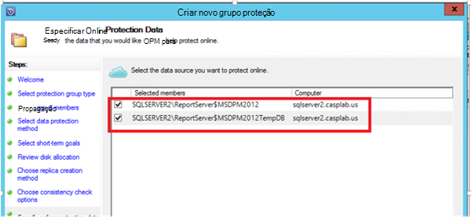
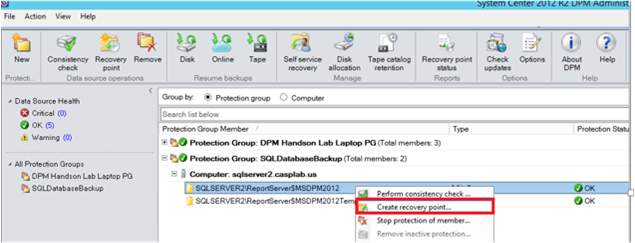

<properties
    pageTitle="Azure cópia de segurança para cargas de trabalho do SQL Server utilizando DPM | Microsoft Azure"
    description="Uma introdução à cópias de segurança bases de dados do SQL Server utilizando o serviço de cópia de segurança do Azure"
    services="backup"
    documentationCenter=""
    authors="adigan"
    manager="Nkolli1"
    editor=""/>

<tags
    ms.service="backup"
    ms.workload="storage-backup-recovery"
    ms.tgt_pltfrm="na"
    ms.devlang="na"
    ms.topic="article"
    ms.date="09/27/2016"
    ms.author="adigan;giridham; jimpark;markgal;trinadhk"/>

# Azure cópia de segurança para utilizar DPM cargas de trabalho do SQL Server

Este artigo orienta-o através dos passos de configuração de cópia de segurança das bases de dados do SQL Server utilizando a cópia do Azure.

Para fazer cópia de segurança bases de dados do SQL Server para Azure, precisa de uma conta Azure. Se não tiver uma conta, pode criar uma conta de avaliação gratuita apenas duas minutos. Para obter detalhes, consulte o artigo [Versão de avaliação gratuita do Azure](https://azure.microsoft.com/pricing/free-trial/).

A gestão da cópia de segurança da base de dados do SQL Server Azure e recuperação a partir do Azure envolve os três passos:

1. Crie uma política de cópia de segurança para proteger a bases de dados do SQL Server para Azure.
2. Crie cópias de segurança a pedido para Azure.
3. Recupera a base de dados a partir do Azure.

## Antes de começar
Antes de começar, certifique-se de que todos os [Pré-requisitos](../backup-azure-dpm-introduction.md#prerequisites) para utilizar a cópia de segurança do Microsoft Azure para proteger das cargas de trabalho são satisfeitos. As pré-requisitos de folha de rosto tarefas como: criar uma cópia de segurança cofre, cofre credenciais a transferir, instalar o agente de cópia de segurança do Azure e registar o servidor com o cofre.

## Criar uma política de cópia de segurança para proteger a bases de dados do SQL Server para Azure

1. No servidor DPM, clique em área de trabalho de **proteção** .

2. No Friso ferramentas, clique em **Novo** para criar um novo grupo de proteção.

    

3. DPM mostra o ecrã principal com as orientações sobre como criar um **Grupo proteção**. Clique em **seguinte**.

4. Selecione **Servers**.

    

5. Expanda a máquina de SQL Server onde estiverem presentes as bases de dados para ser cópias de segurança. DPM mostra várias origens de dados que podem ser cópia de segurança a partir nesse servidor. Expanda a **Todas as partilhas de SQL** e selecione as bases de dados (neste caso podemos selecionado ReportServer$ MSDPM2012 e ReportServer$ MSDPM2012TempDB) para ser cópias de segurança. Clique em **seguinte**.

    

6. Forneça um nome para o grupo de proteção e selecione a caixa de verificação **pretendo proteção online** .

    

7. No ecrã de **Especificar objetivos de curto prazo** , inclua as entradas necessárias para criar cópia de segurança aponta para o disco.

    Aqui Vemos que o **intervalo de retenção** está definido para *5 dias*, **frequência de sincronização** está definido para uma vez a cada *15 minutos* que é a frequência com que a cópia de segurança é disponibilizada. **Cópia de segurança completo Express** está definido para *8:00 p. m*.

    

    >[AZURE.NOTE] Em 8:00 PM (de acordo com a entrada ecrã) é criado um ponto de cópia de segurança diariamente, transferindo os dados que foi modificados a partir do ponto de cópia de segurança de 8:00 PM o dia anterior. Este processo é denominado **Express cópia de segurança completa**. Enquanto a transação registos são sincronizados a cada 15 minutos, se existir uma necessidade de recuperar a base de dados na 9:00 PM –, em seguida, o ponto de é criado pela reproduzir os registos a partir do último expressar ponto de cópia de segurança completa (8 pm neste caso).

8. Clique em **seguinte**

    DPM mostra o espaço de armazenamento geral disponível e a utilização do espaço em disco potenciais.

    

    Por predefinição, DPM cria um volume por origem de dados (base de dados do SQL Server) que é utilizado para a cópia de segurança inicial. Utilizar esta abordagem, Gestor de disco lógicos (LDM) limita a proteção de DPM a origens de 300 dados (bases de dados do SQL Server). Para contornar esta limitação, selecione a **cocriação localizar dados no conjunto de armazenamento DPM**, opção. Se utilizar esta opção, DPM utiliza um único volume para várias origens de dados, que lhe permite DPM proteger até 2000 bases de dados do SQL.

    Se **aumentar automaticamente os volumes** opção está selecionada, DPM pode ter em consideração o volume de cópia de segurança maior à medida que aumenta os dados de produção. Se a opção **automaticamente aumentar os volumes** não estiver selecionada, DPM limita o armazenamento de cópia de segurança utilizado para as origens de dados no grupo proteção.

9. Os administradores são dada a escolha de transferir este cópia de segurança inicial manualmente (desativar network) para evitar o congestionamento de largura de banda ou através da rede. Pode também configurar a hora em que a transferência inicial pode ocorrer. Clique em **seguinte**.

    

    A cópia de segurança inicial requer a transferência da origem de dados completa (base de dados do SQL Server) a partir do servidor de produção (máquina do SQL Server) para o servidor DPM. Estes dados poderão ser grandes e transferir os dados através da rede pode exceder largura de banda. Por este motivo, podem escolher os administradores para o qual transferir a cópia de segurança inicial: **manualmente** (utilizando amovível) para evitar congestionamento da largura de banda ou **automaticamente através da rede** (uma vez especificado).

    Assim que a cópia de segurança inicial estiver concluída, o resto das cópias de segurança são utilizarão cópias de segurança na cópia de segurança inicial. Cópias de segurança utilizarão tendem para ser pequeno e facilmente são transferidas através da rede.

10. Escolha quando pretende que a verificação de consistência para executar e clique em **seguinte**.

    

    DPM pode executar uma consistência verificação para verificar a integridade do ponto de cópia de segurança. Calcula a soma de verificação do ficheiro de cópia de segurança no servidor de produção (máquina do SQL Server neste cenário) e os dados de cópia de segurança para esse ficheiro na DPM. No caso de um conflito, é assumido que o ficheiro de cópia de segurança na DPM está danificado. DPM corrijam os dados de cópia de segurança ao enviar os blocos de correspondente para o erro de correspondência de soma de verificação. Como a verificação de consistência é uma operação de desempenho-a com um grau elevado, os administradores têm a opção de agendamento a verificação de consistência ou executá-lo automaticamente.

11. Para especificar proteção online das origens de dados, selecione as bases de dados para ser protegidos para Azure e clique em **seguinte**.

    

12. Os administradores podem escolher agendas de cópia de segurança e políticas de retenção que satisfaça as suas políticas da organização.

    

    Neste exemplo, cópias de segurança são tomadas uma vez por dia, 12:00 PM e 8 PM (parte inferior do ecrã)

    >[AZURE.NOTE] É aconselhável ter alguns pontos de recuperação de curto prazo disco, para a recuperação rápida. Estes pontos de recuperação são utilizados para "recuperação operacional". Azure serve como uma localização noutro local boa com SLA mais elevadas e garante disponibilidade.

    **Melhores práticas**: Certifique-se de que as cópias de segurança do Azure são agendadas após a conclusão das cópias de segurança de disco local utilizando DPM. Permite que a cópia de segurança do disco mais recente sejam copiados para Azure.

13. Selecione a agenda de política de retenção. Os detalhes sobre como funciona a política de retenção são fornecidos no [Utilizar Azure cópias de segurança para substituir um artigo de infraestrutura de banda](backup-azure-backup-cloud-as-tape.md).

    

    Neste exemplo:

    - Cópias de segurança são tomadas uma vez por dia, 12:00 PM e 8 PM (parte inferior do ecrã) e estão retidas para 180 dias.
    - A cópia de segurança no Sábado às 12:00 é mantida para 104 semanas
    - A cópia de segurança no último Sábado às 12:00 é mantida para 60 meses
    - A cópia de segurança no último Sábado de Março de às 12:00 é mantida para 10 anos

14. Clique em **seguinte** e selecione a opção adequada para transferir a cópia de segurança inicial para Azure. Pode escolher **automaticamente através da rede** ou **Cópia de segurança Offline**.

    - **Automaticamente através da rede** transfere os dados de cópia de segurança para Azure de acordo com a agenda escolhida para a cópia de segurança.
    - Como funciona a **Cópia de segurança Offline** é explicado em [fluxo de trabalho de cópia de segurança Offline no Azure cópia de segurança](backup-azure-backup-import-export.md).

    Escolha o mecanismo de transferência relevantes para enviar a cópia de segurança inicial para Azure e clique em **seguinte**.

15. Após rever os detalhes da política no ecrã de **Resumo** , clique no botão **Criar grupo** para concluir o fluxo de trabalho. Pode clicar no botão **Fechar** e monitorizar o progresso da tarefa na área de trabalho de monitorização.

    

## A pedido a cópia de segurança de uma base de dados do SQL Server
Enquanto os passos anteriores criado uma política de cópia de segurança, um ponto"recuperação" só é criado quando ocorre a cópia de segurança primeira. Em vez de aguardar que o Programador de tarefas para fazem ricochete, os passos indicados abaixo accionador a criação de uma recuperação aponte manualmente.

1. Aguarde até que o estado de grupo de proteção apresenta **OK** para a base de dados antes de criar o ponto de recuperação.

    

2. Com o botão direito na base de dados e selecione o **Ponto de recuperação de criar**.

    

3. Selecione **Proteção Online** no menu pendente e clique em **OK**. Esta ação inicia a criação de um ponto de recuperação no Azure.

    

4. Pode ver o progresso da tarefa na área de trabalho de **monitorização** onde pode encontrar um progresso no tarefa como descrito na figura seguinte.

    

## Recuperar uma base de dados do SQL Server a partir do Azure
Os passos seguintes são necessários para recuperar uma entidade protegida (base de dados do SQL Server) a partir do Azure.

1. Abra o servidor DPM consola de gestão. Navegue até à área de trabalho de **recuperação** onde pode ver os servidores de cópia de segurança ao DPM. Procure a base de dados necessário (neste ReportServer$ MSDPM2012 maiúsculas e minúsculas). Selecione um tempo de **recuperação a partir do** qual termina com **Online**.

    

2. Botão direito do rato no nome da base de dados e clique em **recuperar**.

    

3. DPM mostra os detalhes do ponto de recuperação. Clique em **seguinte**. Para substituir a base de dados, selecione o tipo de recuperação **recuperar a original instância do SQL Server**. Clique em **seguinte**.

    

    Neste exemplo, DPM permite recuperação da base de dados para outra instância do SQL Server ou para uma pasta de rede autónomo.

4. No ecrã **Opções para especificar recuperação** , pode selecionar as opções de recuperação como limitação de utilização de largura de banda de rede para optimizar a largura de banda utilizada pelo recuperação. Clique em **seguinte**.

5. No ecrã de **Resumo** , vê todas as configurações de recuperação fornecidas até ao momento. Clique em **recuperar**.

    O estado de recuperação apresenta a base de dados serem recuperado. Pode clicar em **Fechar** para fechar o assistente e ver o progresso na área de trabalho de **monitorização** .

    

    Assim que a recuperação for concluída, a base de dados restaurado é aplicação consistente.

### Passos seguintes:

• [Azure FAQ de cópia de segurança](backup-azure-backup-faq.md)
