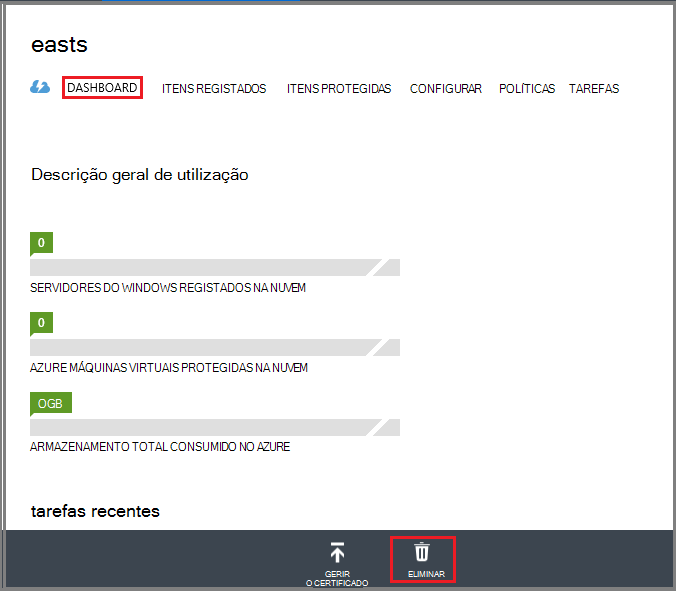

<properties
   pageTitle="Eliminar um cofre Azure cópia de segurança | Microsoft Azure"
   description="Como eliminar cofre uma cópia de segurança do Azure. Resolução de problemas por que razão não é possível eliminar uma cópia de segurança cofre. "
   services="service-name"
   documentationCenter="dev-center-name"
   authors="markgalioto"
   manager="cfreeman"
   editor=""/>

<tags
   ms.service="backup"
   ms.devlang="na"
   ms.topic="article"
   ms.tgt_pltfrm="na"
   ms.workload="storage-backup-recovery"
   ms.date="08/29/2016"
   ms.author="markgal;trinadhk"/>

# Eliminar um cofre de cópia de segurança do Azure

O serviço de cópia de segurança do Azure tem dois tipos de cofres - o Cofre de cópia de segurança e o Cofre de serviços de recuperação. O Cofre de cópia de segurança veio primeiro. Em seguida, no Cofre de serviços de recuperação veio ao longo para suportar as expandido implementações do Gestor de recursos. Devido as capacidades expandidas e as dependências de informações que tem de ser armazenadas no cofre, a eliminar um cofre de serviços de recuperação pode parecer mais difícil de que tem de ser.

|**Tipo de implementação**|**Portal**|**Nome do Cofre**|
|--------------|----------|---------|
|Clássico|Clássico|Cofre cópia de segurança|
|Gestor de recursos|Azure|Serviços de recuperação do Cofre de palavras|

> [AZURE.NOTE] Cofres cópia de segurança não é possível proteger soluções implementado Gestor de recursos. No entanto, pode utilizar um cofre de serviços de recuperação proteger servidores de TI foca implementados e VMs.  

Neste artigo, utilizamos o termo cofre, para consultar o formulário genérico do Cofre de cópia de segurança ou serviços de recuperação cofre. Utilizamos o nome formal, Cofre de cópia de segurança ou Cofre de serviços de recuperação, quando é necessário distinguir entre dos cofres.

## Eliminar um cofre de serviços de recuperação

Eliminar cofre serviços de recuperação é um processo num só passo - a *desde que o Cofre não contenha dos recursos*. Pode eliminar um cofre de serviços de recuperação, tem de remover ou eliminar todos os recursos no cofre. Se tentar eliminar uma cofre que contém recursos, obtém um erro como a imagem seguinte.

  

Até ter desmarcada os recursos do Cofre de palavras, clicar em **Repetir** produz o mesmo erro. Se de que está bloqueada em: esta mensagem de erro, clique em **Cancelar** e siga os passos abaixo para eliminar os recursos no cofre serviços de recuperação.

### Remover os itens do cofre proteger uma VM

Se já tiver o Cofre de serviços de recuperação abrir, avance para o segundo passo.

1.  Abra o portal do Azure e, a partir do Dashboard de abra cofre que pretende eliminar.

    Se não tiver o Cofre de serviços de recuperação afixado ao dashboard, no menu concentrador, clique em **Mais serviços** e na lista de recursos, **Serviços de recuperação**. À medida que começa a escrever, os filtros de lista com base no seu teclado. Clique em **Serviços de recuperação cofres**.

      

    É apresentada a lista de serviços de recuperação cofres. A partir da lista, selecione o cofre que pretende eliminar.

    

2. Na vista de cofre, observe o painel **Essentials** . Para eliminar um cofre, não podem ser quaisquer itens protegidas. Se vir um número diferente de zero, em **Itens de cópia de segurança** ou **servidores de gestão de cópia de segurança**, tem de remover esses itens antes de poder eliminar o cofre.

    

    VMs ficheiros/pastas são consideradas itens de cópia de segurança e são listadas na área de **Cópia de segurança itens** do painel de Essentials. Um servidor DPM é listado na área de **Cópia de segurança do servidor de gestão** do painel de Essentials. **Itens de replicadas** dizem respeito ao serviço do Azure recuperação de sites.

3. Para começar a remoção dos itens protegidos do Cofre de palavras, localize os itens no cofre. No dashboard de cofre clique em **Definições**e, em seguida, clique em **itens de cópia de segurança** para abrir essa pá.

    

    O **Itens de cópia de segurança** pá tem listas separadas, consoante o tipo de Item: máquinas virtuais do Azure ou pastas de ficheiros (ver imagem). Lista de tipo de Item de predefinido apresentada é máquinas virtuais do Azure. Para ver a lista de itens de pastas de ficheiros no cofre, selecione **Pastas de ficheiros** a partir do menu pendente.

4. Pode eliminar um item do cofre proteger uma VM, tem de parar a tarefa de cópia de segurança do item e eliminar os dados de ponto de recuperação. Para cada item no cofre, siga estes passos:

    um. No pá **Itens de cópia de segurança** , clique com o botão direito e, no menu de contexto, selecione **Parar de cópia de segurança**.

    

    É aberta a pá parar de cópia de segurança.

    b. Na pá **Parar de cópia de segurança** , a partir do menu **selecionar uma opção** , selecione **Eliminar dados de cópia de segurança** > escreva o nome do item > e clique em **Parar a cópia de segurança**.

      Escreva o nome do item para confirmar que pretende eliminá-la. O botão **Parar de cópia de segurança** não ativará até que verifique o item para parar. Se não vir a caixa de diálogo para escrever o nome do item cópia de segurança, se selecionou a opção **Manter dados de cópia de segurança** .

    

      Opcionalmente, pode fornecer um motivo por que motivo está a eliminar os dados e adicionar comentários. Depois de clicar em **Parar de cópia de segurança**, permitir a tarefa de eliminar concluir antes de tentar eliminar o cofre. Para verificar que a tarefa foi concluída, verifique as mensagens do Azure .  
   Assim que a tarefa estiver concluída, receberá uma mensagem a indicar o processo de cópia de segurança foi interrompido e os dados de cópia de segurança foram eliminados para esse item.

    c. Depois de eliminar um item na lista, no menu de **Itens de cópia de segurança** , clique em **Atualizar** para ver os restantes itens no cofre.

      

      Quando não existem itens na lista, desloque-se para o painel de **Essentials** na pá de cofre a cópia de segurança. Não devem ser quaisquer **itens de cópia de segurança**, **servidores de gestão de cópia de segurança**ou **replicada itens** apresentados. Se itens continuam a aparecer no cofre, regresse ao passo três acima e selecione uma lista de tipo de item diferente.  

5. Quando não existem mais itens na barra de ferramentas cofre, clique em **Eliminar**.

    

6. Quando lhe for pedido para confirmar que pretende eliminar o cofre, clique em **Sim**.

    O Cofre é eliminado e o portal regressa ao menu de serviço de **Novo** .

## O que acontece se parou o processo de cópia de segurança mas mantidas os dados?

Se interrompeu o processo de cópia de segurança, mas acidentalmente *retidos* os dados, tem de eliminar os dados de cópia de segurança antes de poder eliminar o cofre. Para eliminar os dados de cópia de segurança:

1. No pá **Itens de cópia de segurança** , clique com o botão direito e, no menu de contexto, clique em **Eliminar dados de cópia de segurança**.

    

    É aberta a pá de **Eliminar dados de cópia de segurança** .

2. No pá **Eliminar dados de cópia de segurança** , escreva o nome do item e clique em **Eliminar**.

    

    Depois de ter eliminado os dados, vá para o passo 4c, acima e continue com o processo.

## Eliminar um cofre utilizado para proteger um servidor DPM

Antes de poder eliminar cofre utilizado para proteger um servidor DPM, deve desmarcar quaisquer pontos de recuperação que foram criados e, em seguida, anular o registo o servidor do Cofre de palavras.

Para eliminar os dados associados um grupo de proteção:

1. Na consola do administrador de DPM, clique em **proteção**, selecione um grupo de proteção, selecione o membro do grupo de proteção e no Friso ferramentas, clique em **Remover**. Tem de selecionar o membro do botão de **Remover** a aparecem no Friso ferramenta. No exemplo, o membro é **dummyvm9**. Se existirem vários membros do grupo de proteção, mantenha premida a tecla Ctrl para selecionar vários membros.

    

    Abre a caixa de diálogo **Parar proteção** .

2. Na caixa de diálogo **Parar proteção** , selecione **Eliminar os dados protegidos**e clique em **Parar proteção**.

    

    Não pretende manter os dados protegidos, porque tem de limpar o cofre para poder eliminá-la. Dependendo de recuperação quantos pontos e a quantidade de dados estiver no grupo proteção, poderá demorar em qualquer lugar a partir de aguardar alguns segundos para alguns minutos para eliminar os dados. A caixa de diálogo **Parar proteção** mostra o estado quando a tarefa estiver concluída.

    

3. Continue este processo para todos os membros em todos os grupos de proteção.

    Tem de remover protegidos todos os dados e a proteção grupo (s).

4. Depois de eliminar todos os membros do grupo de proteção, mude para o portal do Azure. Abra o dashboard do cofre e certifique-se de que não existem **Itens de cópia de segurança**, **servidores de gestão de cópia de segurança**ou **replicada itens**. Na barra de ferramentas cofre, clique em **Eliminar**.

    

    Se existirem servidores de gestão de cópia de segurança registados ao Cofre de palavras, não poderá eliminar o cofre, mesmo que não haja dados no cofre. Se considerado tenha eliminado os servidores de gestão de cópia de segurança associados cofre, mas ainda existem servidores que mostra no painel de **Essentials** , consulte o artigo [localizar os servidores de gestão de cópia de segurança registados para o Cofre](backup-azure-delete-vault.md#find-the-backup-management-servers-registered-to-the-vault).

5. Quando lhe for pedido para confirmar que pretende eliminar o cofre, clique em **Sim**.

    O Cofre é eliminado e o portal regressa ao menu de serviço de **Novo** .

## Eliminar um cofre utilizado para proteger um servidor de produção

Antes de poder eliminar cofre utilizado para proteger um servidor de produção, tem de eliminar ou anular o registo de servidor do Cofre de palavras.

Para eliminar o servidor de produção associado cofre:

1. No portal do Azure, abra o dashboard do cofre e clique em **Definições** > **Infraestrutura de cópia de segurança** > **Servidores de produção**.

    

    O **Servidores de produção** pá abre e apresenta todos os servidores de produção no cofre.

    

2. No pá **Servidores de produção** , com o botão direito no servidor e clique em **Eliminar**.

    

    É aberta a pá **Eliminar** .

    

3. No pá **Eliminar** , confirme o nome do servidor para eliminar e clique em **Eliminar**. Corretamente tem de introduzir o nome do servidor para ativar o botão **Eliminar** .

    Assim que foi eliminado no cofre, receberá uma mensagem a indicar que foi eliminado no cofre. Depois de eliminar todos os servidores no cofre, desloque-se novamente para o painel de Essentials no dashboard de cofre.

4. No dashboard do cofre, certifique-se de que não existem **Itens de cópia de segurança**, **servidores de gestão de cópia de segurança**ou **replicada itens**. Na barra de ferramentas cofre, clique em **Eliminar**.

5. Quando lhe for pedido para confirmar que pretende eliminar o cofre, clique em **Sim**.

    O Cofre é eliminado e o portal regressa ao menu de serviço de **Novo** .

## Eliminar um cofre de cópia de segurança

São as seguintes instruções para eliminar um cofre de cópia de segurança no portal do clássico. Um cofre de cópia de segurança e serviços de recuperação cofre são iguais: antes de poder eliminar o cofre, eliminar os itens e os dados retidos.

1. Abra o portal do clássico.

2. Na lista de cópia de segurança cofres, selecione o cofre que pretende eliminar.

    

    Abre o dashboard do cofre. Veja o número de servidores do Windows e/ou Azure máquinas virtuais associados com o cofre. Além disso, observe o armazenamento total consumido no Azure. Terá de parar quaisquer tarefas de cópia de segurança e eliminar os dados existentes antes de eliminar o cofre.

3. Clique no separador **Itens protegida** e, em seguida, clique em **Parar proteção**

    

    É apresentada a caixa de diálogo **Parar proteção de 'cofre'** .

4. Na caixa de diálogo **Parar proteção de 'cofre'** , selecione **Eliminar dados de cópia de segurança associados** e clique em .  
   Opcionalmente, pode escolher um motivo para parar a proteção e fornecer um comentário.

    

    Depois de eliminar os itens no cofre, o Cofre estará vazio.

    

5. Na lista de separadores de, clique em **Itens registado**. Para cada item registado no cofre, selecione o item e clique em **Unregister**.

    

6. Na lista de separadores de, clique em **Dashboard** para abrir esse separador. Certifique-se de que não existem servidores registados ou Azure máquinas virtuais protegidas na nuvem. Além disso, verifique se de que não haja dados no armazenamento. Clique em **Eliminar** para eliminar o cofre.

    

    Ecrã de confirmação Eliminar cópia de segurança Cofre é aberta. Selecione uma opção por que motivo está a eliminar o Cofre e clique em .  

    

    O Cofre é eliminado e regressar ao dashboard portal clássica.

### Localizar os servidores de gestão de cópia de segurança registados ao Cofre de palavras

Se tiver vários servidores registados para cofre, pode ser difícil memorizá-los. Para ver os servidores de registered ao Cofre de palavras e eliminá-los:

1. Abra o dashboard do cofre.

2. No painel de **Essentials** , clique em **Definições** para abrir essa pá.

    

3. No **pá de definições**, clique em **Infraestrutura de cópia de segurança**.

4. No pá **Infraestrutura de cópia de segurança** , clique em **Servidores de gestão de cópia de segurança**. É aberta a pá servidores de gestão de cópia de segurança.

    

5. Para eliminar um servidor a partir da lista, com o botão direito no nome do servidor e, em seguida, clique em **Eliminar**.
    É aberta a pá **Eliminar** .

6. No pá **Eliminar** , fornece o nome do servidor. Se for um nome longo, pode copiar e colá-lo a partir da lista dos servidores de gestão de cópia de segurança. Em seguida, clique em **Eliminar**.  
