<properties
    pageTitle="Introdução a cópia de segurança do Azure DPM | Microsoft Azure"
    description="Uma introdução à cópias de segurança servidores DPM utilizando o serviço de cópia de segurança do Azure"
    services="backup"
    documentationCenter=""
    authors="Nkolli1"
    manager="shreeshd"
    editor=""
    keywords="Sistema Centro de dados proteção Gestor, Gestor de proteção de dados, dpm cópia de segurança"/>

<tags
    ms.service="backup"
    ms.workload="storage-backup-recovery"
    ms.tgt_pltfrm="na"
    ms.devlang="na"
    ms.topic="article"
    ms.date="08/08/2016"
    ms.author="trinadhk;giridham;jimpark;markgal;adigan"/>

# Preparar a cópia de segurança das cargas de trabalho para Azure com DPM

> [AZURE.SELECTOR]
- [Servidor de cópia de segurança Azure](backup-azure-microsoft-azure-backup.md)
- [SCDPM](backup-azure-dpm-introduction.md)
- [Servidor de cópia de segurança Azure (clássico)](backup-azure-microsoft-azure-backup-classic.md)
- [SCDPM (clássico)](backup-azure-dpm-introduction-classic.md)

Este artigo fornece uma introdução à utilização de cópia de segurança do Microsoft Azure para proteger os servidores de sistema Centro dados Protection Gestor (DPM) e das cargas de trabalho. Ao ler o artigo-lo, irá compreender:

- Como funciona a cópia de segurança do Azure DPM server
- As pré-requisitos para alcançar uma experiência de cópia de segurança suave
- Foram encontrados típicos erros e como lidar com os mesmos
- Cenários suportados

> [AZURE.NOTE] Azure tem dois modelos de implementação para criar e trabalhar com recursos: [Gestor de recursos e clássica](../resource-manager-deployment-model.md). Este artigo fornece informações e procedimentos para restaurar a VMs implementados a utilizar o modelo de Gestor de recursos.

Centro de sistema DPM cópias de dados de ficheiros e aplicações. Dados de cópia de segurança para DPM podem ser armazenados no fita, no disco, ou cópias de segurança Azure com cópia de segurança do Microsoft Azure. DPM interage com Azure cópias de segurança da seguinte forma:

- **DPM implementado como uma máquina de virtual server ou no local física** — se DPM é implementado como um servidor físico ou como uma máquina de virtual no local Hyper-V pode agregar dados para um cofre de serviços de recuperação para além do disco e banda cópia de segurança.
- **DPM implementado como uma máquina virtual Azure** — a partir do sistema Centro 2012 R2 com 3 de atualização, DPM pode ser implementado como uma máquina virtual Azure. Se for implementado DPM como uma máquina virtual Azure que pode agregar dados a discos Azure anexados à máquina de virtual DPM Azure ou pode descarregar o armazenamento de dados ao efetuar cópias até cofre serviços de recuperação de segurança.

## Por que motivo efectuar cópia de segurança a partir do DPM Azure?

Os benefícios de negócio de utilização de cópia de segurança do Azure para cópias de segurança servidores DPM incluem:

- Para a implementação de DPM no local, pode utilizar Azure como uma alternativa a implementação a longo prazo em banda.
- Para implementações DPM no Azure, cópia de segurança do Azure permite-lhe descarregar o armazenamento do disco Azure, permitindo-lhe dimensionar ao armazenar os dados mais antigos no Cofre de serviços de recuperação e novos dados no disco.

## Pré-requisitos
Prepare a cópia de segurança do Azure para agregar dados DPM da seguinte forma:

1. **Criar um cofre de serviços de recuperação** — criar cofre no Azure portal.
2. **Transferência de credenciais de cofre** — transferir as credenciais que utilizar para registar o servidor DPM para serviços de recuperação cofre.
3. **Instalar o agente de cópia de segurança do Azure** — a partir do Azure cópia de segurança, instale o agente em cada servidor DPM.
4. **Registar o servidor** — registar o servidor DPM para serviços de recuperação cofre.

### 1. Crie um cofre de serviços de recuperação
Para criar uma recuperação serviços cofre:

1. Inicie sessão no [portal do Azure](https://portal.azure.com/).

2. No menu concentrador, clique em **Procurar** e na lista de recursos, **Serviços de recuperação**. À medida que começa a escrever, irá filtrar a lista com base no seu teclado. Clique em **Serviços de recuperação cofre**.

    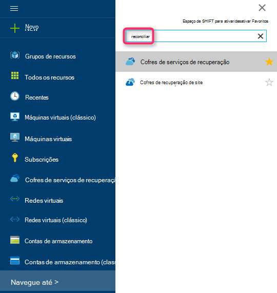

    É apresentada a lista de serviços de recuperação cofres.

3. No menu de **Serviços de recuperação cofres** , clique em **Adicionar**.

    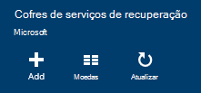

    É aberta a pá cofre serviços de recuperação perguntar para fornecer um **nome**, a **subscrição**, o **grupo de recursos**e a **localização**.

    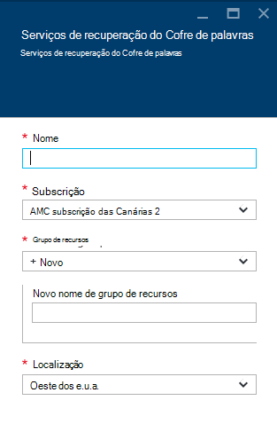

4. Para o **nome**, introduza um nome amigável para identificar o cofre. O nome tem de ser exclusivo para a subscrição Azure. Escreva um nome que contém entre 2 e 50 carateres. Tem de iniciar por uma letra e pode conter apenas letras, números e hífenes.

5. Clique em **subscrição** para ver a lista de subscrições disponível. Se não tiver a certeza de qual para utilizar a sua subscrição, utilize a predefinição (ou sugeridos) subscrição. Haverá múltiplas escolhas apenas se a sua conta institucional está associada com múltiplas subscrições Azure.

6. Clique em **grupo de recursos** para ver a lista de grupos de recursos disponível ou clique em **Novo** para criar um novo grupo de recursos. Para obter informações completas sobre grupos de recursos, consulte o artigo [Descrição geral do Gestor de recursos do Azure](../azure-resource-manager/resource-group-overview.md)

7. Clique em **localização** para selecionar a região geográfica para o cofre.

8. Clique em **Criar**. Pode demorar algum tempo para o Cofre de serviços de recuperação seja criada. Monitorize as notificações de estado na área superior direita no portal.
Quando estiver criado cofre, abre no portal.

### Definir a replicação de armazenamento

A opção de replicação de armazenamento permite-lhe escolher entre armazenamento geo redundantes e armazenamento localmente redundante. Por predefinição, o seu Cofre tem armazenamento geo redundante. Deixe a opção definida como armazenamento geo redundante se esta é a cópia de segurança principal. Selecione armazenamento localmente redundante se pretender que uma opção de menos dispendiosa que não se adequarem como resistente. Leia mais informações sobre [geo redundantes](../storage/storage-redundancy.md#geo-redundant-storage) e opções de armazenamento [redundantes localmente](../storage/storage-redundancy.md#locally-redundant-storage) num [Descrição geral de replicação de armazenamento do Windows Azure](../storage/storage-redundancy.md).

Para editar a definição de replicação de armazenamento:

1. Selecione o seu Cofre para abrir o dashboard do cofre e pá as definições. Se a pá **Definições** não abrir, clique em **todas as definições** no dashboard de cofre.

2. No pá **Definições** , clique em **Cópia de segurança infraestrutura** > **Configuração de cópia de segurança** para abrir o pá de **Configuração de cópia de segurança** . Na pá **Configuração de cópia de segurança** , selecione a opção de replicação de armazenamento para o cofre.

    

    Depois de escolher a opção de armazenamento para o cofre, está pronto para associar a VM cofre. Para começar a associação, deve descobrir e registar as máquinas virtuais Azure.

### 2. transferência de credenciais do Cofre

O ficheiro de credenciais do Cofre é um certificado gerado pelo portal para cada cofre cópia de segurança. O portal, em seguida, os carregamentos pendentes a chave pública para o serviço de controlo de acesso (ACS). A chave privada do certificado é disponibilizada para o utilizador como parte do fluxo de trabalho que é fornecido como uma entrada no fluxo de trabalho de registo de máquina. Isto autentica a máquina para enviar dados de cópia de segurança para um cofre identificado no serviço de cópia de segurança do Azure.

A credencial Cofre é utilizada apenas durante o fluxo de trabalho do registo. Cabe do utilizador para se certificar de que o ficheiro de credenciais do Cofre não está comprometido. Se cair mãos de qualquer utilizador não autorizado, o ficheiro de credenciais de cofre pode ser utilizado para registar outras máquinas contra o mesmo cofre. No entanto, como os dados de cópia de segurança são encriptados através de uma frase de acesso que pertence ao cliente, não podem ser comprometidos dados de cópia de segurança existentes. Para mitigar este preocupações, a cofre credenciais estão definidas para expirar no 48hrs. Pode transferir as credenciais do cofre dos serviços de recuperação qualquer número de vezes – mas que apenas o ficheiro de credenciais de cofre mais recente é aplicável durante o fluxo de trabalho do registo.

O ficheiro de credenciais do Cofre é transferido através de um canal seguro a partir do portal Azure. O serviço de cópia de segurança do Azure é ignora da chave privada do certificado e a chave privada não é persiste no portal do ou o serviço. Utilize os passos seguintes para transferir o ficheiro de credenciais do cofre para um computador local.

1. Inicie sessão no [portal do Azure](https://portal.azure.com/).

2. Abrir Cofre de serviços de recuperação ao qual à qual pretende registar DPM de computador.

3. Pá definições é aberto por predefinição. Se estiver fechada, clique em **Definições** no dashboard de cofre para abrir o separador Definições. No pá de definições, clique em **Propriedades**.

    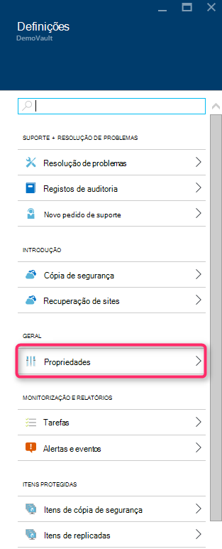

4. Na página Propriedades, clique em **Transferir** nas **Credenciais de cópia de segurança**. O portal gera o ficheiro de credenciais do cofre, que é feito disponível para transferência.

    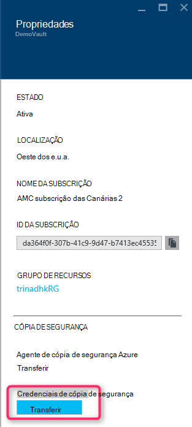

O portal irá gerar uma credencial de cofre utilizando uma combinação do nome do cofre e a data atual. Clique em **Guardar** para transferir as credenciais do cofre para a pasta de transferências da conta local ou, selecione guardar como no menu Guardar para especificar uma localização para as credenciais do cofre. Irá demorar um minuto para o ficheiro a ser gerado.

### Nota
- Certifique-se de que o ficheiro de credenciais do Cofre está guardado numa localização que pode ser acedida a partir do seu computador. Se este é armazenado numa partilha de ficheiro/SMB, verifique as permissões de acesso.
- O ficheiro de credenciais do Cofre é utilizado apenas durante o fluxo de trabalho do registo.
- O ficheiro de credenciais do cofre expira após 48hrs e pode ser transferido a partir do portal.

### 3. instalar agente de cópia de segurança

Depois de criar o Cofre Azure cópia de segurança, um agente deve ser instalado em cada um dos seus máquinas com o Windows (Windows Server, cliente do Windows, servidor do Gestor de proteção de dados do sistema centro ou máquina de servidor de cópia de segurança do Azure) que permite a cópia de segurança de dados e aplicações para o Azure.

1. Abrir Cofre de serviços de recuperação ao qual à qual pretende registar DPM de computador.

2. Pá definições é aberto por predefinição. Se estiver fechada, clique em **Definições** para abrir o separador Definições. No pá de definições, clique em **Propriedades**.

    

3. Na página Definições, clique em **Transferir** em **Agente de cópia de segurança do Azure**.

    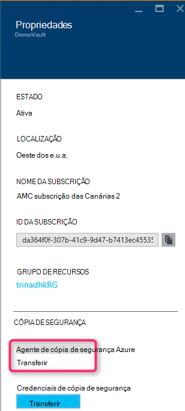

   Depois do agente é transferido, faça duplo clique MARSAgentInstaller.exe para iniciar a instalação do agente de cópia de segurança do Azure. Selecione a pasta de instalação e a pasta Rascunho necessários para o agente. A localização da cache especificada tem de ter espaço livre que é pelo menos 5% dos dados da cópia de segurança.

4.  Se utilizar um servidor proxy para ligar à internet, no ecrã de **configuração do Proxy** , introduza os detalhes de servidor de proxy. Se utilizar um proxy autenticado, introduza os detalhes de nome e palavra-passe de utilizador neste ecrã.

5.  O agente de cópia de segurança do Azure instala .NET Framework 4,5 e do Windows PowerShell (se ainda não esteja disponível) para concluir a instalação.

6.  Quando o agente estiver instalado, **Fechar** a janela.

    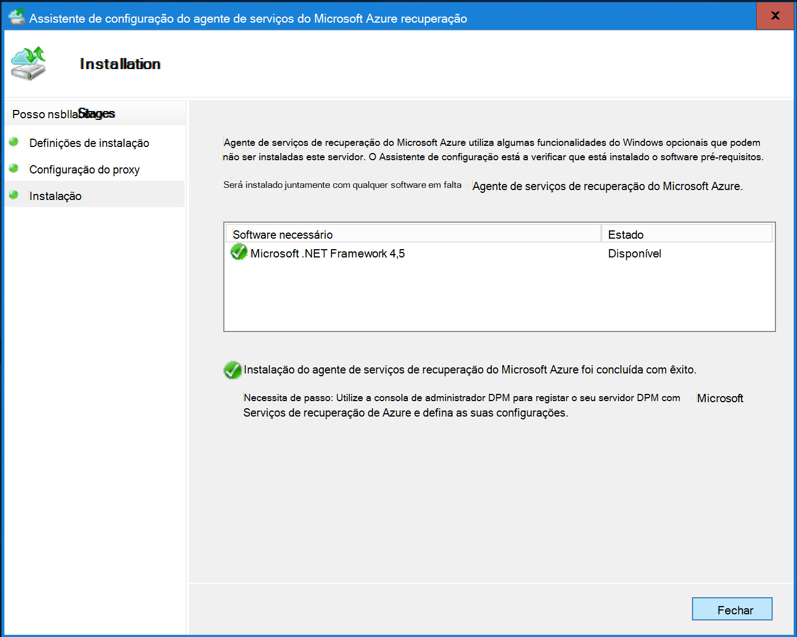

7. Para **registar o servidor DPM** cofre, no separador **Gestão** , clique no **Online**. Em seguida, selecione **Registar**. Será aberto o Assistente de configuração registar.

8. Se utilizar um servidor proxy para ligar à internet, no ecrã de **configuração do Proxy** , introduza os detalhes de servidor de proxy. Se utilizar um proxy autenticado, introduza os detalhes de nome e palavra-passe de utilizador neste ecrã.

    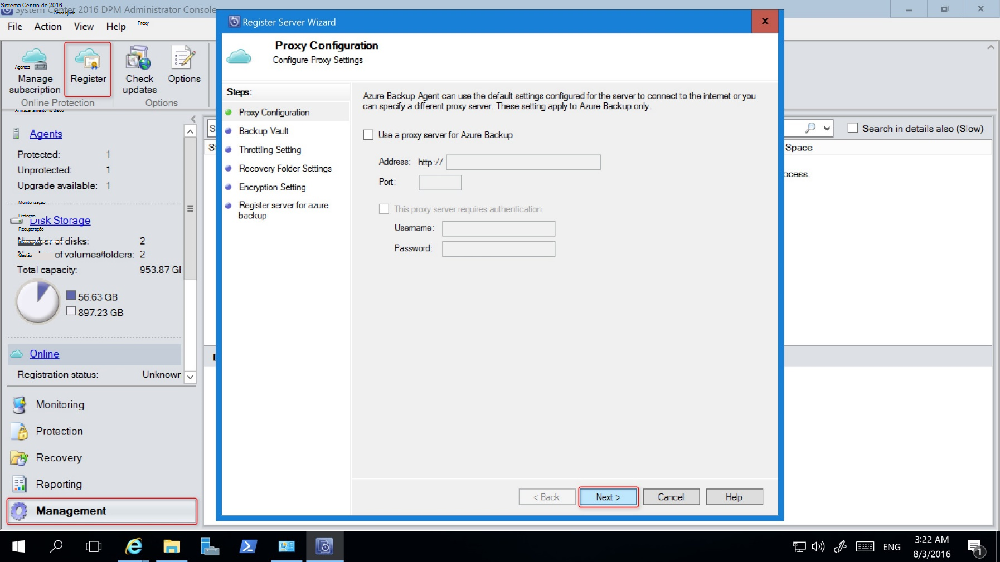

9. No ecrã de credenciais do cofre, procure e selecione o ficheiro de credenciais do cofre que foi transferido anteriormente.

    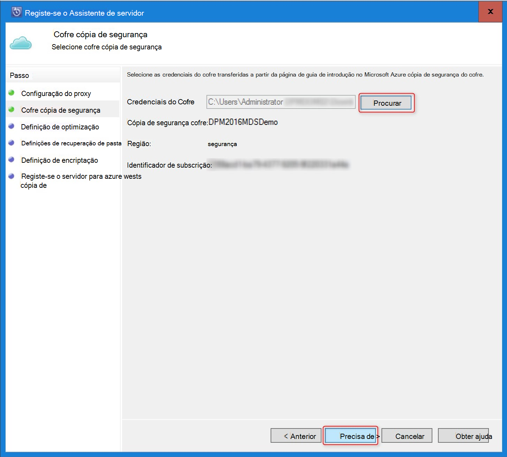

    O ficheiro de credenciais do Cofre é válido apenas para 48 hrs (após ser transferido a partir do portal). Se se deparar com qualquer erro neste ecrã (por exemplo, "Cofre credenciais ficheiro fornecido expirou"), início de sessão para o portal do Azure e transferir que as credenciais do cofre novamente o ficheiro.

    Certifique-se de que o ficheiro de credenciais do Cofre está disponível numa localização que possa ser acedida pela aplicação de configuração. Se encontrar erros relacionados de acesso, copie o ficheiro de credenciais do cofre para uma localização temporária nesta máquina e repita a operação.

    Se se deparar com um erro de credenciais do Cofre inválido (por exemplo, "Cofre inválido credenciais desde") o ficheiro está danificado ou não tiver as mais recentes credenciais associadas com o serviço de recuperação. Repetir a operação depois de transferir um ficheiro de credenciais do cofre novo a partir do portal. Este erro é normalmente visto se o utilizador clica na opção de **credenciais do Cofre de transferência** no portal do Azure, em rápida sucessão. Neste caso, apenas o segundo cofre credencial ficheiro é válido.

10. Para controlar a utilização da largura de banda de rede durante o trabalho e as horas que não sejam de trabalho, no ecrã de **Definição de limitação** , pode definir os limites da utilização da largura de banda e definir o trabalho e que não sejam-trabalho horas.

    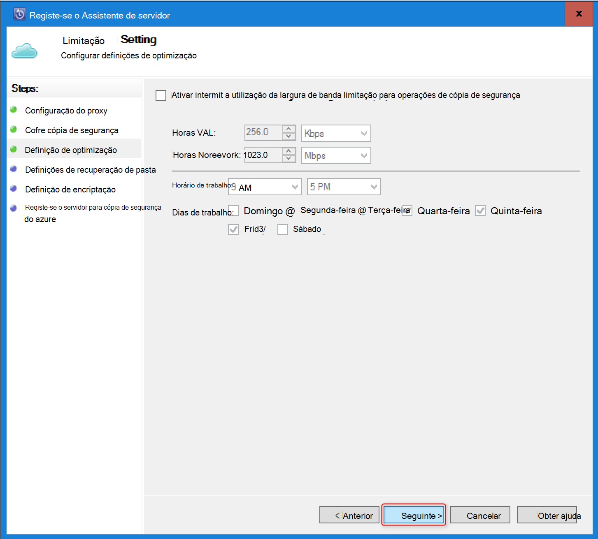

11. No ecrã de **Definição de pasta de recuperação** , navegue para a pasta onde os ficheiros transferidos a partir do Azure serão temporariamente testados.

    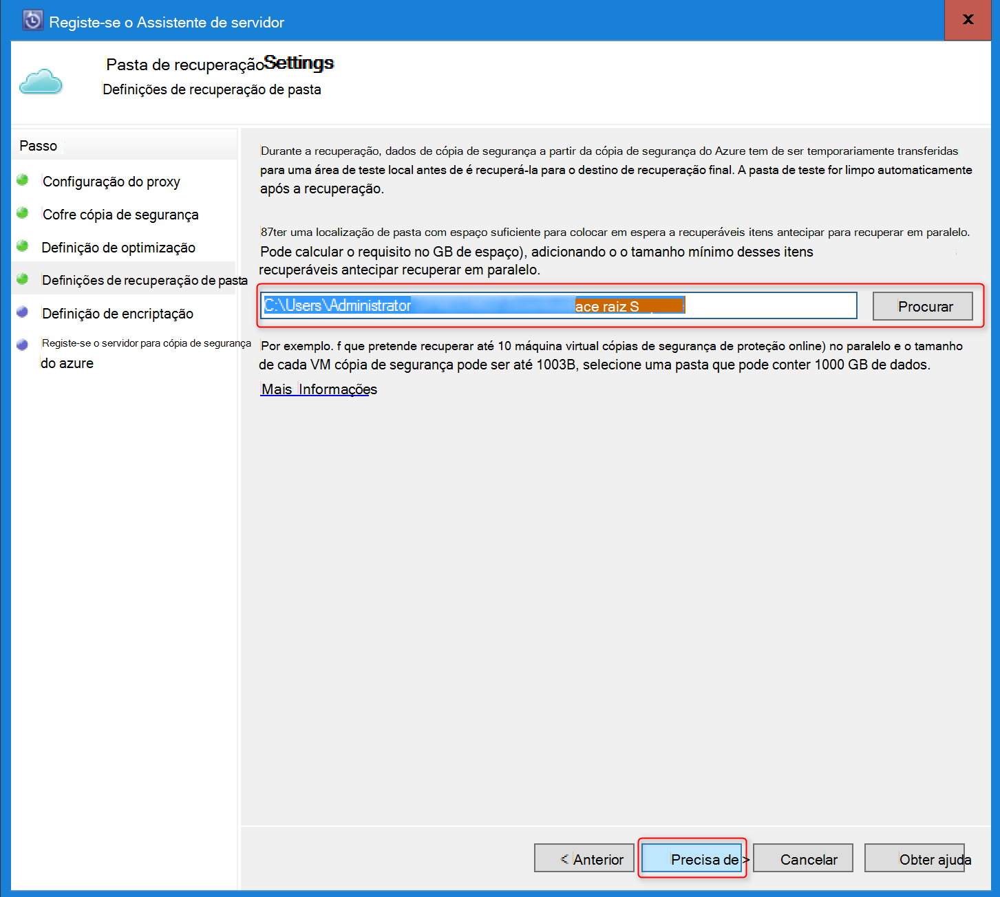

12. No ecrã de **definição de encriptação** , pode gerar uma frase ou fornecer uma frase de acesso (mínimo de 16 caracteres). Lembre-se guardar a frase de acesso numa localização segura.

    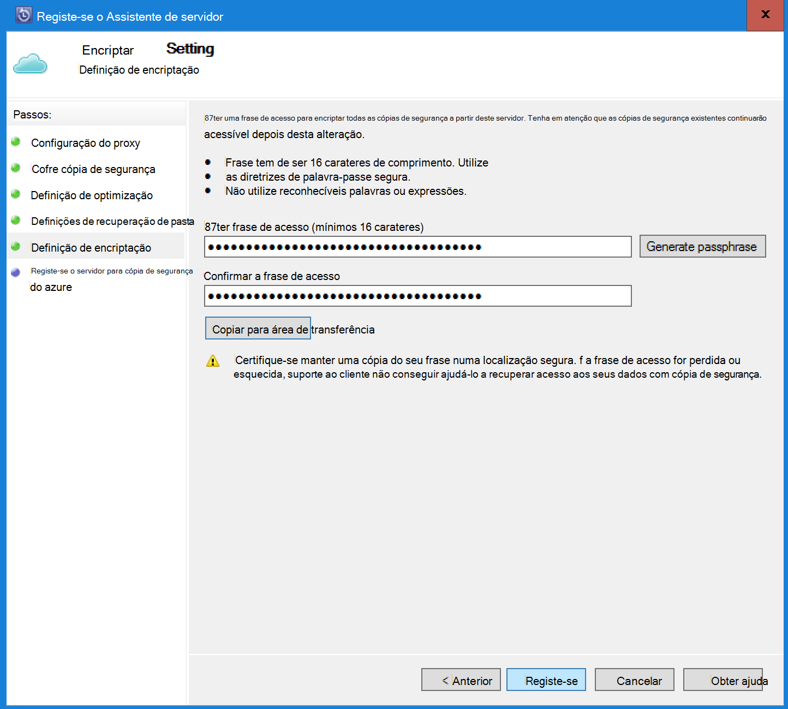

    > [AZURE.WARNING] Se a frase de acesso for perdida ou esquecida; Não é possível ajuda no recuperar os dados de cópia de segurança do Microsoft. É o proprietário do utilizador final a frase de acesso de encriptação e a Microsoft não tem visibilidade da frase de acesso utilizado pelo utilizador final. Guarde o ficheiro numa localização segura conforme for necessário durante uma operação de recuperação.

13. Depois de clicar no botão **Registar** , o computador está registado com êxito ao Cofre de palavras e está agora pronto para começar a cópia de segurança para Microsoft Azure.

14. Quando utilizar o Gestor de proteção de dados, pode modificar as definições de especificadas durante o fluxo de trabalho de registo ao clicar na opção de **Configurar** selecionando **Online** no separador **Gestão** .

## Requisitos de (e limitações)

- DPM pode estar em execução como um servidor físico ou uma máquina de virtual Hyper-V instalado no sistema de centro de 2012 SP1 ou sistema Centro 2012 R2. Também pode ser executada como uma máquina virtual Azure em execução no sistema de centro de 2012 R2 com, pelo menos, DPM 2012 R2 Update Rollup 3 ou uma máquina de virtual do Windows no VMWare em execução no sistema de centro de 2012 R2 com, pelo menos, Update Rollup 5.
- Se estiver a executar o DPM com sistema Centro 2012 SP1 deve instalar filmar atualizar o 2 para SP1 de Gestor de proteção de dados do Centro de sistema. O que é necessário antes de poder instalar o agente de cópia de segurança do Azure.
- O servidor DPM deve ter Windows PowerShell e o .net Framework 4,5 instalado.
- DPM pode cópias das cargas de trabalho a maior parte dos Azure cópia de segurança. Para uma lista completa do que tem suportado consulte a cópia de segurança do Azure suporte itens abaixo.
- Não não possível recuperar dados armazenados num Azure cópia de segurança com a opção "copiar para a banda".
- Terá de uma conta Azure com a funcionalidade de cópia de segurança do Azure ativada. Se não tiver uma conta, pode criar uma conta de avaliação gratuita apenas de duas minutos. Leia sobre [preços de cópia de segurança do Azure](https://azure.microsoft.com/pricing/details/backup/).
- Utilização de cópia de segurança do Azure requer o agente de cópia de segurança do Azure ser instalado em servidores que pretende fazer cópia de segurança. Cada servidor tem de ter pelo menos 5% do tamanho dos dados que estão a ser cópia de segurança, disponíveis como armazenamento gratuito no local. Por exemplo, criar cópias de segurança de 100 GB de dados requer um mínimo de 5 GB de espaço livre na localização rascunho.
- Os dados serão armazenados no armazenamento Azure cofre. Não existe limite para a quantidade de dados que pode até uma cópia de segurança do Azure do Cofre de palavras, mas o tamanho de uma origem de dados (por exemplo uma máquina virtual ou base de dados) não deve exceder 54400 GB.

Estes tipos de ficheiro são suportados para até Azure:

- Encriptada (cópias de segurança completas apenas)
- Comprimidos (utilizarão cópias de segurança suportadas)
- Dispersos (utilizarão cópias de segurança suportados)
- Comprimido e de dispersão (tratada como Sparse)

E estes não são suportadas:

- Os servidores de sistemas de ficheiros entre maiúsculas e minúsculas não são suportados.
- Ligações de disco rígidas (ignorado)
- Nova análise pontos (ignorado)
- Encriptadas e comprimidos (ignorado)
- Encriptadas e dispersos (ignorado)
- Sequência comprimida
- Sequência de dispersa

>[AZURE.NOTE] A partir no sistema de centro de 2012 DPM com SP1 diante pode fazer cópia de segurança para cima das cargas de trabalho protegidas por DPM para Azure utilizando a cópia do Microsoft Azure.
