<properties
    pageTitle="Gerir e monitorizar o Azure máquina virtual cópias de segurança | Microsoft Azure"
    description="Saiba como gerir e monitorizar cópias de segurança uma máquina virtual Azure"
    services="backup"
    documentationCenter=""
    authors="trinadhk"
    manager="shreeshd"
    editor=""/>

<tags
    ms.service="backup"
    ms.workload="storage-backup-recovery"
    ms.tgt_pltfrm="na"
    ms.devlang="na"
    ms.topic="article"
    ms.date="08/31/2016"
    ms.author="trinadhk; jimpark; markgal;"/>

# <a name="manage-and-monitor-azure-virtual-machine-backups"></a>Gerir e monitorizar o Azure máquina virtual cópias de segurança

> [AZURE.SELECTOR]
- [Gerir Azure VM cópias de segurança](backup-azure-manage-vms.md)
- [Gerir VM clássica cópias de segurança](backup-azure-manage-vms-classic.md)

Este artigo fornece informações sobre a gestão comuns e tarefas de monitorização para máquinas virtuais de modelo clássico protegidas no Azure.  

>[AZURE.NOTE] Azure tem dois modelos de implementação para criar e trabalhar com recursos: [Gestor de recursos e clássica](../resource-manager-deployment-model.md). Consulte o artigo [preparar o seu ambiente para agregar Azure máquinas virtuais](backup-azure-vms-prepare.md) para obter detalhes sobre como trabalhar com o modelo de implementação de clássica VMs.

## <a name="manage-protected-virtual-machines"></a>Gerir protegidas máquinas virtuais

Para gerir máquinas virtuais protegidas:

1. Para ver e gerir as definições de cópia de segurança para uma máquina virtual, clique no separador **Itens protegida** .

2. Clique no nome de um item para ver o separador **Detalhes de cópia de segurança** , que mostra-lhe informações sobre a cópia de segurança última protegido.

    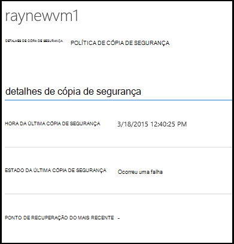

3. Para ver e gerir a política de cópia de segurança definições para uma máquina virtual clique no separador de **políticas** .

    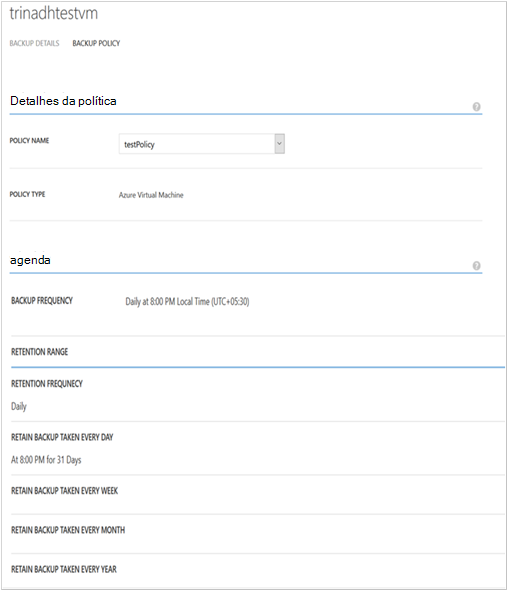

    No separador de **Políticas de cópia de segurança** mostra-lhe a política existente. Pode modificar, conforme necessário. Se precisar de criar uma nova política clique em **Criar** na página **políticas** . Repare que se pretender remover uma política não devem ter qualquer máquinas virtuais associadas.

    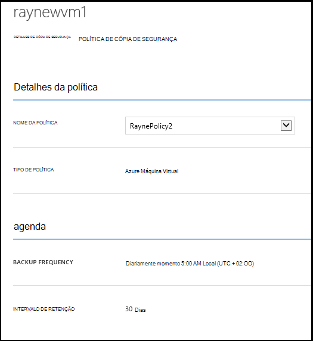

4. Pode obter mais informações sobre ações ou de estado para uma máquina virtual na página **tarefas** . Clique numa tarefa na lista para obter mais detalhes ou filtrar tarefas para uma máquina virtual específica.

    

## <a name="on-demand-backup-of-a-virtual-machine"></a>A pedido a cópia de segurança de uma máquina virtual
Pode demorar um pedido cópia de segurança de uma máquina virtual, assim que é configurado para protecção. Se a cópia de segurança inicial estiver pendente para máquina virtual, cópia de segurança a pedido irá criar uma cópia completa da máquina virtual no Azure cofre cópia de segurança. Se estiver concluída a primeira cópia de segurança, irá de cópia de segurança a pedido apenas alterações de enviar a partir de cópia de segurança anterior a cópia de segurança do Azure do Cofre de palavras, ou seja,-é sempre utilizarão.

>[AZURE.NOTE] Intervalo de retenção de uma cópia de segurança a pedido está definido para o valor de retenção especificado para diária retenção na política de cópia de segurança correspondente para a VM.  

Para tirar uma procura cópia de segurança de uma máquina virtual:

1. Navegue para a página de **Itens protegida** e selecione **Azure Virtual Machine** como **tipo** (se ainda não selecionado) e clique no botão **Selecionar** .

    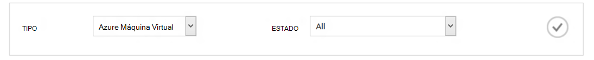

2. Selecione a máquina virtual no qual pretende tomar uma procura cópia de segurança e clique no botão **Agora cópia de segurança** na parte inferior da página.

    

    Isto vai criar uma tarefa de cópia de segurança na máquina selecionada virtual. Intervalo de retenção do ponto de recuperação criado através desta tarefa será igual ao que especificado na política associada a máquina virtual.

    

    >[AZURE.NOTE] Para ver a política associada uma máquina virtual, desagregar máquina virtual na página de **Itens protegida** e aceda ao separador Política de cópia de segurança.

3. Quando a tarefa estiver criada, pode clicar no botão de **tarefa de vista** na barra de alerta para ver a tarefa correspondente na página tarefas.

    

4. Após a conclusão com êxito da tarefa, um ponto de recuperação será criado que pode utilizar para restaurar a máquina virtual. Isto também irão incrementar o valor da coluna ponto recuperação por 1 na página **Itens protegida** .

## <a name="stop-protecting-virtual-machines"></a>Deixar de proteger máquinas virtuais
Pode escolher parar de cópias de segurança futuras de uma máquina de virtual com as seguintes opções:

- Manter os dados de cópia de segurança associados máquina virtual num cofre de cópia de segurança do Azure
- Eliminar dados de cópia de segurança associados máquina virtual

Se tiver selecionado para manter os dados de cópia de segurança associados máquina virtual, pode utilizar os dados de cópia de segurança para restaurar a máquina virtual. Para preços detalhes para essas máquinas virtuais, clique [aqui](https://azure.microsoft.com/pricing/details/backup/).

Para parar de proteção para uma máquina virtual:

1. Navegue até à página **Protegida itens** e selecione **Azure máquina virtual** como o tipo de filtro (se ainda não selecionado) e clique no botão **Selecionar** .

    

2. Selecione a máquina virtual e clique em **Parar proteção** na parte inferior da página.

    

3. Por predefinição, cópia de segurança do Azure, não elimina os dados de cópia de segurança associados a máquina virtual.

    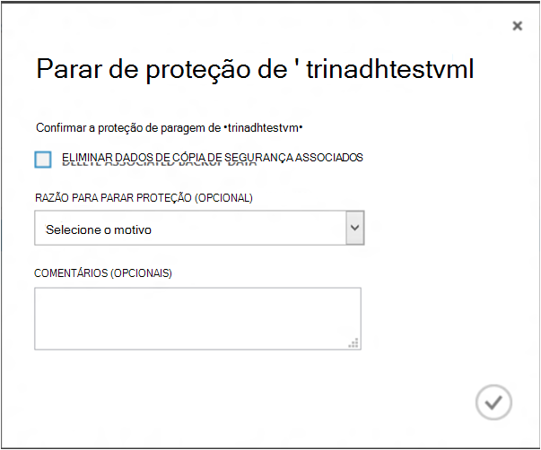

    Se quiser eliminar dados de cópia de segurança, selecione a caixa de verificação.

    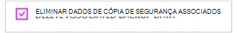

    Seleccione uma razão para parar a cópia de segurança. Enquanto isto é opcional, fornecer um motivo ajudará a cópia de segurança do Azure para trabalhar nos comentários e atribuir prioridades os cenários de cliente.

4. Clique no botão **Submeter** para submeter a tarefa **Parar proteção** . Clique em **Vista de tarefa** para ver a tarefa na página **tarefas** correspondente.

    

    Se não tiver selecionado opção **Eliminar dados de cópia de segurança associados** durante **Parar proteção** assistente, em seguida, mensagem conclusão da tarefa, o estado de proteção muda para **Protecção parado**. Os dados permanecem com cópia de segurança do Azure até ser eliminada explicitamente. Pode eliminar sempre os dados ao selecionar a máquina virtual na página de **Itens protegida** e clicando em **Eliminar**.

    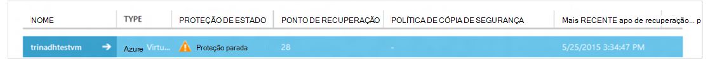

    Se tiver selecionado a opção **Eliminar dados de cópia de segurança associados** , a máquina virtual não será parte da página **Itens protegida** .

## <a name="re-protect-virtual-machine"></a>Proteger novamente Máquina Virtual
Se não tiver selecionado a opção **Eliminar dados de cópia de segurança associar** em **Parar proteção**, pode proteger voltar a máquina virtual ao seguir os passos semelhantes ao cópias de segurança máquinas virtuais registadas. Assim que protegido, esta máquina virtual vai ter dados de cópia de segurança retidos antes de parar proteção e pontos de recuperação criadas após protege novamente.

Depois de voltar a proteger, estado de proteção contra a máquina virtual será alterado para **protegido** se existirem pontos de recuperação antes de **Parar proteção**.

  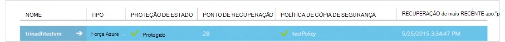

>[AZURE.NOTE] Quando voltar a proteger a máquina virtual, pode escolher uma política que a política com as quais máquina virtual foi protegida inicialmente diferente.

## <a name="unregister-virtual-machines"></a>Anular o registo máquinas virtuais

Se pretender remover a máquina virtual do cofre a cópia de segurança:

1. Clique no botão **UNREGISTER** na parte inferior da página.

    

    É apresentada uma notificação de alerta na parte inferior do ecrã pedir a confirmação. Clique em **Sim** para continuar.

    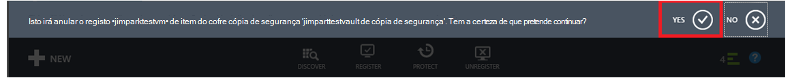

## <a name="delete-backup-data"></a>Eliminar dados de cópia de segurança
Pode eliminar os dados de cópia de segurança associados com uma máquina virtual, quer:

- Durante a tarefa de proteção de parar
- Após uma proteção de parar a tarefa é concluída numa máquina virtual

Para eliminar dados de cópia de segurança num computador virtuais, que se encontra no estado de *Proteção parado* registar conclusão de uma tarefa de **Cópia parar** :

1. Navegue para a página de **Itens protegida** e selecione **Azure Virtual Machine** como *tipo* e clique no botão **Selecionar** .

    

2. Selecione a máquina virtual. A máquina virtual irá estar num estado **Parado proteção** .

    

3. Clique no botão **Eliminar** na parte inferior da página.

    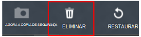

4. No Assistente de **Eliminar dados de cópia de segurança** , selecione um motivo para eliminar dados de cópia de segurança (vivamente recomendados) e clique em **Submeter**.

    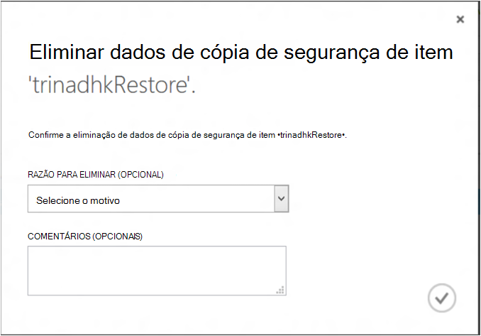

5. Isto vai criar uma tarefa de eliminar dados de cópia de segurança de máquina virtual seleccionada. Clique em **tarefa da vista** para ver a tarefa correspondente na página tarefas.

    

    Assim que a tarefa está concluída, a entrada correspondente à máquina virtual será removida da página **protegido itens** .

## <a name="dashboard"></a>Dashboard
Na página **Dashboard** pode rever informações sobre máquinas virtuais Azure, os respetivos armazenamento e trabalhos associados no últimas 24 horas. Pode ver o estado de cópia de segurança e algum erro de cópia de segurança associado.

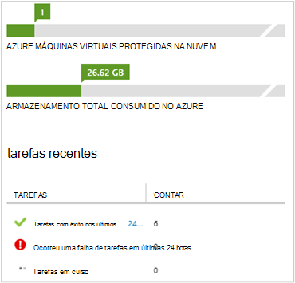

>[AZURE.NOTE] Os valores no dashboard são atualizados a cada 24 horas.

## <a name="auditing-operations"></a>Operações de auditoria
Cópia de segurança do Azure fornece rever "operação dos registos de" de operações de cópia de segurança acionado ao cliente, tornando mais fácil ver exatamente que operações de gestão de foram efetuadas no cofre cópia de segurança. Registos de operações ativar excelente post-mortem e suporte para as operações de cópia de segurança de auditoria.

As seguintes operações são registadas nos registos de operação:

- Registe-se
- Anular o registo
- Configurar a protecção
- Cópia de segurança (ambos agendados assim como a pedido a cópia de segurança através de BackupNow)
- Restaurar
- Parar a protecção
- Eliminar dados de cópia de segurança
- Adicionar política
- Eliminar política
- Política de actualização
- Cancelar tarefa

Para ver registos de operação correspondente a uma cópia de segurança cofre:

1. Navegue para **Serviços de gestão de** no portal do Azure e, em seguida, clique no separador de **Registos de operação** .

    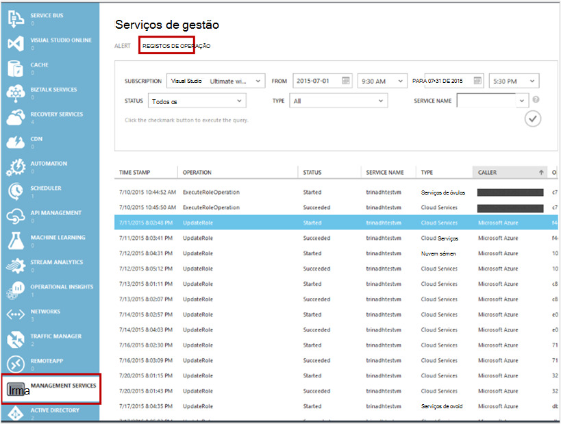

2. Em filtros, selecione a **cópia de segurança** com o *tipo* e especifique o nome do cofre cópia de segurança no *nome do serviço* e clique em **Submeter**.

    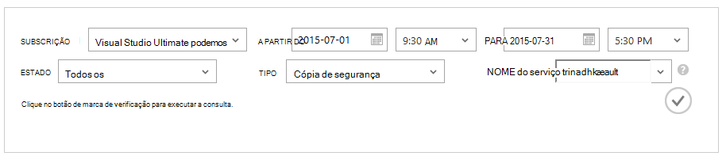

3. Nos registos do operações, selecione qualquer operação e clique em **Detalhes** para ver os detalhes correspondente a uma operação.

    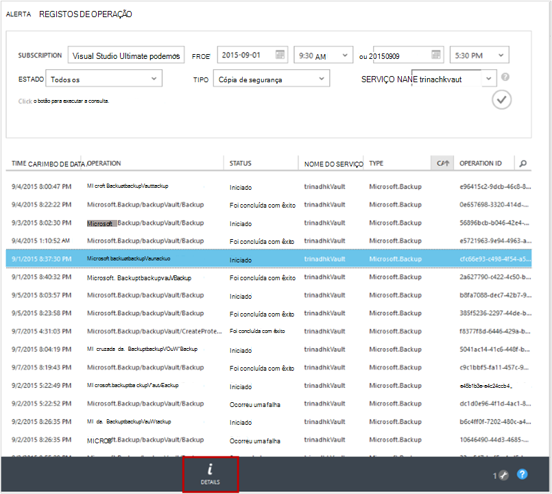

    O **Assistente de detalhes** contém informações sobre o funcionamento acionou, a tarefa de Id do recurso no qual esta operação é acionada e hora de início da operação.

    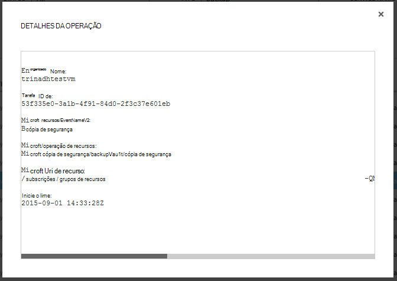

## <a name="alert-notifications"></a>Notificações de alerta
Pode obter notificações de alerta personalizadas para as tarefas no portal. Pode fazê-lo que define as alertas regras baseadas no PowerShell no operacionais dos eventos. Recomendamos que utilize *PowerShell versão 1.3.0 ou acima*.

Para definir uma notificação personalizada para alertar para falhas de cópia de segurança, um exemplo de comando terá o seguinte aspeto:

```
PS C:\> $actionEmail = New-AzureRmAlertRuleEmail -CustomEmail contoso@microsoft.com
PS C:\> Add-AzureRmLogAlertRule -Name backupFailedAlert -Location "East US" -ResourceGroup RecoveryServices-DP2RCXUGWS3MLJF4LKPI3A3OMJ2DI4SRJK6HIJH22HFIHZVVELRQ-East-US -OperationName Microsoft.Backup/backupVault/Backup -Status Failed -TargetResourceId /subscriptions/86eeac34-eth9a-4de3-84db-7a27d121967e/resourceGroups/RecoveryServices-DP2RCXUGWS3MLJF4LKPI3A3OMJ2DI4SRJK6HIJH22HFIHZVVELRQ-East-US/providers/microsoft.backupbvtd2/BackupVault/trinadhVault -Actions $actionEmail
```

**ResourceId**: pode obter este partir do menu de contexto de operações registos tal como descrito na secção. URI do recurso na janela de pop-up de detalhes de uma operação é ResourceId para ser fornecido para este cmdlet.

**OperationName**: esta será do formato "Microsoft.Backup/backupvault/<EventName>" sempre que NomeDoAcontecimento é uma das Register, Unregister, ConfigureProtection, fazer cópia de segurança, restaurar, StopProtection, DeleteBackupData, CreateProtectionPolicy, DeleteProtectionPolicy, UpdateProtectionPolicy

**Estado**: suportadas valores são-introdução, foi concluída com êxito e falhou.

**ResourceGroup**: ResourceGroup do recurso no qual é acionada operação. Pode obter este valor ResourceId. Valor entre campos */resourceGroups/* e */providers/* ResourceId valor é o valor para ResourceGroup.

**Nome**: nome da regra alerta.

**CustomEmail**: Especifique o endereço de e-mail personalizado ao qual pretende enviar notificação de alerta

**SendToServiceOwners**: esta opção envia uma notificação de alerta para todos os administradores e coadministradores da subscrição. Podem ser utilizado no **Novo AzureRmAlertRuleEmail** cmdlet

### <a name="limitations-on-alerts"></a>Limitações de alertas
Alertas baseados em eventos são submetidas para as seguintes limitações:

1. Alertas são acionou em todas as máquinas virtuais no cofre cópia de segurança. Não é possível personalizá-lo para receber alertas por conjunto específico de máquinas virtuais num cofre de cópia de segurança.
2. Esta funcionalidade está na pré-visualização. [Saiba mais](../monitoring-and-diagnostics/insights-powershell-samples.md#create-alert-rules)
3. Vai receber alertas de "alerts-noreply@mail.windowsazure.com". Atualmente não é possível modificar o remetente de correio eletrónico.

## <a name="next-steps"></a>Próximos passos

- [Restaurar Azure VMs](backup-azure-restore-vms.md)
