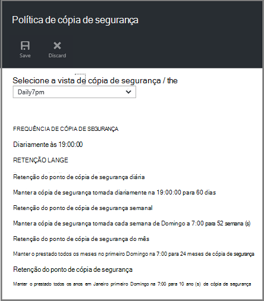

<properties
    pageTitle="Gerir implementado Gestor de recursos máquina virtual cópias de segurança | Microsoft Azure"
    description="Saiba como gerir e monitorizar implementado Gestor de recursos máquina virtual cópias de segurança"
    services="backup"
    documentationCenter=""
    authors="trinadhk"
    manager="shreeshd"
    editor=""/>

<tags
    ms.service="backup"
    ms.workload="storage-backup-recovery"
    ms.tgt_pltfrm="na"
    ms.devlang="na"
    ms.topic="article"
    ms.date="08/11/2016"
    ms.author="jimpark; markgal; trinadhk"/>

# Gerir Azure máquina virtual cópias de segurança

> [AZURE.SELECTOR]
- [Gerir Azure VM cópias de segurança](backup-azure-manage-vms.md)
- [Gerir VM clássica cópias de segurança](backup-azure-manage-vms-classic.md)

Este artigo fornece orientações sobre como gerir cópias de segurança VM e explica as informações de cópia de segurança alertas disponíveis no dashboard de portal. As informações neste artigo aplica-se para utilizar o VMs com serviços de recuperação cofres. Este artigo não aborda a criação de máquinas virtuais, nem-explica como proteger máquinas virtuais. Para uma introdução sobre como proteger implementado Gestor de recursos do Azure VMs no Azure com cofre serviços de recuperação, consulte o artigo [aspeto pela primeira vez: criar uma cópia de segurança VMs para cofre serviços de recuperação](backup-azure-vms-first-look-arm.md).

## Gerir cofres e máquinas virtuais protegidas

No portal do Azure, o dashboard do Cofre de serviços de recuperação fornece acesso às informações sobre a cofre, incluindo:

- o mais recente instantâneo de cópia de segurança, que também é o ponto de restauro mais recente < br\>
- a política de cópia de segurança < br\>
- tamanho total de instantâneos de cópia de segurança de todos os < br\>
- número de máquinas virtuais que são protegidas com o Cofre < br\>

Muitas tarefas de gestão com uma cópia de segurança de máquina virtual começam por abrir o Cofre no dashboard. No entanto, uma vez que cofres podem ser utilizados para proteger vários itens (ou vários VMs), para ver os detalhes sobre uma determinado VM, abra o dashboard do item de cofre. O procedimento que se segue mostra-lhe como abrir o *dashboard do cofre* e, em seguida, continue para o *dashboard de item do cofre*. Existem "" sugestões de ambos os procedimentos que apontam saída como adicionar o Cofre e do Cofre de palavras item para o dashboard Azure utilizando o Pin para o comando do dashboard. Afixar ao dashboard é uma forma de criação de um atalho para o cofre ou o item. Também pode executar comandos comuns a partir do atalho.

>[AZURE.TIP] Se tiver várias dashboards e pás abrir, utilize o controlo de deslize azul escuro na parte inferior da janela para o diapositivo Azure dashboard de e para trás.

### Abra um cofre de serviços de recuperação no dashboard de:

1. Inicie sessão no [portal do Azure](https://portal.azure.com/).

2. No menu concentrador, clique em **Procurar** e na lista de recursos, **Serviços de recuperação**. À medida que começa a escrever, os filtros de lista com base no seu teclado. Clique em **Serviços de recuperação cofre**.

      

    A lista de serviços de recuperação cofres são apresentados.

      

    >[AZURE.TIP] Se afixar um cofre para o Dashboard do Azure, esse cofre é imediatamente acessível ao abrir o portal do Azure. Para afixar um cofre para o dashboard, na lista de cofre, com o botão direito no cofre e selecione **Afixar ao dashboard**.

3. Na lista de cofres, selecione o cofre para abrir o seu dashboard. Quando selecionar o cofre, o dashboard do cofre e o pá **Definições** abrir. Na seguinte imagem, o dashboard do **Cofre Contoso** está realçado.

    

### Abrir um dashboard de item do Cofre

No procedimento anterior que abriu o dashboard do cofre. Para abrir o dashboard de item do cofre:

1. No dashboard do cofre, no mosaico **Itens de cópia de segurança** , clique em **máquinas virtuais do Azure**.

    

    O **Itens de cópia de segurança** pá listas a tarefa de cópia de segurança última para cada item. Neste exemplo, existe uma máquina virtual, demovm-markgal protegida por deste cofre.  

    

    >[AZURE.TIP] Para facilidade de acesso, pode afixar um item do cofre para o Dashboard do Azure. Para afixar um item do cofre, na lista de itens de cofre, clique com o botão direito e selecione **Afixar ao dashboard**.

2. Na pá **Itens de cópia de segurança** , clique no item para abrir o dashboard de item do cofre.

    

    Dashboard de item do cofre e o respetivo pá **Definições** abrem.

    

    A partir do dashboard de item de cofre, que pode efetuar várias tarefas de gestão de chave, tais como:

    - alterar as políticas ou criar uma nova política de cópia de segurança < br\>
    - ver os pontos de restauro e ver o seu estado de consistência < br\>
    - a pedido a cópia de segurança de uma máquina virtual < br\>
    - deixar de proteger máquinas virtuais < br\>
    - retomar a proteção de uma máquina virtual < br\>
    - eliminar uma cópia de segurança dados (ou um ponto de recuperação) < br\>
    - [Restaurar uma cópia de segurança (ou um ponto de recuperação)](./backup-azure-arm-restore-vms.md#restore-a-recovery-point) < br\>

Para obter os procedimentos seguintes, o ponto de partida é o dashboard de item do cofre.

## Gerir políticas de cópia de segurança

1. No [dashboard do cofre item](backup-azure-manage-vms.md#open-a-vault-item-dashboard), clique em **Todas as definições** para abrir o pá **Definições** .

    

2. No pá **Definições** , clique em **política de cópia de segurança** para abrir essa pá.

    No pá, são apresentados os detalhes de intervalo frequência e retenção cópia de segurança.

    

3. A partir do menu de **Escolha política de cópia de segurança** :
    - Para alterar as políticas de, selecione uma política diferente e clique em **Guardar**. A nova política é aplicada imediatamente à cofre. < br\>
    - Para criar uma política, selecione **Criar novo**.

    

    Para obter instruções sobre como criar uma política de cópia de segurança, consulte o artigo [definir uma política de cópia de segurança](backup-azure-manage-vms.md#defining-a-backup-policy).

[AZURE.INCLUDE [backup-create-backup-policy-for-vm](../../includes/backup-create-backup-policy-for-vm.md)]

## A pedido a cópia de segurança de uma máquina virtual
Pode demorar um pedido cópia de segurança de uma máquina virtual, assim que é configurado para protecção. Se a cópia de segurança inicial estiver pendente, a pedido cópia de segurança cria uma cópia completa da máquina virtual no cofre serviços de recuperação. Se a cópia de segurança inicial estiver concluída, uma cópia de segurança a pedido enviará apenas alterações a partir do limite da anterior, para o Cofre de serviços de recuperação. Isto é, cópias de segurança subsequentes são sempre utilizarão.

>[AZURE.NOTE] O intervalo de retenção para uma cópia de segurança a pedido é o valor de retenção especificado para o ponto de cópia de segurança diário na política. Se nenhum ponto de cópia de segurança diário estiver selecionado, em seguida, é utilizado o ponto de cópia de segurança semanal.

Para acionar uma cópia de segurança a pedido de uma máquina virtual:

- No [dashboard do cofre item](backup-azure-manage-vms.md#open-a-vault-item-dashboard), clique em **cópia de segurança agora**.

    

    O portal torna-se de que pretende iniciar uma tarefa de cópia de segurança a pedido. Clique em **Sim** para iniciar a tarefa de cópia de segurança.

    

    A tarefa de cópia de segurança cria um ponto de recuperação. O intervalo de retenção do ponto de recuperação é o mesmo intervalo de retenção especificado na política associada a máquina virtual. Para controlar o progresso para a tarefa, no dashboard do cofre, clique no mosaico de **Tarefas de cópia de segurança** .  

## Deixar de proteger máquinas virtuais
Se optar por deixar de proteger uma máquina virtual, é-lhe perguntado se pretende manter os pontos de recuperação. Existem duas formas de parar proteger máquinas virtuais:
- parar de todas as tarefas futuras de cópia de segurança e eliminar todos os pontos de recuperação, ou
- parar de todas as tarefas de cópia de segurança futuras mas deixar os pontos de recuperação  

Existe um custo associado mantendo os pontos de recuperação no armazenamento. No entanto, o benefício de sair os pontos de recuperação é que pode restaurar a máquina virtual mais tarde, se pretender. Para mais informações sobre o custo sair os pontos de recuperação, consulte o artigo [preços detalhes](https://azure.microsoft.com/pricing/details/backup/). Se optar por eliminar todos os pontos de recuperação, não é possível restaurar a máquina virtual.

Para parar de proteção para uma máquina virtual:

1. No [dashboard do cofre item](backup-azure-manage-vms.md#open-a-vault-item-dashboard), clique em **Parar a cópia de segurança**.

    

    É aberta a pá parar de cópia de segurança.

    

2. Na pá **Parar de cópia de segurança** , selecione se pretendem reter ou eliminar os dados de cópia de segurança. A caixa informação de fornece detalhes sobre a sua escolha.

    

3. Se optar por manter os dados de cópia de segurança, avance para o passo 4. Se optar por eliminar os dados de cópia de segurança, confirme que pretende parar as tarefas de cópia de segurança e eliminar os pontos de recuperação - escreva o nome do item.

    

    Se não tiver a certeza do nome do item, Paire o cursor sobre o ponto de exclamação para visualizar o nome. Além disso, o nome do item está em **Parar de cópia de segurança** no topo da pá.

4. Opcionalmente, forneça um **motivo** ou **comentário**.

5. Para parar a tarefa de cópia de segurança para o item atual, clique em  

    Uma mensagem de notificação permite-lhe saber que as tarefas de cópia de segurança foram paradas.

    

## Retomar a proteção de uma máquina virtual
Se a opção **Manter dados de cópia de segurança** foi escolhida quando foi parada proteção para a máquina virtual, em seguida, é possível retomar a proteção. Se a opção **Eliminar dados de cópia de segurança** foi escolhida, não é possível retomar a proteção para a máquina virtual.

Para retomar a proteção para a máquina virtual

1. No [dashboard do cofre item](backup-azure-manage-vms.md#open-a-vault-item-dashboard), clique em **retomar a cópia de segurança**.

    

    Pá a política de cópia de segurança é aberta.

    >[AZURE.NOTE] Quando voltar a proteger a máquina virtual, pode escolher uma política que a política com as quais máquina virtual foi protegida inicialmente diferente.

2. Siga os passos na [políticas de alteração de ou criar uma nova política de cópia de segurança](backup-azure-manage-vms.md#change-policies-or-create-a-new-backup-policy), para atribuir a política para a máquina virtual.

    Assim que a política de cópia de segurança é aplicada à máquina virtual, verá a seguinte mensagem.

    

## Eliminar dados de cópia de segurança
Pode eliminar os dados de cópia de segurança associados com uma máquina virtual durante a tarefa de **cópia de segurança de parar** ou em qualquer altura após a cópia de segurança a tarefa estiver concluída. Pode ainda ser vantajoso esperar dias ou semanas antes de eliminar os pontos de recuperação. Ao contrário de restaurar pontos de recuperação, quando eliminar dados de cópia de segurança, é possível selecionar pontos de recuperação específico para eliminar. Se optar por eliminar os seus dados de cópia de segurança, eliminar todos os pontos de recuperação associados ao item.

O seguinte procedimento assume a tarefa de cópia de segurança para a máquina virtual foi parada ou desativada. Assim que a tarefa de cópia de segurança estiver desactivada, as opções de **retomar a cópia de segurança** e **Eliminar cópia de segurança** estão disponíveis no dashboard de item do cofre.

Para eliminar dados de cópia de segurança num computador virtual com *cópia de segurança desativado*:

1. No [dashboard do cofre item](backup-azure-manage-vms.md#open-a-vault-item-dashboard), clique em **Eliminar cópia de segurança**.

    

    É aberta a pá de **Eliminar dados de cópia de segurança** .

    

2. Escreva o nome do item para confirmar que pretende eliminar os pontos de recuperação.

    

    Se não tiver a certeza do nome do item, Paire o cursor sobre o ponto de exclamação para visualizar o nome. Além disso, o nome do item é em **Eliminar dados de cópia de segurança** no topo da pá.

3. Opcionalmente, forneça um **motivo** ou **comentário**.

4. Para eliminar os dados de cópia de segurança de item atual, clique em  

    Uma mensagem de notificação permite-lhe saber que os dados de cópia de segurança foi eliminados.

## Próximos passos

Para obter informações sobre como recriar uma máquina virtual de um ponto de recuperação, consulte o artigo [Restaurar VMs Azure](backup-azure-restore-vms.md). Se precisar de informações sobre como proteger o seu máquinas virtuais, consulte o artigo [aspeto pela primeira vez: criar uma cópia de segurança VMs para cofre serviços de recuperação](backup-azure-vms-first-look-arm.md). Para obter informações sobre como monitorizar eventos, consulte o artigo [alertas do Monitor para cópias de segurança do Azure máquina virtual](backup-azure-monitor-vms.md).
